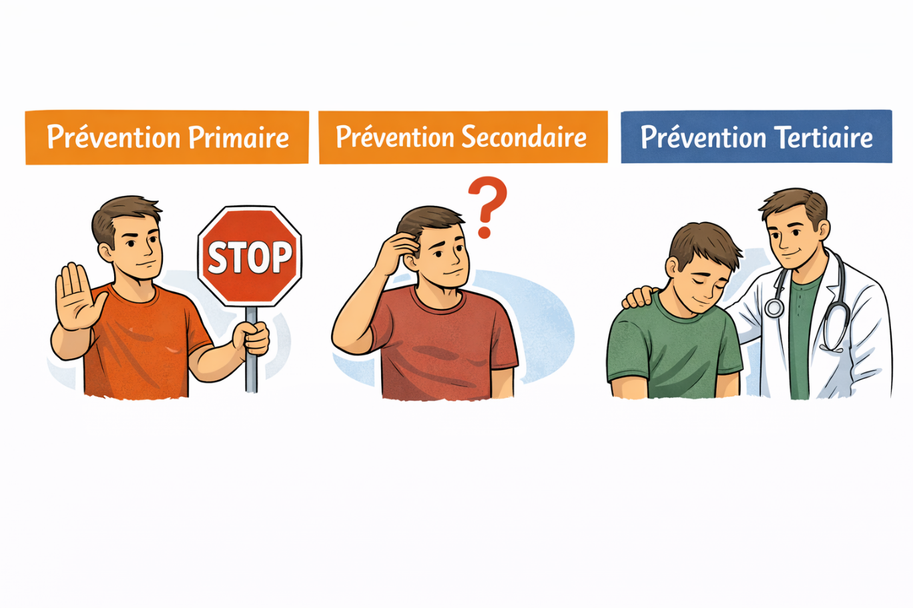

# Introduction, cadre, objectif et sources

## Statut
- extrait fidèle provisoire
- bloc 2 couvert : pages imprimées 8-15 / pages PDF 9-16
- convention de pagination : page PDF = page imprimée + 1

## Pages sources
- p. 8-15 du traité, soit pages PDF 9-16.
- Source de travail : `Traité RDRd - Version dec 25-en cours.docx`.
- Le bloc commence après les remerciements et se termine juste avant le chapitre `Mythes`.

## Fonction du chapitre dans le traité
Ce bloc établit le cadre d'usage du traité. Il explique pourquoi le livre est écrit, à qui il s'adresse, quelle posture RDR il adopte, comment il articule vulgarisation et rigueur scientifique, et comment il se situe juridiquement.

Il sert aussi de garde-fou documentaire : le traité n'est pas présenté comme une incitation à consommer, une prescription médicale, une garantie de sécurité ou un substitut à une prise en charge. Il est positionné comme un outil d'information pour une prévention secondaire : mieux comprendre les risques, les mécanismes et les décisions associées aux consommations.

## Contenu source fidèle

### Page imprimée 8 / PDF 9 — Note auteur, équipe et motivation initiale

Le bloc s'ouvre par une note de travail :

```text
A faire :
Pause diabolo pour la partie testing
Addicto
```

Cette note est conservée comme TODO éditorial. Elle ne constitue pas un contenu scientifique ni une recommandation.

L'introduction présente une équipe de quatre membres aux profils complémentaires :

| Membre mentionné | Compétence ou fonction décrite dans le traité | Fonction attribuée dans le projet |
|---|---|---|
| David | formation en chimie et toxicologie ; expérience en gestion des risques | apporte une vision croisée |
| Yannick | professeur de physique | fournit une perspective scientifique pour aborder les questions complexes liées aux drogues |
| Stephane | étudiant en médecine | apporte une compréhension des effets physiologiques et des impacts santé |
| Sylvain | spécialiste de la radioprotection | assure la coordination et la gestion du projet |

L'objectif de l'association est formulé ainsi : promouvoir l'état de l'art scientifique en matière de réduction et gestion des risques.

Les auteurs indiquent avoir bénéficié d'une formation universitaire en recherche, avec apprentissage de l'analyse de publications scientifiques et de la rédaction de résumés. Ils rappellent que de nombreux chercheurs travaillent sur les drogues, mais que leurs travaux sont peu mis en avant dans les médias.

Le sous-titre `Pourquoi` explique la genèse du projet :

- intention initiale de produire des fiches de sensibilisation pour des proches adolescents et des enfants ;
- animation envisagée de sessions de sensibilisation aux addictions au travail ;
- intérêt scientifique pour les effets d'une molécule sur personnalité, santé et comportement ;
- volonté de joindre prévention et science.

Le traité justifie son existence par le constat d'un niveau élevé d'informations fausses ou imprécises dans les échanges ordinaires sur les drogues. Les exemples cités sont :

- banalisation parentale de l'alcool ;
- démunissement face à l'ecstasy ;
- jeunes considérant le cannabis moins toxique que le tabac ;
- trentenaires convaincus qu'un verre de vin par jour est bon pour la santé.

Les auteurs décrivent ensuite le parcours informationnel comme difficile pour les personnes qui souhaitent une consommation responsable : sources nombreuses, dispersées, parfois trop techniques, parfois trop vulgarisées, avec notions mal interprétées et témoignages tronqués ou focalisés sur une substance. Ils ajoutent que les associations de prévention, avec des moyens limités, doivent toucher beaucoup de personnes rapidement, ce qui rend le traitement détaillé difficile.

La logique centrale est que des clés scientifiques de base permettent de comprendre et d'ancrer des règles de réduction des risques. Sans compréhension de ce que les drogues induisent dans le corps, les décisions reposent sur des `on dit`, avec risque d'erreurs et de conséquences physiques ou mentales.

### Page imprimée 9 / PDF 10 — Publics, évolution des consommations, prévention secondaire

L'idée du livre est rattachée à une soirée avec des jeunes d'une vingtaine d'années. Le texte affirme que connaître ce à quoi l'on s'expose lors d'une consommation peut éviter des comportements problématiques. Il formule une intention intergénérationnelle : aider les jeunes, les enfants des auteurs et les familles à comprendre une dimension associée à l'adolescence, à la découverte de soi, à la recherche de sensations et au goût du risque.

Le traité souligne ensuite une évolution sociale des consommations présentée comme taboue ou peu discutée. Des substances associées à certains groupes ou milieux — cocaïne, GHB dans des soirées festives parisiennes, crack comme marqueur de marginalisation — seraient désormais consommées dans toutes les classes sociales. Le texte mentionne aussi une médiatisation des psychédéliques comme remèdes miracles : LSD pour traiter les addictions, MDMA/ecstasy pour traiter le stress post-traumatique, psilocybine pour traiter les dépressions. La cible initiale était les jeunes adultes, mais les auteurs concluent que tous les consommateurs sont concernés.

L'objectif déclaré de l'association RISKY est de contribuer à une meilleure compréhension des drogues et des médicaments, afin d'aider les personnes à prendre des décisions éclairées pour protéger leur santé physique et mentale.

Le sous-titre `Objectif` précise que le livre s'adresse à toute personne voulant comprendre comment diminuer les risques et les bases associées : étudiants en pharmacie ou médecine, proches de personnes addictes, consommateurs réguliers ou occasionnels.

Le traité distingue trois niveaux de prévention :

| Type de prévention | Définition dans le traité | Position du livre |
|---|---|---|
| Prévention primaire | Éviter toute consommation de drogues. | Ce n'est pas le niveau principal du livre. |
| Prévention secondaire | Réduire les risques encourus par les consommateurs. | Niveau dans lequel le livre s'intègre : mieux maîtriser les risques. |
| Prévention tertiaire | Réduire les conséquences de l'addiction. | Ce n'est pas le niveau principal du livre. |

Le texte indique que les actions de prévention se concentrent surtout sur la prévention primaire et tertiaire. Il affirme que la majorité des consommateurs, toutes substances confondues, relèvent d'un usage simple : consommation existante sans critères diagnostiques d'un trouble de l'usage selon les classifications médicales actuelles. Un renvoi interne est fait vers le futur chapitre `Accro dès la première prise` dans la partie `Mythes et addiction`.

Un visuel illustre les trois niveaux de prévention. Il oppose :

- prévention primaire : personnage avec panneau STOP ;
- prévention secondaire : personnage interrogatif avec point d'interrogation ;
- prévention tertiaire : personne accompagnée par un soignant.

<figure class="doc-figure">
  
  <figcaption>Figure source p. 9 : distinction entre prévention primaire, prévention secondaire et prévention tertiaire.</figcaption>
</figure>

### Page imprimée 10 / PDF 11 — Non-moralisation, factualité et publics cibles

Le texte explique que les usagers relevant d'un usage simple ne se reconnaissent ni dans la prévention primaire centrée sur l'abstinence, ni dans la prévention tertiaire centrée sur une pathologie addictive déjà constituée. Une large proportion de consommateurs serait donc sans cadre structuré d'information, s'appuyant sur des croyances personnelles, des conseils informels entre pairs, ou des messages de réduction des risques transmis de manière fragmentaire par certaines associations.

Le traité identifie un manque d'outils pédagogiques accessibles permettant d'expliquer de façon détaillée, scientifique et contextualisée :

- les mécanismes d'action des substances ;
- leurs effets ;
- les risques associés aux usages.

La posture est formulée sans ambiguïté : l'idée n'est pas de moraliser, mais de comprendre les risques et comment s'en protéger.

L'objectif informationnel est de fournir des informations claires, précises, vérifiables et factuelles sur les effets et les risques des drogues, sans prétendre à l'exhaustivité. Le texte indique ne porter aucun jugement de valeur et se concentrer sur les faits.

Les auteurs ne cherchent pas à transformer le lecteur en expert ou addictologue. L'ambition de RISKY est de donner des connaissances de base pour favoriser la prise de conscience des dangers liés à l'usage de drogues et aider à prendre des décisions éclairées et responsables.

Le texte introduit la loi de Brandolini, ou `loi du bullshit`, à partir de l'exemple de l'idée selon laquelle une consommation modérée d'alcool serait bénéfique pour la santé. La correction des idées fausses est présentée comme difficile : elle requiert sensibilisation, preuves crédibles et résistance au sensationnalisme.

Un objectif général est formulé : instaurer une culture de prévention basée sur une vision scientifiquement rigoureuse et les avancées récentes de la recherche.

Le sous-titre `A qui s'adresse le livre` détaille les publics :

| Public | Besoin ou usage décrit |
|---|---|
| Consommateur et entourage | Comprendre et gérer les dangers ; apprendre des mesures de réduction des risques ; recevoir une aide directe. |
| Associations spécialisées dans la réduction des risques et travailleurs sociaux | Appui au terrain, formation continue, référence pour supports de communication, renforcement des compétences en prévention et intervention. Le texte cite `CARRUD, CSAPA` tel qu'écrit dans la source. |
| Cliniciens : addictologues, médecins généralistes, psychiatres, etc. | Compléter la formation initiale, enrichir l'approche clinique, actualiser les connaissances par rapport à l'état de l'art. |

### Page imprimée 11 / PDF 12 — Scientifiques, journalistes et modes de lecture

La liste des publics continue avec :

| Public | Besoin ou usage décrit |
|---|---|
| Scientifiques | Améliorer les connaissances sur les drogues ; relier recherche et pratiques de terrain en réduction des risques. |
| Journalistes | Accéder à des informations pour traiter précisément les sujets liés aux drogues, aux politiques de réduction des risques et aux débats sociétaux ; contribuer à la déstigmatisation et à la diffusion de pratiques informées par la recherche. |

Le sous-titre `Comment lire ce livre ?` indique une volonté d'aller droit au but et d'éviter les développements inutilement longs. Le traité propose plusieurs modes de lecture selon la motivation du lecteur.

| Motivation | Conseil de lecture | Durée approximative indiquée |
|---|---|---|
| Comprendre grossièrement les éléments importants ; réduire uniquement les risques de sa consommation | Lire uniquement les encadrés | 30 minutes ; le texte compare cela à environ un tiers du temps passé sur Instagram en une journée ou au temps passé `sur le trône` par homme en une journée. |
| Comprendre les notions et se faire son propre avis | Lire les titres violets | Entre 2 et 3 heures |
| Argumenter, débattre, expliquer ou sensibiliser d'autres personnes | Lire les parties 1 et 2 a minima | 5 heures |

Le texte précise que le livre comporte beaucoup de sous-chapitres pour identifier rapidement les parties plus facultatives et que les références sont directement placées en bas de page.

Deux notes de bas de page sont associées à la comparaison de durée :

1. URL La Provence sur le temps passé par les Français sur les réseaux sociaux.
2. Note extraite comme `Multimédia | Combien de temps passent les Français sur les réseaux sociaux ? | La Provence`, avec la même URL dans l'extraction Pandoc. Cette note doit être relue, car son rattachement au `temps passé sur le trône` semble incohérent ou incomplet.

### Page imprimée 12 / PDF 13 — Structure du livre, lecture efficace, approche scientifique et sources

Le traité annonce trois grandes parties :

1. fonctionnement des drogues et médicaments sur le cerveau ;
2. découverte des drogues selon leur classement et leur dangerosité ;
3. risques communs à toute prise de drogue et règles de réduction des risques communes.

Un encadré `Pour une lecture efficace` demande au lecteur de :

- mettre de côté ce qu'il croit savoir sur les drogues ;
- accepter que certaines notions puissent être difficiles.

Si le lecteur reste bloqué sur une croyance, le texte recommande de compléter les recherches et de consulter les sources citées.

Le sous-titre `Aspect scientifique` explique que les phénomènes biologiques et chimiques liés aux drogues ont été simplifiés et vulgarisés autant que possible, mais qu'ils sont tout de même systématiquement expliqués. Le texte indique aussi que le livre a été relu par des professionnels de santé afin de renforcer sa validité scientifique et d'adresser les éléments les plus justes tout en restant vulgarisé.

Un encadré définit le périmètre terminologique initial : dans une première approche, toute substance psychoactive, active sur le cerveau, prise en automédication ou de façon récréative sera considérée comme une drogue.

Le sous-titre `Sources` indique que les sources citées dans le livre permettent une perspective plus précise et approfondie. Les auteurs disent avoir évité les ouvrages coûteux et publications scientifiques inaccessibles pour privilégier une grande variété de contenus gratuits, basés sur des livres et études, et si possible divertissants, y compris des vidéos.

Le traité mentionne l'utilisation des ressources d'associations, principalement l'association suisse Nuit Blanche, remerciée pour son travail, sa disponibilité et les débats enrichissants.

Source citée : `https://nuit-blanche.ch/`.

### Page imprimée 13 / PDF 14 — Cadre juridique et principes Energy Control

Le sous-titre `Cadre juridique` commence par rappeler que, légalement, la facilitation ou la provocation à l'usage sont interdites par l'article L.3421-4 du code de la santé publique. Il est aussi interdit de présenter les produits classés comme stupéfiants sous un jour favorable. Le texte précise que cette contrainte ne s'applique pas de la même manière à l'alcool et au tabac, en signalant `aucun problème, autre que moral, pour l'alcool et le tabac`.

La tension juridique est posée par des questions : fournir une seringue propre ou un filtre à un consommateur d'héroïne est-il une facilitation à l'usage ? Un flyer expliquant les risques de la MDMA tout en mentionnant ses effets relève-t-il de la provocation ou de la présentation favorable ?

Le traité rappelle que l'histoire de la réduction des risques et des dommages est issue de combats associatifs, mais aussi d'autorités et de ministres de la santé.

L'objectif des associations de réduction des risques est résumé ainsi : atténuer les dangers sanitaires, sociaux et la mortalité liée à la consommation de substances psychoactives. La RDR, apparue il y a environ 30 ans, prône la responsabilité individuelle et collective, la promotion de la santé et l'éducation sanitaire. Elle concerne toutes substances et types d'usages sans imposer l'abstinence.

Le texte présente ensuite les principes clés d'Energy Control, association intégrée à ABD et partiellement financée par l'État. Ces principes sont utilisés comme traduction opérationnelle de l'approche RDR et de la `gestion des risques et des plaisirs`.

| N° | Principe Energy Control retranscrit dans le traité |
|---:|---|
| 1 | La consommation de drogues est et restera une réalité ; des personnes souhaiteront utiliser des drogues légales et illégales malgré prévention ou répression. |
| 2 | Les motivations, formes de consommation et niveaux de risque varient ; le risque est multifactoriel. |
| 3 | Il existe un plaisir associé à l'usage de drogues, reconnu et recherché par les personnes qui en utilisent, mais souvent nié par les approches d'abstinence ou de prohibition. |
| 4 | Prendre des drogues ne signifie pas nécessairement avoir des problèmes ; penser que les usagers se tournent vers les drogues parce qu'ils sont vulnérables perpétue la stigmatisation. |
| 5 | L'addiction n'est pas le seul problème associé aux drogues ; la plupart des problèmes sont aigus et ne nécessitent pas l'établissement d'une dépendance. |
| 6 | Une consommation responsable de drogues est possible, comme pour d'autres activités risquées. |
| 7 | Des informations objectives et utiles sur substances, risques et modèles de consommation à moindre risque sont nécessaires, mais non suffisantes, pour faciliter une décision éclairée. |

Source citée : `https://energycontrol.org/quienes-somos/`.

### Page imprimée 14 / PDF 15 — Techno+, article L3411-8 et reconnaissance internationale

La page commence par le huitième principe Energy Control :

| N° | Principe Energy Control retranscrit dans le traité |
|---:|---|
| 8 | Les efforts se concentrent sur la prévention de l'usage et le traitement des personnes ayant développé des problèmes, laissant sans aide la majorité des personnes qui utilisent des drogues de manière récréative, sans problème actuel mais à risque d'en rencontrer. |

Le traité indique que le procès de Techno+, association pionnière de la RDR en milieu festif, a été déterminant pour faire accepter le principe de la réduction des risques et l'existence des associations concernées. L'affaire est décrite comme un affrontement entre politique de réduction des risques liée aux drogues et ministère de l'Intérieur.

Le texte précise qu'après un premier procès remporté en 2003 pour vice de procédure, l'État a fait appel sur le fond. Pendant la période du procès, Techno+ et ses soutiens, notamment l'Association Française pour la Réduction des Risques liés aux Usages de Drogues, ont contribué à faire inscrire la protection juridique des intervenants associatifs. Un décret référentiel des actions de réduction des risques pour les usagers de drogues est indiqué comme publié le 14 avril 2005. Le 18 avril 2005, Techno+ est décrite comme relaxée de toutes les charges d'incitation et de facilitation à l'usage. Les conseils de consommation à moindre risque associés à l'affaire sont présentés comme faisant depuis partie des recommandations sanitaires.

Sources citées :

- `https://technoplus.org/historique/`
- `https://issuu.com/medecinsdumonde/docs/mdm_rdr_fr_bd`

Le texte cite ensuite l'article L3411-8 comme cadre des actions de réduction des risques. Les éléments explicitement retenus sont :

- prévenir les dommages sanitaires, psychologiques et sociaux ;
- prévenir la transmission des infections ;
- prévenir la mortalité par surdose ;
- viser les substances psychoactives ou classées comme stupéfiants ;
- délivrer des informations sur les risques et dommages ;
- orienter les usagers vers services sociaux, soins généraux ou spécialisés ;
- participer à l'analyse, à la veille et à l'information sur composition, usages de transformation et consommation, dangerosité des substances ;
- permettre à l'intervenant agissant conformément à sa mission de bénéficier de la protection mentionnée à l'article 122-4 du code pénal.

Le traité ajoute que la réduction des risques est de plus en plus acceptée, même si des mentalités et préjugés restent à faire évoluer.

Il signale enfin une avancée en mars 2024 : la Commission de l'ONU sur les stupéfiants aurait reconnu pour la première fois la RDR comme élément essentiel de santé publique lié à la consommation de produits psychotropes hors cadre médical. Le texte indique que la résolution a été votée le 22 mars par 70 % des 53 membres, avec comme opposants la Russie et la Chine, et qu'elle encourage les États à soutenir et financer les démarches de RDR ainsi qu'à réduire discrimination, exclusion et atteintes envers les usagers de stupéfiants.

### Page imprimée 15 / PDF 16 — Avertissement légal et limites de responsabilité

La page poursuit la mention de la résolution de l'ONU et contient un encadré juridique/éthique. Le texte visible de l'encadré est conservé comme avertissement source :

> Ce livre est écrit dans le seul but d'informer et de réduire les risques liés à la consommation de certaines substances.
>
> Certains produits abordés dans ce livre sont illégaux. Il est de votre responsabilité de respecter la loi.
>
> Nous n'encourageons personne à consommer des drogues, et nous ne pourrions être tenus pour responsables si vous le faites.
>
> Les résumés sur les pratiques de réduction des risques sont issus d'échanges avec des consommateurs, des associations et surtout des publications scientifiques. Ce ne sont pas des prescriptions qui vous éviteront de façon certaine des problèmes, et nous ne pourrions être tenus pour responsables de vos actes.
>
> En tant qu'association RISKY, notre mission est de vous informer et de vous aider à mieux comprendre les enjeux liés à la consommation de drogues et de médicaments. Nous vous invitons à utiliser ces informations avec discernement et à toujours respecter les lois en vigueur.

Source citée : document CND/UNODC associé à la 67e session : `https://www.unodc.org/documents/commissions/CND/CND_Sessions/CND_67/Documents/ECN72024L5Rev2_unedited_revised.pdf`.

## Notions à conserver

### Notions de cadrage

- Association RISKY.
- Objectif de promotion de l'état de l'art scientifique en réduction et gestion des risques.
- Genèse du traité : fiches de sensibilisation, sessions en milieu professionnel, approche scientifique des drogues et médicaments.
- Problème documentaire : informations fausses, dispersées, trop techniques ou trop vulgarisées.
- Décisions fondées sur des `on dit` lorsque la compréhension mécanistique manque.
- Cible élargie : jeunes adultes, familles, consommateurs réguliers ou occasionnels, proches, professionnels, journalistes, scientifiques.

### Notions de prévention et RDR

- Prévention primaire : éviter la première consommation.
- Prévention secondaire : réduire les risques encourus par les consommateurs.
- Prévention tertiaire : réduire les conséquences de l'addiction.
- Positionnement du livre : prévention secondaire.
- Usage simple : consommation ne répondant pas aux critères diagnostiques d'un trouble de l'usage selon les classifications médicales actuelles.
- Manque d'outils pédagogiques pour les usagers qui ne se reconnaissent ni dans l'abstinence ni dans la prise en charge d'un trouble constitué.
- Non-moralisation : comprendre les risques et les protections plutôt que juger.
- Information claire, précise, vérifiable et factuelle.

### Notions scientifiques et communicationnelles

- Loi de Brandolini : coût de correction d'une idée fausse plus élevé que sa diffusion.
- Vision scientifiquement rigoureuse et appui sur les avancées récentes de la recherche.
- Relire par des professionnels de santé : mention source, à ne pas convertir en validation scientifique formelle.
- Substance psychoactive : dans le traité, toute substance active sur le cerveau prise en automédication ou de façon récréative est considérée comme drogue dans une première approche.
- Sources gratuites et accessibles privilégiées.
- Ressources associatives, notamment Nuit Blanche.

### Notions juridiques et institutionnelles

- Article L.3421-4 du code de la santé publique : facilitation ou provocation à l'usage, présentation favorable de stupéfiants.
- Réduction des risques et des dommages : information, responsabilisation, aide aux pratiques, sans imposer l'abstinence.
- Energy Control : principes opérationnels de gestion des risques et des plaisirs.
- Techno+ : procès présenté comme moment structurant de la reconnaissance de la RDR en milieu festif.
- Article L3411-8 : informations, orientation, analyse/veille, protection des intervenants agissant dans leur mission RDR.
- Article 122-4 du code pénal : protection mentionnée dans l'extrait cité.
- Commission de l'ONU sur les stupéfiants, mars 2024 : reconnaissance de la RDR comme élément de santé publique selon la source.
- Avertissement : objectif d'information et RDR, respect de la loi, absence d'encouragement, absence de prescription, absence de garantie.

## Recommandations RDR présentes dans le traité

| Recommandation ou principe | Contexte | Objectif RDR | Limite | Pages sources |
|---|---|---|---|---:|
| Comprendre ce que les drogues induisent dans le corps avant de décider. | Constat que les décisions basées sur les `on dit` créent des risques d'erreurs. | Remplacer les croyances non vérifiées par une compréhension minimale des mécanismes et risques. | Le bloc ne détaille pas encore les mécanismes ; ils sont renvoyés aux chapitres suivants. | 8-9 |
| Situer le livre en prévention secondaire : mieux maîtriser les risques. | Distinction prévention primaire / secondaire / tertiaire. | Cibler les consommateurs ou personnes exposées aux consommations qui ne relèvent pas d'un trouble constitué. | Ne signifie pas que la consommation devient sûre ; réduction du risque ≠ suppression du risque. | 9-10 |
| Ne pas moraliser ; comprendre les risques et les protections. | Positionnement pédagogique du traité. | Favoriser l'accès à l'information et réduire la stigmatisation. | Ne doit pas être interprété comme neutralisation des risques ou absence de limites légales. | 10 |
| Lire selon son besoin : encadrés, titres violets, parties 1 et 2. | Tableau de lecture. | Adapter l'effort de lecture au niveau de besoin et d'engagement. | La structuration visuelle exacte dépend du document original ; les `titres violets` doivent être repérés plus tard. | 11 |
| Mettre de côté ce que l'on croit savoir et consulter les sources si une croyance bloque la lecture. | Encadré `Pour une lecture efficace`. | Réduire l'effet des croyances préalables sur la compréhension des données. | Nécessite des sources accessibles et correctement comprises. | 12 |
| Fournir des informations objectives et utiles sur substances, risques et modèles de consommation à moindre risque. | Principe Energy Control n° 7. | Aider à une décision éclairée. | Le traité précise que c'est nécessaire mais non suffisant. | 13 |
| Délivrer des informations, orienter, participer à l'analyse/veille/information. | Extrait L3411-8. | Cadre opérationnel de la politique RDR. | Ce n'est pas une habilitation automatique à tout contenu ; interprétation juridique à valider si publication applicative. | 14 |
| Respecter les lois et ne pas traiter les résumés RDR comme prescriptions garanties. | Encadré légal final. | Clarifier la limite entre information RDR et prescription/incitation. | Ne suffit pas à sécuriser juridiquement une application ; validation juridique nécessaire. | 15 |

## Données, repères et catégories

| Élément | Valeur ou catégorie | Page | Statut |
|---|---|---:|---|
| Équipe mentionnée | 4 membres : chimie/toxicologie/gestion des risques ; physique ; médecine ; radioprotection/coordination | 8 | source à relire avant exposition publique |
| Types de prévention | primaire, secondaire, tertiaire | 9 | catégorisation centrale |
| Positionnement du traité | prévention secondaire | 9 | central |
| Durées de lecture | 30 minutes ; 2 à 3 heures ; 5 heures | 11 | source à conserver, notes associées à relire |
| Structure du livre | 3 grandes parties : cerveau ; classement/dangerosité ; risques communs et règles RDR | 12 | structure source |
| RDR | apparue il y a environ 30 ans selon le traité | 13 | repère historique à vérifier avant usage externe |
| Energy Control | 8 principes listés | 13-14 | principes source |
| Techno+ | procès 2003 ; décret référentiel 14 avril 2005 ; relaxe 18 avril 2005 | 14 | repères historiques à vérifier avant publication externe |
| Article L3411-8 | information, orientation, analyse/veille, protection | 14 | extrait source |
| CND/ONU 2024 | reconnaissance de la RDR le 22 mars ; vote indiqué : 70 % des 53 membres ; opposants indiqués : Russie et Chine | 14-15 | source à vérifier juridiquement et diplomatiquement avant intégration publique |
| Avertissement final | information, respect de la loi, absence d'encouragement, absence de prescription et de garantie | 15 | source à conserver ; ne vaut pas validation juridique app |

## Images, tableaux, figures, encadrés

| Page | Type | Titre visible | Description | Information transmise | Données extraites | Importance RDR | Statut |
|---:|---|---|---|---|---|---|---|
| 9 | figure / illustration | `Prévention Primaire` ; `Prévention Secondaire` ; `Prévention Tertiaire` | Trois scènes illustrées : STOP, interrogation, accompagnement médical. | La prévention secondaire occupe l'espace entre abstinence et prise en charge d'un trouble constitué. | Trois catégories de prévention. | Cadre la cible du traité et évite la confusion avec abstinence ou traitement. | extrait ; asset créé |
| 11 | tableau | `Motivation` ; `Conseil de lecture` ; `Durée approximative de lecture` | Tableau de parcours de lecture selon la motivation. | Le lecteur peut sélectionner un niveau d'engagement. | 30 min ; 2-3 h ; 5 h ; encadrés ; titres violets ; parties 1 et 2. | Potentiel pour futurs parcours Académie. | extrait ; notes à relire |
| 12 | encadré | `Pour une lecture efficace` | Encadré avec icône koala ; conseille de mettre de côté les croyances préalables et signale que certaines notions peuvent être difficiles. | Prépare le lecteur à la correction des croyances et à l'effort cognitif. | 2 consignes de lecture. | Important pour posture pédagogique et biais. | extrait ; icône copiée |
| 12 | encadré | non titré | Encadré avec icône koala définissant le périmètre : substance psychoactive active sur le cerveau, prise en automédication ou récréativement, considérée comme drogue. | Donne la définition opérationnelle de `drogue` dans le traité. | Définition source. | Important pour cohérence terminologique. | extrait |
| 15 | encadré légal / avertissement | non titré | Grand encadré en gras/souligné précisant objectif informatif, illégalité possible, respect de la loi, absence d'encouragement, absence de prescription ou garantie. | Délimite le statut du traité et ses limites. | 5 paragraphes d'avertissement. | Important pour posture RDR et limites d'automatisation. | extrait ; à faire valider juridiquement avant app |

Assets créés :

- `05_assets_visuels/p009_figure_01_preventions_primaire_secondaire_tertiaire.png`
- `05_assets_visuels/p012_figure_01_icone_koala_encadres.jpeg`

## Implications CultureRDR

### Données utilisables

| Donnée possible | Origine | Utilisation potentielle | Limite |
|---|---|---|---|
| Niveau de prévention ciblé | prévention secondaire, p. 9 | Tag de contenu Académie ou cadrage onboarding | Ne pas déduire le niveau réel de risque individuel à partir de ce seul tag. |
| Public cible | consommateurs, entourage, associations, travailleurs sociaux, cliniciens, scientifiques, journalistes | Segmentation documentaire ou mode de lecture | Ne pas personnaliser médicalement sans données et validation. |
| Mode de lecture | encadrés ; titres violets ; parties 1 et 2 | Parcours court / intermédiaire / approfondi | Les titres violets doivent être repérés et normalisés. |
| Type de contenu | information RDR ; source ; avertissement ; cadre légal | Métadonnées de contenu | Ne pas convertir en consentement utilisateur ou protection juridique automatique. |
| Statut légal possible | substances illégales abordées ; respect de la loi | Affichage de limites et contexte | Nécessite validation juridique selon pays et date. |
| Sources | liens Nuit Blanche, Energy Control, Techno+, Médecins du Monde, UNODC/CND, La Provence | Bibliographie et traçabilité | Certaines sources sont associatives, médiatiques ou juridiques ; hiérarchiser ultérieurement. |

### Règles candidates

| ID | Domaine | Règle candidate | Déclencheur possible | Données nécessaires | Message possible | Source | Niveau de confiance | Limite | À ne pas faire |
|---|---|---|---|---|---|---|---|---|---|
| R-CADRAGE-001 | cadrage contenu | Tout contenu issu de ce traité doit être présenté comme information RDR, non comme incitation ou prescription. | Affichage d'un module Académie ou conseil RDR | Type de contenu, source, statut de validation | `Information de réduction des risques : ne remplace pas un avis médical ou juridique.` | p. 15 | élevé pour cadrage ; faible pour formulation finale | Formulation à valider juridiquement et UX. | Ne pas promettre une protection légale ou médicale. |
| R-PREVENTION-001 | pédagogie | Les contenus généraux du traité relèvent d'abord de la prévention secondaire. | Classification d'un module général | Niveau de prévention du module | `Objectif : comprendre et réduire les risques, pas moraliser.` | p. 9-10 | moyen | Certains chapitres relèvent aussi de prévention tertiaire ou d'urgence. | Ne pas assimiler prévention secondaire à usage sans risque. |
| R-SOURCES-001 | qualité documentaire | Un contenu RDR doit conserver ses sources et limites. | Création d'une fiche Académie ou message long | Sources citées, type de source, date, niveau de validation | `Sources et limites à consulter avant application.` | p. 12, p. 15 | moyen | Le traité ne propose pas encore de grille qualité complète. | Ne pas produire de règle métier sans source canonique. |

### Messages candidats

| ID | Domaine | Niveau | Condition | Message court | Action proposée | Variante directe | Variante douce | Source | Commentaire métier | À ne pas dire |
|---|---|---|---|---|---|---|---|---|---|---|
| MSG-CADRAGE-001 | cadre RDR | information | Ouverture d'un contenu issu du traité | Ce contenu sert à informer et réduire les risques, pas à encourager une consommation. | Lire les limites et vérifier les sources. | `Respecte la loi ; ces informations ne sont pas des prescriptions.` | `Ces repères aident à comprendre les risques, avec des limites.` | p. 15 | Message de contexte, pas de conseil personnalisé. | `Cette pratique est sûre.` |
| MSG-PREVENTION-001 | prévention secondaire | information | Module général sur RDR | Réduire les risques suppose de comprendre les mécanismes, pas de se fier aux `on dit`. | Consulter les notions mécanistiques et les sources. | `Ne base pas tes décisions sur des croyances non vérifiées.` | `Quand un sujet est chargé de croyances, revenir aux mécanismes aide à décider.` | p. 8-10 | À relier aux futurs modules croyances/biais. | `La science donne toujours une réponse simple.` |

### Modules Académie candidats

| ID | Thème | Module candidat | Objectif pédagogique | Notions à couvrir | Pré-requis | Source | Priorité | À ne pas faire maintenant |
|---|---|---|---|---|---|---|---|---|
| MOD-INTRO-001 | posture RDR | Pourquoi une prévention secondaire ? | Expliquer la différence entre éviter, réduire les risques et prendre en charge les conséquences. | prévention primaire ; secondaire ; tertiaire ; usage simple ; trouble de l'usage | aucun | p. 9-10 | haute | Ne pas créer de parcours final avant extraction des chapitres risque. |
| MOD-INTRO-002 | méthode de lecture | Comment lire un contenu RDR ? | Aider le lecteur à choisir entre lecture rapide, intermédiaire et approfondie. | encadrés ; titres violets ; parties ; sources ; croyances préalables | aucun | p. 11-12 | moyenne | Ne pas supposer que la structure visuelle est déjà disponible dans l'app. |
| MOD-INTRO-003 | cadre légal et éthique | Ce que la RDR permet et ne permet pas | Présenter la différence entre information RDR, incitation, prescription et garantie. | L3421-4 ; L3411-8 ; information ; orientation ; respect de la loi | notions générales RDR | p. 13-15 | haute | Ne pas donner d'avis juridique personnalisé. |
| MOD-INTRO-004 | sources et validité | Pourquoi garder les sources ? | Expliquer la traçabilité, les sources accessibles et les limites des contenus vulgarisés. | sources gratuites ; associations ; professionnels de santé ; preuves ; limites | aucun | p. 12 | moyenne | Ne pas construire une hiérarchie finale des preuves avant bloc science. |

### Points à ne pas automatiser sans validation

- Ne pas déduire automatiquement qu'un utilisateur relève d'un `usage simple` ou qu'il n'a pas de trouble de l'usage.
- Ne pas transformer l'absence de moralisation en banalisation des risques.
- Ne pas afficher des conseils de consommation comme s'ils étaient des prescriptions sûres.
- Ne pas utiliser l'avertissement légal du traité comme substitut à une revue juridique de l'application.
- Ne pas personnaliser un conseil juridique à partir de l'article L3421-4 ou L3411-8 sans validation.
- Ne pas traiter les relectures par professionnels de santé comme une certification médicale formelle.
- Ne pas intégrer les affirmations de mars 2024 sur la CND/ONU sans vérification externe si elles doivent être exposées publiquement.

## Incertitudes et limites

| Point | Type | Page | Commentaire |
|---|---|---:|---|
| Note `A faire : Pause diabolo pour la partie testing / Addicto` | TODO source | 8 | Statut exact à clarifier ; conservé comme note auteur. |
| Noms des membres d'équipe | données personnelles / exposition publique | 8 | Présents dans la source ; à vérifier avant publication hors base privée. |
| `CARRUD` | orthographe source | 10 | Le sigle usuel est probablement `CAARUD`, mais l'extraction conserve la graphie source. À relire. |
| Majorité des consommateurs relevant d'un usage simple | affirmation épidémiologique | 9 | Le bloc ne fournit pas de source directe ; renvoi interne vers un futur chapitre. |
| Notes de bas de page 1 et 2 | notes mal rattachées | 11 | La note sur le `trône` semble incohérente avec l'URL La Provence. À contrôler dans le DOCX. |
| `drogue et médicament su le cerveau` ; `notions peuvent être difficile` | coquilles source | 12 | Ne pas corriger sans politique éditoriale ; conserver la notion. |
| Historique juridique Techno+ | exactitude juridique/historique | 14 | Conserver comme source ; vérifier avant usage public ou juridique. |
| CND/ONU mars 2024 | actualité/institutionnel | 14-15 | Conserver comme source ; vérifier la résolution, le vote et les oppositions avant publication. |
| Encadré légal | portée juridique | 15 | Sert de cadrage source ; ne vaut pas validation juridique pour CultureRDR. |

## Renvois internes

- `01_source_canonique/00_front_matter_suivi_remerciements.md` : objectifs éditoriaux, table des matières, remerciements.
- `01_source_canonique/02_mythes_croyances_heuristiques_biais_sophismes.md` : croyances, Brandolini, correction d'idées fausses, mythes cités dans l'introduction.
- `01_source_canonique/04_comprendre_science_preuves_causalite.md` : état de l'art, sources, preuve, vulgarisation, limites.
- `01_source_canonique/14_risques_generiques_sommeil_juridique.md` : risques juridiques spécifiques plus tardifs.
- `02_themes_transversaux/01_posture_rdr_cadre_legal_ethique.md` : à produire en phase 2.
- `02_themes_transversaux/02_publics_prevention_secondaire_non_stigmatisation.md` : à produire en phase 2.
- `02_themes_transversaux/05_methode_scientifique_preuves_causalite_incertitude.md` : à produire en phase 2.
- `03_derives_culturerdr/08_no_go_automation.md` : limites d'automatisation issues de l'introduction.
