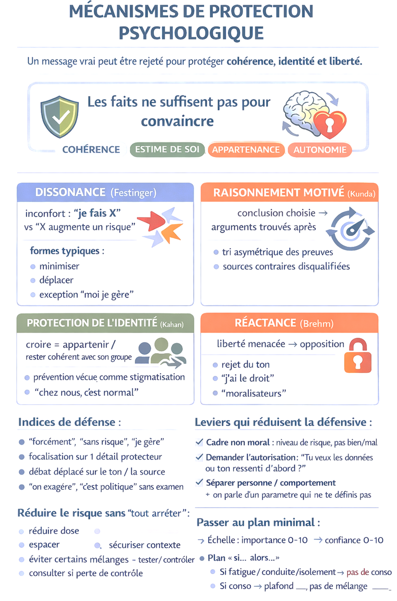
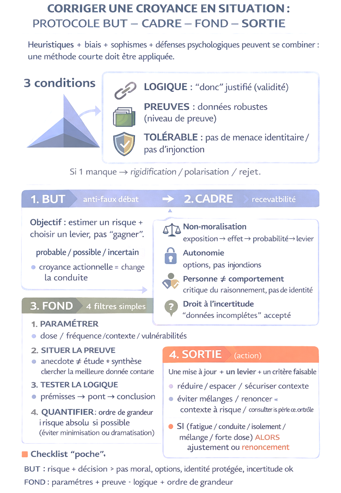

# Mécanismes de protection psychologique et approche RDR

### 1. Pourquoi la logique ne suffit pas

Le traité affirme que, lorsqu'il est question de drogues et de comportements à risque, la logique ne suffit pas. Une croyance peut être défendue par des mécanismes dont la fonction n'est pas de rechercher la vérité, mais de protéger :

- la cohérence interne ;
- l'estime de soi ;
- l'appartenance ;
- la liberté perçue.

Dans ce cadre, une correction factuelle peut être vécue comme une menace. Le rejet ne signifie pas nécessairement que la personne ne comprend pas l'information : il peut indiquer que l'information entre en conflit avec une cohérence psychologique ou sociale.

Quatre mécanismes sont présentés comme dominants :

1. dissonance cognitive ;
2. raisonnement motivé ;
3. protection de l'identité ;
4. réactance psychologique.

Ces mécanismes peuvent se combiner. Une heuristique peut donner la première impression, un biais peut sélectionner les données compatibles, un sophisme peut donner l'apparence d'une démonstration, puis la dissonance ou la réactance peuvent verrouiller l'ensemble.

### 2. Dissonance cognitive

La dissonance cognitive, associée à Festinger, désigne l'inconfort psychologique produit par un conflit entre deux éléments : par exemple un comportement et une connaissance du risque.

Exemple source :

```text
« je consomme »
vs
« cela augmente un risque »
```

La réduction de l'inconfort ne passe pas forcément par un changement de comportement. Elle peut passer par une modification du discours intérieur : minimisation, déplacement, exception personnelle ou déni partiel.

| Forme | Exemples conservés | Fonction psychologique |
|---|---|---|
| Minimisation | `c'est ponctuel`, `c'est léger`, `je ne mélange pas` | Réduire la portée perçue du risque. |
| Déplacement | `le problème, c'est surtout les autres`, `les excès`, `les produits de mauvaise qualité` | Déplacer le risque vers un autre groupe, un autre comportement ou une autre cause. |
| Exception personnelle | `moi je gère`, `je suis prudent`, `je connais mon corps` | Maintenir une image de maîtrise personnelle. |
| Déni partiel | ne pas intégrer la dose réelle, le cumul, la vulnérabilité ou la conduite | Écarter une dimension gênante sans nier tout le risque. |

Signaux typiques :

- justifications répétitives ;
- focalisation sur un seul détail protecteur ;
- oubli des autres paramètres ;
- réduction du problème à une caricature ;
- glissement moral : la personne se sent accusée, donc se défend.

### 3. Raisonnement motivé

Le raisonnement motivé est distingué du simple biais de confirmation. Le biais de confirmation décrit une sélection asymétrique des informations ; le raisonnement motivé décrit la cause de cette sélection : la conclusion acceptable est implicitement choisie à l'avance, puis défendue.

La réflexion n'est pas absente, mais elle est orientée vers la préservation d'une conclusion compatible avec le comportement, l'identité ou le confort psychologique.

Exemples conservés :

| Exemple | Erreur de raisonnement |
|---|---|
| `Le cannabis me détend donc il est bon pour mon anxiété` | Confusion entre soulagement immédiat et trajectoire clinique. |
| `La vape est moins nocive que le tabac donc c'est sans conséquence` | Conclusion absolue à partir d'un comparatif. |
| `Microdoser m'aide à travailler donc c'est inoffensif` | Passage abusif du bénéfice perçu à l'innocuité supposée. |

Signaux typiques :

- tri asymétrique des preuves ;
- dévalorisation automatique des sources contradictoires ;
- réponses du type `études biaisées`, `on exagère`, `c'est politique`, sans examen méthodologique.

### 4. Protection de l'identité

Le traité présente la protection de l'identité à partir de la cognition protectrice de l'identité : les opinions et habitudes peuvent appartenir à l'image personnelle ou à l'identité de groupe. Les informations sont alors filtrées selon leur compatibilité avec les valeurs du groupe ou l'image de soi.

Dans le champ des drogues, l'identité peut être personnelle, collective ou mixte. Exemples conservés :

- une personne qui se perçoit comme prudente peut avoir du mal à admettre qu'elle prend un risque en buvant régulièrement ;
- un groupe d'amis peut normaliser une pratique : `chez nous, on boit mais on n'a pas de problèmes` ;
- un discours de prévention externe peut être reçu comme une stigmatisation : `on veut nous faire passer pour des inconscients ou des malades` ;
- dans certains milieux, critiquer l'alcool peut être reçu comme une attaque contre un art de vivre familial, national ou social ;
- un usager de cannabis identifié à une contre-culture pro-cannabis peut rejeter les données négatives parce qu'elles menacent l'idéologie positive du groupe.

Le rejet des faits ne porte donc pas toujours sur leur contenu scientifique. Il peut viser à protéger l'honneur, la cohésion ou la continuité symbolique du groupe.

### 5. Réactance psychologique

La réactance psychologique est définie comme une réaction de rejet lorsqu'une liberté perçue est menacée. Un message injonctif peut déclencher opposition, défiance ou renforcement du comportement.

Même si le fond est exact, un ton de type :

- `tu dois arrêter` ;
- `ne fais jamais ça` ;
- `c'est irresponsable` ;

peut produire un rejet. La personne ne réfute pas forcément les faits ; elle réfute l'atteinte à l'autonomie.

Signaux typiques :

- opposition immédiate au ton plutôt qu'au contenu ;
- discrédit de la source : `moralisateurs`, `contrôle social`, `propagande` ;
- réponses du type `j'ai le droit`, `on dramatise`, `ça me regarde`.

### 6. Lever les freins psychologiques

Le traité propose de rendre l'accueil de l'information possible sans attaque identitaire, puis de transformer l'inconfort en petit plan d'action.

#### 6.1 Poser un cadre non moral

Le cadre recommandé remplace l'axe bien/mal par :

```text
exposition → effet → réduction du risque
```

Formulation source à conserver :

```text
On ne parle pas de faute. On parle de niveau de risque à ce niveau d'exposition et de ce qu'on peut ajuster.
```

Les paramètres à préciser sont : dose, fréquence, contexte, mélanges et vulnérabilités.

#### 6.2 Demander l'autorisation avant d'informer

Cette étape vise à réduire la défensive :

```text
Tu veux que je te donne les données connues sur ce point, ou tu préfères qu'on reste sur ton ressenti d'abord ?
```

Si la personne accepte, l'information doit rester brève et revenir vers elle. Le traité déconseille le monologue.

#### 6.3 Dissocier valeur et comportement

Le traité recommande de séparer la personne du comportement discuté :

```text
Avoir ce comportement ne dit pas qui tu es. On parle d'un paramètre modifiable, pas de ta valeur.
```

Puis :

```text
Reconnaître un risque = reprendre du contrôle, pas se condamner.
```

#### 6.4 Faire émerger l'ambivalence

Le traité se réfère à l'entretien motivationnel : l'objectif est que la personne formule elle-même une raison de bouger, plutôt que de subir une argumentation externe.

Questions proposées :

- `Qu'est-ce que tu aimes dans X ?`
- `Et qu'est-ce que tu aimes moins / qui t'inquiète parfois ?`
- `Dans quelles situations c'est le plus risqué ?`

La reformulation doit rester sans ironie :

```text
Donc d'un côté X t'apporte ___, et de l'autre tu vois ___ comme risque.
```

Le traité signale que les effets moyens de l'entretien motivationnel sur la réduction d'usage sont modestes et variables selon les contextes et comparateurs. Cette limite doit être conservée.

#### 6.5 Travailler en menu d'options réalistes

Le traité recommande de proposer plusieurs leviers, puis de laisser choisir :

- réduire la dose, avec un plafond clair ;
- espacer la fréquence, par exemple avec des jours `off` ;
- sécuriser le contexte : pas de conduite, pas d'isolement, sommeil, alimentation, hydratation selon substance ;
- éviter certains mélanges, notamment alcool + dépresseurs ou stimulants + stimulants ;
- tester ou vérifier si applicable : produit, dosage ;
- consulter en cas de perte de contrôle, symptômes ou complications.

Formulation type :

```text
Si tu voulais juste baisser le risque sans tout changer, parmi ces options, laquelle te paraît faisable cette semaine ?
```

#### 6.6 Passer au micro-engagement mesurable

Deux outils sont proposés :

1. une échelle 0-10 d'importance et de confiance ;
2. un plan minimal `si... alors...`.

Exemples :

```text
Si je suis fatigué / si je dois conduire / si je suis seul, alors je ne consomme pas.
```

```text
Si je consomme, alors je limite à ___ et je ne mélange pas avec ___.
```

#### 6.7 Style de communication

Trois réflexes sont recommandés : questions ouvertes, écoute réflective, résumé.

À éviter : confrontation, sarcasme, `tu sais très bien que...`, catastrophisme.

Phrase anti-dissonance à conserver :

```text
Ici, l'objectif n'est pas d'avoir raison ou tort : c'est d'aligner ce que tu veux pour toi (sécurité, contrôle, santé, plaisir) avec des choix concrets qui réduisent le risque.
```

### 7. Infographie p. 34 — Mécanismes de protection psychologique

<figure class="doc-figure">
  
  <figcaption>Infographie p. 34 : un message factuel peut être rejeté pour protéger cohérence, identité ou liberté perçue.</figcaption>
</figure>

Le visuel `MÉCANISMES DE PROTECTION PSYCHOLOGIQUE` condense le chapitre. Phrase centrale :

```text
Les faits ne suffisent pas pour convaincre.
```

Il reprend les quatre mécanismes : dissonance, raisonnement motivé, protection de l'identité et réactance. Il liste aussi des indices de défense : `forcément`, `sans risque`, `je gère`, focalisation sur un seul détail protecteur, débat déplacé sur le ton ou la source, `on exagère`, `c'est politique`.

Les leviers affichés sont : cadre non moral, demande d'autorisation, séparation personne/comportement, réduction du risque sans `tout arrêter`, menu d'options, échelle 0-10 et plan `si... alors...`.

### 8. Approche en réduction des risques

Le traité explique qu'une croyance ne se corrige correctement que si trois conditions sont réunies :

| Condition | Description |
|---|---|
| Raisonnement valide | Le `donc` doit être justifié. |
| Données robustes | Le niveau de preuve doit être suffisant. |
| Échange psychologiquement tolérable | L'échange ne doit pas produire menace identitaire ni injonction défensive. |

Si l'une manque, la discussion peut produire l'effet inverse : rigidification, polarisation ou rejet.

Le traité insiste sur un point pratique : les discussions sur les drogues échouent rarement uniquement par manque d'information. Elles échouent souvent par absence de règles du jeu. Sans cadre, l'échange dérive vers l'opinion, la morale, l'anecdote ou l'attaque personnelle.

La logique RDR proposée est dépassionnée, paramétrée, orientée décision, non centrée sur la victoire argumentative. L'objectif est de préciser l'exposition, cibler l'effet pertinent, reconnaître l'incertitude, puis déduire un levier concret.

### 9. Protocole BUT – CADRE – FOND – SORTIE

Le protocole est présenté comme une méthode courte pour traiter une affirmation du type `c'est sans danger`, `ça aide`, `on exagère`.

#### 9.1 BUT

Clarifier la finalité : pour quoi discute-t-on ? Deux buts robustes sont retenus :

1. estimer un niveau de risque au bon niveau de certitude : probable, possible ou incertain ;
2. identifier une décision RDR compatible avec la réalité : réduire, espacer, sécuriser le contexte, éviter certains mélanges, renoncer dans certaines situations, consulter.

Le but n'est pas de trancher moralement ou de gagner un débat, mais de cibler ce que la croyance change dans l'action.

#### 9.2 CADRE

Règles du cadre :

| Règle | Contenu |
|---|---|
| Non-moralisation | Parler d'exposition, d'effets, de probabilité et de leviers. |
| Autonomie | Présenter des options plutôt qu'une injonction. |
| Séparation personne / comportement | Critiquer une pratique ou un raisonnement n'est pas juger une valeur humaine. |
| Droit à l'incertitude | Dire que les données sont incomplètes évite une fausse certitude. |

#### 9.3 FOND

Le fond transforme l'affirmation en problème de risque.

| Filtre | Fonction | Erreur évitée |
|---|---|---|
| Paramétrer | Dose, fréquence, effet, contexte, vulnérabilités. | Impression de bon sens prise pour une évaluation. |
| Sourcer | Situer le niveau de preuve. | Biais de confirmation. |
| Tester la logique | Prémisses, pont logique, conclusion. | Sophismes. |
| Quantifier | Ordre de grandeur, risque absolu, comparaison pertinente. | Dramatisation ou minimisation. |

Règle source : lorsqu'une phrase sur une substance ne contient ni dose, ni fréquence ou durée, ni effet, ni contexte, elle n'est pas une évaluation du risque.

#### 9.4 SORTIE

Un débat RDR réussi se termine par une sortie actionnable, pas par une victoire rhétorique. La sortie produit :

1. une mise à jour plus précise ;
2. un levier concret : réduire, espacer, sécuriser, éviter un mélange, renoncer dans un contexte, tester ou consulter ;
3. un critère de faisabilité.

Exemple de formulation :

```text
Si contexte à risque (fatigue, conduite, isolement, mélange, forte dose), alors ajustement ou renoncement.
```

L'amélioration partielle et stable a plus de valeur qu'une vérité complète sans effet sur la conduite.

### 10. Infographie p. 44 — Corriger une croyance en situation

<figure class="doc-figure">
  
  <figcaption>Infographie p. 44 : protocole BUT - CADRE - FOND - SORTIE pour rendre une correction plus recevable.</figcaption>
</figure>

L'infographie `CORRIGER UNE CROYANCE EN SITUATION : PROTOCOLE BUT – CADRE – FOND – SORTIE` reprend :

- les trois conditions : logique, preuves, tolérable ;
- les quatre étapes : BUT, CADRE, FOND, SORTIE ;
- la règle de sortie `SI... ALORS...`.

Le bas de l'image extraite dans `05_assets_visuels/p044_figure_01_corriger_croyance_situation.png` est partiellement altéré ; la formulation textuelle du chapitre doit servir de référence.

### 11. Exemples d'application

Les dialogues du traité mélangent conversations réelles et fictionnelles. Ils servent d'exemples pédagogiques, pas de scripts universels.

#### 11.1 Cannabis — conversation entre amis

La croyance actionnelle ciblée est du type `c'est naturel, donc c'est safe` ou `ça passe bien, donc c'est sans risque`.

Le dialogue montre que B :

- dissocie la personne du comportement ;
- refuse le raccourci `naturel = pas dangereux` ;
- rappelle que la naturalité ne renseigne pas sur la dose, la répétition, le cerveau, la conduite ou les vulnérabilités ;
- distingue absence de dépendance et point actionnable ;
- propose des leviers sans exiger l'arrêt.

Leviers proposés : éviter de conduire après consommation, réduire la fréquence ou instaurer des jours `off`, éviter alcool + cannabis en cas de trajet, faire une période-test si anxiété, motivation ou sommeil se dégradent.

#### 11.2 Alcool — conversation en public

La scène se déroule dans un dîner professionnel, avec public et enjeux de statut. La croyance actionnelle est `bon vin = faible risque`.

La stratégie consiste à ne pas humilier, ne pas contester le plaisir, ne pas faire un cours, mais ramener discrètement vers quantité, répétition, contexte et conduite. Le dialogue rappelle que :

- l'exemple d'une grand-mère de 99 ans ne dit rien de l'effet moyen répété ;
- `le sucre est un vrai problème` n'efface pas le risque lié à l'alcool ;
- la qualité du vin change le plaisir, pas la règle biologique de base ;
- `je gère` doit être précisé : fréquence, quantité, week-end, conduite.

La sortie utile est l'organisation du retour : qui conduit ce soir ?

#### 11.3 Stand RDR — malaise en festival

Contexte : malaise sans perte de connaissance, palpitations, tremblements, anxiété, nausée, coup de chaud, amis stressés. Des hypothèses circulent : `on l'a drogué`, `taz coupé`.

Le traité précise que la priorité n'est pas de trancher la causalité sur place. La priorité est de réduire le risque immédiat, éviter l'escalade, empêcher redrop / alcool / reprise de danse / excitants, et produire une sortie simple.

Actions immédiates proposées :

- asseoir la personne à l'écart, au frais ;
- ventiler ;
- enlever la couche en trop ;
- pas d'alcool ;
- pas de redrop ;
- pas de substance `pour calmer` ;
- pas de boisson énergisante ;
- eau en petites gorgées, pas une bouteille d'un coup ;
- ne pas laisser la personne seule.

Signaux d'appel à l'équipe médicale : confusion importante, vomissements répétés, douleur thoracique, difficulté à respirer, perte de connaissance, convulsions, agitation incontrôlable, température très élevée, aggravation malgré repos au frais.

Règle synthétique donnée :

```text
MDMA + alcool + chaleur = combinaison à risque.
```

Garde-fous associés : pauses au frais, pas d'alcool, pas de redrop `pour rattraper`.

### 12. Conclusion

Le traité conclut que les croyances fausses ne relèvent pas d'un manque d'intelligence. Elles relèvent d'un fonctionnement humain normal sous contrainte : temps, attention, enjeux sociaux.

Avec les substances psychoactives, la difficulté est renforcée parce que le risque est varié et le sujet culturellement chargé. Une discussion ordinaire fournit rarement tous les paramètres : dose, fréquence, contexte, vulnérabilités, niveau de preuve.

Une stratégie réaliste consiste à viser de petites victoires. Une croyance actionnelle n'a pas besoin d'être démolie pour que le risque baisse. Il peut suffire d'obtenir :

- une phrase moins absolue ;
- un `donc` reformulé au bon niveau ;
- un paramètre ajouté ;
- un garde-fou contextuel : pas de conduite, pas de mélange à haut risque, jours `off`, plafond de dose.

Le protocole `BUT – CADRE – FOND – SORTIE` sert à rendre la mise à jour factuelle psychologiquement tolérable, puis à la convertir en décision praticable.
