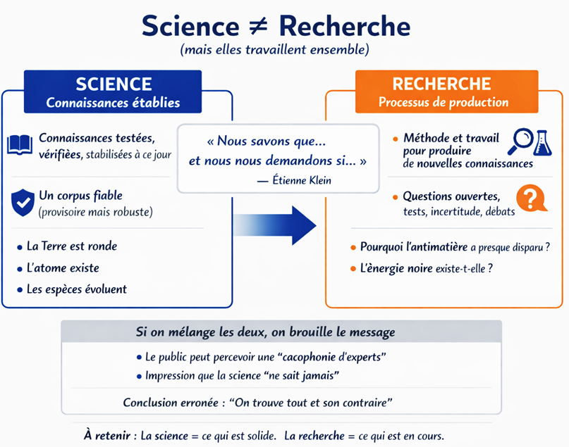
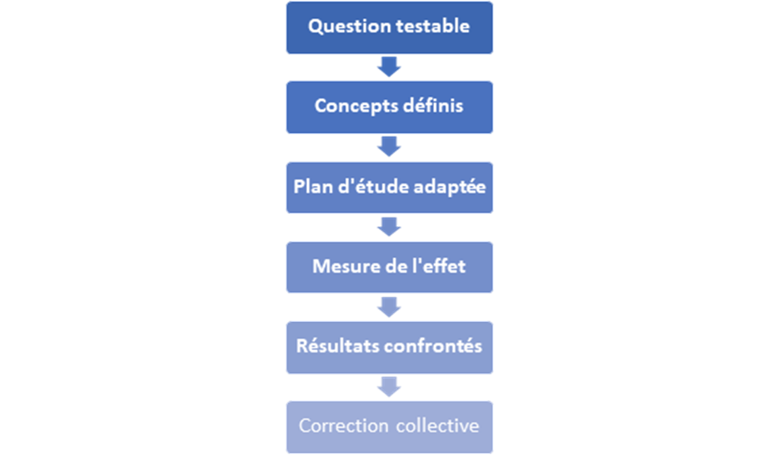

# Comprendre la science, preuves, causalité et méthode scientifique

### 1. Ouverture : comprendre ce qu'est un argument scientifique

Le traité part du constat qu'un argument est souvent présenté comme `scientifique`. Pour en comprendre la portée, il faut savoir ce qu'est la science, comment elle fonctionne, et comment interpréter les publications sur lesquelles le traité s'appuie.

Le chapitre annonce plusieurs points :

- distinction entre science et recherche ;
- principes de la méthode scientifique ;
- niveaux de preuve ;
- exemples concrets ;
- aperçu des outils statistiques utilisés dans les publications ;
- prévention des interprétations abusives.

Le traité signale que ces notions seront appliquées dans le chapitre `Boire un verre de vin est bon pour la santé`, avec une approche plus historique.

### 2. Science et recherche

Le traité insiste sur la distinction entre science et recherche.

| Terme | Définition source | Fonction |
|---|---|---|
| Science | Ensemble des connaissances établies et vérifiées à ce jour. | Corpus stabilisé, testable, corrigible, utilisable. |
| Recherche | Processus par lequel de nouvelles connaissances sont produites. | Exploration des questions ouvertes et réduction progressive de l'incertitude. |

Le physicien Étienne Klein est mobilisé pour formuler la distinction :

```text
Nous savons que... et nous nous demandons si...
```

La première partie renvoie aux acquis de la science ; la seconde aux questions ouvertes de la recherche.

Le traité donne des exemples de connaissances scientifiques stabilisées :

- la Terre est ronde ;
- l'atome existe ;
- les espèces évoluent.

Ces acquis ne doivent pas être remis en cause sans nouvelle preuve scientifique contraire solide.

À l'inverse, la recherche s'attaque à des questions non résolues découlant des limites de ces savoirs : par exemple la disparition de l'antimatière dans l'univers ou l'existence d'une énergie noire.

Le traité avertit que mélanger science et recherche brouille l'image de la science. Le public peut alors percevoir une cacophonie d'experts, ne plus savoir si la science `sait` ou `doute`, et conclure de façon erronée qu'`on trouve tout et son contraire` dans les publications.

### 3. Comment une conclusion entre dans le corpus scientifique

Le traité précise qu'une idée n'entre pas dans le corpus scientifique parce qu'une publication existe. Elle y entre progressivement lorsque plusieurs conditions convergent :

- la reproductibilité des résultats a été testée ;
- la robustesse a été évaluée avec des méthodes différentes : observationnelles, expérimentales, cliniques, toxicologiques, in vivo, in vitro, imagerie selon le sujet ;
- les biais dominants ont été traqués : facteurs de confusion, fausse causalité, mauvaise sélection des participants, mesures imparfaites ;
- les effets observés sont compatibles avec ce que l'on connaît du corps et du cerveau.

Le traité ajoute une nuance importante : la cohérence biologique ne suffit pas, seule, à conclure avec certitude. Elle doit s'inscrire dans une convergence plus large.

Une conclusion devient suffisamment stable pour être utilisée en prévention, en clinique ou dans des recommandations lorsque le niveau d'incertitude résiduelle est borné.

Dans la phase intermédiaire entre recherche et science, des résultats apparemment contradictoires sont normaux. Ils ne signifient pas nécessairement que la science `se trompe`, mais que la recherche explore les conditions pertinentes : chez qui, à quelle dose, dans quel contexte, avec quelles co-consommations.

### 4. Infographie p. 46 — `Science ≠ Recherche`

<figure class="doc-figure">
  
  <figcaption>Infographie p. 46 : distinguer le corpus scientifique stabilisé des questions encore travaillées par la recherche.</figcaption>
</figure>

L'infographie oppose deux colonnes :

- `Science` : connaissances établies, testées, vérifiées, stabilisées à ce jour ; corpus fiable, provisoire mais robuste ; exemples : Terre ronde, atome, évolution des espèces ;
- `Recherche` : processus de production ; méthode et travail pour produire de nouvelles connaissances ; questions ouvertes, tests, incertitude, débats ; exemples : antimatière, énergie noire.

Le visuel reprend la formule d'Étienne Klein et indique que science et recherche travaillent ensemble. Il signale aussi le risque de message brouillé lorsque les deux plans sont confondus : impression de cacophonie d'experts, impression que la science ne sait jamais, conclusion erronée `on trouve tout et son contraire`.

Conclusion du visuel :

```text
La science = ce qui est solide.
La recherche = ce qui est en cours.
```

### 5. Exemple de la cigarette électronique

Le vapotage est présenté comme un exemple de phase intermédiaire entre recherche et science. La question initiale est double :

1. la cigarette électronique réduit-elle le risque par rapport au tabac fumé ?
2. à quels risques propres expose-t-elle ?

Le traité explique qu'une réponse scientifique stable n'a pas pu être formulée immédiatement, car le recul était faible et les méthodes produisaient des résultats partiels, parfois perçus comme contradictoires.

#### Données initiales et limites

Plusieurs types de données sont distingués :

- travaux toxicologiques et réglementaires : les aérosols de cigarette électronique contiennent globalement moins de composés nocifs que la fumée de tabac, mais peuvent contenir des substances irritantes ou toxiques selon les conditions d'usage, les liquides et les dispositifs ;
- études physiologiques et cliniques : elles ont observé des effets respiratoires ou cardiovasculaires potentiels, mais la comparaison directe est compliquée par la diversité des produits et par le fait que beaucoup d'usagers sont d'anciens fumeurs ;
- incertitude de long terme : l'usage massif est récent à l'échelle des maladies chroniques.

#### Formulation convergente

Progressivement, une conclusion plus stable et opérationnelle est devenue possible :

- une exposition à des substances nocives est confirmée, donc le vapotage n'est pas neutre ;
- l'exposition à de nombreux toxiques est généralement moindre que celle liée à la fumée de tabac, ce qui soutient une réduction de risque en cas de substitution complète chez un fumeur ;
- un intérêt possible pour l'arrêt du tabac est étayé, avec des synthèses montrant que les cigarettes électroniques nicotinées peuvent augmenter les taux de sevrage par rapport à certains comparateurs, sous réserve des biais et de la qualité des essais ;
- l'enjeu jeunesse est consolidé : exposition inutile à la nicotine et risque de dépendance chez les non-fumeurs, en particulier les adolescents.

Le traité conclut que la formulation robuste n'est pas un slogan de type `inoffensif` ou `aussi dangereux que le tabac`, mais une formulation nuancée : le vapotage est généralement moins nocif que le tabac fumé lorsqu'il remplace totalement la combustion chez un fumeur, mais il n'est pas sans risque et ne devrait pas être initié chez les non-fumeurs, surtout les jeunes.

### 6. Exemple de la neurotoxicité de la MDMA

Le traité distingue d'abord ce qui relève du corpus scientifique établi :

- la MDMA augmente fortement la libération de sérotonine ;
- cette pharmacologie explique des effets aigus documentés ;
- une augmentation dose-dépendante de la température centrale a été décrite chez l'humain ;
- les formes sévères observées en contexte récréatif ont été associées à l'hyperthermie.

Ces points reposent sur des mécanismes pharmacologiques cohérents et une convergence clinique.

La question restée longtemps incertaine est différente :

```text
La MDMA abîme-t-elle durablement le système sérotoninergique chez l'humain ?
```

Le traité explique que les données ont été hétérogènes et parfois contradictoires selon les méthodes.

#### Modèles animaux

Des atteintes de marqueurs sérotoninergiques ont été mises en évidence dans plusieurs modèles animaux. La discussion porte cependant sur la transposition à l'humain : dose, fréquence d'exposition, espèce, rôle de la température, rôle du stress expérimental.

Le signal est préoccupant, mais l'extrapolation directe à l'usage récréatif humain ne peut pas être considérée comme fiable sans réserve.

#### Imagerie médicale

Les études d'imagerie mesurent indirectement des marqueurs comme le SERT, transporteur de la sérotonine, et non les neurones eux-mêmes.

Une baisse du SERT a souvent été observée chez des usagers, mais une remontée partielle après abstinence a aussi été décrite. Cette observation laisse ouverte l'alternative entre dommage durable et adaptation réversible. Le traité signale aussi que les populations étudiées ne consommaient pas uniquement de la MDMA.

#### Études psychologiques et psychiatriques

Les études en psychologie ou psychiatrie montrent une association entre usage de MDMA, surtout usage important, et déficits cognitifs subtils, notamment mnésiques. L'interprétation est compliquée par :

- polyconsommation ;
- sommeil ;
- sorties et mode de vie ;
- biais de sélection.

Une partie des effets observés peut donc être attribuée à des facteurs corrélés à l'usage plutôt qu'à la MDMA seule.

#### Formulation prudente retenue

Lorsque plusieurs angles convergent, une formulation plus robuste devient possible :

- un risque de perturbations prolongées de marqueurs sérotoninergiques et de certaines fonctions neuropsychologiques est plausible, surtout en cas d'usage important ;
- l'ampleur, la réversibilité et les facteurs individuels restent discutés : dose cumulée, abstinence, vulnérabilités, co-consommations ;
- les conditions de consommation jouent un rôle déterminant dans la gravité des complications aiguës : milieux chauds, foule, effort ou danse, hydratation inadaptée.

Le traité recommande de sortir du binaire `neurotoxique / pas neurotoxique` pour retenir une position plus nuancée : le risque existe et dépend de la dose, de la répétition, du contexte et des co-consommations, avec incertitude résiduelle explicitement bornée.

### 7. La méthode scientifique

Le traité définit la science comme une méthode avant d'être un ensemble de faits. Cette méthode oblige une idée à se confronter au réel, puis à la critique d'autres équipes.

L'objectif est de produire des connaissances :

- testables ;
- corrigeables ;
- plus fiables que l'intuition ;
- résistantes aux biais, routines et intérêts humains, y compris ceux des chercheurs.

Le fil rouge utilisé est la question :

```text
Le cannabis abîme-t-il la mémoire ?
```

Cette question paraît simple, mais elle montre pourquoi la méthode compte plus que les slogans.

### 8. Figure 2 — Étapes génériques de la méthode scientifique

<figure class="doc-figure">
  
  <figcaption>Figure p. 49 : étapes génériques permettant de transformer une question en hypothèse testable et confrontée aux données.</figcaption>
</figure>

La figure présente une séquence verticale :

1. Question testable ;
2. Concepts définis ;
3. Plan d'étude adaptée ;
4. Mesure de l'effet ;
5. Résultats confrontés ;
6. Correction collective.

### 9. Six étapes de la méthode scientifique

#### 9.1 Question testable

Une démarche scientifique commence par une formulation qui peut être mise à l'épreuve. La phrase `le cannabis abîme la mémoire` est trop vague pour être testée. Une formulation scientifique impose des conditions : qui, quoi, quand, comment.

Exemple conservé :

```text
Chez des adultes, une dose donnée de THC altère-t-elle la mémoire de travail dans les deux heures suivant l'administration, par rapport à un placebo ?
```

Une hypothèse devient alors possible :

```text
Le THC diminue la performance en mémoire de travail de manière dose-dépendante.
```

Des prédictions en découlent : baisse mesurable au test, relation dose-effet, réversibilité partielle avec le temps, modulation par la tolérance. L'intérêt n'est pas l'hypothèse en elle-même, mais le fait qu'elle puisse être mise en défaut.

#### 9.2 Définir les concepts

La méthode scientifique impose de définir ce qui est mesuré. Le mot `mémoire` recouvre plusieurs fonctions. Une conclusion globale reste impossible tant que les types de mémoire ne sont pas définis.

Le traité distingue :

- mémoire de travail : retenir ou manipuler une information sur quelques secondes ;
- mémoire épisodique : mémorisation d'éléments appris ;
- attention et vitesse de traitement : facteurs qui influencent les performances sans être la mémoire au sens strict.

Règle : une affirmation du type `ça abîme la mémoire` n'est pas scientifique tant que la fonction cognitive et le critère de mesure ne sont pas précisés.

#### 9.3 Choisir un plan d'étude adapté

La méthode scientifique n'utilise pas un seul outil. Le plan d'étude dépend de la question.

Avec l'exemple cannabis-mémoire :

- pour un effet aigu, minutes ou heures, un protocole expérimental peut être utilisé : THC contre placebo, tests standardisés, conditions identiques ; la causalité est mieux approchée parce que l'exposition est contrôlée ;
- pour un effet durable, mois ou années, des études observationnelles chez des consommateurs sont généralement utilisées ; la difficulté majeure est que les différences observées peuvent être liées à des facteurs associés : sommeil, santé mentale, contexte social, autres substances.

Le traité insiste sur une idée : un résultat observé n'a pas le même statut selon qu'il provient d'un essai contrôlé ou d'une étude observationnelle. La méthode détermine le niveau d'inférence possible.

#### 9.4 Mesurer et quantifier

La méthode scientifique remplace les jugements binaires par des quantités :

- taille d'effet : amplitude du changement ;
- incertitude : intervalle de confiance ;
- variabilité : effet moyen, maximum et minimum observés ;
- conditions : dose, délai, tolérance, co-consommations.

Dans l'exemple cannabis-mémoire, une baisse moyenne peut être modeste et rester pertinente dans certaines situations : tâches complexes, conduite, examens. L'enjeu n'est pas seulement de savoir si la performance baisse, mais dans quelles conditions, pour qui et avec quelle amplitude.

#### 9.5 Réplication et controverse organisée

Une étude, même bien faite, ne suffit pas. La connaissance scientifique progresse par confrontation collective.

Les publications contradictoires doivent être analysées en fonction de : population, dose, produit THC/CBD, délai depuis la prise, mesures cognitives, contrôle des biais.

Dans l'exemple cannabis-mémoire, des résultats hétérogènes peuvent apparaître si :

- l'usage est occasionnel ou quotidien ;
- le THC est élevé ou modulé par du CBD ;
- la dernière prise date de quelques heures ou de plusieurs jours ;
- l'alcool ou la nicotine sont co-consommés ;
- la population étudiée est jeune, adulte ou vulnérable.

La méthode ne fait pas disparaître ces variations ; elle les cartographie et cherche les conditions qui expliquent la convergence ou la divergence.

#### 9.6 Biais et garde-fous

Les chercheurs restent humains. Les résultats peuvent être influencés par des biais cognitifs, des incitations de carrière, des conflits d'intérêts ou des erreurs méthodologiques.

La force de la science réside donc dans des mécanismes d'objectivation collective :

- protocoles et critères prédéfinis pour limiter la sélection a posteriori ;
- transparence méthodologique ;
- contrôle des facteurs de confusion ;
- analyses de sensibilité ;
- réplications indépendantes ;
- relecture critique ;
- débats contradictoires.

Dans l'exemple cannabis-mémoire, ces garde-fous évitent deux confusions : présenter une association comme causalité, et confondre effet aigu avec effet durable.

### 10. Conclusion du chapitre science

Le traité conclut que la science avance parce qu'elle oblige à mettre les idées à l'épreuve. Une affirmation n'y est pas acceptée parce qu'elle paraît évidente ou choquante, mais parce qu'elle peut être testée, mesurée, discutée et corrigée.

Les résultats ne dépendent donc pas d'une neutralité parfaite des chercheurs, mais d'un fonctionnement collectif qui limite progressivement les erreurs et les biais.

Dans le domaine des drogues, la méthode est présentée comme particulièrement importante, car les discours sont souvent tranchés :

- `ça détruit le cerveau` ;
- `ce n'est pas dangereux` ;
- `tout dépend des gens`.

Ces phrases donnent une impression de clarté, mais elles sont peu utiles si elles ne disent pas dans quelles conditions un risque apparaît, pour qui et à quel moment.

L'exemple du cannabis et de la mémoire illustre la nécessité de préciser : type de mémoire, adolescents ou adultes, prise récente ou à distance, dose, produit.

Les réponses scientifiques sont rarement absolues. Elles indiquent des tendances, des ordres de grandeur et des conditions de risque. Une baisse de mémoire de travail après consommation de THC peut être modérée, transitoire et sans conséquence dans certaines situations, mais devenir problématique pour conduire, étudier ou effectuer une tâche exigeante.

La réduction des risques s'appuie directement sur ce mode de raisonnement. Il ne s'agit pas de dire qu'une substance est `bonne` ou `mauvaise`, mais de comprendre quand et comment les risques augmentent ou diminuent : dose, fréquence, associations de substances, fatigue, stress, vulnérabilités individuelles.

La méthode scientifique fournit alors des repères concrets pour ajuster les comportements plutôt que des injonctions générales. Le traité conclut que la science ne donne pas des certitudes définitives, mais des outils pour penser les risques de manière plus fine, réaliste et utile.
