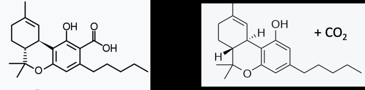
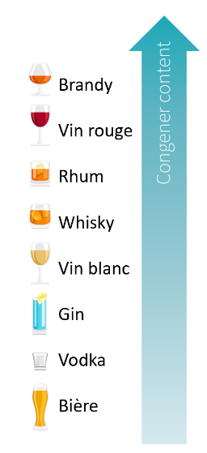
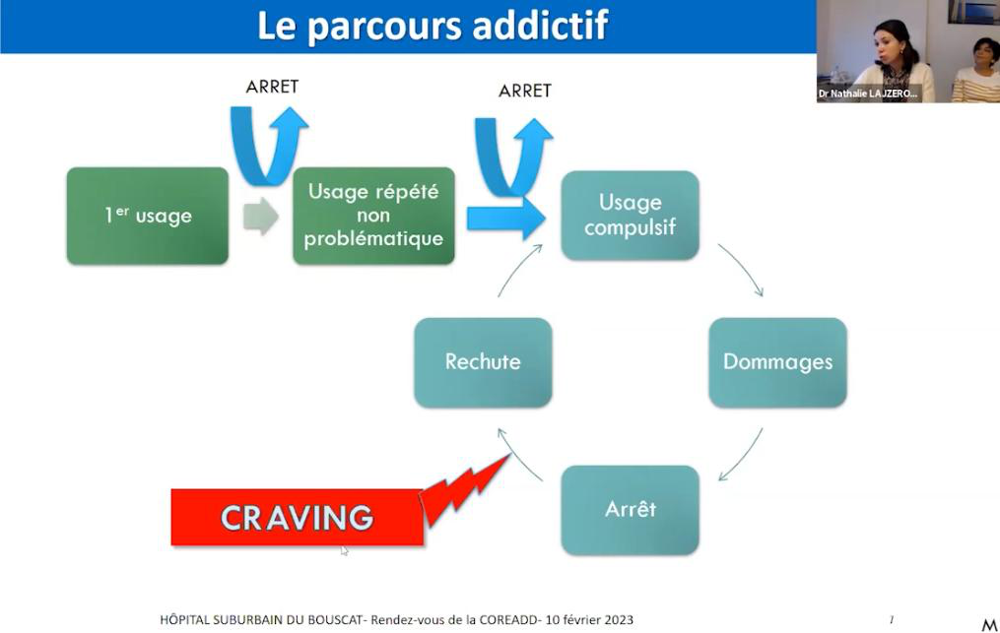

# Mythes sucre, naturel, reste perche, contact et addiction

## « Addiction » au sucre ?

Parfois, lors de débat sur
l’addiction à l’alcool, certaines personnes finissent par botter en touche en
disant « oui, mais bon, l’addiction au sucre ce n’est pas mieux ».

Est-ce qu’une addiction au sucre est aussi grave qu’une
addiction à l’alcool ?

Pour la personne « addicte au sucre », en matière
de santé, elle risque (grossièrement) un surpoids morbide causant des problèmes
cardiovasculaires et à un diabète de type 2 (s’il y a un terrain propice).
Pour la personne ayant une addiction à l’alcool, les risques sont beaucoup plus
nombreux, à commencer par la toxicité. Plus de 70 maladies peuvent être
provoquées par l’alcool, il y a des possibilités de surdose, d’accidents, etc.
De plus, l’alcool est plus calorique que le sucre et les boissons alcoolisées
sont également sucrées. L’alcoolisme inclut les conséquences potentielles de
l’addiction au sucre.

L’argument ne tient pas pour amener l’impact de l’alcool au
niveau de celui du sucre, mais ne permet pas d’assurer qu’un addict au sucre
sera en meilleure santé qu’un alcoolique à un instant T.

En effet, comparer les toxicités des objets de l’addiction
(sucre et alcool) n’est pas comparer les addictions. Quel que soit la substance
ou le comportement de l’addiction, certaines conséquences se recoupent, par
exemple :

– isolement social,

– délaissement d’activités au profit de la
consommation,

– conséquence sur la santé, les finances.

La maladie est l’addiction, elle s’exprime différemment chez
chaque malade et ne causera pas la même perte de qualité de vie. L ’objet de
l’addiction ne permet pas toujours de classer la gravité des addictions, il est
un facteur qui peut être aggravant en rajoutant des conséquences négatives
potentielles (toxicité, illégalité, etc.).

Mais pour les scientifiques, comme Jean Zwiller, directeur
de recherche CNRS au laboratoire de neurosciences cognitives de Strasbourg et
spécialiste des drogues, la comparaison de celles-ci avec le sucre est
absurde.

Pour comprendre l’ « addiction » au sucre, une
étude récente intitulée "Sugar addiction: the state of the science [76] "
fait un point exhaustif sur l'état actuel des connaissances concernant
l'addiction au sucre et sa comparaison avec l'addiction aux drogues.

L'analogie entre le sucre et la cocaïne est souvent utilisée,
car très médiatisée, pour souligner la prévalence de la surconsommation de
sucre et les problèmes de santé qui en découlent , mais les mécanismes
d'action et les effets sur le corps sont fondamentalement différents .
Les drogues vont modifier le fonctionnement du cerveau, le sucre rapide
(nutriment essentiel à la vie, notamment au fonctionnement du cerveau) peut
activer le circuit de récompense.

En ce qui concerne les études, très médiatisées, qui
montrent que les rats ont tendances à prendre de façon préférentiel le sucre à
la cocaïne, sont en fait peu reproductible et les résultats dépendent de
comment ont été conditionnés les rats [77]
(privation alimentaire, le délai entre la visualisation des choix et l’accès
aux produits, etc).

Point supplémentaire, le rat addicte à la cocaïne
continue de consommer même lorsqu’il reçoit une décharge électrique douloureuse
à chaque prise, alors que ce n’est pas le cas pour le sucre. Ce point est
important : L’envie de consommer de la cocaïne est supérieure à la peur de
l’électrocution, ce qui n’est pas le cas avec le sucre.

Enfin, les résultats sont similaires quand le sucre est
remplacé par des édulcorants comme la saccharine.

L’étude met en évidence plusieurs points scientifiques qui
justifient que le sucre ne puisse pas être considéré comme une drogue au sens
pharmacologique et neurobiologique :

Chez l’animal, les comportements
ressemblant à une « addiction au sucre » n’apparaissent quasiment que dans des
conditions artificielles : un accès intermittent et limité au sucre après une
période de restriction. Dans ce contexte, les rats surconsomment le sucre quand
il redevient disponible, manifestant certains signes qui rappellent une
dépendance. Mais ces effets disparaissent lorsque le sucre est accessible de
façon continue (accès ad libitum). Le binge ou la surconsommation est donc
davantage lié à la privation suivie d’une récompense gustative intense, plutôt
qu’à des propriétés intrinsèques addictives du sucre. En d’autres termes, sans
manipulation externe (privation, accès restreint), ces schémas « addictifs » ne
se développent pas.

Les drogues d’abus entraînent des
modifications stables et profondes de la neurotransmission dopaminergique.
Elles perturbent durablement les circuits de récompense (notamment dans le
striatum, la voie mésolimbique), induisent une sensibilisation, une tolérance
et une réorganisation structurelle et fonctionnelle de ces systèmes. Le sucre,
lui, déclenche certes une libération de dopamine lorsqu’il est consommé, mais
cette réponse s’atténue rapidement, et n’est pas associée aux changements
neuroadaptatifs à long terme typiques des drogues. Les études montrent qu’avec
des aliments sucrés, la libération de dopamine diminue dès que l’aliment n’est
plus nouveau ou lorsque l’animal anticipe l’aliment. Il n’y a pas ce phénomène
de maintien durable d’une perturbation du circuit de la récompense.

Les drogues d’abus génèrent un
tableau de manque (sevrage) marqué par des symptômes physiologiques et
comportementaux distincts. Dans les quelques expériences où l’on observe un
sevrage apparent du sucre, celui-ci se produit essentiellement dans le même type
de cadre : accès intermittent, puis arrêt brutal. Or, ce « sevrage » semble
davantage lié au stress de ne pas retrouver la récompense gustative attendue
qu’à une dépendance pharmacologique. Quand un aliment sucré est immédiatement
accessible, on n’observe pas de « craving » persistant ni de symptômes
comparables à ceux du manque observé avec les opioïdes ou les stimulants.

Les drogues agissent souvent sur
des récepteurs et des transporteurs neuronaux spécifiques (opioïdes endogènes,
dopamine, sérotonine, GABA, etc.) et induisent des effets pharmacodynamiques
mesurables et durables. Le sucre, lui, n’a pas d’action directe de ce type : il
apporte de l’énergie, du plaisir gustatif, mais ne produit pas d’altération
pharmacologique directe et ciblée sur le cerveau. Les parallèles faits entre la
vitesse d’absorption d’une drogue et l’absorption rapide du glucose restent
superficiels. Le sucre n’entraîne pas l’intensité ni la persistance
d’altérations moléculaires que l’on observe avec l’ingestion de substances
psychoactives.

Les comportements assimilés à une
dépendance au sucre sont souvent liés à la palatabilité (goût sucré agréable),
et non au sucre lui-même. Des aliments sucrés sans apport calorique
(édulcorants) peuvent induire des comportements de recherche similaires, montrant
que c’est le goût (et le contexte : rareté, intermittence) qui joue un rôle,
plus que le sucre. Les drogues d’abus, elles, n’ont pas besoin de saveur
agréable : leur pouvoir addictif provient de leurs effets directs sur le
cerveau, indépendamment de leur goût.

| Aspect étudié | Sucre | Cocaïne |
| --- | --- | --- |
| Contexte   expérimental | Les   comportements addictifs n'apparaissent que dans des conditions artificielles   (privation suivie d'accès intermittent). | Provoque une   dépendance même en accès continu et sans manipulation extérieure. |
| Réponse neurobiologique | Libère de la dopamine, mais   l'effet diminue rapidement sans changements durables. | Perturbe durablement les   circuits de récompense, avec des changements structurels et fonctionnels. |
| Syndrome de   sevrage | Pas de symptômes   de manque persistants, seulement un stress lié à l'absence de récompense   gustative -sucre ou édulcorant- | Provoque un   syndrome de sevrage marqué avec des symptômes physiologiques et   comportementaux. |
| Effet pharmacodynamique | Pas d'effet pharmacologique   direct sur le cerveau, agit comme source d'énergie et plaisir gustatif. | Effets directs sur les   récepteurs neuronaux, modifiant durablement le fonctionnement du cerveau. |
| Comportement   en cas de punition | Les rats cessent   de consommer s'il y a une punition (ex : choc électrique). | Les rats continuent de consommer malgré une punition,   montrant une forte dépendance. |

Tableau 8.
Sucre VS Cocaïne

En résumé , d’un point de vue scientifique, le sucre
n’engendre pas les mêmes modifications neurochimiques durables, le même pattern
de tolérance, de dépendance et de sevrage que les drogues d’abus. Ce que l’on
appelle couramment « addiction au sucre » semble davantage relever d’un
comportement de surconsommation contextuelle, lié à la palatabilité, la
privation et la récompense gustative intermittente, plutôt qu’à une dépendance
pharmacologique intrinsèque comme c’est le cas avec les substances addictives.

Il n'existe pas de preuves solides soutenant l'idée
que le sucre est addictif chez les humains. Les comportements qui
pourraient être interprétés comme addictifs, tels que la surconsommation,
semblent plutôt être le résultat d'un accès intermittent à des aliments sucrés,
et non pas d'effets neurochimiques spécifiques au sucre.

De plus, le modèle de l'addiction alimentaire, qui tente de
placer la surconsommation de certains aliments dans le même cadre
neurobiologique que l'addiction aux drogues, a été remis en question. L'étude
souligne également des défis méthodologiques, notamment le fait que les humains
consomment rarement du sucre isolé, ce qui rend difficile la comparaison avec
les études sur les animaux.

En ce qui concerne les symptômes, tels que la perte de
contrôle ou le sevrage, ils ne sont pas démontrés dans le cas du sucre. En
somme, l'étude conclut qu'il est prématuré et potentiellement dangereux
d'intégrer l'idée d'une addiction au sucre dans la littérature scientifique et
les recommandations de politique publique, surtout en la comparant à
l'addiction aux drogues.

En effet, l’ « addiction » au sucre est
aujourd’hui un moyen de dédramatiser sa consommation de drogue ou à minima de
minimiser les risques et dommages en plaçant le sucre au premier plan.

Pour finir, lors du 8ème Congrès sur les Addictions (E-ADD
2024), qui s'est tenu le 19 mars 2024, une conférence [78]
sur les addictions alimentaires a été animée par Philippe Gorwood, Laurent
Karila, et Jean-Michel Cohen. Ils ont discuté de l'évolution potentielle du
DSM, qui pourrait à l'avenir inclure un trouble spécifiquement dédié aux
troubles alimentaires. Cette nouvelle catégorie se baserait sur la
consommation excessive de sucre rapide ET de graisses saturées . Ils
ont souligné qu'actuellement, le terme « addiction alimentaire » est
utilisé de manière pratique pour décrire certains comportements qui ont des similarités
à une addiction. Ils ont souligné que les troubles alimentaires ne sont pas
traités de la même manière que les addictions traditionnelles, car ils
n'activent pas les mêmes mécanismes dans le cerveau.

<figure class="doc-figure">
  
  <figcaption>Figure p. 78 : Sucre Naturel Reste Perche Contact.</figcaption>
</figure>

· Certaines
conséquences des addictions, comme l'isolement social et le délaissement
d’activités au profit de la consommation sont similaires quel que soit l'objet
de l'addiction. Mais la toxicité de l’objet de l’addiction cause des problèmes
de santé plus ou moins grave

· Il
n'existe pas de preuves solides d'une véritable addiction au sucre chez les
humains

· Les
mécanismes cérébraux sont différents entre le sucre (essentiel à la vie) et les
drogues

· Les
troubles alimentaires et l'addiction alimentaire pourraient être inclus dans le
DSM à l'avenir, mais ils ne fonctionnent pas comme les addictions aux drogues

· Les
traitements pour un trouble du comportement lié au sucre ne sont pas les mêmes
que pour les addictions

## Naturel = plus sûr ?

Une distinction est souvent
établie entre les produits naturels et synthétiques, suscitant des débats
animés, alimentés par des croyances profondément ancrées, souvent erronées, sur
leur sécurité et leur efficacité.

Cette dichotomie s'avère particulièrement problématique dans
le domaine des drogues, où la perception de la naturalité peut fausser la
compréhension de la toxicité et des risques associés.

<figure class="doc-figure">
  
  <figcaption>Figure p. 81 : Sucre Naturel Reste Perche Contact.</figcaption>
</figure>

Or,
il est important de comprendre que, quelle que soit l’origine (naturelle ou
synthétique), c'est uniquement la structure des substances consommées et leur
quantité qui déterminent leur toxicité et leurs propriétés pharmacologiques.

Pour comprendre pourquoi ce mythe est courant, il faut
aborder la notion d’heuristique, de biais et de sophisme.

Heuristique : Une heuristique est une méthode mentale
rapide, une sorte de raccourci cognitif utilisé pour résoudre des problèmes ou
prendre des décisions de manière efficace sans mobiliser beaucoup de ressources
mentales.

Trois raisonnements sont identifiés comme brouillant le
jugement concernant les substances chimiques [79] :

·
 L'heuristique du "naturel est meilleur" : Cette
croyance repose sur l'idée que le naturel est inoffensif, en opposition à
l'idée que le synthétique est dangereux.

·
 L'heuristique de la "contagion" : L'idée fausse
qu'une présence, même minime, d'un composé non naturel rend l’ensemble du
produit dangereux, négligeant la maxime toxicologique essentielle selon
laquelle "c’est la dose qui fait le poison".

·
 L'heuristique de la "confiance" : Une tendance à
se fier aveuglément à des entités ou des produits en raison de leur caractère
naturel, sans évaluation fondée sur des preuves scientifiques.

Pourtant, les produits synthétiques font souvent l’objet
d’études plus approfondies lors de leur découverte. Les formulations,
c’est-à-dire les mélanges dans le produit fini, sont généralement beaucoup
mieux contrôlées.

Dans l'analyse des perceptions publiques réalisée en Europe concernant
les substances chimiques [80]
 [81] ,
des données révélatrices sont mises en évidence :

·
 70% des personnes interrogées ne sont pas conscients que la
structure chimique du sel (NaCl) demeure identique, que le sel soit d'origine
naturelle ou synthétique.

·
 81% des personnes interrogées, pensent qu’un composé chimique
synthétique est toujours dangereux, indépendamment du niveau d'exposition.

La chimiophobie est devenue un levier marketing tant pour
les produits de consommation courante que pour les drogues. Ce phénomène repose
sur le sophisme de l'appel à la nature [82] ,
une tactique de persuasion qui suggère que tout ce qui est naturel est
automatiquement bon. Un sophisme est un argument fallacieux, c'est-à-dire un
raisonnement biaisé utilisé pour convaincre. Ce type de raisonnement est
exploité pour promouvoir une large gamme de produits, allant des gels douche au
« citron de Sicile » jusqu’aux campagnes pour la légalisation du cannabis (par
exemple, « c’est une drogue naturelle, donc c’est acceptable »).

Cependant, le simple fait qu'une substance soit naturelle ne
constitue pas un argument toxicologique valable pour sa légalisation. Des
critères bien plus rigoureux, basés sur des preuves scientifiques, doivent être
pris en compte pour de telles décisions (voir partie sur la classification des
drogues).

Cette chimiophobie peut engendrer des décisions néfastes
pour le consommateur, comme le rejet des médicaments de substitution pour les opioïde
ou les médicaments utilisés dans la prise en charge des addictions au le
cannabis ou l’alcool, considérés comme non naturels, alors qu'ils ont fait
l'objet d'études approfondies prouvant leur efficacité, leur sécurité et qu’ils
causent moins de dommages (voir partie addiction). Cela conduit également à
considérer les champignons hallucinogènes comme moins risqués que le LSD, alors
que leur mécanisme d’action est identique. La différence réside dans
l’incertitude du dosage lors de la prise de champignons et la durée des effets.

### Biais de naturalité

Le biais de naturalité désigne de façon générale la tendance
à percevoir les produits naturels comme intrinsèquement plus sûrs ou meilleurs
que les produits synthétiques, bien que cette perception soit souvent infondée
et puisse conduire à des choix risqués pour la santé.

Ce biais s’étend parfois jusqu’aux pharmacies et aux
professionnels de santé. Un exemple est l’utilisation du violet de gentiane ,
une molécule extraite d’une fleur, souvent recommandé par des pharmacies à des
mères allaitantes pour traiter les candidoses. Cette pratique s’appuie
fréquemment sur les recommandations de groupes ou d’associations d’allaitement,
comme La Leche League France [83] ,
qui mentionne le violet de gentiane comme un traitement local efficace et peu
coûteux et ne nécessitant pas de consultation médicale. Toutefois, cette
approche soulève des questions majeures de sécurité .

Le violet de gentiane est connu pour ses propriétés
antifongiques. Toutefois, son caractère cancérigène a été démontré dans
plusieurs études animales depuis les années 70 [84] .
Par ailleurs, l’ Organisation mondiale de la santé (OMS) déconseille
son usage dans l’alimentation animale, en raison de son effet génotoxique .
Pourtant, son utilisation en première intention chez les mères allaitantes
persiste : il est recommandé de l’appliquer directement sur la poitrine et dans
la bouche du nourrisson , exposant ainsi des populations particulièrement
vulnérables à des risques inutiles .

Des alternatives thérapeutiques validées par des
études scientifiques rigoureuses existent pourtant. La Haute Autorité de
Santé (HAS) et l’ Agence nationale de sécurité du médicament et des
produits de santé (ANSM) privilégient des traitements comme la nystatine
ou le miconazole , qui ont prouvé leur efficacité contre les candidoses
tout en offrant un profil de sécurité bien mieux documenté, alors que ce sont
des produits de synthèse. Malgré ces recommandations, certaines pharmacies et
associations d’allaitement continuent de promouvoir le violet de gentiane, renforçant
ainsi un biais de naturalité profondément enraciné dans la culture
populaire.

Ce phénomène reflète un problème plus large : la confiance
aveugle envers les produits naturels . Cette perception, bien que largement
infondée, peut entraîner des situations à risques , où les précautions
nécessaires ne sont pas prises. Le violet de gentiane, par son nom évocateur,
sa disponibilité sans ordonnance et son usage historique, est fréquemment
considéré comme inoffensif, alors que les données scientifiques contredisent
cette idée.

Un autre exemple, moins technique est la croyance que la
vitamine C classique serait moins efficace que la vitamine C dans l’acérola.

Le biais de naturalité n’épargne pas les professionnels de
santé, ce qui aggrave son impact. Lorsqu’un produit naturel est recommandé sans
prendre en compte ses études toxicologiques, des risques réels et méconnus
peuvent affecter des patients. La sécurité objective doit toujours primer sur
la perception.

#### Exemple de l’Ayahuasca

L’Ayahuasca, une décoction traditionnelle originaire
d’Amérique du Sud, est aujourd’hui au cœur d’un engouement mondial, en grande
partie grâce à sa perception comme un produit naturel et spirituel.

Elle est souvent consommée dans le cadre de cérémonies dites
« thérapeutiques » ou « chamaniques » et bénéficie d’une popularité croissante
auprès de ceux en quête d’expériences introspectives. Cette boisson est
composée principalement de deux plantes [85]
:

·
 La liane Banisteriopsis caapi, qui contient des
inhibiteurs de la monoamine oxydase (IMAO),

·
 Des feuilles de Psychotria viridis, riches en
diméthyltryptamine (DMT).

Cette recette de base peut faire l’objet d’adaptation avec
des rajouts de principes actifs supplémentaires.

L’IMAO permet à la DMT, une molécule psychoactive
puissante, de devenir active lorsqu’elle est ingérée par voie orale, en
empêchant sa dégradation dans le système digestif. Prise par voie
orale, la DMT est détruite par des enzymes du système digestif avant
d’atteindre le cerveau pour exercer son action psychoactive. L’adjonction
d’IMAO permet d’empêcher cette dégradation de façon à ce que le DMT reste
active par voie orale. Le problème, c’est que les IMAO sont eux-mêmes actifs
sur le cerveau.

En termes pharmacologiques, consommer de l’Ayahuasca revient
à ingérer un mélange de DMT (agoniste des récepteurs à la sérotonine), une substance
puissante et illégale dans de nombreux pays, et d’IMAO, une classe
d’antidépresseurs historiquement utilisée, mais utilisés aujourd’hui en 3 ou 4 ème
a causes de leurs effets secondaires [86] .
Ces derniers incluent notamment des interactions alimentaires potentiellement
mortelles (syndrome sérotoninergique), ce qui impose des restrictions
alimentaires et un encadrement médical strict.

En médecine, les IMAO sont contre indiqués avec d’autres
molécules sérotoninergiques comme la DMT.

Ce paradoxe est révélateur du biais de naturalité. Sous sa
forme brute et naturelle, l’Ayahuasca est perçue comme mystique et bénéfique,
en partie grâce à son association avec des rituels traditionnels. Cependant, si
l’on isolait la DMT et les IMAO pour en produire un mélange purifié et contrôlé,
il y a fort à parier que cette version synthétique serait largement rejetée par
les mêmes consommateurs en raison de son origine « chimique ».

Pourtant, cette version pourrait potentiellement offrir des
doses précises et réduire les risques d’effets secondaires graves liés à
l’imprévisibilité des concentrations dans les préparations artisanales.

L’Ayahuasca illustre ainsi parfaitement comment le statut «
naturel » peut influencer l’acceptation sociale d’une substance, au détriment
d’une évaluation rationnelle des risques et des bénéfices. Ce mélange, loin
d’être anodin, souligne la nécessité d’une approche basée sur la science plutôt
que sur des perceptions biaisées, pour garantir une consommation informée et
sécurisée.

#### Antidépresseur naturel VS synthétique

Un exemple marquant de ce biais de naturalité se retrouve
dans la préférence de certains patients pour le millepertuis , présenté
comme un « antidépresseur naturel », au détriment des inhibiteurs
sélectifs de la recapture de la sérotonine (ISRS) comme la Fluoxétine (Prozac),
prescrit par leur médecin , considérés comme « chimiques ».

Bien que le millepertuis renferme des substances actives
telles que l’hyperforine et l’hypéricine [87] ,
qui agissent sur plusieurs neurotransmetteurs (sérotonine, dopamine,
noradrénaline, etc.), il n’est pas exempt de risques. Les études montrent qu’il
peut entraîner de nombreuses interactions médicamenteuses et alimentaires
 potentiellement graves (par exemple avec les anticoagulants ou la
pilule contraceptive ) -voir partie interaction- et qu’il présente un
effet sur le métabolisme susceptible d’amoindrir l’efficacité d’autres
traitements.

Par ailleurs, à l’instar de tous produits naturels, sa
composition en principes actifs varie selon la plante et le mode de
préparation, rendant son action moins prévisible que celle d’un ISRS dont la
dose et la qualité sont strictement contrôlées. Sauf dans le cas de produits
pharmaceutiques comme le Mildac.

Paradoxalement, le rejet des ISRS—dont le mécanisme et
l’innocuité sont mieux documentés—au profit du millepertuis témoigne d’une
méfiance injustifiée envers le « synthétique ». Cette préférence
repose davantage sur une perception idéalisée du « naturel » que
sur une évaluation rigoureuse des risques et bénéfices de chaque option
thérapeutique.

| Critère | ISRS   (Inhibiteurs Sélectifs de la Recapture de la Sérotonine) | Millepertuis |
| --- | --- | --- |
| Type de   substance | Médicaments de   synthèse | Plante   médicinale |
| Mécanisme   d’action | Mécanisme primaire : Inhibition   sélective de la recapture de la sérotonine (5-HT) Mécanismes secondaires   possibles | Inhibition de la recapture   de plusieurs neurotransmetteurs (sérotonine, noradrénaline, dopamine) Possible   action sur d’autres récepteurs (GABA, glutamate, etc.) -mécanisme mal connu - |
| Contrôle de   la composition | Strictement   contrôlé par les autorités de santé | Variable selon   la plante, la méthode de culture, la partie utilisée et le procédé   d’extraction |
| Preuves   d’efficacité | Efficacité bien documentée   par de nombreuses études cliniques | Efficacité reconnue dans   certains cas de dépression légère à modérée, mais consensus médical moins   solide |
| Interactions   médicamenteuses | Interactions   possibles mais peu nombreuses | Très nombreuses   interactions (anticoagulants, contraceptifs oraux, antiviraux, etc.), pouvant   diminuer ou altérer l’efficacité d’autres traitements |
| Effets   secondaires | Troubles   gastro-intestinaux, céphalées, dysfonctions sexuelles, etc. | Photosensibilité, troubles   digestifs, agitation, risque d’interactions multiples |
| Encadrement   médical | Nécessaire   (prescription médicale) | Usage souvent   en automédication, moins d’encadrement et de surveillance |
| Recommandations   officielles | Recommandés en première ou   deuxième ligne pour la dépression majeure | Généralement non   recommandés en première intention, surtout dans la dépression modérée à   sévère, à cause des nombreuses interactions |
| Prix &   accessibilité | Remboursés | En vente libre, prix variable |

Tableau 9.Comparaison des ISRS avec le Millepertuis

### Une frontière assez fine

Dans l’imaginaire collectif, le
mot « synthétique » est souvent associé à « chimique », et donc à quelque chose
d’artificiel, voire dangereux. Pourtant, la chimie, qu’elle soit pratiquée en
laboratoire ou qu’elle opère dans une cellule vivante, repose toujours sur les
mêmes principes fondamentaux : assembler ou fragmenter des molécules.

Même dans le cadre de la chimie
dite « de synthèse », les chercheurs ou industriels partent inévitablement de
briques élémentaires issues de la nature : atomes, acides organiques, alcools,
bases azotées… Le laboratoire ne crée pas de rien, il réorganise ce que la
nature met déjà à disposition. La frontière entre « naturel » et « synthétique
» devient alors plus floue qu’elle n’y paraît.

Le chimiste et
psychopharmacologue Alexander Shulgin, dans son ouvrage emblématique TIHKAL
(Tryptamines I Have Known And Loved [88] ),
présente une série d’expériences fascinantes menées en Allemagne concernant la
capacité du mycélium de champignons du genre Psilocybe à transformer des
molécules psychoactives. Voici comment il décrit cette découverte dans la
section consacrée à la molécule 4-HO-DET :

« Certaines études
fascinantes ont été menées en Allemagne, dans lesquelles le mycélium
métaboliquement actif de certaines espèces de Psilocybe a reçu de la
diéthyltryptamine comme potentiel complément alimentaire. Habituellement, ces
champignons transforment naturellement la N,N-diméthyltryptamine (DMT) en
psilocine en ajoutant un groupe hydroxyle en position 4 de la molécule grâce à
une enzyme probablement nommée par les biochimistes "indole
4-hydroxylase". Vous introduisez de la DMT, vous obtenez de la 4-hydroxy-DMT,
autrement dit de la psilocine. Peut-être que si vous introduisiez Mickey Mouse,
vous obtiendriez de la 4-hydroxy-Mickey Mouse. C'est comme si la psyché du
champignon se fichait complètement du substrat sur lequel elle travaillait, et
se contentait simplement d’accomplir son devoir sacré : hydroxyliser en
position 4 toutes les tryptamines qu’elle rencontre.

On a ainsi observé que si vous
introduisez de la N,N-diéthyltryptamine (DET, une molécule qui n'existe pas
naturellement) durant la croissance, les enzymes obéissantes et aveugles vont
l'hydroxyliser en 4-hydroxy-N,N-diéthyltryptamine (4-HO-DET), une drogue
puissante elle aussi inconnue dans la nature. C’est cette substance qui
constitue le sujet principal de ce commentaire.

Quel beau défi lancé à la
controverse entre naturel et synthétique ! Si une plante (dans ce cas précis,
le mycélium d’un champignon) reçoit une molécule synthétique et qu'elle la
convertit, en utilisant ses capacités naturelles, en un produit jamais observé
auparavant dans la nature, ce produit est-il naturel ? Qu’est-ce que le naturel
? Voilà de quoi alimenter bien des dissertations longues et inutiles. »

Ce commentaire de Shulgin soulève
un débat fondamental dans le domaine des substances psychédéliques : la
frontière entre naturel et artificiel est-elle aussi nette qu’on le pense ? En
montrant que le vivant, ici représenté par le mycélium d’un champignon, ne fait
pas de différence entre les molécules synthétiques et naturelles lorsqu’il
s’agit de réaliser ses transformations chimiques, Shulgin souligne le caractère
arbitraire et complexe de cette distinction. Il pose aussi la question du
résultat : est-ce que la molécule synthétique devient naturelle ?

Pour enrichir cette question, d’autres exemples existent. Le
cannabis, pour qu’il devienne actif, une transformation chimique, la
décarboxylation, doit se faire (souvent par chauffage lors de la combustion).

En d'autres termes, avant que le cannabis puisse exercer son
effet sur le cerveau, il doit nécessairement subir une transformation chimique.
Dans la mesure où la molécule active n’est pas celle produite par la plante,
est ce que cela est naturel ?

<figure class="doc-figure">
  
  <figcaption>Figure p. 89 : Sucre Naturel Reste Perche Contact.</figcaption>
</figure>

Figure 7.Transformation du THCa en THC

Un autre exemple est celui du LSD, souvent qualifié de
substance semi-synthétique ou semi-naturelle.
Le LSD est un dérivé d'une molécule naturelle produite par certains
champignons, notamment l'ergot de seigle. En modifiant chimiquement cette
molécule par l'ajout d'un groupement spécifique, on obtient le LSD.

En somme, dans ces deux cas, une intervention chimique
est indispensable pour que la substance devienne active.

Il est également possible de synthétiser une molécule
naturellement produite par l'organisme. Ainsi, un produit de synthèse peut être
identique à une molécule naturellement générée par le corps. C'est le cas du
GHB, qui est naturellement présent dans l’organisme et qui est un précurseur
d’un neurotransmetteur naturel, le GABA.

Figure 8. Transformation du GHB (gauche) en GABA (droite) dans l'organisme (par la gaba
transaminase)

Autrement dit :

#### Les cannabinoïdes issus du CBD et leurs transformations chimiques

Le CBD est légal dans de nombreux pays, mais la législation impose
généralement une limite stricte sur la quantité de THC présente dans les
produits. En France, par exemple, le taux de THC autorisé dans les produits à
base de CBD ne doit pas dépasser 0,3 % [89] .
En revanche, certains dérivés du THC, qui peuvent être aussi actifs, voire
plus, que le THC lui-même, restent parfois légaux jusqu’à leur interdiction
explicite.

C’est notamment le cas du HHC
(hexahydrocannabinol), une molécule dérivée du THC. Le HHC est produit en
laboratoire via une transformation chimique appelée hydrogénation [90] ,
qui consiste à ajouter des atomes d’hydrogène à la structure du THC. Cette
modification confère au HHC des propriétés psychoactives similaires au THC,
tout en le rendant potentiellement plus stable et difficile à détecter par les
tests classiques.

Lorsque le HHC a été interdit dans certains pays, il a rapidement été
remplacé par d’autres molécules analogues, comme le THCP
(tetrahydrocannabiphorol) ou le HHCP
(hexahydrocannabiphorol), qui imitent les effets du THC tout en contournant
temporairement les lois en vigueur. Ces nouveaux dérivés sont souvent obtenus à
partir de molécules de CBD ou de THC extraites de la plante, puis transformées
chimiquement dans un laboratoire grâce à des réactions spécifiques, comme
l’ajout ou le retrait de certains groupements chimiques.

Sur
le plan marketing, il est nécessaire de conserver une image naturelle pour
séduire les consommateurs, en particulier ceux qui associent le cannabis à des
propriétés organiques ou médicinales. Cependant, de nombreux produits contenant
ces dérivés synthétiques ne sont pas naturellement présents dans la plante.

Pour préserver l’aspect naturel, les
fabricants ont recours à une stratégie simple mais efficace : les molécules synthétisées en
laboratoire, comme le HHC ou d’autres dérivés du THC, sont pulvérisées ou
saupoudrées sur des fleurs de cannabis CBD. Ces fleurs servent
de support visuel pour donner l’impression que le produit est entièrement
naturel.

Ce jeu entre réglementation, innovation chimique et
marketing crée un cycle continu : dès qu’une molécule devient illégale, une
nouvelle molécule de synthèse apparaît. Cependant, le fait d’associer ces
substances au cannabis leur confère un aspect naturel.

### Le milieu et la transformation

#### Le problème de la combustion (exemple du tabac)

En ce qui concerne le tabac, il est important de comprendre
que la nicotine est responsable de la dépendance, mais qu’elle n’est pas à
l’origine de la toxicité de la cigarette.

La cigarette est toxique principalement en raison de la
combustion-Cela est vrai pour tout ce qui est fumé, des joints, aux barbecues-.
Celle-ci produit un grand nombre de substances irritantes, toxiques et
cancérigènes, notamment des goudrons, du monoxyde de carbone et divers composés
organiques volatils. À cela s’ajoutent d'autres sources de toxicité plus
secondaires, comme la capacité de la plante de tabac à concentrer la
radioactivité naturelle, en particulier le polonium 210, absorbé depuis
certains sols agricoles.

Les substituts nicotiniques disponibles en pharmacie (comme
les gommes ou patchs Nicorette) ou la cigarette électronique sont parfois
perçus comme des alternatives qui ne seraient pas forcément meilleures. Sur ce
point, deux types d'oppositions récurrentes apparaissent souvent dans le débat
public :

·
 D’une part, le sujet de l’addiction : « Ça ne sert à rien, on
reste accro à la nicotine ». Cet argument reflète une confusion entre
dépendance et dangerosité . Or, le principal risque sanitaire du tabac vient
de la combustion, pas de la nicotine elle-même.

·
 D’autre part, en ce qui concerne la cigarette électronique,
certains invoquent des risques de toxicité potentiels à long terme, souvent
formulés comme : « Vous verrez dans 30 ans ». Cette prudence peut se
comprendre, mais elle manque souvent de mise en perspective avec les risques
avérés et massifs du tabac fumé . À ce jour, rien ne tue autant que la
cigarette traditionnelle.

| Composition | Cigarette | Substitut nicotinique | Cigarette électronique |
| --- | --- | --- | --- |
| Voie d’incorporation | Fumée issue de la combustion, créant des particules dans   l’air (principale cause de la toxicité) | Sublinguale, cutanée | Vapeur : création d’un aérosol (liquide dans l’air) |
| Toxicité du produit seul | Plante de tabac : contient du polonium 210, un élément   radioactif | Nicotine pure : aucun problème connu | Nicotine pure : aucun problème connu |
| Toxicité des ajouts | Additifs (ammoniac, insecticides, etc.) | Adjuvants inertes | Glycérine, propylène   glycol, arômes alimentaires ; risque si la mèche brûle |

Tableau 10.
Toxicité de la cigarette, vapoteuse et substituts

Un autre exemple pertinent est celui de la cigarette
électronique. Les liquides utilisés contiennent notamment de la glycérine,
également appelée glycérol. Il s'agit d'une molécule naturellement produite
lors de la fermentation alcoolique ou par dégradation des graisses.
Contrairement à une idée reçue, la cigarette électronique est souvent
considérée comme moins « naturelle » que la cigarette classique, alors qu’en
réalité, l’exposition globale aux substances nocives est bien plus faible.

Enfin, si le produit est
fumé, qu'il soit naturel ou non, la combustion devient le principal problème.
La combustion est une réaction chimique extrêmement violente et
imparfaite, générant des centaines de composés chimiques et de particules
toxiques (benzène, formaldehyde, etc) .

Fumer, quelle que soit la
substance, est toxique et cancérigène et n’est pas une pratique naturelle.

Le problème de la combustion est très important et
pose également un problème de santé avec le barbecue ou encore les bougies.

Un rapport de l’ADEME [91]
(Agence de l’Environnement) montre que brûler trois bougies (même « naturelle »)
dans une pièce non ventilée pendant deux équivaut à s’exposer à des niveaux
de pollution similaires à ceux observés dans le trafic d’une autoroute .

Lors de la combustion, des substances nocives telles que le
formaldéhyde, le benzène et les particules fines sont émises. Ces composés, en
raison de leur petite taille et de leur toxicité, peuvent pénétrer profondément
dans les voies respiratoires, augmentant les risques de maladies respiratoires
et cardiovasculaires. Les particules ultrafines émises, souvent inférieures à
100 nm, sont particulièrement préoccupantes car elles s’accumulent dans les
poumons et peuvent passer dans la circulation sanguine

#### Exemple de la fabrication de l’alcool

L’alcool n’est pas une molécule, mais une famille de
molécule. Un alcool est une molécule qui contient un groupement
oxygène-hydrogène.

Figure 9.
De gauche à droite : Méthanol, Éthanol, Propanol /C=carbone H=hydrogène O=
oxygène H=hydrogène

Lorsque l’on parle d’alcool dans le langage courant,
boissons ou désinfectant, nous parlons en réalité de l’éthanol. Dans une
boisson alcoolisée, nous pouvons avoir plus de 250 molécules d’alcool
différentes, mais c’est l ’éthanol qui est le plus abondant.

##### Fabrication

Pour avoir de l’énergie, les levures doivent créer une
molécule qui s’appelle l’ATP. Pour ce faire elles doivent digérer le glucose.

Elles ont deux solutions pour le faire :

– avec de l’oxygène : Sucre + oxygène = ATP + CO 2
+ H 2 0

– privé d’oxygène : sucre = ATP + CO 2 +
Éthanol

L’éthanol est donc un déchet de la digestion des sucres par
les levures. Au-delà de 15% d’alcool dans le milieu, les levures meurent.

Cela veut dire qu’une boisson alcoolisée qui dépasse 15% a
subi un procédé physico-chimique pour être concentré : la distillation.
(Les vins ne dépassent pas les 15%).

La nature est parfaitement imparfaite, et la fermentation
pour la création des boissons alcoolisées conduisent à la production d'une
multitude de sous-produits, pas uniquement de l'éthanol , mais environ 200
composés de réaction (des acides, des esters, différents alcools, etc),
dont certains peuvent être toxiques.

Ces produits de fabrications secondaires s’appellent des
congénères.

Il semblerait que les boissons contenant plus de congénères
produisent plus de gueule de bois [92] ,
mais les recherches doivent se poursuivre. Malgré cela, c’est surtout la
quantité d’éthanol qui reste la principale cause de gueule de bois.

##### La qualité : l’alcool frelaté

L’alcool frelaté est un alcool qui contient trop de
méthanol. Le méthanol peut attaquer le nerf optique et rendre aveugle, une dose
de 20 à 50 ml peut tuer.

Dans les commerces la qualité de l’alcool est contrôlée, mais
il existe un risque pour les alcools artisanaux « fait maison » ou
le détournement d’alcools ménagers ou parfums.

Avant de pouvoir consommer une boisson alcoolisée, un
procédé doit être respecté pour retirer le méthanol. Le méthanol bout à 65°C et
l’éthanol à 78°C. En chauffant le mout après fermentation ou en faisant une
bonne distillation [93] ,
il est possible d’évacuer le méthanol sans enlever l’éthanol.

Si dans les boissons du commerce les contrôles sont réalisés
et le producteur maitrise le procédé, ce n’est pas forcément le cas des novices
qui font cela dans leur garage.

Bernard Basset, vice-président de l’Association nationale de
prévention en alcoologie et en addictologie précise : « De façon
générale, la consommation d’alcool artisanal est fortement déconseillée, c’est
clairement une prise de risques. Mieux vaut boire de l’alcool dont la qualité
est garantie » [94] ,

Pour les alcools non destinés à la consommation, ce procédé
n’est pas forcément réalisé et les normes ne sont pas les mêmes : ce sont
des mélanges éthanol/méthanol en plus ou moins grande quantité. Par
exemple : l’alcool ménager, alcool désinfectant (à 90°), les eaux de
Cologne… dans certains cas ils peuvent être volontairement adultérés

Boire
un alcool artisanal ou fait maison représente un risque potentiellement grave

Il ne faut jamais boire des
produits ménager, sanitaire ou cosmétique contenant de l’alcool : ils
contiennent plus de méthanol

Dans les pays en voie de développement ou interdisant
l’alcool, la vente de contrebande à des conséquences dramatiques, [95]
car non seulement les dealers n’enlèvent pas le méthanol présent, mais ils en
rajoutent (car moins cher).

Il est aussi possible d’avoir de mauvaises surprises comme
en Israël en 2019. Le site du ministère de la Santé alerte sur des décès liés à
la consommation d’alcool frelaté vendu en supermarchés et en kiosques [96] .

Le méthanol est l’alcool le plus impactant sur la santé dans
les non-qualités, mais les alcools dits « lourds » comme le propanol
est aussi réglementé. Ils peuvent accroitre les maladies du foie, bien qu’ils
jouent un rôle important dans la saveur de la boisson alcoolisée [97] .

En résumé, l’alcool, souvent considéré comme naturel,
contient des centaines de molécules plus ou moins toxiques et nécessite un
procédé physico-chimique pour éviter qu’il ne soit rapidement mortel. La notion
de naturel est donc totalement subjective.

### La Naturalité n'équivaut pas à la Sécurité

Voici quelques exemples de produits naturels :

Les bactéries, comme les plantes, disposent de mécanismes de
survie très différents de ceux des animaux. Parmi ces mécanismes, la production
de toxines est une stratégie défensive extrêmement efficace, perfectionnée par
400 millions d’années d’évolution.

Au-delà de ces toxines bien connues, il faut comprendre
qu’un produit naturel, qu’il s’agisse d’une épice ou d’un légume, contient un
large éventail de substances chimiques. Lorsqu’on en extrait certains
composés, c’est-à-dire qu’on les concentre sous forme d’extraits ou d’huiles
essentielles, des risques peuvent apparaître .

Voici quelques exemples :

Les compléments alimentaires sont peu réglementés et les
consommateurs ne sont pas informés des risques pour la santé ni des
interactions possibles avec des médicaments. Ce dernier point à fait l’objet
d’une alerte de l’agence nationale de sécurité sanitaire. [103]

Au-delà de ce manque d’information, il est important de
souligner que les allégations de santé telles que « augmente l’énergie » ou «
renforce le système immunitaire » sont encadrées par le règlement (CE)
n°1924/2006 sur les allégations nutritionnelles et de santé. Ce règlement
exige que ces allégations soient basées sur des preuves scientifiques robustes
et validées par l’ Autorité européenne de sécurité des aliments (EFSA) .
Cette agence évalue les études scientifiques soumises par les fabricants et
autorise une liste d’allégations de santé spécifiques pour chaque substance ou
ingrédient.

Cependant, malgré ce cadre réglementaire, des enquêtes
menées par la Direction générale de la concurrence, de la consommation et de
la répression des fraudes (DGCCRF) ont révélé des taux significatifs de
non-conformité sur les sites internet proposant des compléments alimentaires.
Par exemple, une enquête a démontré que 76 % [104]
des sites contrôlés présentaient des anomalies , notamment l’utilisation
d’allégations de santé non autorisées ou employées de manière non conforme.
Cela inclut des promesses exagérées ou infondées qui peuvent induire en erreur
les consommateurs.

La concentration dans ces extraits peut atteindre des
niveaux toxiques pour certaines molécules naturelles, présentées comme des
remèdes miracles, par exemple pour la gueule de bois.

----------------------------------

Aborder les compléments alimentaire est l’occasion de
faire un point sur le détox :

Parmi les allégations particulièrement répandues mais
scientifiquement infondées figure celle liée à la « détox ». Ce concept repose
sur l’idée vague qu’il existerait dans l’organisme une accumulation de «
toxines » qu’il faudrait éliminer à l’aide de compléments, de jus, de tisanes
ou de cures spécifiques.

Or, cette notion de « toxines » est rarement définie de
manière précise. En réalité, soit l’organisme fonctionne normalement, et dans
ce cas les xénobiotiques — c’est-à-dire les substances étrangères à
l’organisme, comme les médicaments, les polluants ou certains additifs — sont
efficacement pris en charge par les systèmes naturels d’élimination (foie,
reins, intestins, etc.) ; soit les fonctions d’élimination sont altérées, ce
qui constitue alors une situation pathologique nécessitant une prise en charge
médicale adaptée.

Dans aucun cas connu en physiologie humaine, il n’existe
une situation où il serait utile, ou même nécessaire, de recourir à un produit
ou une cure pour « éliminer des toxines » chez une personne en bonne santé. La
promotion commerciale de ces pratiques s’appuie donc davantage sur une croyance
séduisante et une rhétorique pseudo-scientifique que sur des bases
physiologiques ou pharmacologiques solides.

Ce type d’allégation joue souvent sur la peur diffuse de
la pollution ou du stress oxydatif, mais détourne l’attention des véritables
enjeux de santé publique, comme l’alimentation déséquilibrée, le tabac, la
sédentarité ou l’alcool, qui sont, eux, scientifiquement établis comme facteurs
de risque majeurs.

L'opposition entre le naturel et le chimique n'a pas
vraiment de sens d'un point de vue scientifique. Dans les deux cas, il s'agit
d'un mélange de molécules dont l'impact doit être identifié. En termes de
réduction des risques, le naturel peut induire les mêmes risques que le
synthétique.

----------------------------------

La toxicité est déterminée
par la structure chimique des substances et leurs actions sur le corps, non
pas par leur origine (« naturelle » ou non)

Les risques et les avantages
des substances sont évalués sur la base de données scientifiques, et non de
perceptions biaisées

Si un produit est fumé,
peu importe l’origine, il devient hautement toxique.

## Resté perché ?

Il est courant d'entendre dire que l'on peut rester bloqué,
"perché", lors d'une prise de drogue. Le terme est inapproprié ,
car le cerveau ne peut pas rester bloqué. La substance finit par se dégrader et
le cerveau s'adapte. Cela est vrai pour toutes les drogues.

Il
est important de comprendre que la drogue finit toujours par disparaitre de
l’organisme : ce qui monte finit toujours par redescendre.

Cependant, développer des problèmes à long terme, et
avoir un changement de comportement est effectivement possible.

Si ces problèmes sont souvent associés aux psychédéliques
tels que la MDMA, le LSD ou les champignons. Il est important de souligner
que le cannabis [105] ,
l’alcool [106] [107] et
d'autres substances peuvent également créer des problèmes similaires.

Le fait de dire « resté perché » peut en réalité
faire référence a différentes causes, mais tout ne s’explique pas par une
dose trop forte [108] .

### Badtrip traumatisant

Un badtrip [109]
(pour le cannabis, le badtrip est appelé « la crise blanche ») peut
entraîner des répercussions à long terme. Durant ces épisodes, il est possible
d'observer des choses effrayantes ou d'éprouver des angoisses intenses. Bien
que, dans la majorité des cas, les choses reviennent à la normale après
quelques jours, cette expérience peut parfois conduire à un stress
post-traumatique sévère, à des troubles anxieux ou encore des
dépersonnalisations ou déréalisation. Dans ce cas, la personne n'est pas restée
sous l'effet de la drogue, mais a développé un trouble psychologique à la suite
du bad trip.

L’état dans lequel était la personne au moment de son
expérience refait surface d’un coup, provoquant des angoisses.

Paradoxalement, certaines
substances comme la MDMA, le cannabis ou le LSD commencent à être utilisées
pour traiter l'anxiété et le stress post-traumatique.

Les conditions dans lesquelles
la substance est consommée sont déterminantes pour réduire la probabilité d'un
bad trip. Plusieurs outils sont développés pour aborder ce sujet dans la partie
sur le badtrip.

### Trouble sous-jacent

Une autre cause possible réside dans l'existence d'un
trouble psychologique préexistant [110] [111] .
Par exemple, une personne peut présenter des symptômes schizophréniques après
avoir consommé une drogue. Dans ces cas, il n’est pas possible de prouver la
relation de causalité, c'est-à-dire que la drogue n'est pas à l'origine de la
schizophrénie. Le trouble était latent, et la consommation de drogue l'a
simplement révélé. De nombreux troubles sont concernés, la dépression, les
troubles de dépersonnalisation, déréalisation, etc.

### Flashbacks et HPPD

Les principes de flashbacks et du HPPD sont des effets qui
reviennent après la consommation. Ils sont souvent appelés "retour
d'acide", en raison de leur association initiale avec le LSD. Ces
réminiscences peuvent varier, dans le temps et dans les sensations, allant d'un
retour temporaire à un état d'euphorie ou d'angoisse jusqu'à un simple trouble
visuel.

La littérature sur le sujet présente de nombreuses
contradictions. De nombreux sites web, associations et youtubers abordent
le sujet avec assurance, mais en réalité, peu de choses sont définitivement
établies sur ces phénomènes.

Le HPPD, ou Hallucinogen Persisting Perception Disorder,
porte un nom trompeur. En effet, ce trouble n'implique pas d'hallucinations au
sens strict, puisque les patients sont conscients de l'aspect illusoire de leur
perception. Les symptômes du HPPD se manifestent majoritairement par des
interférences visuelles simples, telles que des points, des grillages, des
spirales, ainsi que des halos, des flashs et des traînées associées à des
objets en mouvement. Ce trouble est défini dans le manuel diagnostique de psychiatrie,
le DSM-5 :

A. Suite à l'arrêt de l'utilisation d'un hallucinogène,
l'individu expérimente un ou plusieurs des symptômes perceptuels qui étaient
présents pendant l'intoxication par l'hallucinogène (par exemple,
hallucinations géométriques, fausses perceptions de mouvement dans les champs
visuels périphériques, éclats de couleur, intensification des couleurs,
traînées d'images d'objets en mouvement, images résiduelles positives, halos
autour des objets, macropsie et micropsie).

ET

B. Les symptômes mentionnés dans le Critère A entraînent
une détresse ou une incapacité cliniquement significative dans les domaines
social, professionnel, ou dans d'autres domaines importants du fonctionnement.

ET

C. Les symptômes ne sont pas attribuables à une autre
condition médicale (par exemple, lésions anatomiques et infections du cerveau,
épilepsies visuelles) et ne sont pas mieux expliqués par un autre trouble
mental (par exemple, délirium, trouble neurocognitif majeur, schizophrénie) ou
par des hallucinations hypnopompiques (halucination normale lors du passage du
sommeil à l’eveil).

De façon général en psychiatrie, il n’y a pas de trouble
s’il n’y a pas de conséquences négative sur la vie du patient. Il ne faudrait
donc pas parler de HPPD si la personne n’est pas gênée par les symptômes.
Plusieurs études tendent à faire deux sous catégories de HPPD en fonction de la
gravité [112] .
Le HPPD 1 qui serait réversible rapidement et le HPPD 2 irréversible ou peu
réversible.

Une étude en ligne menée à Berkeley a suggéré que 4,1% des
consommateurs de psychédéliques pourraient souffrir de HPPD. Cependant, ce
chiffre pourrait être surestimé, en raison du biais inhérent à l'étude en
ligne, où les personnes déjà affectées sont plus susceptibles de participer.
D'autres sources suggèrent que jusqu'à 77% des consommateurs de perturbateurs
pourraient présenter ce trouble, tandis que certaines études indiquent que ce
trouble n'est pas nécessairement lié à la consommation de substances. Enfin,
certaines recherches suggèrent que le développement du HPPD est moins probable
dans le cadre de thérapies psychédéliques qu'en cas d'usage récréatif de ces
substances [113] .

Il est difficile de classer les flashbacks et le HPPD
dans des catégories définies, il est donc préférable de rester vague, étant
donné que les recherches sont peu avancées.

À l'heure actuelle, il est généralement admis que le HPPD
et flashback peuvent être déclenché par plusieurs substances psychoactives :
les antidépresseurs [114] ,
le LSD, le cannabis [115]
 [116]
et la MDMA.

Pour certains, le HPPD serait en réalité l'explication
derrière le phénomène de flashback [117] .
Dans les conversations au sein des associations de réduction des risques, le
HPPD est généralement associé à des troubles visuels occasionnels qui
persistent dans le temps. Le flashback, quant à lui, fait référence à la
re-experience d'un bad trip ou au retour d'un état d'euphorie. Le flashback est
plus ponctuel.

Pour résumer, il est
important de retenir que :

-
La consommation de substances psychoactives (LSD, MDMA, antidépresseurs,
cannabis) peut entraîner des effets de rémanence.

- Les HPPD se caractérisent
majoritairement par des troubles visuels qui perdurent dans le temps.

- Les flashbacks sont des
phénomènes ponctuels.

### Atteinte neurologique lié à un usage chronique

Un usage chronique de drogues peut également entraîner des
dommages significatifs au cerveau, provoquant des changements de comportement.
Par exemple, la consommation chronique d'alcool ou de protoxyde d’azote, qui
causent une carence en vitamine B1, peuvent mener à une affection appelée
psychose de Korsakoff [118] .
Cette maladie se caractérise par des symptômes tels que des changements
émotionnels, de l'apathie et de l'amnésie qui peut être vu comme le fait d’être
bloqué.

D'autres drogues, telles que la cocaïne, les opioïdes ou les
amphétamines, peuvent également causer des dommages au cerveau lorsqu'elles
sont consommées de manière chronique. Ces dommages peuvent se manifester sous
la forme de troubles cognitifs, de problèmes de mémoire, de difficultés à se
concentrer et de troubles de l'humeur, tels que la dépression ou l'anxiété.

### Problèmes liés à l’addiction

Quelle que soit la substance, l'addiction est un trouble à
part entière. Il est possible qu'une personne consommant régulièrement, voire
de manière chronique, développe des problèmes, y compris des changements de
comportement, liés à son addiction et non à la substance elle-même. Des
symptômes tels que la dépression, le manque, l'angoisse, etc., peuvent être
observés et cela peut affecter considérablement leur vie quotidienne.
L'addiction peut engendrer des conséquences néfastes sur la santé mentale, les
relations interpersonnelles, la stabilité financière et la qualité de vie en
général.

En conclusion, bien qu'il existe
plusieurs problèmes qui peuvent persister ou apparaître avec le temps, cela ne
signifie pas que la personne reste bloquée ou perchée.

L'expression
« resté bloqué » ou « resté perché » :

- occulte le véritable
problème

- peut conduire à culpabiliser
et enfoncer le consommateur en difficulté ,

- manque de précision sur la
réalité de la situation.

Dans les dossiers consacrés à chaque drogue, ces points
seront approfondis et mis en perspective en termes de statistiques et de
stratégies de réduction des risques.

Il est important de souligner que les effets à long terme
des drogues sur le cerveau peuvent varier d'une personne à l'autre et dépendent
de nombreux facteurs, tels que la durée de l'usage, la fréquence, la quantité
consommée et la vulnérabilité individuelle.

## Contamination par contact

La croyance populaire selon
laquelle une personne ayant consommé une drogue pourrait transmettre les effets
de cette substance à une autre personne ou à un animal par le biais d'un simple
baiser ou d'un contact physique relève davantage de la mythologie que de la
science. Pour autant, certains consommateurs n’osent pas caresser leur animal
de compagnie par peur de les intoxiquer.

Cette idée est souvent basée sur
des malentendus concernant la pharmacocinétique des drogues, c'est-à-dire la
manière dont les substances sont absorbées, distribuées, métabolisées et
éliminées par l'organisme.

Après ingestion , une drogue est généralement absorbée
dans le système sanguin et distribuée aux différents tissus et organes cibles.
Elle subit ensuite un processus de métabolisation, souvent au niveau du foie,
avant d'être éliminée de l'organisme. À chaque étape de ce processus, des
mécanismes de régulation hautement spécifiques sont en jeu, assurant que la
drogue atteint et agit sur les sites appropriés.

Les concentrations de drogue dans la salive, même si elles
peuvent parfois être détectées, sont extrêmement faibles par rapport aux
concentrations nécessaires pour induire un effet pharmacologique. De plus, ces
traces minuscules seraient diluées dans les fluides corporels de la personne ou
de l'animal "contaminé", réduisant encore davantage toute possibilité
d'effet.

Même dans le cas de substances agissant à très faible dose,
comme le LSD, la quantité présente dans la salive après ingestion serait
insuffisante pour provoquer un effet chez une autre personne. Il convient
également de noter que de nombreuses substances nécessitent un mode
d'administration spécifique pour être efficaces. Par exemple, certaines drogues
doivent passer par le système digestif, tandis que d'autres doivent être
inhalées ou injectées pour exercer leur effet.

En résumé, bien que l'idée de "contamination"
puisse être séduisante pour certains, elle n'est pas appuyée par les
connaissances scientifiques actuelles en pharmacologie et toxicologie. Les
mécanismes d'action et de distribution des drogues dans l'organisme sont
complexes et spécifiques, rendant la transmission d'effets pharmacologiques par
simple contact buccal ou sexuel, impossible.

## Accro à la première prise

L’idée selon laquelle une personne peut devenir addict dès
la première prise est répandue, notamment pour des drogues autres que l’alcool.
Si certaines substances possèdent effectivement un potentiel addictif élevé, ce
facteur ne suffit pas, à lui seul, à entraîner une addiction.

Par exemple, la nicotine, souvent considérée comme la drogue
la plus addictive selon les analyses actuelles, n’entraîne une dépendance que
chez environ 60 % [119]
des consommateurs réguliers.

Cette idée simplifie à l'excès la complexité des mécanismes
de l'addiction, pour plusieurs raisons :

Ces notions sont développées dans les différentes sections
du livre, notamment dans la classification des substances et la partie dédiée à
l’addiction.

Figure 10.
Parcours de l'addiction. Dr.CHIPI et Dr.LAJZEROWICZ [120]

L’addiction est un processus
complexe, qui « s’apprend »

Ce mythe présente des dangers concrets :

Selon l'Observatoire Français des Drogues et des Tendances
Addictives (OFDT) [121] ,
la majorité des usagers de drogues ne deviennent pas dépendants. Pour le
cannabis, environ 9 % des consommateurs développent une dépendance. Ce chiffre
augmente à 16 % pour les personnes ayant commencé leur consommation à
l’adolescence et atteint 25 à 50 % chez les usagers quotidiens.

Une publication dans The Lancet estime qu’environ 10
% des usagers de drogues développent une addiction, toutes substances
confondues [122] .

La plupart des usagers ne développent pas d’addiction.
L’enjeu principal est donc de les accompagner pour qu’ils maintiennent cette
situation, tout en évitant de basculer dans l’addiction et en minimisant les
risques et les dommages liés à la consommation. C’est l’un des objectifs de ce
livre.

### Le taux de conversion en fonction des substances

Pour aller plus loin, le taux de conversion permet d’y voir
plus clair. Dans le champ de l’addictologie, le taux de conversion désigne la
probabilité qu’une personne ayant déjà expérimenté une substance psychoactive
développe ultérieurement un trouble de l’usage (selon le DSM-5 [123] )
ou une dépendance (selon le DSM-IV). Il s’agit d’une probabilité
conditionnelle, calculée parmi les consommateurs , et non dans la
population générale totale.

Le terme de « taux de conversion » ne correspond pas à une
catégorie officielle et n’est pas utilisé comme tel dans les classifications
diagnostiques (DSM, CIM). Il s’agit d’une construction épidémiologique dérivée,
utilisée à des fins comparatives pour estimer la probabilité conditionnelle de
transition vers un trouble de l’usage parmi les personnes exposées.

Dans la majorité des travaux épidémiologiques, ce taux est
estimé comme une probabilité cumulée sur la vie entière (lifetime risk).
Autrement dit, il correspond à la proportion de personnes ayant consommé au
moins une fois une substance donnée et qui, à un moment quelconque de leur
trajectoire de vie, remplissent les critères diagnostiques d’un trouble de
l’usage ou d’une dépendance. Ce taux n’est donc pas limité aux premières
semaines ou aux premiers mois suivant l’initiation, mais intègre l’ensemble de
la trajectoire d’usage, parfois sur plusieurs décennies.

Dans la majorité des enquêtes, l’exposition est définie
comme le fait d’avoir consommé au moins une fois la substance, sans distinction
systématique entre expérimentation unique, usage occasionnel précoce ou usage
répété. Cette définition tend à lisser des trajectoires d’usage pourtant très
hétérogènes.

Il doit également être souligné que le taux de conversion ne
constitue ni une prédiction individuelle, ni une fatalité. Il s’agit d’un
indicateur populationnel, utilisé pour comparer les substances entre elles et
pour apprécier leur potentiel addictif relatif dans un cadre épidémiologique.

Les premières estimations robustes ont été produites à
partir d’enquêtes représentatives en population générale, utilisant des
critères diagnostiques standardisés.

| Substance | Taux de conversion vie   entière (≈) | Cadre méthodologique |
| --- | --- | --- |
| Nicotine (tabac) | 60–70 % | Dépendance DSM-IV / SUD DSM-5 |
| Alcool | 20–30 % | Forte variabilité selon fréquence |
| Cannabis | 8–15 % | Jusqu’à 20–30 % chez usagers   quotidiens |
| Cocaïne (snif) | 15–25 % | Progression souvent rapide |
| Amphétamines (hors   méthamphétamine) | 10–20 % | Données populationnelles |
| Méthamphétamine | 25–40 % | Populations spécifiques |
| Opioïdes (ensemble) | 20–30 % | Forte hétérogénéité |
| Héroïne | 25–40 % | Exposition rare, risque élevé |
| MDMA | 5–10 % | Usage intermittent majoritaire |
| Hallucinogènes classiques | < 5 % | Faible compulsion d’usage |

Tableau 11.Ordres de grandeur
des taux de conversion (usage expérimental → addiction / trouble de
l’usage)

Ces estimations reposent principalement sur des enquêtes
telles que la National Comorbidity Survey et la National Epidemiologic Survey
on Alcohol and Related Conditions, et ont été synthétisées dans plusieurs
analyses comparatives (Anthony et al., 1994 [124] ;
Lopez-Quintero et al., 2011 [125] ).Ces
estimations reposent sur des données déclaratives rétrospectives, exposées à
des biais de mémoire, de désirabilité sociale et à une sous-déclaration des
usages anciens, en particulier pour les substances illicites.

Une hiérarchie stable entre substances a été observée. La
nicotine apparaît systématiquement comme la substance présentant le potentiel
de conversion le plus élevé, suivie par l’alcool et certains stimulants, tandis
que le cannabis et les hallucinogènes présentent des taux plus faibles.

L’interprétation des taux de conversion est rendue plus
complexe par l’évolution des classifications diagnostiques. Depuis le DSM-5,
les notions d’abus et de dépendance (DSM-IV) ont été remplacées par le Trouble
de l’Usage défini sur des niveaux de sévérité. Cette approche a pour effet
d’inclure des formes légères et parfois transitoires d’usage problématique dans
les estimations, ce qui augmente mécaniquement les taux rapportés par rapport
aux définitions plus restrictives utilisées auparavant.

Cette distinction est particulièrement importante pour les
stimulants. Des taux élevés de Trouble de l’Usage ont parfois été rapportés
lorsque plusieurs substances sont regroupées ou lorsque les analyses portent
sur des populations cliniques. En population générale, et lorsque les
amphétamines sont distinguées de la méthamphétamine, le taux de conversion
apparaît plus modéré, généralement compris entre 10 et 20 %. La méthamphétamine
constitue un cas spécifique, associé à une progression plus rapide vers des
formes sévères de trouble de l’usage [126] .

Il doit enfin être rappelé que ces taux représentent des
moyennes populationnelles. Le passage vers l’addiction est fortement influencé
par la fréquence d’usage, l’âge d’initiation, la voie d’administration, la
présence de comorbidités psychiatriques et le contexte socio-environnemental. À
substance identique, les trajectoires individuelles peuvent donc diverger
fortement. (Voir partie Addiction)
