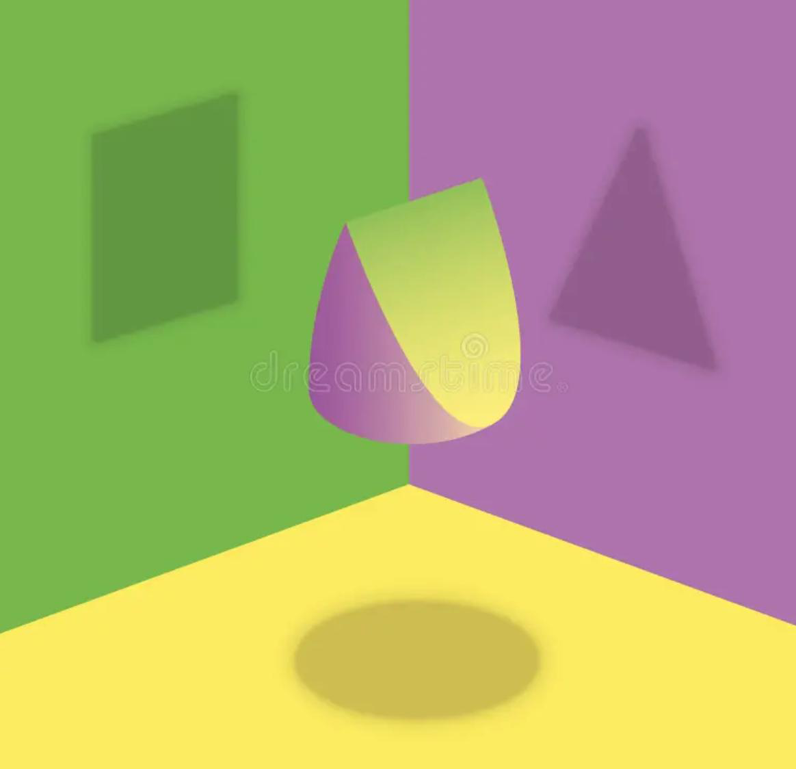
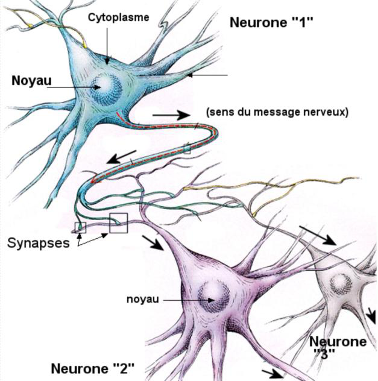
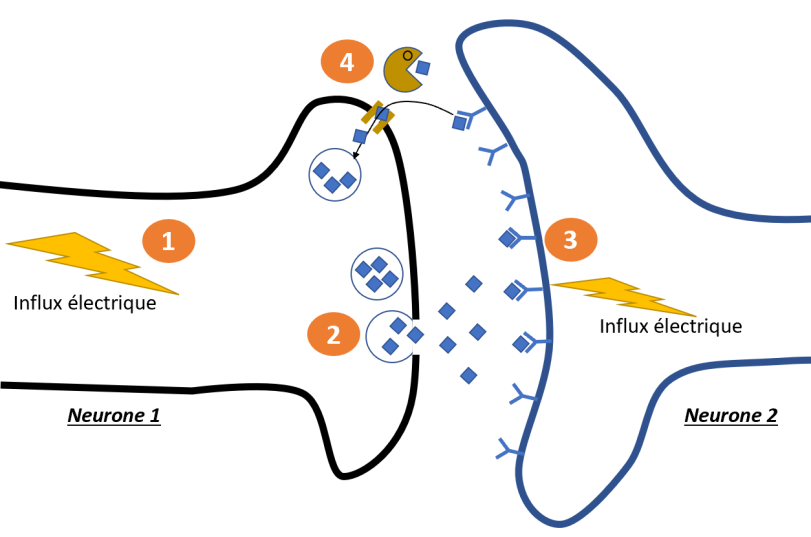
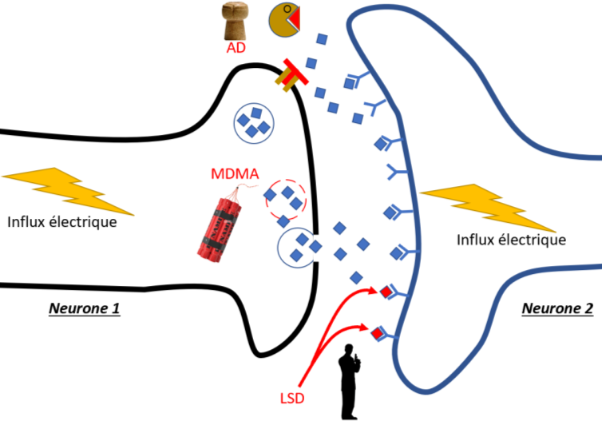
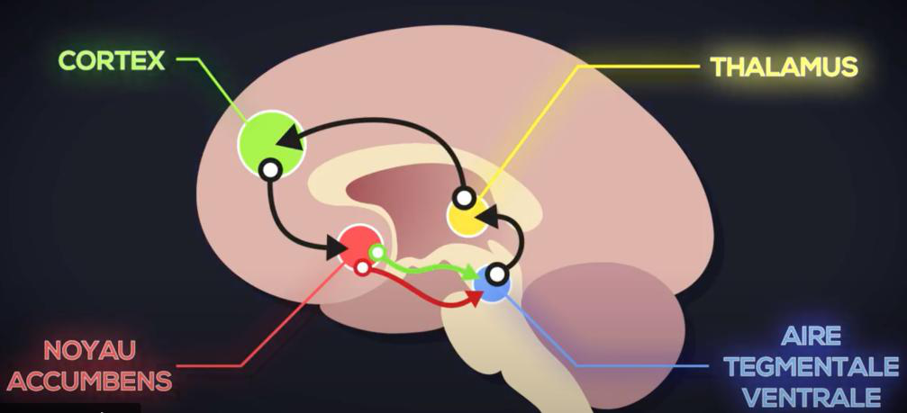
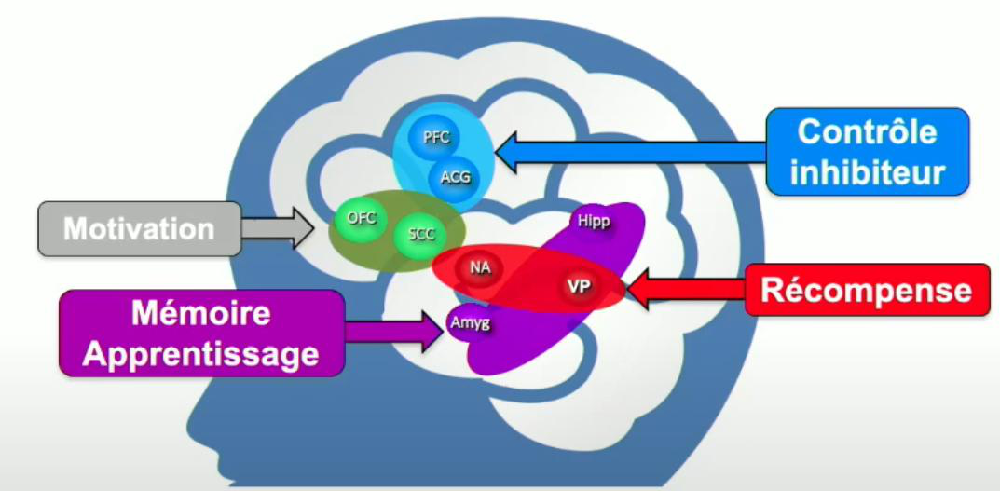

# Cerveau, synapses, neurotransmetteurs et circuits

## Le cerveau et le corps

## Le cerveau

Les drogues ont toutes pour point commun d’agir sur un même
organe : le cerveau. C’est ce que l’on appelle des substances psychotropes
ou psychoactives.

Comment elles agissent ? Comment le cerveau
s’adapte ? Quels sont les parties du cerveaux impliqués dans
l’addiction ?

Pour répondre à ces questions, le LSD sera souvent cité car
son mécanisme d’action très ciblé fait de lui un bon exemple.

Avant de plonger dans le vif du sujet, il est crucial de
discuter du domaine des neurosciences. À ce jour, aucun cadre (paradigme) ne
permet de prendre en compte l’ensemble des connaissances sur le cerveau et
chaque théorie, prise individuellement, demeure incomplète. À l'instar de la
physique classique et quantique, les chercheurs s'efforcent de définir une
approche ou un cadre scientifique capable d'englober l'ensemble des théories
existantes.

Notre attrait naturel pour des théories faciles à comprendre
conduit souvent à des croyances erronées ou largement réfutées. Par exemple,
l'idée que nous n'utilisons que 10% de notre cerveau, la théorie du cerveau
reptilien, ou l'affirmation simpliste que l'amour se réduit à la libération
d'ocytocine. Malheureusement, le terme de "neuroscience" perd de son
sens.

Voici quelques courants actuels :

Le localisationnisme qui considère le cerveau comme
différentes parties aux rôles spécifiques, une approche jugée incomplète
aujourd’hui. Affirmer par exemple que la dépression est due uniquement à
l'activation de certaines zones cérébrales est erroné. Cela explique (notamment)
pourquoi l'IRM n'est pas utilisée pour le diagnostic en psychiatrie.

Le constructivisme [147]
qui considère le cerveau comme un organe dépendant des sensations, du contexte
et du corps dans son ensemble. Pour illustrer ce point de vue, prenons
l'exemple du striatum, la « zone du plaisir ». Certains affirment [148]
que cette région cérébrale expliquerait notre inaction face au changement
climatique en privilégiant des comportements guidés par le plaisir.

Les constructivistes contestent cette théorie, car elle
néglige le contexte social et les stimuli auxquels nous sommes constamment
exposés. En effet, il ne prend pas en compte le système dans lequel nous
vivons, caractérisé par la publicité incessante pour des billets d'avion à bas
prix, le besoin social de posséder les dernières baskets fabriquées à l'autre
bout du monde, entre autres facteurs. Ainsi, il est inexact de se
déresponsabiliser en accusant une partie de notre cerveau. Selon eux, réduire
un problème complexe, impliquant d'importantes considérations sociales, à un
simple problème « cérébral » individuel, est inapproprié.

L'approche neuropharmacologique , basée sur la chimie
cérébrale, les neurotransmetteurs, présente également des limites. Par exemple,
réduire l'amour à une libération d’ocytocine, la dépression à un manque de
sérotonine ou le trouble de l’attention à un déséquilibre de dopamine est
inexacte.

La notion selon laquelle la dépression serait causée par un
déséquilibre chimique, notamment un manque de sérotonine, est de plus en plus
remise en question par la communauté scientifique. Le Royal College de Londres
a retiré toute mention de cette théorie de son site internet.

De même, une revue exhaustive de la littérature
scientifique menée par l'University College de Londres [149] conclut qu'il
n'existe pas de preuves solides établissant un lien direct entre les niveaux de
sérotonine et la dépression.

Cette revue, publiée dans Molecular Psychiatry, a examiné
des dizaines de milliers de cas et divers types d'études, allant de la
génétique à la privation de sérotonine. Les résultats suggèrent que la théorie
du déséquilibre chimique est une simplification excessive et que les
antidépresseurs, en particulier les inhibiteurs sélectifs de la recapture de la
sérotonine (ISRS), n'agissent pas en corrigeant un prétendu déséquilibre de
sérotonine. En fait, leur mécanisme d'action exact demeure inconnu, bien qu'ils
soient plus efficaces qu'un placebo.

L a neuropharmacologie aide à comprendre certaines
conséquences des drogues et médicaments (effets des surdoses, interactions,
antidote, etc) mais elle ne doit pas être extrapolée et n’explique pas tout !

La simplification excessive mène à des conclusions erronées.

En conclusion, chaque approche regarde l’ombre d’une forme,
sans la décrire directement.

<figure class="doc-figure">
  
  <figcaption>Figure 11. Illustration de la dualité.</figcaption>
</figure>

### Le fonctionnement des synapses

Les informations, émotions, pensées, perceptions,
mémoires sont portées par les neurones. Pour communiquer entre eux, ils ont
besoin de messagers : ce sont les neurotransmetteurs. De façon simplifiée,
toutes nos émotions et pensées sont portées par des neurotransmetteurs. .

-

<figure class="doc-figure">
  
  <figcaption>Figure 12. Schéma de neurone.</figcaption>
</figure>

La jonction entre les neurones s’appelle la synapse
et c’est à travers elle que les neurones communiquent.

<figure class="doc-figure">
  
  <figcaption>Figure 13. Schéma d’une synapse.</figcaption>
</figure>

Pour expliquer le mécanisme de base, nous allons prendre un
exemple : le Nutella.

Lorsque vous craquez et que vous plongez votre cuillère dans
le pot de Nutella, il se passe la chose suivante :

1. L’influx
électrique –
Un influx nerveux venant de la langue se dirige vers le neurone 1, pour donner
suite à la première cuillère, avec l’information : « C’est trop
bon, fait péter la dopamine (neurotransmetteur du plaisir) on est trop bien
là !»

2. Libération
 —
Le neurone 1, qui est malin, a des stocks de dopamine en réserve : les vésicules .
Il va dès lors les libérer dans la synapse pour prévenir les autres neurones.

3. Liaison
 –
La dopamine libérée (le messager), va se fixer sur des récepteurs sur le
neurone 2 pour donner le message et générer un influx électrique.

4. Re capture
 Destruction —Puis
que le cerveau ne peut rester dans un tel état de plaisir, le neurone 1 va
récupérer les neurotransmetteurs (ici la dopamine), pour la prochaine fois ou
alors une protéine va les dégrader (Pac-Man). Le cerveau fait en sorte
de ne pas rester perché !

Le bien-être et le plaisir sont
(en résumé) la quantité de neurotransmetteurs sur des récepteurs, dans les
synapses. Nous passons notre vie à essayer d’en avoir le plus possible. Nos
décisions, actions et envies sont toutes faites pour optimiser la concentration
de certains neurotransmetteurs dans le cerveau. Si les drogues agissent dessus,
les réseaux sociaux ou encore l’art le font aussi.

Les effets euphorisants ne sont
pas spécifiques aux drogues. Vous en avez déjà connu plusieurs dans le passé.
Souvenez-vous, lorsque vous avez dû galérer pour obtenir quelque chose et que
cela arrive enfin ? L’obtention du bac ou du permis par exemple. Cela
peut aussi être un vendredi soir après une semaine bien chargée, quand vous
relâchez la pression. Une espèce d’euphorie intense avec un sentiment de
surpuissance se produit. Dans ce genre de situations, vous touchez l’ivresse de
l’alcool ou encore l’énergie que vous pouvez avoir sous ecstasy.

Les émotions et sensations nous guident dans notre
vie : nous sommes motivés pour faire ce que nous faisons au quotidien dans
l’espoir d’atteindre un état de plaisir (séduction ou vie sociale), de
bien-être, de satiété (aller faire les courses ou cuisiner), ou de sérénité.

Autrement dit, la drogue va intervenir sur votre cerveau
pour vous faire ressentir ce genre de plaisir ou de bonheur sans effort et
c’est bien là un des premiers dangers.

#### Hacker le système : mécanisme d’action de base des drogues

Mettons-nous à la place d’un hacker cérébral.
Son objectif ? Créer un maximum de stimulation dans le neurone 2. Reprenez
la figure 2 et réfléchissez-y 5 min.

Nous allons prendre dans cet exemple des
neurones à sérotonine (pour faire simple, c’est le neurotransmetteur du
bonheur) et des substances qui agissent dessus.

<figure class="doc-figure">
  
  <figcaption>Figure 14. Exemple d’actions sur les neurones sérotoninergiques.</figcaption>
</figure>

A l’attaque :

1. Éclater
les vésicules –
Il est possible de provoquer la libération des stocks de neurotransmetteurs
contenus dans les vésicules. Les neurotransmetteurs vont se diffuser jusqu’aux
récepteurs. C’est le mécanisme d’action (principal) de la MDMA (l’ecstasy) sur la sérotonine. C’est explosif et
ça marche très bien.

Petite
particularité : pour rentrer dans le neurone 1, la MDMA passe par le canal
de recapture .

Il est
fréquent d’entendre que la MDMA vide les stocks et qu’il faudrait subir un
lendemain de déprime le temps qu’ils se refassent. C’est le cas à très forte
dose et cela dépend du contexte. Ce que ce mécanisme montre c’est qu’une
libération massive de sérotonine a lieu.

2. Empêcher
la recapture –
Il est possible de boucher le canal de recapture. Dans ce cas les
neurotransmetteurs libérés vont rester plus longtemps dans la synapse.

C’est le
principe des antidépresseurs ( AD ) les plus
prescrits : les Inhibiteurs Sélectifs de la Recapture de la Sérotonine
(ISRS) comme le Prozac (le nom chimique : Fluoxétine)

C’est un
mécanisme assez doux : le bien-être n’est pas forcé, il est prolongé.

3. Empêcher
la dégradation [151]
 –
Il est possible de bloquer la protéine qui dégrade le neurotransmetteur. Pour
qu’il agisse plus longtemps.

C’est le
principe d’une autre classe d’antidépresseurs ( AD ) :
les Inhibiteurs de la MonoAmineOxydase (IMAO). La MAO est la protéine qui
dégrade (entre autres) la sérotonine.

Comme pour
les ISRS, on prolonge le bien-être. Ici, c’est moins sélectif, les IMAO
n’agissent pas que sur la sérotonine, les effets sur le cerveau sont donc plus
larges.

4. Envoi
d’un leurre —Il est possible de
stimuler directement le neurone 2, en se faisant passer pour un
neurotransmetteur, avec une molécule qui y ressemble : c’est ce que l’on
appelle un agoniste.

C’est le
principe du LSD, des champignons hallucinogènes
(psylocibine) qui vont venir se fixer sur certains récepteurs à sérotonine. Le
THC (principe actif du cannabis) est également un agoniste mais d’un système
particulier.

Le bien-être
est créé de nulle part. Il n’y a pas de perturbation directe des mécanismes de
régulation.

#### Différents récepteurs

Pour autant, comment expliquer
que le LSD soit « hallucinogène » et non pas les
antidépresseurs ?

C’est parce qu’il existe différents récepteurs pour un même
neurotransmetteur. Reprenons notre exemple sur les neurones à sérotonine :
( ) il en existe 13
variantes.

Les antidépresseurs, par leurs mécanismes,
vont augmenter la concentration de la sérotonine que nous avons produite. Cette
sérotonine se fixe de façon indifférenciée sur tous les récepteurs.

Certaines molécules
hallucinogènes vont surtout se fixer sur les récepteurs dits
« 5-HT2A » (utile si vous cherchez un bon mot de passe J ). C’est la suractivation de ce type de
récepteurs qui engendre des effets hallucinogènes [152] .

#### Point sur les interactions

Il est intéressant de comprendre
les mécanismes d’actions, car ils expliquent la majorité du temps les interactions
entre les substances.

Par exemple :

Est-ce que la prise de MDMA pour quelqu’un sous
antidépresseur de type ISRS est dangereuse ?

Ce serait théoriquement possible,
mais comme les ISRS bloquent le canal de recapture, qui est le chemin
pris par la MDMA pour rentrer dans le neurone, la MDMA reste dehors et produit
donc peu ou moins d’effets.

Cependant, avec un antidépresseur
type IMAO , c’est une autre histoire. Dans ce cas, l’effet de la MDMA et
de l’IMAO se compile (libération par la MDMA et non-dégradation par l’IMAO).
Cette interaction peut conduire à ce que l’on appelle un syndrome
sérotoninergique, qui peut être mortel.

Est-ce qu’il est possible de prendre deux
antidépresseurs en même temps ?

Oui, c’est possible. Certaines
personnes souffrant de dépressions profondes ou de stress post-traumatiques
peuvent avoir deux antidépresseurs simultanément : un ISRS et un autre de
type IMAO, car ils n’ont pas le même mécanisme d’action. Ainsi, au lieu d’avoir
une forte dose d’un type d’AD, il est possible d’avoir deux doses faibles de
deux AD avec des mécanismes d’actions différents.

Pour information, les
antidépresseurs de type IMAO ne sont presque plus prescrits à cause des effets
secondaires.

Connaitre les mécanismes
d’actions des médicaments et des drogues que l’on utilise est intéressant pour
comprendre les interactions. Ce n’est pas suffisant pour justifier les
mélanges.

### Les neurotransmetteurs

#### Les messagers

Il y a donc différents messagers et autant de systèmes à
hacker. Voici les principaux, pour vous donner une idée [153] .

| Neurotransmetteurs | Image | Action | Exemple de drogue qui agit dessus |
| --- | --- | --- | --- |
| Neurotransmetteur | Image | Rôle | Exemples |
| Acétylcholine   (Ach) |  | Mémoire | Nicotine |
| GABA |  | Calme l’activité générale du cerveau | Alcool / GHB/ benzodiazépines |
| Glutamate (Glu) |  | Stimule l’activité   générale du cerveau | Alcool |
| NorAdrénaline |  | Prépare le corps à fuir/lutter (attention, concentration) | Cocaïne |
| Dopamine |  | Plaisir | Presque toute   directement ou indirectement |
| Sérotonine |  | Régulation de l’humeur, plénitude | LSD/antidépresseurs/MDMA |
| Endorphines   (opioïdes) |  | Régulation de la   douleur physique et psychique | Codéine/Héroïne |
| Endocannabinoïdes |  | Régulation de la douleur, appétit, mémoire | Cannabis et dérivé |

Tableau 14.
Tableau des neurotransmetteurs

C’est extrêmement résumé [154] .
Un même neurotransmetteur dans le cerveau peut avoir différents rôles. Plus
encore, ces neurotransmetteurs ont des rôles dans le reste de l’organisme. Par
exemple, l’acétylcholine sert dans le mécanisme de contraction des muscles.

En fonction de la cible de la
substance, les effets ressentis seront différents. Pour une personne qui ne
consomme aucune substance, voici à quoi ressemble une journée :

– Le matin en se réveillant,
elle sécrète du glutamate qui va lui donner un coup de boost

– Sur la route du travail,
elle se retrouve bloquée dans les embouteillages, stressés d’arriver en retard,
elle libère de la noradrénaline ,

– Finalement, elle arrive à
l’heure, elle va produire de la sérotonine qui va la faire se sentir
mieux,

– En début d’après-midi,
elle a une présentation au travail qui se passe bien. Félicitée, elle libère
des endorphines et de la dopamine ,

– De retour à la maison, une
dispute au téléphone lui fait baisser sa sérotonine , elle se sent mal,

– Grâce à un footing, elle
libère des endorphines et des endocannabinoïdes , elle se sent
mieux, plus détendue

– Le soir, le glutamate
diminue et le GABA augmente, elle se sent fatiguée et est prête à
s’endormir.

#### L’action des drogues

L’exemple du LSD, de la MDMA et
des antidépresseurs n’a pas été pris au hasard. Ces substances sont plutôt
sélectives. Les drogues impactent plusieurs types de neurotransmissions et
parfois des mécanismes ne sont pas expliqués. Aujourd’hui encore, certaines
actions de l’alcool sont constatées sans être comprises.

Le tableau ci-après présente les
actions de plusieurs drogues sur certaines neurotransmissions.

|  | Nicotine | MDMA | LSD | THC | Alcool | GHB | Cocaïne |  |
| --- | --- | --- | --- | --- | --- | --- | --- | --- |
|  | Sérotonine | / | ↑ libère | ↑ active les récepteurs | ↓ mécanisme non connu | ↑ mécanisme non connu | ↑ mécanisme non connu | ↑ bloque la recapture |
|  | Dopamine | ↑ indirect | ↑ indirect | ↑ indirect | ↑ indirect | ↑ indirect | ↑ indirect | ↑ bloque la recapture |
|  | Opioïde | ↑ libère des endorphines | / | / | / | ↑ libère des endorphines | ↑ libère des endorphines | / |
|  | Cannabinoïde | ↑ augmente le nombre de récepteurs | / | / | ↑ active les récepteurs | ↑ augmente l’activité du système | ? | ↑ augmente l’activité du système |
|  | Acétylcholine | ↑ bloque la recapture | ↑ indirect | / | / | ↑ active les récepteurs | ↑ mécanisme non connu | ↑ mécanisme non connu |
|  | Glutamate | ↑ indirect | ↑ indirect | ↑ mécanisme non connu | ↓ indirect | ↓ Bloque fermé les récepteurs | ↑ mécanisme non connu | ↑ mécanisme non connu |
|  | GABA | ↑ mécanisme non connu | / | ↓ indirect | ↓ indirect | ↑ Bloque ouvert les récepteurs | ↑ active les récepteurs | / |

Tableau 15.
Effets de certaines drogues lors d’une prise sur les principaux
neurotransmetteurs. (bleu= mécanisme principal)

L’action des substances psychoactives est complexe et
n’impacte pas qu’un type de neurotransmission. Néanmoins, les mécanismes
principaux déterminent souvent les effets ressentis et certains risques.

Le tableau montre les actions lors d’une prise. En cas de
prises répétées, la tolérance peut créer un effet inverse. Par exemple un
fumeur aura moins ↓ d’acétylcholine
(sans fumer) qu’un non-fumeur.

La diversité d’action des drogues fait qu’il existe des
tolérances croisées assez étonnantes. L’alcool impact suffisamment le système
cannabinoïde pour créer une tolérance, donc le cannabis aura moins d’effet sur
un buveur. L’usage répété de nicotine augmente la quantité des récepteurs
endocannabinoïdes, donc le cannabis aura plus d’effet chez un fumeur.

#### Exemple de l’alcool

Les mécanismes d’actions de l’alcool sont complexes (plus
que la plupart d’autres drogues). C’est une petite molécule qui s’infiltre
partout et qui cause une multitude d’effets.

En plus d’avoir des actions spécifiques (sur
des récepteurs), l’alcool a une action non spécifique (généralisée). En effet,
il perturbe l’équilibre des membranes ce qui modifie de nombreuses fonctions
cellulaires et systèmes de neurotransmetteurs. Cette action non spécifique est
à l’origine de son pouvoir désinfectant [155] :
concentré, il détruit les membranes des bactéries et les virus.

Pour en revenir aux effets sur le cerveau, l’alcool impact
de façon direct ou indirect l’ensemble des neurotransmetteurs [156]
 [157] .

Figure 15.
Systèmes impactés par l'alcool

L’alcool se comporte comme un cocktail de substance. Une
base de GHB, un peu de nicotine, saupoudré d’un peu de codéine et de MDMA avec
une pincé de feuille de cannabis. Sans intégrer la toxicité des mélanges aux
niveaux des organes (comme le foie), cette pluralité d’effets permet déjà de
se rendre qu’il ne faudrait jamais le mélanger a d’autres substances
psychoactives .

Les effets sur le cerveau de
l’alcool sont variés : il ne faudrait jamais le mélanger avec d’autres
substances psychoactives.

##### Gaba et glutamate

Les principaux effets ressentis de l’alcool proviennent de
son action sur le gaba et le glutamate, ces deux neurotransmetteurs servent à
réguler l’activité général du cerveau.

|  | Effet s’il y en a + | Effet s’il y en a - | Effet de l’alcool | Conséquence |
| --- | --- | --- | --- | --- |
| Gaba | ↓ l’activité du cerveau | ↑augmente l’activité | Active les récepteurs du gaba | ↓ l’activité du cerveau |
| Glutamate | ↑augmente l’activité | ↓ l’activité du cerveau | Bloque fermé les   récepteurs du glutamate | ↓ l’activité du cerveau |

Tableau 16.Effet
de l'alcool sur le gaba et le glutamate sur l’activité cérébrale

L’alcool à deux mécanismes pour diminuer l’activité
cérébrale, c’est à dire la communication entre les neurones. Cela peut
entrainer un relâchement des muscles, dont le diaphragme, causant un arrêt
respiratoire.

En mélangeant les substances qui agissent sur le gaba
(benzodiazépines comme le valium ou les anesthésiants comme le propofol ou le
ghb) il y a un risque d’arrêt respiratoire .

Ses deux effets majeurs, positif sur le GABA (qui ralenti
le cerveau) et négatif sur le Glutamate (qui stimule le cerveau) reviennent à
lever le pied de l’accélérateur et appuyer sur le frein.

L’alcool diminue l’activité
générale du cerveau.

Il
ne faut JAMAIS le mélanger a d’autres substances agissant sur le GABA (GHB,
GBL, Benzodiazépines, anesthésiant) ou d’autres dépresseurs.

Il faut être transparent sur
sa consommation d’alcool avec ses médecins, surtout en cas d’opération.

##### Acétylcholine : pourquoi l’alcool
« appelle » le tabac ?

L’alcool active certains récepteurs de l’acétylcholine, les
mêmes que la nicotine. L'acétylcholine intervient dans le contrôle des
mouvements, le cycle sommeil/éveil, l’anxiété, la douleur, l’attention et la
mémoire.

Est-ce que ce mécanisme explique pourquoi les consommateurs
d’alcool peuvent avoir une forte envie de cigarette ? pas vraiment. Il y a
plusieurs théories mais qui ne sont pas totalement démontrées.

La première considère que
l’activation légère des récepteurs à l’acétylcholine amorce l’envie de fumer.
Dans l’idée ce serait comme tirer une taffe de cigarette.

La deuxième considère que l’envie
de fumer apparaît pour stimuler le cerveau (afin de contrer l’effet de
l’alcool) [158] .

La troisième est liée à
l’activation du circuit de récompense par les deux drogues. Lorsque
l’activation de ce circuit à lieu, il pousse à consommer tous types de
substances.

Les trois théories ne sont pas vraiment démontrées.
Cependant les études permettent de retirer plusieurs points intéressants [159] :

-Les fumeurs sont 4 fois plus susceptibles
d’être addictes à l’alcool,

-Les buveurs ont 3 fois plus de chances de
fumer,

-Si l’alcool et la nicotine sont consommés en
même temps, leurs effets sur la dopamine (le plaisir) s’additionne,

-Si le tabac est consommé avant la
consommation de l’alcool, alors l’effet positif de l’alcool sur la dopamine
n’est pas ressenti,

-Une fois que la consommation d’alcool a
commencée, le fait de fumer augmente l’envie de boire,

-Fumer ne diminue pas l’alcoolémie,

- Les effets sur le rythme cardiaques
s’additionnent : les deux augmentent le rythme cardiaque.

### Les circuits cérébraux

La neuropharmacologie et la
neurotransmission, vu précédemment, mettent en lumière la communication entre
les neurones par le biais des neurotransmetteurs. Ce premier niveau de
compréhension est suivi par celui des circuits cérébraux, où l'organisation et
l'interaction des cellules nerveuses sont observées à un niveau supérieur.

-Les circuits cérébraux sont
imaginés comme un réseau complexe de routes entrelacées sur une carte, où
chaque route représente une voie de communication neuronale et chaque
intersection est un neurone.

-Les routes sont soigneusement
tracées et interconnectées pour permettre le flux d'informations à travers le
cerveau, orchestrant ainsi des fonctions telles que la mémoire, le contrôle et
les sensations de plaisir. Une étude des circuits cérébraux nous offre un
aperçu précieux de la manière dont le cerveau fonctionne et interagit avec le
monde qui l'entoure.

#### Le circuit de la récompense

Le circuit de la récompense est vital pour
l’évolution. C’est grâce à lui que nous trouvons du plaisir pour réaliser les
tâches qui nous permettent de survivre, par exemple :

– chasser pour manger,

– marcher jusqu’à une source d’eau pour
boire,

– séduire pour se reproduire.

Le signal passe par plusieurs zones du cerveau en utilisant la
dopamine .

<figure class="doc-figure">
  
  <figcaption>Figure 16. Zones du cerveau impliquées dans le système de récompense.</figcaption>
</figure>

Prenons un exemple : vous voyez quelqu’un fumer, le cortex
envoie l’information au noyau accumbens.

Ce noyau accumbens décide de ce qu’il faut faire de
cette information :

– Il peut produire
du dégout ou du déplaisir : Flèche rouge dans
le schéma

– Il peut
produire du plaisir : flèche verte dans
le schéma

Si le circuit est activé, vous
allez ressentir du plaisir. Vous allez garder en mémoire ce plaisir et le
comportement va être renforcé : vous en redemanderez. Plus vous
recommencez et plus vous en voudrez.

#### Les autres circuits cérébraux

Lorsque l’on parle de drogues, le circuit de la récompense
est rapidement évoqué. S’il permet d’expliquer le plaisir ressenti lors de la
prise de substance, il ne permet pas, à lui seul, d’expliquer l’addiction.

Il y a trois autres circuits impliqués dans
l’addiction : la mémoire, la motivation et le contrôle .

Le circuit du contrôle (de l’inhibition) permet de
réagir de façon adaptée face à une situation. C’est notamment ce système qui
nous évite de frapper les personnes qui nous énervent, même si cela nous
soulagerait, temporairement. Il permet également de nous raisonner lorsque nous
abusons d’une substance.

<figure class="doc-figure">
  
  <figcaption>Figure 17. Les circuits cérébraux impliqués dans l’addiction.</figcaption>
</figure>

Le processus ressemble donc à cela :

1- Je
consomme de la drogue, cette dernière pirate le circuit de la récompense
pour ressentir un plaisir intense

2- Le circuit
de la mémoire enregistre « drogue = plaisir +++ », et cela
s’accentue au fur et à mesure que l’on en consomme. Le phénomène s’appelle la
mémoire pathologique [161] .
Même après un arrêt de la consommation durant un temps long, le cerveau
garde cette association.

3- Le
circuit de la mémoire va influencer le circuit de la motivation , qui va
se focaliser sur l’obtention de la drogue et se désintéresser du reste

4- Le circuit
du contrôle (inhibiteur) ne fonctionne plus : les feux sont tout le
temps au vert pour consommer, quelle que soit la situation.

Ce processus se retrouve dans toutes les addictions,
qu’elles soient d’une substance ou d’un comportement. Toutes les drogues n’ont
pas une action directe et importante sur la dopamine et peuvent donc être plus
ou moins addictogènes.

è
