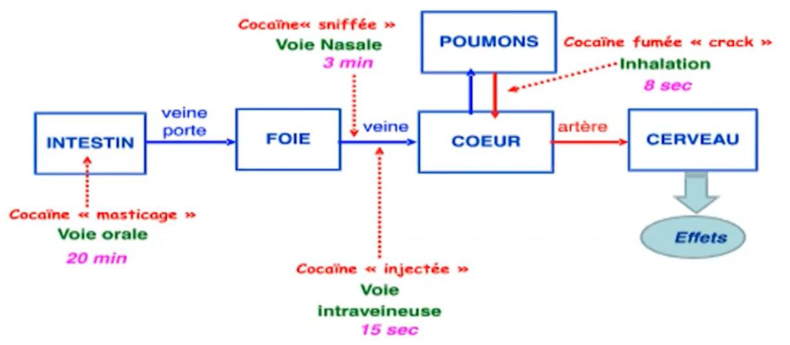

# PK, PD, absorption, distribution, metabolisme et elimination

## Statut
- extrait provisoire
- phase 1, bloc 12
- contenu source canonique structure, non valide comme module final
- extraction locale depuis `sources/traite/traite_rdr_version_html_clean.md`, controlee par pagination PDF

## Pages sources
- Pages imprimees du traite : p. 126-139.
- Pages PDF correspondantes : p. 127-140.
- Convention documentaire : `page PDF = page imprimee + 1`.

## Fonction du chapitre dans le traite

Ce bloc conserve la partie `PK/PD/ADME` dans la couche source canonique. Il sert a documenter les definitions, exemples, nuances, limites, donnees chiffrees, visuels et implications RDR presents dans le traite, sans transformer ce contenu en module final, score, regle metier definitive ou recommandation medicale autonome.

## Contenu source fidele

> Note documentaire : le passage ci-dessous reprend le contenu du traite sur le perimetre du bloc. Les titres, listes, exemples, tableaux et formulations importantes sont conserves pour limiter la perte d'information. Les implications CultureRDR sont separees plus bas.

## Le devenir des drogues : metabolisme
<figure class="doc-figure">
  
  <figcaption>Figure p. 127 : repere visuel sur le devenir des substances dans l'organisme.</figcaption>
</figure>
Précédemment, la partie présentant l’actions des molécules
sur le cerveau, est une science appelée pharmacodynamie. Toutefois, la façon
dont le corps agit sur les substances est très importante car elle détermine
l'assimilation et l'élimination des substances par le corps (c'est la
pharmacocinétique).

Cette partie se focalisera sur les notions de base de la
pharmacocinétique, permettant de poser les règles de réduction des risques de
base et génériques. La pharmacodynamie et la pharmacocinétique seront
réabordées dans le contexte des risques liés aux interactions, qui constituent
l'un des risques majeurs.

Cinq paramètres sont à considérer pour comprendre comment le
corps agit sur les drogues : l'absorption, la distribution, la
métabolisation et l'élimination. Ces paramètres sont communément appelés « ADME
».

L'absorption et l'administration concernent le mode
de consommation de la drogue ou du médicament, ainsi que la manière dont le
principe actif sera absorbé pour atteindre la circulation sanguine. La distribution
désigne le processus par lequel la molécule se répartit dans les différents
organes, en tenant compte des transferts entre eux.

Une fois la molécule absorbée et distribuée dans
l'organisme, elle sera métabolisée . Le métabolisme représente la «
digestion » des médicaments et des drogues. Une multitude de molécules
spécialisées dans l'organisme contribuent à la transformation des substances,
les modifiant pour les rendre inactives, principalement en y ajoutant des
atomes d'oxygène. Cela facilite ensuite l' élimination du produit par les
reins.

Le corps digère les produits ingérés de la même manière
qu'il digère les aliments. Seuls quelques cas spécifiques, tels que le
plutonium ou l'uranium, qui ont tendance à se fixer sur les os, sont difficiles
à éliminer. Un autre cas particulier concerne l'inhalation de poussières, de
particules (lorsqu’un produit est fumé) ou de fibres, comme dans le cas de
l'amiante. Cela est dû au fait qu’elles sont trop petites pour être stoppées
par le nez et les muqueuses, et trop grosses pour passer dans la circulation
sanguine et être éliminées.

En revanche, pour les molécules organiques comme les drogues
et les médicaments, le corps est suffisamment équipé pour les neutraliser.

Deux mécanismes expliquent pourquoi il n’est pas possible de
« rester perché » : le premier est la tolérance aiguë (tachyphylaxie), et le
second est la dégradation des principes actifs par l'organisme.

[Image reference: Une image contenant fenêtre, mammifère, fixant

Description générée automatiquement; source export Word: Traité RDR version html_fichiers/image010.png]

Le
corps réussit toujours à transformer et à éliminer les substances ; la notion
de « rester perché » n'est pas liée à un effet intrinsèque de la drogue
elle-même.

Chaque paramètre « ADME » englobe plusieurs grandeurs et
types de mesures, analysés en détail pour chaque médicament et chaque drogue
par les chercheurs. Les notions qui suivent sont celles ayant une implication
directe dans la réduction des risques.

### Absorption et distribution

#### Mode d’administration

##### Vitesse d’apparition et durée des effets

L'un des principaux critères de l'absorption des drogues et
médicaments est le mode de consommation. Cela est un facteur déterminant pour
les risques, mais également pour la vitesse d’apparition des effets et leurs
durées.

L'idée à retenir est que moins il y a d'intermédiaires
jusqu'au sang, plus l'effet sera rapide et court . En effet, une fois le
sang atteint, la drogue se diffuse dans tout l'organisme, agit rapidement, mais
est aussi vite éliminée par le corps. À l'inverse, plus il y a d'organes
intermédiaires, plus l'effet à dose égale sera moins intense mais plus prolongé .

[Image reference: Une image contenant texte, capture d’écran, diagramme

Description générée automatiquement; source export Word: Traité RDR version html_fichiers/image066.jpg]

Figure 23.Vitesse d'apparition des effets de la cocaïne en fonction de la voie d'administration [174]

[Image reference: Une image contenant ligne, capture d’écran, conception, art

Description générée automatiquement; source export Word: Traité RDR version html_fichiers/image067.png]

Figure 24.
Schéma de la concentration dans le sang en fonction de la voie d'administration

Point intéressant, bien que non représenté dans le schéma,
est l'existence de connexions entre les organes. Par exemple, une partie de
ce qui est fumé se retrouve également dans l'estomac . Les poumons, pour se
nettoyer, utilisent un mucus et des cils vibratiles qui remontent une partie
des particules jusqu'à l'œsophage, un processus connu sous le nom de remontée
mucociliaire. Il en va de même pour ce qui est sniffé : le nez est continuellement
nettoyé en poussant les particules vers l'arrière, jusqu'à ce qu'elles
atteignent le système digestif. C’est pour cette raison que les fumeurs
augmentent également leurs risques de cancer de l’estomac [175] .

L'efficacité de certaines substances peut également varier
selon le mode d'administration. Par exemple, la Salvia , une substance
perturbatrice, se dégrade dans l’estomac elle est donc peu efficace lorsqu'elle
est ingérée, mais devient très puissante lorsqu'elle est fumée.

Le LSD est efficace en quantités extrêmement minimes et
n'est généralement pas coupé lorsqu’il est vendu, car les additifs potentiels
nécessitent des doses beaucoup plus élevées pour agir. En revanche, il y a une
autre famille de drogue qui est actif à très faible dose : les N-Bomes.

Les seuls cas d’analyse de LSD qui ont fait l’objet
d’alertes ont été des N-bomes vendus comme LSD car cette famille est bien plus
toxique! Dans la famille des N-bomes, certains composés, contrairement au LSD,
ne sont pas actifs lorsqu'ils sont ingérés normalement ; ils doivent être
placés sous la langue pour éviter la dégradation par le foie. Un dealer
précisant qu’il faut garder sous la langue le LSD est donc mauvais signe !
Pour être certain de la substance consommée, il faut faire des tests (voir
partie « testing »).

##### Biodisponibilité : adaptation des doses

Les courbes montrent que, pour une même dose, le pic dans le
sang est différent : c’est ce qu’on appelle la biodisponibilité. Cela
correspond à la vitesse et à l'importance du passage du principe actif
(médicament ou drogue) dans la circulation générale, permettant d’atteindre le
site d'action.

Lorsqu’une drogue est administrée par voie orale, une partie peut être détruite
dans le système digestif ou métabolisée par le foie avant d’atteindre la
circulation générale. Cela signifie qu’à dose égale, une substance administrée
par voie orale peut être beaucoup moins puissante qu’une substance administrée
par voie intraveineuse, sublinguale ou fumée. Parfois, la voie orale n’est même
pas envisageable car la substance est trop rapidement dégradée (c’est le cas,
par exemple, pour la Salvia et la DMT).

Cette variation de biodisponibilité rend indispensable l’adaptation des
doses en fonction du mode d’administration.
Par exemple, la morphine a une biodisponibilité orale d’environ 30 %, ce qui
signifie qu’il faut administrer une dose trois fois plus élevée par voie orale
pour obtenir les mêmes effets qu’une injection.

| Substance | Voie d'administration | Biodisponibilité approximative | Dose équivalente approximative |
| --- | --- | --- | --- |
| Morphine | Orale | 20-40% | 25-50 mg |
|  | Intraveineuse | 100% | 10 mg |
| Oxycodone | Orale | 60-87% | 11.5-16.6 mg |
|  | Intraveineuse | 100% | 10 mg |
| Héroïne | Fumée | 52% | 19 mg |
|  | Intraveineuse | 100% | 10 mg |
| Cocaïne | Nasale | 60-80% | 62.5-83.3 mg |
|  | Fumée | 70-90% | 55.5-71.4 mg |
|  | Intraveineuse | 100% | 50 mg |
| MDMA | Orale | 55% | 90.9 mg |
|  | Nasale | 83% | 60.2 mg |
|  | Intraveineuse | 100% | 55 mg |

Tableau 17. Equivalence approximative des doses en fonction du mode d'administration [176] [177]

La biodisponibilité varie également selon les individus. Des
facteurs tels que l’âge, le sexe, le poids, l’état de santé et même la
génétique (comme les variations des enzymes hépatiques) influencent la capacité
du corps à absorber et métaboliser une drogue. Par conséquent, il est
impossible de définir une dose universelle. Chaque cas nécessite une évaluation
pour minimiser les risques et maximiser l’efficacité.

L’influence de l’âge est importante. Par exemple, le
diazépam [178] ,
une benzodiazépine couramment utilisée pour ses propriétés anxiolytiques et
sédatives, illustre bien cette variation.

Chez un homme jeune, après administration, le pic
plasmatique est atteint rapidement, en moins de 2 heures. Cette cinétique
permet une action rapide du médicament et une élimination progressive,
réduisant ainsi le risque d’accumulation et d’effets prolongés.

En revanche, chez un homme âgé, le pic plasmatique est
retardé, nécessitant environ 4 heures pour être atteint. De plus, la vitesse
d’élimination est réduite, prolongeant la présence du diazépam dans
l’organisme. Cela allonge la durée d’action et augmente les risques de sédation
prolongée ou d’autres effets indésirables.

[Image reference: Une image contenant fenêtre, mammifère, fixant

Description générée automatiquement; source export Word: Traité RDR version html_fichiers/image010.png]

L’adaptation des doses en
fonction de la biodisponibilité est particulièrement importante dans un
contexte d’usage récréatif ou thérapeutique. Ignorer cette notion peut
entraîner des surdosages.

##### Application à la cocaïne

Cette différence de voie d'administration peut faire
varier les effets pour une même molécule . Un exemple probant est la cocaïne
(voir figure), qui peut être consommée en sniff, fumée (c’est le crack),
injectée ou en application locale.

Il peut paraître surprenant que le crack et la cocaïne
soient la même molécule. Les consommateurs eux-mêmes pensent souvent qu'il y a
d'autres substances actives dans le crack expliquant la différence d'effet, ou
que cela est lié à la pureté. Chimiquement, il s'agit de la même molécule avec
le même mécanisme d'action. Ce qui change, c'est que la cocaïne sniffée est
sous forme de sel, tandis que le crack est sous forme libre (free base). Les
sels ne peuvent se fumer ; pour fumer de la cocaïne, il faut donc la convertir
en base libre (forme organique). C'est donc une légère différence d'état
physique qui permet de la fumer, mais qui ne modifie pas le mécanisme d'action.

[Image reference: Solved Given the structure of cocaine (right) and its free | Chegg.com; source export Word: Traité RDR version html_fichiers/image068.png]

Figure 25.
Cocaïne fumée (crack) à gauche, Cocaïne sniffée à droite

La cocaïne sniffée a une durée d'action d'environ 70
minutes, tandis qu'en la fumant sous forme de crack, l'ensemble des effets est
condensé en environ 10 minutes. Du fait de leur intensité accrue, ces effets
rendent ce mode de consommation plus addictogène.

En application locale, la cocaïne n'agit plus comme un
stimulant mais comme un anesthésiant (cela atténue les douleurs liées au
sniff). C'est de là que vient l'usage de tester la cocaïne en l'appliquant sur
les gencives. Très peu de drogues ont un effet anesthésiant rapide en
application locale ; donc, si les sensations dans les gencives disparaissent,
il est probable que ce soit de la cocaïne. Bien sûr, ce test, souvent vu dans
des séries, n'est pas fiable. Il se peut que la cocaïne soit coupée avec de la lidocaïne
ou d'autres substances anesthésiantes.

Les modes
d’administration font varier :

[Image reference: Une image contenant fenêtre, mammifère, fixant

Description générée automatiquement; source export Word: Traité RDR version html_fichiers/image010.png]

-le
temps de montée,

-les effets,

-la durée.

Le mode d’administration
est donc déterminant pour comprendre les effets et les risques associés.

##### Risques en fonction de la voie d’administration

En termes de gestion des risques, l'illégalité des drogues
et leur qualité variable rendent certains modes d'administration plus ou moins
risqués [179] .

| Voie   d'administration | Montée des   effets | Risques | Parades |
| --- | --- | --- | --- |
| Intraveineuse | Quelques secondes | · Surdosage involontaire   · Risques de transmission HIV, hépatite C,   etc.   · Risques grave lié à l’injection de   bactéries et impuretés présentent dans la drogue | · Réduire la poudre, caillou aussi   finement que possible   · Utiliser une solution propre   · Choisir une seringue appropriée   · Utiliser un filtre pour remplir la   seringue   · Désinfecter et changer régulièrement de   point d’injection   · Utiliser son propre matériel |
| Sniffé | Quelques minutes | · Lésions des muqueuses nasales   · Risques de transmission de l’hépatite C en cas de   partage du matériel utilisé pour sniffer | · Réduire la poudre, caillou aussi finement que   possible   · Nettoyer les muqueuses nasales après consommation et   utiliser des pommade nasale |
| Fumé | Quelques secondes | · Surdosage involontaire, assimilation   rapide   · Risque de consommation excessive   · Irritation de la langue et de la gorge   · Substances cancérigènes à la suite du   processus de combustion (quelle que soit la plante fumée) | · Consommer de petites doses   · Faire des pauses entre une consommation   et la suivante   · Utiliser son propre matériel, en   particulier les filtres   · Vaporiser (évaporation) vaut mieux que   fumer (évite la combustion) |
| Rectal (suppositoire) | Après plusieurs minutes | Surdosage   involontaire rapidement   Irritation   de l’intestin | Consommer   des doses adaptées   Selon   la forme galénique – utiliser un lubrifiant (pastille)   Attendre   90 min. que l’effet se déploie |
| Oral | Entre 30 et 120   minutes | Surdosage   involontaire | Adapter le   dosage en fonction de l’âge, du sexe et du poids   Attendre suffisamment de temps |

Tableau 18.
Risques en fonction des modes d'administration

##### Effet du premier passage dans le foie (premier passage hépatique)

Le premier passage dans le foie permet de faire un lien
entre l’absorption et la métabolisation.

[Image reference: Une image contenant texte, capture d’écran, diagramme, Police

Description générée automatiquement; source export Word: Traité RDR version html_fichiers/image069.png]

Figure 26.Schéma des voies d'administration

Dans le cas d'une prise sublinguale, nasale, intraveineuse
ou sous-cutanée, la molécule contourne le foie pour aller directement dans le
système sanguin et le cerveau.

Dans le cas d'une prise orale, le médicament transite par le
foie avant de rejoindre la circulation sanguine. Si la substance est
efficacement métabolisée par cet organe, son principe actif peut être
rapidement neutralisé. Dans certains contextes, cette transformation hépatique
peut significativement réduire la concentration de la substance active dans le
sang et change la façon dont elle est éliminée. Ce phénomène est connu sous le
nom d'effet de premier passage hépatique (EPPh).

Une illustration de l'influence de cet effet pour une même
drogue selon deux modes d'administration est la MDMA. Avec une administration
orale, le foie transforme une partie de la MDMA en molécule actives et
hallucinogènes (comme MDA, HMDA, etc.) avant qu’elle arrive au cerveau. En
revanche, lorsqu'elle est sniffée, la MDMA contourne cette étape et atteint
directement le système sanguin. Les effets ressentis sont donc un peu différents [180] .

Le premier passage hépatique peut aussi servir à activer
certains médicaments ou drogues. C'est le cas de la codéine, qui est doit
être transformée en morphine par le foie . C’est pour cela qu’il n’existe
pas en pharmacie de codéine en sublingual ou sous-cutanée.

En fonction de comment doit être transformé la molécule
(métabolisme) le mode d’administration doit être différent.

### Le métabolisme : la digestion

Les médicaments et les drogues sont rarement éliminé
directement par l’organisme. Les substances sont transformées principalement
dans le foie, qui décompose et modifie les molécules issues des aliments, des
graisses, des sucres et des toxines.

Dans le cadre d’une approche générale, il possible de
considérer que les reins laissent passer les molécules polaires. La polarité
des molécules signifie qu'elles présentent une répartition inégale des charges
électriques, semblable au comportement des aimants. L'oxygène, constamment
disponible grâce à la respiration, est efficace pour augmenter la polarité des
molécules. Il est possible de voir l’oxygène comme un aimant à forte puissance.
De façon simplifiée, la première phase du métabolisme consiste donc à ajouter
des atomes d’oxygène aux molécules, c’est une réaction d’oxydo-réduction.

Cette transformation des molécules se déroule en deux étapes
: la Phase I , où des modifications chimiques comme l'oxydation, la
réduction ou l'hydrolyse sont réalisées, et la Phase II , où une molécule
hydrophile du corps est attachée aux métabolites issus de la Phase I. Cette
conjugaison permet de transporter les substances jusqu’aux voies d’élimination,
comme le rein ou les glandes sudoripares.

La Phase II , appelée aussi phase de conjugaison, joue
un rôle complémentaire en rendant les substances encore plus solubles dans
l’eau pour leur excrétion. Elle implique l’ajout de petites molécules
hydrophiles, comme l’acide glucuronique (glucuronidation), des groupements
sulfates (sulfoconjugaison), ou encore des groupements acétyles (acétylation).
Par exemple, la glucuronidation, catalysée par des enzymes appelées
transférases, attache un acide glucuronique à la molécule, la rendant beaucoup
plus facile à éliminer par l’urine ou la bile. Ces réactions se déroulent aussi
principalement dans le foie.

[Image reference: Une image contenant capture d’écran, Graphique, graphisme, Police

Description générée automatiquement; source export Word: Traité RDR version html_fichiers/image070.png]

Figure 27.
Schéma simplifié de la métabolisation

Cependant, dans le contexte des drogues, la Phase II est
souvent moins déterminante que la Phase I, car elle intervient principalement
comme étape de finalisation après que les modifications chimiques majeures ont
été effectuées. C'est pourquoi elle sera abordée de manière plus succincte.

#### Exemple de l’alcool

Comprendre comment l’organisme digère l’alcool
(métabolisation) permet de comprendre l’origine de sa toxicité et les
interactions avec d’autres drogues et médicaments.

Le corps humain fabrique de l’alcool en très faible
quantité de l’ordre de 0.0001 à 0.1 grammes par jours [181] , il n’est pas adapté à la
métabolisation d’une grande quantité.

##### Les voies de dégradation principales [182]

Le corps peut utiliser deux moyens pour modifier l’alcool
(phase1). Le premier par des molécules spécialisés (ADH et ALDH) et l’autre par
des molécules généralistes (les cytochromes).

###### Les molécules spécialisées

[Image reference: Une image contenant texte, horloge, périphérique, jauge

Description générée automatiquement; source export Word: Traité RDR version html_fichiers/image071.png]

Figure 28 .Métabolisation de l'alcool par l'ADH et l'ALDH
(C=carbone, O=Oxygène, H=Hydrogène)

Environ 90% de l’alcool consommé est métabolisé par cette
voie. La phase 1 est réalisée en plusieurs réactions.

[Image reference: Une image contenant fenêtre, mammifère, fixant

Description générée automatiquement; source export Word: Traité RDR version html_fichiers/image010.png]

La
première est réalisée par une molécule active de l‘organisme qui s‘appelle
l’enzyme “ A lcool D és H ydrogénase”(ou ADH )
qui va convertir la molécule d’alcool en éthanal (aussi appelé Acétaldéhyde).
L’ éthanal est un solvant organique et un réactif chimique, ayant de
nombreuses applications, de l’industrie du plastique à celle des parfums. Il
est le principal coupable des effets toxiques à court et long terme de l’alcool
(cancer, vomissement, maux de tête, etc). Lorsque les études portent sur
l’alcool, elles portent généralement sur l’alcool et ses produits de
dégradation.

Boire un verre standard
revient à ingérer environ 8 grammes de solvant organique toxique et
cancérigène.

La deuxième étape est la transformation de l’éthanal
en acide acétique (c’est l’acide du vinaigre). Cette étape se réalise via
l’enzyme “ A ceta L dehyde
 D és H ydrogénase”
( ALDH ). L’acide acétique n’est pas toxique,
cette étape détoxifie l’éthanal.

La troisième et dernière étape est la transformation de
l’acide acétique en eau, CO 2 et libération d’énergie (acétate
transformé acétyl-coA qui rentre dans le cycle de Krebs). C’est pour cela
que l’alcool est calorique.

Pour 1 gramme, l'alcool produit 7,1 calories alors que le
sucre seulement 4 et le gras 9 [183] .
Le corps va se concentrer sur la digestion de l’alcool et va donc utiliser ces
calories en priorité. Pendant ce temps, les sucres et le gras vont être
directement stockés [184] .

Cela veut dire que pour 10 grammes d’alcool (un verre
standard), l’apport calorique est de 71 calories (sans compter le sucre présent
dans la boisson alcoolisé) contre 40 calories pour 10 grammes de sucres. Ce
calcul ne tient pas compte des sucres qui seront stockés durant la
« digestion » de l’alcool.

| Aliment/Boisson | Calories   (pour 100 g) |
| --- | --- |
| Vin   rouge | 83 |
| Coca | 39 |
| Hamburger | 250 |
| Piña   colada | 239 |

[Image reference: Une image contenant fenêtre, mammifère, fixant

Description générée automatiquement; source export Word: Traité RDR version html_fichiers/image010.png]

1
verre de vin rouge (environ 15cl) équivaut à 1 canette de coca (33cl).

1 cocktail de pina colada
(environ 22cl soit environ 220 grammes) équivaut à un Big Mac

###### Influence de la génétique

Génétiquement, certaines
personnes vont avoir naturellement plus d’enzymes ADH et peu d’ALDH, causant
des effets extrêmement désagréables dès le premier verre bu. Ils ont donc
beaucoup moins de risque de tomber dans l’alcoolisme.

| ADH | ALDH | Effets ressentis | Sensibilité à l’alcool |
| --- | --- | --- | --- |
| ++ | -- | Pic important d’éthanal dès le   premier verre. Rougissement, maux de tête et vomissements | Rend intolérant à l’alcool.   Toxicité plus importante |
| -- | ++ | Production lente d’éthanal et élimination rapide | Les effets secondaires étant moins forts, il y a une plus   grande probabilité d’être addict |

Dans certaines régions du monde, notamment en Asie, la
majorité de la population ont des mutations génétiques de l’ADH la rendant plus
efficace. La raison évoquée est évolutionniste. Les plus anciennes traces de
consommation d’alcool ont été retrouvés dans ces régions. Au début c’était un
réel avantage de pouvoir consommer de l’alcool car cela permettait de consommer
des fruits pourris et donc facilitait l’accès à la nourriture. Puis, lors du
développement de l’agriculture donnant accès à une nourriture plus abondante,
consommé de l’alcool est devenu un désavantage. Il y a plus de chances de
survie si cette enzyme est surexprimée car cela provoque un dégout pour
l’alcool diminuant donc la consommation et donc la mortalité [185] . En France, 5% de la
population serait intolérante à l’alcool.

Sur cette base, afin de rendre intolérants les alcooliques,
un médicament qui bloque l’ALDH a été développé : le disulfirame. L’alcoolique
va avoir une accumulation importante d’éthanal et des effets secondaires
beaucoup plus importants. L’objectif est d’écœurer de l’alcool. Ce médicament
n’est plus ou peu prescrit.

Il existe un autre problème avec l’utilisation des enzymes
ADH et ALDH: pour fonctionner elles ont besoin d’une petite molécule qui est
importante pour une multitude de processus dans notre organisme : le NAD.
Par exemple, le NAD participe à la métabolisation du gras. Comme ses molécules
sont accaparées pour métaboliser l’alcool, le gras s’accumule dans le foie et
on obtient ce que l’on appelle une stéatose hépatique, communément appelé “ foie
gras ”. Une autre conséquence est une acidose lactique, qui est indirectement
responsable de la goutte , cette inflammation des articulations
douloureuses [186] .

La majorité de la toxicité
de l’alcool provient de l’éthanal, produit de décomposition dans l’organisme. Un
verre d’alcool revient à ingérer 8 grammes d’éthan a l .

L’alcool est plus
calorique que le sucre , mais les calories apportées ne servent pas au
fonctionnement de l’organisme.

Le foie se concentre sur la
dégradation de l’alcool, engendrant des problèmes de foie gras et d’acidose .

[Image reference: Une image contenant fenêtre, mammifère, fixant

Description générée automatiquement; source export Word: Traité RDR version html_fichiers/image010.png]

En
fonction de la génétique il est possible d’être intolérant à une drogue ,
cela évite de tomber dans l’addiction mais peu augmenter la toxicité lors des
consommations.

Les personnes
« résistantes » tombent plus facilement dans l’addiction.

##### Les molécules généralistes : les
cytochromes P450

Les cytochromes P450 (CYP) sont une famille d'enzymes
présentes surtout dans le foie. Elles jouent un rôle important dans le
métabolisme des médicaments, des toxines, et même des molécules produites par
notre corps. Ces enzymes sont souvent décrites comme des "outils
polyvalents" : elles ne sont pas très spécialisées, ce qui leur permet de
transformer une grande variété de molécules. Cependant, leurs réactions
chimiques sont assez "violentes" : elles cassent ou modifient les
molécules de manière radicale.

Les cytochromes P450 se regroupent en plusieurs types (par
exemple, CYP3A4, CYP2D6), chacun ayant une préférence pour certains médicaments
ou substances. Leur efficacité peut varier d’une personne à l’autre à cause de
différences génétiques (c’est le polymorphisme).

Le principal cytochrome impliqué dans la transformation de
l’alcool en éthanal est le CYP2E1.

[Image reference: Une image contenant capture d’écran, texte, diagramme, ligne

Description générée automatiquement; source export Word: Traité RDR version html_fichiers/image072.png]

Figure 29 . Métabolisation de l'alcool par les cytochrome

Cette voie est problématique car elle produit des formes
d’éthanal hyper réactifs (radicalaires) qui conduisent, plus que la forme
normale, à la perturbation des membranes cellulaires, dénaturation de certaines
protéines, des mutations de l’ADN (mécanisme pouvant provoquer le cancer) et la
mort des cellules du foie.

Il s’avère que l’on retrouve des CYP2E1 dans le cerveau [187] , d’où la neurotoxicité
de l’alcool !

###### Introduction aux interactions

Il existe un stock de CYP2E1 dans l’organisme, si l’alcool est
mélangé à un médicament qui est digérés par ce cytochrome, ils vont se faire
concurrence. C’est dangereux car le médicament peut rester plus longtemps dans
l’organisme et cela peut conduire à de surdose.

C’est ce que l’on appelle une interaction : la toxicité
ou les effets des deux produits ensemble est plus différente que les deux
produits pris séparément. Cette partie est importante pour la réduction des
risques et est développée dans la partie « risque pendant la
consommation ».

###### Induction enzymatique

Autre particularité, c’est que cette voie est responsable
d’une partie de la tolérance à l’alcool. En effet, après avoir bu (même en
quantité modérée) le corps va anticiper et créer une plus grande quantité de ce
cytochrome.

Lors de la prochaine consommation, le corps aura plus de
réserve et métabolisera plus vite. Le nom de cet effet est “l’induction
enzymatique”. La tolérance à l’alcool augmente donc sa toxicité !
La consommation d’alcool chronique multiplie les risques et ne les additionnes
pas [188] .
Les buveurs réguliers peuvent présenter jusqu’à 10 fois plus de CYP2E1 !

###### Induction enzymatique et interaction médicamenteuse

Il y a effet dangereux de cette induction enzymatique. Le
CYP2E1 sert aussi à métaboliser le paracétamol. Sans l’induction enzymatique de
l’alcool, seul une petite partie du paracétamol suit cette voie. Lorsque le
paracétamol agit avec le CYP2E1 un produit hautement toxique est créer (le
NAPQI) [189] .

Donc, lors d’une consommation régulière d’alcool notamment
une alcoolisation importante, la quantité de CYP2E1 augmente, en cas de prise
de paracétamol il y a un risque de nécrose hépatique plus important.

[Image reference: Une image contenant fenêtre, mammifère, fixant

Description générée automatiquement; source export Word: Traité RDR version html_fichiers/image010.png]

La
consommation d’alcool peut rendre toxique la prise de paracétamol et d’autre
médicaments. Il ne faut pas prendre de paracétamol les lendemains de fêtes.

La consommation d’alcool
de façon chronique multiplie la toxicité et ne l’additionne pas sur l’ensemble
des organes (foie, cerveau etc).

##### Les voies secondaires : non oxydantes

Les autres voies de dégradation sont moins courantes, mais
elles sont utiles pour plusieurs suivis. Voici quelques exemples concernant
l'éthanol:

L'éthanol réagit avec les acides gras pour former des
esters, qui peuvent endommager les tissus. Le dosage des esters dans le sang et
les cheveux permet de suivre ou de démontrer une consommation excessive
d'alcool .

L'éthanol se lie aux phosphates, perturbant les membranes
cellulaires. Le produit résultant sert de marqueur pour l'alcoolisme
chronique .

L'éthanol se lie aux sulfates , et le produit généré
peut être mesuré dans les cheveux pour détecter une consommation d'alcool .

L'éthanol se lie à l'acide glucuronide , formant
l'éthylglucuronide (EG). C'est le marqueur le plus couramment utilisé en
routine. Il est présent dans le sang et les urines beaucoup plus longtemps
que l'alcool lui-même, permettant ainsi de détecter une consommation d'alcool
récente. L'EG peut également être mesuré dans les cheveux pour détecter une
consommation chronique d'alcool.

La capacité à mesurer ces produits de dégradation a ouvert
la voie à diverses applications en médecine légale. Par exemple, dans le cas
d'un accident du travail, il est possible de vérifier si la personne était sous
l'influence de l'alcool, même si l'alcool lui-même n'est plus détectable [190] .De plus,
dans les analyses post-mortem, il est possible de différencier l'alcool
consommé avant le décès et l'alcool produit par la décomposition du corps.

La détection de ces produits de dégradation offre des
informations précieuses pour les professionnels de la santé et la justice.

#### Prodrogue : Exemple de la codéine

[Image reference: Une image contenant texte, capture d’écran, Police, Graphique

Description générée automatiquement; source export Word: Traité RDR version html_fichiers/image073.png]

Figure 30.Schéma simplifié de la métabolisation de la codéine

Un exemple intéressant est celui de la codéine, un
médicament qui n’est pas vraiment actif en lui-même. Pour produire ses effets,
elle doit être métabolisée dans le corps. La codéine suit trois voies
principales de métabolisation [191]
:

Autrement dit, seule une petite partie de la codéine (5 à 10
%) devient réellement efficace grâce au CYP2D6, car c’est uniquement sous forme
de morphine qu’elle agit.

La codéine est une prodrogue de la morphine, c’est-à-dire
qu’elle doit être transformée dans le corps pour devenir active.

L'impact de la génétique sur la réponse aux médicaments est
bien illustré par la codéine. Par exemple, une personne qui possède beaucoup de
CYP2D6 produira une grande quantité de morphine à partir d’une dose normale de
codéine. Cela peut rendre une dose classique toxique ou insupportable pour
elle. À l’inverse, une personne ayant peu de CYP2D6 pourrait ressentir moins
d’effet, car la codéine ne serait pas suffisamment transformée en morphine.

### L’élimination

L'élimination, ou excrétion, représente l'étape finale par
laquelle le corps se débarrasse des médicaments, drogues ou métabolites. Ce
processus permet de réguler les concentrations de ces substances dans
l’organisme et éviter leur accumulation toxique.

Il existe plusieurs voies d’élimination, chacune adaptée à
des types spécifiques de molécules.

La voie rénale, qui passe par les reins, est la principale
pour l’élimination des substances polaires. Dans cette voie, les médicaments et
métabolites sont d’abord filtrés par les glomérules rénaux, où ils quittent la
circulation sanguine pour entrer dans l’urine primaire. Certains composés
peuvent être réabsorbés dans le sang à travers les tubules rénaux si
l’organisme en a encore besoin. En cas d’insuffisance rénale, c’est-à-dire si
les reins ont du mal à fonctionner, les substances peuvent s’accumuler et
devenir toxiques.

Pour les molécules non polaires, souvent non éliminées
efficacement par les reins, elles sont généralement transformées par la phase 1
du métabolisme. Ces métabolites, transportés dans l’intestin via la bile,
peuvent être éliminés dans les selles. Cependant, une fraction peut être
réabsorbée par l’intestin et retourner dans le foie, un processus appelé cycle
entérohépatique, qui prolonge la durée de présence de certaines substances dans
l’organisme.

Les substances volatiles, comme l’alcool ou certains gaz
anesthésiques, sont également éliminées par la voie pulmonaire. Dans cette
voie, les échanges gazeux au niveau des alvéoles permettent d’expirer les
molécules sous forme de gaz. Cela explique pourquoi des tests comme l’alcootest
mesurent directement la concentration d’alcool dans l’air expiré.

D’autres voies d’élimination existent, bien qu’elles soient
moins courantes. Certaines molécules sont excrétées via la transpiration ou la
salive, tandis que des traces peuvent être déposées dans les cheveux ou les
ongles, où elles restent détectables longtemps après leur consommation. Enfin,
certaines substances peuvent être éliminées via le lait maternel, ce qui peut
avoir des implications importantes pour les nourrissons.

Ces mécanismes d'élimination, bien qu’efficaces, ne
permettent pas de se débarrasser instantanément des substances. La vitesse à
laquelle elles quittent l’organisme dépend de leur demi-vie, un concept clé qui
sera exploré pour mieux comprendre la durée de leur action et leur persistance
dans le corps.

#### La demi-vie

Quelle que soit la molécule, qu'il s'agisse d'un médicament
ou d'une drogue, celle-ci sera progressivement éliminée par l'organisme. En
fonction de l'affinité de la molécule avec le corps et de la voie
d'administration, le temps nécessaire pour éliminer la moitié de la substance
est appelé demi-vie.

Ce paramètre peut également varier en fonction des
individus, de leur alimentation et de nombreux autres facteurs. Néanmoins, il
s'agit d'un facteur clé pour les médicaments, car il permet de déterminer quand
il est possible de reprendre une dose, et est donc pris en compte pour fixer
les posologies.

Par exemple, la demi-vie de la caféine est d'environ 5
heures [192] .
Cela signifie qu'il faut 5 heures pour éliminer 50 % de la caféine consommée.
Puis, il faut encore 5 heures pour éliminer 50 % du reste (soit 75 % éliminés
du total de caféine consommée), et ainsi de suite.

Au bout de 5 périodes [193] ,
97 % de la caféine a été éliminée par l'organisme. L'élimination est rapide au
début, car la concentration est élevée et le corps réagit en conséquence ; avec
le temps, le taux d'élimination diminue.

| Temps écoulé   (heures) | Nombre de   demi-vie | Quantité   éliminée |
| --- | --- | --- |
| 0 | 0 | 0,0% |
| 5 | 1 | 50,0% |
| 10 | 2 | 75,0% |
| 15 | 3 | 87,5% |
| 20 | 4 | 93,8% |
| 25 | 5 | 96,9% |
| 30 | 6 | 98,4% |
| 35 | 7 | 99,2% |
| 40 | 8 | 99,6% |
| 45 | 9 | 99,8% |
| 50 | 10 | 99,9% |

Tableau 19.
Temps et demi-vie

L'intérêt de la demi-vie en gestion des risques est
principalement de prévenir les interactions avec d'autres médicaments. En cas
d'incompatibilité entre deux substances, il est nécessaire d'attendre
l'élimination de la première avant de prendre la seconde.

La question est donc de savoir à partir de quand on peut
considérer que la première substance est effectivement éliminée, car atteindre
100 % d'élimination nécessiterait un nombre considérable de demi-vies (à chaque
demi-vie, seule la moitié est éliminée).

La réponse à cette question n'est pas aisée et peut varier
selon les domaines considérés. En cas de contamination radioactive, la
référence est plutôt de 10 périodes ; en pharmacologie, elle est de 7 périodes [194] ,
soit environ 99,2 % d'élimination.

Autrement dit si un médicament est incompatible avec la
caféine, le patient doit attendre 35h après son dernier café pour prendre le
médicament.

La demi-vie sert également à :

Attention : La demi-vie indique la durée de
présence d’une substance dans le corps, mais elle n’est pas toujours corrélée
aux effets ressentis. Une personne peut avoir une concentration élevée sans
ressentir d’effet, notamment à cause de la tolérance aiguë.

[Image reference: Une image contenant fenêtre, mammifère, fixant

Description générée automatiquement; source export Word: Traité RDR version html_fichiers/image010.png]

La
concentration dans le corps diminue de moitié à chaque demi-vie.

Pour éviter des
interactions, attendre 7 demi-vies entre deux substances incompatibles.

Une demi-vie courte
augmente le risque de sevrage brutal.

Une demi-vie longue
facilite un arrêt progressif.

La demi-vie sert à
ajuster la fréquence des prises.

La demi-vie ne prédit pas
toujours les effets ressentis (tolérance aiguë possible).

## Notions a conserver

- Le devenir des
- Absorption et distribution
- Mode d’administration
- Vitesse d’apparition et durée des effets
- Biodisponibilité : adaptation des doses
- Application à la cocaïne
- Risques en fonction de la voie d’administration
- Effet du premier passage dans le foie (premier passage hépatique)
- Le métabolisme : la digestion
- Exemple de l’alcool
- Les voies de dégradation principales [182]
- Les molécules spécialisées
- Influence de la génétique
- Les molécules généralistes : les
- Introduction aux interactions
- Induction enzymatique
- Induction enzymatique et interaction médicamenteuse
- Les voies secondaires : non oxydantes
- Prodrogue : Exemple de la codéine
- L’élimination
- La demi-vie

## Recommandations RDR presentes dans le traite

| Formulation fidele ou paraphrase prudente | Contexte | Objectif RDR | Limite | Pages sources |
|---|---|---|---|---:|
| sur le cerveau, est une science appelée pharmacodynamie. Toutefois, la façon | Bloc 12 - PK/PD/ADME | Conserver le point d'attention operationnel sans l'isoler de son contexte. | A relire avant transformation en conseil individualise ou automatisation. | 126-139 |
| pharmacocinétique, permettant de poser les règles de réduction des risques de | Bloc 12 - PK/PD/ADME | Conserver le point d'attention operationnel sans l'isoler de son contexte. | A relire avant transformation en conseil individualise ou automatisation. | 126-139 |
| réabordées dans le contexte des risques liés aux interactions, qui constituent | Bloc 12 - PK/PD/ADME | Conserver le point d'attention operationnel sans l'isoler de son contexte. | A relire avant transformation en conseil individualise ou automatisation. | 126-139 |
| métabolisation et l'élimination. Ces paramètres sont communément appelés « ADME | Bloc 12 - PK/PD/ADME | Conserver le point d'attention operationnel sans l'isoler de son contexte. | A relire avant transformation en conseil individualise ou automatisation. | 126-139 |
| les risques, mais également pour la vitesse d’apparition des effets et leurs | Bloc 12 - PK/PD/ADME | Conserver le point d'attention operationnel sans l'isoler de son contexte. | A relire avant transformation en conseil individualise ou automatisation. | 126-139 |
| augmentent également leurs risques de cancer de l’estomac [175] . | Bloc 12 - PK/PD/ADME | Conserver le point d'attention operationnel sans l'isoler de son contexte. | A relire avant transformation en conseil individualise ou automatisation. | 126-139 |
| L'efficacité de certaines substances peut également varier | Bloc 12 - PK/PD/ADME | Conserver le point d'attention operationnel sans l'isoler de son contexte. | A relire avant transformation en conseil individualise ou automatisation. | 126-139 |
| placés sous la langue pour éviter la dégradation par le foie. Un dealer | Bloc 12 - PK/PD/ADME | Conserver le point d'attention operationnel sans l'isoler de son contexte. | A relire avant transformation en conseil individualise ou automatisation. | 126-139 |
| sang est différent : c’est ce qu’on appelle la biodisponibilité. Cela | Bloc 12 - PK/PD/ADME | Conserver le point d'attention operationnel sans l'isoler de son contexte. | A relire avant transformation en conseil individualise ou automatisation. | 126-139 |
| Lorsqu’une drogue est administrée par voie orale, une partie peut être détruite | Bloc 12 - PK/PD/ADME | Conserver le point d'attention operationnel sans l'isoler de son contexte. | A relire avant transformation en conseil individualise ou automatisation. | 126-139 |
| par voie orale peut être beaucoup moins puissante qu’une substance administrée | Bloc 12 - PK/PD/ADME | Conserver le point d'attention operationnel sans l'isoler de son contexte. | A relire avant transformation en conseil individualise ou automatisation. | 126-139 |
| pour minimiser les risques et maximiser l’efficacité. | Bloc 12 - PK/PD/ADME | Conserver le point d'attention operationnel sans l'isoler de son contexte. | A relire avant transformation en conseil individualise ou automatisation. | 126-139 |
| réduisant ainsi le risque d’accumulation et d’effets prolongés. | Bloc 12 - PK/PD/ADME | Conserver le point d'attention operationnel sans l'isoler de son contexte. | A relire avant transformation en conseil individualise ou automatisation. | 126-139 |
| l’organisme. Cela allonge la durée d’action et augmente les risques de sédation | Bloc 12 - PK/PD/ADME | Conserver le point d'attention operationnel sans l'isoler de son contexte. | A relire avant transformation en conseil individualise ou automatisation. | 126-139 |
| contexte d’usage récréatif ou thérapeutique. Ignorer cette notion peut | Bloc 12 - PK/PD/ADME | Conserver le point d'attention operationnel sans l'isoler de son contexte. | A relire avant transformation en conseil individualise ou automatisation. | 126-139 |
| Cette différence de voie d'administration peut faire | Bloc 12 - PK/PD/ADME | Conserver le point d'attention operationnel sans l'isoler de son contexte. | A relire avant transformation en conseil individualise ou automatisation. | 126-139 |
| (voir figure), qui peut être consommée en sniff, fumée (c’est le crack), | Bloc 12 - PK/PD/ADME | Conserver le point d'attention operationnel sans l'isoler de son contexte. | A relire avant transformation en conseil individualise ou automatisation. | 126-139 |
| Il peut paraître surprenant que le crack et la cocaïne | Bloc 12 - PK/PD/ADME | Conserver le point d'attention operationnel sans l'isoler de son contexte. | A relire avant transformation en conseil individualise ou automatisation. | 126-139 |
| des séries, n'est pas fiable. Il se peut que la cocaïne soit coupée avec de la lidocaïne | Bloc 12 - PK/PD/ADME | Conserver le point d'attention operationnel sans l'isoler de son contexte. | A relire avant transformation en conseil individualise ou automatisation. | 126-139 |
| est donc déterminant pour comprendre les effets et les risques associés. | Bloc 12 - PK/PD/ADME | Conserver le point d'attention operationnel sans l'isoler de son contexte. | A relire avant transformation en conseil individualise ou automatisation. | 126-139 |
| ##### Risques en fonction de la voie d’administration | Bloc 12 - PK/PD/ADME | Conserver le point d'attention operationnel sans l'isoler de son contexte. | A relire avant transformation en conseil individualise ou automatisation. | 126-139 |
| En termes de gestion des risques, l'illégalité des drogues | Bloc 12 - PK/PD/ADME | Conserver le point d'attention operationnel sans l'isoler de son contexte. | A relire avant transformation en conseil individualise ou automatisation. | 126-139 |
| \| Voie   d'administration \| Montée des   effets \| Risques \| Parades \| | Bloc 12 - PK/PD/ADME | Conserver le point d'attention operationnel sans l'isoler de son contexte. | A relire avant transformation en conseil individualise ou automatisation. | 126-139 |
| Risques en fonction des modes d'administration | Bloc 12 - PK/PD/ADME | Conserver le point d'attention operationnel sans l'isoler de son contexte. | A relire avant transformation en conseil individualise ou automatisation. | 126-139 |
| efficacement métabolisée par cet organe, son principe actif peut être | Bloc 12 - PK/PD/ADME | Conserver le point d'attention operationnel sans l'isoler de son contexte. | A relire avant transformation en conseil individualise ou automatisation. | 126-139 |
| peut significativement réduire la concentration de la substance active dans le | Bloc 12 - PK/PD/ADME | Conserver le point d'attention operationnel sans l'isoler de son contexte. | A relire avant transformation en conseil individualise ou automatisation. | 126-139 |
| Le premier passage hépatique peut aussi servir à activer | Bloc 12 - PK/PD/ADME | Conserver le point d'attention operationnel sans l'isoler de son contexte. | A relire avant transformation en conseil individualise ou automatisation. | 126-139 |
| certains médicaments ou drogues. C'est le cas de la codéine, qui est doit | Bloc 12 - PK/PD/ADME | Conserver le point d'attention operationnel sans l'isoler de son contexte. | A relire avant transformation en conseil individualise ou automatisation. | 126-139 |
| En fonction de comment doit être transformé la molécule | Bloc 12 - PK/PD/ADME | Conserver le point d'attention operationnel sans l'isoler de son contexte. | A relire avant transformation en conseil individualise ou automatisation. | 126-139 |
| (métabolisme) le mode d’administration doit être différent. | Bloc 12 - PK/PD/ADME | Conserver le point d'attention operationnel sans l'isoler de son contexte. | A relire avant transformation en conseil individualise ou automatisation. | 126-139 |
| La Phase II , appelée aussi phase de conjugaison, joue | Bloc 12 - PK/PD/ADME | Conserver le point d'attention operationnel sans l'isoler de son contexte. | A relire avant transformation en conseil individualise ou automatisation. | 126-139 |
| Par exemple, la glucuronidation, catalysée par des enzymes appelées | Bloc 12 - PK/PD/ADME | Conserver le point d'attention operationnel sans l'isoler de son contexte. | A relire avant transformation en conseil individualise ou automatisation. | 126-139 |
| Le corps peut utiliser deux moyens pour modifier l’alcool | Bloc 12 - PK/PD/ADME | Conserver le point d'attention operationnel sans l'isoler de son contexte. | A relire avant transformation en conseil individualise ou automatisation. | 126-139 |
| première est réalisée par une molécule active de l‘organisme qui s‘appelle | Bloc 12 - PK/PD/ADME | Conserver le point d'attention operationnel sans l'isoler de son contexte. | A relire avant transformation en conseil individualise ou automatisation. | 126-139 |
| qui va convertir la molécule d’alcool en éthanal (aussi appelé Acétaldéhyde). | Bloc 12 - PK/PD/ADME | Conserver le point d'attention operationnel sans l'isoler de son contexte. | A relire avant transformation en conseil individualise ou automatisation. | 126-139 |

## Donnees, reperes et categories

| Donnee ou repere detecte | Contexte | Limite documentaire | Pages sources |
|---|---|---|---:|
| Description générée automatiquement; source export Word: Traité RDR version html_fichiers/image010.png] | Donnee ou repere chiffre present dans le passage source. | A relire dans le PDF avant reutilisation quantitative. | 126-139 |
| Description générée automatiquement; source export Word: Traité RDR version html_fichiers/image066.jpg] | Donnee ou repere chiffre present dans le passage source. | A relire dans le PDF avant reutilisation quantitative. | 126-139 |
| Figure 23.Vitesse d'apparition des effets de la cocaïne en fonction de la voie d'administration [174] | Donnee ou repere chiffre present dans le passage source. | A relire dans le PDF avant reutilisation quantitative. | 126-139 |
| Description générée automatiquement; source export Word: Traité RDR version html_fichiers/image067.png] | Donnee ou repere chiffre present dans le passage source. | A relire dans le PDF avant reutilisation quantitative. | 126-139 |
| Figure 24. | Donnee ou repere chiffre present dans le passage source. | A relire dans le PDF avant reutilisation quantitative. | 126-139 |
| augmentent également leurs risques de cancer de l’estomac [175] . | Donnee ou repere chiffre present dans le passage source. | A relire dans le PDF avant reutilisation quantitative. | 126-139 |
| Par exemple, la morphine a une biodisponibilité orale d’environ 30 %, ce qui | Donnee ou repere chiffre present dans le passage source. | A relire dans le PDF avant reutilisation quantitative. | 126-139 |
| \| Morphine \| Orale \| 20-40% \| 25-50 mg \| | Donnee ou repere chiffre present dans le passage source. | A relire dans le PDF avant reutilisation quantitative. | 126-139 |
| \| \| Intraveineuse \| 100% \| 10 mg \| | Donnee ou repere chiffre present dans le passage source. | A relire dans le PDF avant reutilisation quantitative. | 126-139 |
| \| Oxycodone \| Orale \| 60-87% \| 11.5-16.6 mg \| | Donnee ou repere chiffre present dans le passage source. | A relire dans le PDF avant reutilisation quantitative. | 126-139 |
| \| \| Intraveineuse \| 100% \| 10 mg \| | Donnee ou repere chiffre present dans le passage source. | A relire dans le PDF avant reutilisation quantitative. | 126-139 |
| \| Héroïne \| Fumée \| 52% \| 19 mg \| | Donnee ou repere chiffre present dans le passage source. | A relire dans le PDF avant reutilisation quantitative. | 126-139 |
| \| \| Intraveineuse \| 100% \| 10 mg \| | Donnee ou repere chiffre present dans le passage source. | A relire dans le PDF avant reutilisation quantitative. | 126-139 |
| \| Cocaïne \| Nasale \| 60-80% \| 62.5-83.3 mg \| | Donnee ou repere chiffre present dans le passage source. | A relire dans le PDF avant reutilisation quantitative. | 126-139 |
| \| \| Fumée \| 70-90% \| 55.5-71.4 mg \| | Donnee ou repere chiffre present dans le passage source. | A relire dans le PDF avant reutilisation quantitative. | 126-139 |
| \| \| Intraveineuse \| 100% \| 50 mg \| | Donnee ou repere chiffre present dans le passage source. | A relire dans le PDF avant reutilisation quantitative. | 126-139 |
| \| MDMA \| Orale \| 55% \| 90.9 mg \| | Donnee ou repere chiffre present dans le passage source. | A relire dans le PDF avant reutilisation quantitative. | 126-139 |
| \| \| Nasale \| 83% \| 60.2 mg \| | Donnee ou repere chiffre present dans le passage source. | A relire dans le PDF avant reutilisation quantitative. | 126-139 |
| \| \| Intraveineuse \| 100% \| 55 mg \| | Donnee ou repere chiffre present dans le passage source. | A relire dans le PDF avant reutilisation quantitative. | 126-139 |
| Tableau 17. Equivalence approximative des doses en fonction du mode d'administration [176] [177] | Donnee ou repere chiffre present dans le passage source. | A relire dans le PDF avant reutilisation quantitative. | 126-139 |
| diazépam [178] , | Donnee ou repere chiffre present dans le passage source. | A relire dans le PDF avant reutilisation quantitative. | 126-139 |
| plasmatique est atteint rapidement, en moins de 2 heures. Cette cinétique | Donnee ou repere chiffre present dans le passage source. | A relire dans le PDF avant reutilisation quantitative. | 126-139 |
| retardé, nécessitant environ 4 heures pour être atteint. De plus, la vitesse | Donnee ou repere chiffre present dans le passage source. | A relire dans le PDF avant reutilisation quantitative. | 126-139 |
| Description générée automatiquement; source export Word: Traité RDR version html_fichiers/image010.png] | Donnee ou repere chiffre present dans le passage source. | A relire dans le PDF avant reutilisation quantitative. | 126-139 |
| [Image reference: Solved Given the structure of cocaine (right) and its free \| Chegg.com; source export Word: Traité RDR version html_fichiers/image068.png] | Donnee ou repere chiffre present dans le passage source. | A relire dans le PDF avant reutilisation quantitative. | 126-139 |
| Figure 25. | Donnee ou repere chiffre present dans le passage source. | A relire dans le PDF avant reutilisation quantitative. | 126-139 |
| La cocaïne sniffée a une durée d'action d'environ 70 | Donnee ou repere chiffre present dans le passage source. | A relire dans le PDF avant reutilisation quantitative. | 126-139 |
| condensé en environ 10 minutes. Du fait de leur intensité accrue, ces effets | Donnee ou repere chiffre present dans le passage source. | A relire dans le PDF avant reutilisation quantitative. | 126-139 |
| Description générée automatiquement; source export Word: Traité RDR version html_fichiers/image010.png] | Donnee ou repere chiffre present dans le passage source. | A relire dans le PDF avant reutilisation quantitative. | 126-139 |
| risqués [179] . | Donnee ou repere chiffre present dans le passage source. | A relire dans le PDF avant reutilisation quantitative. | 126-139 |
| \| Rectal (suppositoire) \| Après plusieurs minutes \| Surdosage   involontaire rapidement   Irritation   de l’intestin \| Consommer   des doses adaptées   Selon   la forme galénique – utiliser un lubrifiant (pastille)   Attendre   90 min. que l’effet se déploie \| | Donnee ou repere chiffre present dans le passage source. | A relire dans le PDF avant reutilisation quantitative. | 126-139 |
| \| Oral \| Entre 30 et 120   minutes \| Surdosage   involontaire \| Adapter le   dosage en fonction de l’âge, du sexe et du poids   Attendre suffisamment de temps \| | Donnee ou repere chiffre present dans le passage source. | A relire dans le PDF avant reutilisation quantitative. | 126-139 |
| Tableau 18. | Donnee ou repere chiffre present dans le passage source. | A relire dans le PDF avant reutilisation quantitative. | 126-139 |
| Description générée automatiquement; source export Word: Traité RDR version html_fichiers/image069.png] | Donnee ou repere chiffre present dans le passage source. | A relire dans le PDF avant reutilisation quantitative. | 126-139 |
| Figure 26.Schéma des voies d'administration | Donnee ou repere chiffre present dans le passage source. | A relire dans le PDF avant reutilisation quantitative. | 126-139 |
| directement le système sanguin. Les effets ressentis sont donc un peu différents [180] . | Donnee ou repere chiffre present dans le passage source. | A relire dans le PDF avant reutilisation quantitative. | 126-139 |
| Description générée automatiquement; source export Word: Traité RDR version html_fichiers/image070.png] | Donnee ou repere chiffre present dans le passage source. | A relire dans le PDF avant reutilisation quantitative. | 126-139 |
| Figure 27. | Donnee ou repere chiffre present dans le passage source. | A relire dans le PDF avant reutilisation quantitative. | 126-139 |
| quantité de l’ordre de 0.0001 à 0.1 grammes par jours [181] , il n’est pas adapté à la | Donnee ou repere chiffre present dans le passage source. | A relire dans le PDF avant reutilisation quantitative. | 126-139 |
| ##### Les voies de dégradation principales [182] | Donnee ou repere chiffre present dans le passage source. | A relire dans le PDF avant reutilisation quantitative. | 126-139 |

## Images, tableaux, figures, encadres

| Page | Type | Titre visible | Description | Donnees extraites | Importance RDR | Statut |
|---:|---|---|---|---|---|---|
| 127 | image / figure | a confirmer | Visuel extrait depuis le PDF, dimensions 1223x535. | Texte visible a controler dans l'image. | Conserver le visuel avec sa page source pour exploitation ulterieure. | `05_assets_visuels/p127_figure_01_pk_pd_adme.png` | extrait ; a relire |
| 127 | image / figure | a confirmer | Visuel extrait depuis le PDF, dimensions 584x509. | Texte visible a controler dans l'image. | Conserver le visuel avec sa page source pour exploitation ulterieure. | `05_assets_visuels/p127_figure_02_pk_pd_adme.png` | extrait ; a relire |
| 129 | image / figure | a confirmer | Visuel extrait depuis le PDF, dimensions 1024x196. | Texte visible a controler dans l'image. | Conserver le visuel avec sa page source pour exploitation ulterieure. | `05_assets_visuels/p129_figure_01_pk_pd_adme.png` | extrait ; a relire |
| 131 | image / figure | a confirmer | Visuel extrait depuis le PDF, dimensions 938x747. | Texte visible a controler dans l'image. | Conserver le visuel avec sa page source pour exploitation ulterieure. | `05_assets_visuels/p131_figure_01_pk_pd_adme.png` | extrait ; a relire |
| 132 | image / figure | a confirmer | Visuel extrait depuis le PDF, dimensions 1143x279. | Texte visible a controler dans l'image. | Conserver le visuel avec sa page source pour exploitation ulterieure. | `05_assets_visuels/p132_figure_01_pk_pd_adme.png` | extrait ; a relire |
| 133 | image / figure | a confirmer | Visuel extrait depuis le PDF, dimensions 1379x232. | Texte visible a controler dans l'image. | Conserver le visuel avec sa page source pour exploitation ulterieure. | `05_assets_visuels/p133_figure_01_pk_pd_adme.png` | extrait ; a relire |
| 135 | image / figure | a confirmer | Visuel extrait depuis le PDF, dimensions 946x329. | Texte visible a controler dans l'image. | Conserver le visuel avec sa page source pour exploitation ulterieure. | `05_assets_visuels/p135_figure_01_pk_pd_adme.png` | extrait ; a relire |
| 137 | image / figure | a confirmer | Visuel extrait depuis le PDF, dimensions 979x722. | Texte visible a controler dans l'image. | Conserver le visuel avec sa page source pour exploitation ulterieure. | `05_assets_visuels/p137_figure_01_pk_pd_adme.png` | extrait ; a relire |

## Implications CultureRDR

### Donnees utilisables

- Notions et categories du bloc a integrer ulterieurement dans les themes transversaux : Le devenir des, Absorption et distribution, Mode d’administration, Vitesse d’apparition et durée des effets, Biodisponibilité : adaptation des doses, Application à la cocaïne, Risques en fonction de la voie d’administration, Effet du premier passage dans le foie (premier passage hépatique), Le métabolisme : la digestion, Exemple de l’alcool, Les voies de dégradation principales [182], Les molécules spécialisées.
- Pages et visuels associes utilisables pour garder la tracabilite documentaire.
- Mentions de substances a conserver dans l'index substances lorsque le bloc les traite explicitement.

### Regles candidates

Aucune regle metier definitive n'est creee dans ce fichier. Les elements directement deduisibles du traite pourront etre repris en Phase 3 comme candidats non valides, avec source, niveau de confiance et limite.

### Messages candidats

Les formulations operationnelles du traite peuvent inspirer des messages RDR candidats, mais elles ne sont pas validees ici comme textes d'application.

### Modules Academie candidats

- Module futur possible : `PK/PD/ADME`.
- Objectif futur : expliquer les notions du bloc avec leurs pages sources, sans perdre les nuances du traite.

### Points a ne pas automatiser sans validation

- Toute conclusion qui depend d'une dose, d'une frequence, d'un contexte, d'une vulnerabilite individuelle ou d'une association entre produits.
- Toute transformation d'un exemple du traite en regle generale.
- Toute utilisation medicale, juridique ou UX qui necessite une validation humaine.

## Incertitudes et limites

- Les images extraites automatiquement doivent etre relues visuellement pour confirmer titre, cadrage et lisibilite.
- Les donnees chiffrees detectees automatiquement doivent etre controlees dans le PDF avant reutilisation.
- Le contenu est fidele au document source, mais le present fichier reste un extrait provisoire.

## Renvois internes

- Fichier source : `01_source_canonique/11_pk_pd_absorption_distribution_metabolisme_elimination.md`.
- Themes futurs : `02_themes_transversaux/08_pk_pd_absorption_distribution_metabolisme_elimination.md` futur ; `15_dose_exposition_frequence_conversion_seuils_limites.md` futur.
- Index notions : `00_pilotage/03_index_notions.md`.
- Index visuels : `00_pilotage/02_index_visuels_tableaux_figures.md`.
