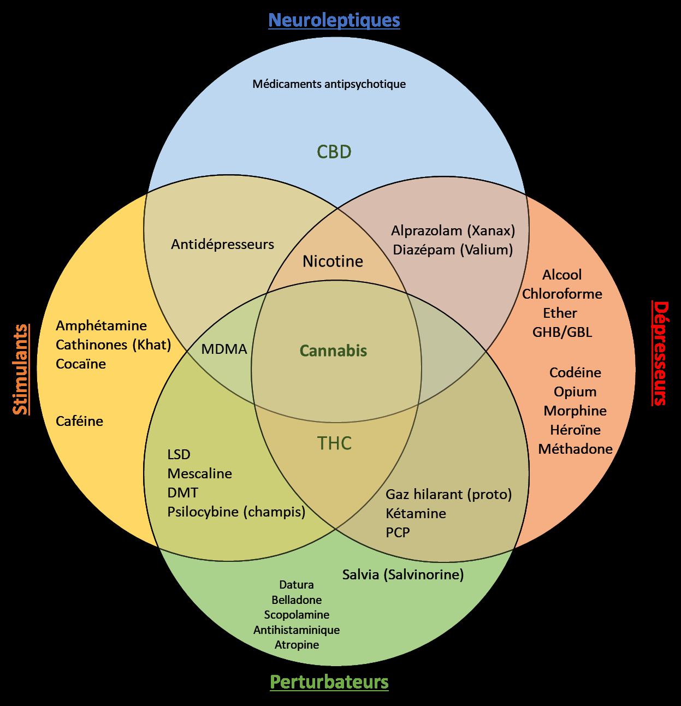

# Classifications des substances

<figure class="doc-figure">
  
  <figcaption>Figure p. 160 : support visuel du chapitre sur les classifications, les dommages et la dangerosite.</figcaption>
</figure>

# Classification des substances

Est-il possible de comparer les
drogues entres-elles ? Qu’est-ce qu’une drogue douce, dure ? Qu’est-ce
qu’un hallucinogène ? Qu’est-ce qui se passe si de la cocaïne est
consommée avec de l’alcool ? Pour répondre à ces questions, deux
classifications sont abordées.

La première permettra d’avoir une
vision sous forme de « boite » pour mieux réussir à différencier les
drogues par rapport à leurs effets et aborder les mélanges.

La deuxième classera les
principales par les dommages qu’elles peuvent causer pour aborder la notion de
drogue douce ou dure.

## Classification selon les types d’effets

Pour classifier de manière exhaustive les drogues, il serait
nécessaire de prendre en compte plusieurs facteurs tels que leur mécanisme
d'action sur le cerveau et le corps, leur potentiel addictif, leur dangerosité,
la dose efficace, et bien plus encore, en plus de leurs effets subjectifs.

-

-Il est important de souligner qu'aucune classification
basée uniquement sur les effets des drogues n'est universellement acceptée, car
les effets peuvent varier en fonction des individus et des circonstances, et
que certains mécanismes d'action peuvent être complexes.

Cependant, ces classifications permettent tout de même de
mieux situer les substances les unes par rapport aux autres, de comprendre leur
famille et de mieux appréhender la toxicité potentielle de certains mélanges.
De plus, toutes les drogues et substances agissant sur le cerveau peuvent être
classées dans cette classification.

En 2003, un ingénieur nommé Derek Snider [237]
a proposé une classification en prenant en compte 4 types d'effets majeurs et
en créant un diagramme logique. Ce type de diagramme est connu sous le nom de «
diagramme de Venn ». Parfois, cette classification est seulement présentée
comme diagramme de Venn. Cette classification est souvent reprise, elle a également
été adoptée par la Commission globale de politique en matière de drogues en
2019 [238] .

### Les quatre grandes catégories

Il y a donc quatre types de
drogues : stimulantes, neuroleptiques (aussi appelés antipsychotiques),
dépresseurs et perturbateurs (anciennement appelés hallucinogènes).

|  | Stimulant | Neuroleptique | Dépresseur | Perturbateur |
| --- | --- | --- | --- | --- |
| Action | Stimulation des fonctions psychiques (éveil, activité du   cerveau, etc.) | Aussi appelé Antipsychotique ou   « tranquillisant » Neutralité émotionnelle et affective   Effet sédatif [239] . | Diminution des fonctions psychiques. Diminution de   l’activité cérébrale et perte de la mémoire.   Soulagement de l’anxiété | Modification de la conscience et de la perception.   Souvent, les perturbateurs sont euphorisants. |
| Ce que je ressens | Mes pensées s’accélèrent. Je suis plein d’énergie | Mes émotions sont moins fortes (joie et tristesse). Je   suis moins motivé. Je suis moins anxieux. | Je suis dans le gaz. J’ai moins   mal. | Mes raisonnements sont différents. Mes sens sont modifiés   (les couleurs, le touché, la perception du temps) |
| Exemple [240] | Cocaïne | CBD | Alcool | Champignon hallucinogène |

Tableau 21.Les 4 grands types d'effets des drogues

#### Hallucination= Éléphants roses dans mon salon ?

Lorsque l’on parlait
d’hallucinogènes, l’image qui venait souvent est celle d’un éléphant rose dans
son salon. Ce n’est pas forcément le cas. Ce type d’hallucination est parfois
recherché par les consommateurs, mais n’est pas atteignable avec n’importe
quelle substance et n’importe quelle dose.

Le terme hallucination est
avant tout une altération de ce que l’on perçoit ou ressent : c’est un
état modifié de conscience, un peu comme l’hypnose. Pour aller plus loin, une
hallucination est une perte de la réalité : il est, dès lors, impossible
de faire la différence entre le vrai et le faux. Ce type d’effet concerne
surtout des substances qui s’apelle les délirogènes.

Lorsque l’on garde conscience
que ce que l’on voit est irréel , il faudrait parler d’ hallucinose .

Aujourd’hui, pour être plus
précis, le terme de perturbateur est utilisé.

### Classification générale de Derek Snider

[Image reference: image076.png; source export Word: Traité RDR version html_fichiers/image076.png]

Figure 33.Classification simplifiée de Derek Snider

#### Limite s

Deux substances d’une même
catégorie peuvent avoir deux mécanismes d’actions différents. C’est le cas par
exemple des amphétamines et de la caféine, les deux stimulent mais pas de la
même façon.

De plus, il est parfois difficile
de classer les substances par effet. Plusieurs classifications de ce type
existent et il est possible de voir des différences de positionnement pour
certaines substances. Ce n’est donc pas une science exacte, mais cette
classification reste utile pour se faire une idée générale.

#### Notion d’antagoniste

Cette visualisation permet de mettre en avant
une notion intéressante : l’antagonisme. De manière générale, prendre un
dépresseur a tendance à annuler les effets d’un stimulant. Il en est de même
pour un perturbateur et un neuroleptique . Il est difficile de faire une
vérité générale , mais voici quelques exemples intéressants :

– En cas de prise de MDMA ou cocaïne (dont
l’effet dure environ quatre heures) et une grande dose d’alcool, les effets de
l’alcool ne se feront pas ressentir. Ils apparaitront d’un coup lorsque la MDMA
ou la cocaïne sera « digéré »,

– En cas de prise de LSD avec un
traitement de Diazépam, les effets du LSD pourraient être atténués.

#### Les mélanges

La classification permet également d’avoir une
première approche lors des poly consommation (prise de plusieurs substances).

[Image reference: Une image contenant fenêtre, mammifère, fixant

Description générée automatiquement; source export Word: Traité RDR version html_fichiers/image010.png]

Dans
une première approche :

– Prendre
deux molécules de la même famille augmente considérablement la
probabilité de faire une overdose (exemples : alcool + codéine ou cocaïne
+ amphétamine)

– Prendre
deux molécules de familles opposées diminue (temporairement) les
effets ressentis, mais cumule les effets secondaires et peut même les
multiplier comme le cas de la cocaïne + alcool.

L’intérêt des mélanges est nul
et c’est dangereux.

Pour une analyse plus fine, il faut également se pencher sur
les mécanismes d’actions des substances pour comprendre leurs interactions.

#### Cas particulier de l’alcool

La classification de l’alcool
peut surprendre, mais il s’agit bien d’un dépresseur du système nerveux. Pour
autant, la désinhibition peut conduire à sentir une pseudo stimulation et son
effet antalgique peu donner l’impression d’avoir plus de force. En fait, non,
vous ne sentez juste pas la douleur. Plus de détails seront présents dans la
partie dédiée à cette drogue (préciser quel chapitre/partie).

#### Cas particulier du cannabis [241]

Le cannabis n’est pas une
substance mais un mélange de substances actives (CBD, THC et d’autres molécules
de la même famille).

Le cannabis va bien diminuer l’activité cérébrale, il est dépresseur ,
pour autant il peut augmenter l’humeur, l’anxiété ou la paranoïa : il peut
être stimulant . Le cannabis est aussi perturbateur : il
change la perception de l’environnement, peut distordre la notion de temps,
faire sursauter et donner l’impression d’avoir quelqu’un vous regarde.

C’est une drogue complexe qui
n’agit pas comme les autres. Il existe dans le corps un système entier qui
fonctionne avec des molécules cousines du cannabis : le système
cannabinoïde endogène. Ce dernier est abordé dans le Chapitre 1.

### Les sous-familles

Lorsque l’on regarde des séries sur les
drogues (Narcos, Breaking bad, etc.) ou lorsque l’on nous prescrit des
médicaments en milieu hospitalier, les termes employés sont plutôt :
« narcotiques », « hypnotiques », « analgésique »
et parfois « psychédéliques ».

Pour mieux appréhender ces termes, il faut aller un peu plus
loin dans la classification, et chercher des sous-familles :

[Image reference: image077.png; source export Word: Traité RDR version html_fichiers/image077.png]

Figure 34. Principales sous-familles de la classification de Derek Snider

#### Les dissociatifs

Les dissociatifs donnent la sensation
d’être déconnecté de son corps . C’est la « décorporation » :
le corps et l’esprit sont dissociés. A dose faible, il est toujours possible de
contrôler, bien que difficilement, ses mouvements. Le risque de chute reste
considérable, et c’est l’un des dangers bien connus de cette sous-famille [242] .
A forte dose, les dissociatifs peuvent être utilisés comme anesthésiant ,
c’est le cas de la kétamine et du protoxyde d’azote.

#### Les sédatifs hypnotiques

Sédatif veut dire dépresseur du système
nerveux. Un hypnotique est une substance capable d’induire une somnolence. C’est
ce que l’on appelle en langage commun un « somnifère ».

Un sédatif hypnotique est donc un dépresseur qui fait
dormir . Ils sont parfois prescrits comme anxiolytiques (pour lutter contre
les crises d’angoisse ou d’anxiété).

Dans les sédatifs hypnotiques, il y a une
famille de médicaments bien connue : les Benzodiazépines . Cette
famille comprend des médicaments comme le Valium ou le Xanax. Les principes
actifs finissent souvent par « zépam » : Diazépam, Nordazépam,
Témazépam…

#### Les analgésiques narcotiques

Le terme analgésique est synonyme d’antalgique
qui signifie « lutter contre la douleur ». Le paracétamol a des
propriétés antalgiques.

Narcotique signifie un engourdissement de la sensibilité, un
ralentissement de la respiration et un état proche du sommeil. Le terme
narcotique est utilisé pour parler des dérivés de la morphine, d’où son
synonyme : « morphinique ».

Les analgésiques narcotiques sont donc des antidouleurs
dérivés de la morphine.

#### Les psychédéliques

Le terme psychédélique a été inventé par
Humphry Osmond, un pionnier de la recherche sur le sujet aux États-Unis. Cela
pourrait se traduire par « Dévoilant ou déployant l’âme » [243] .

Pour décrire cela de façon plus
pragmatique, les psychédéliques se caractérisent par des effets psychologiques
(introspection, réflexions), de l’extase, des hallucinoses ou, à très fortes
doses, des hallucinations sans amnésie (trou noir).

L’environnement et l’état
émotionnel est particulièrement important pour cette classe : le risque
de Bad Trip est bien présent (angoisses, phobies, etc.).

#### Les délirants

Un délire est un trouble psychique
d’une personne qui a perdu le contact avec la réalité , qui dit des
choses ne concordant pas avec la réalité. Pour avoir un effet hallucinogène il faut
en consommer des doses proches de l’overdose mortelle. Les trips provoquent de
réelles hallucinations (et non des hallucinoses) et sont particulièrement
angoissants et désagréables.

Paradoxalement, à plus faible
dose, ils ont un réel intérêt thérapeutique entre autres pour le
traitement cardiaque et agissent comme antinauséeux. Ils agissent également
contre le mal des transports pour les enfants ou le mal des transports pour les
vols zero-G (scopolamine). Ils peuvent également pris en tant qu’antiallergiques
ou encore en tant que sédatifs puisqu’ils présentent moins d’effets secondaires
que les benzodiazépines. Il y a de grandes chances que vous en ayez déjà pris
au cours de votre vie d’ailleurs, à faible dose, évidement.

## Classification selon les dommages causés à soi et
aux autres

Dans les années 70 la guerre
contre les drogues débute avec une règlementation de l’ONU, de la naîtra cette
classification drogue dure et drogue douce.

-La notion de drogues douces et
dures est souvent utilisée pour différencier les drogues. L’alcool, le cannabis
et le tabac sont présentées comme des drogues moins « graves »
(douces) par rapport à toutes les autres qui elles seraient « vraiment »
dangereuses (fort potentiel addictif, forte potence etc.).

-

Imaginons que la notion de drogue
douce et dure est du sens : Est-ce que l’alcool, le tabac et le cannabis
sont les drogues les moins dangereuses ?

Plus que cette notion, identifier
les drogues dangereuses des autres est un enjeu important pour les spécialistes
et souvent demandé par les politiques.

Il existe plusieurs
classifications par dangerosité. Parmi les plus connues il y a le rapport
Roques de l’Assemblée Nationale en 1998 [244]
et celle de David Nutt de 2007 [245]
(cartographie Dépendances/Dommages utilisé régulièrement dans les forum de RDR) [246] .
Ces classifications sont assez basiques. Depuis, David Nutt, a poussé la
réflexion et a co-développé une classification beaucoup plus détaillée parue en
2010 puis reprise et validée dans plusieurs pays jusqu’en 2021.

Au regard des résultats de
l’étude et des réactions de mes interlocuteurs, nous allons rentrer dans le
détail et expliquer le raisonnement. N’hésitez pas à lire directement les
conclusions si vous le détail méthodologique de l’étude ne vous intéresse pas.

### QQOQCCP

Pour aborder le sujet, rien de
mieux qu’un bon QQOQCCP que nous avons tous appris à l’école et que n’avons
pratiquement jamais appliqué. 😊

QUI : David Nutt, neuro-psychopharmacologue
expert (entre autres) à l’European Monitoring centre for Drugs and Drug
Addiction (l’EMDDA), aidés par d’autres chercheurs

QUOI : Étude avec une approche globale, pour
classer les drogues

OU : Impérial College de Londres

QUAND : 2010

COMMENT : Utilisation d’une méthode scientifique
qui permet de définir des critères et des pondérations de façon cadrée.
(méthode MCDA [247] )
À titre d’exemple, cette méthode a été utilisée pour conseiller les
gouvernements sur la gestion des déchets nucléaires [248]

COMBIEN : 20 substances, 16 critères,
2 séminaires nationaux

POURQUOI : Informer les décideurs (gouvernement,
instances de santé, etc.) en matière de santé, de stratégie policière et de
soins sociaux.

L’idée est de prendre en considération tous les dommages
causés par chaque substance pour les classer les unes par rapport aux autres. Chose
simple à dire, mais complexe à réaliser.

### Validation et limites

L’étude a été faite au
Royaume-Uni en 2010, mais les travaux ont été repris en 2015 au niveau européen
avec la même méthode : cette fois avec 30 spécialistes de 20 pays et les
résultats sont similaires [249]
(nous la prendrons également en compte). Depuis, elle a été citée dans environ
1000 publications scientifiques, qui l’utilisent souvent en point de
départ, par la Commission globale de politique en matière de drogues en 2019 [250]
et présentée encore en 2022 dans les cours d’addictologie. D’autres études sur
des approches différentes obtiennent des résultats similaires. Par exemple, en
regardant la différence pour chaque substance entre la dose létale et la dose
usuelle [251]
ou par l’étude de consommateurs [252] .

Néanmoins, la méthode peut être
critiquée [253] .
En effet, les résultats bruts associent des critères pharmacologiques et des
considérations sociétales beaucoup plus larges. Cela sera pris en compte dans
la présentation de l’étude.

Une autre limite concerne le mélange de substances. Ici,
chaque substance est étudiée seule, mais la consommation de plusieurs
substances en même temps (poly consommation) est très fréquente (alcool et
tabac, alcool et cocaïne, etc.). C’est même souvent dans ces cas que l’on se retrouve
avec les pires accidents.

L’étude ne prend pas en compte les faux produits, par
exemple les pilules d’ecstasy vendues en boite et qui sont au mieux, un mélange
contenant bien de la MDMA et au pire des médicaments. Ici, seule la drogue
elle-même est considérée.

Enfin, seuls les dommages sont étudiés ici, alors qu’il peut
exister des aspects positifs également (utilisation médicale, création
d’emploi, culture, etc).

#### « ça dépend de la
dose »

Le premier réflexe lorsque cette
étude est présentée est de se dire : « oui, mais ça dépend de la dose
donc ce n’est pas interprétable ».

Effectivement, le principe de
base en toxicologie est « c’est la dose qui fait l’effet » et c’est
vrai quelle que soit la drogue.

En comparant la prise de 10
bières contre 1 milligramme de crack, l’alcool pourrait passer pour une drogue
plus dangereuse.

La question à se poser est plutôt
 : quels dommages peuvent causer l’alcool et quels dommages peuvent
causer le crack ? Ensuite, ce sera la dose qui causera les dommages.

L’étude a une approche descriptive, c’est-à-dire qu’elle liste des conséquences
potentielles et les additionne. Afin d’avoir une idée, cela revient à se poser
ce genre de question pour chaque drogue (c'est partiellement imagé):

– Quelle est la dose létale ? est-elle facilement
atteignable ?

– Est-ce qu’elle peut provoquer des maladies typiques
(cirrhose, etc.) ?

– Est-ce qu’elle est addictogène ?

– Provoque-t-elle une perte de contrôle durant la prise ?

– Peut-elle provoquer un des troubles psy ?

Après avoir répondu à toutes ces questions, il faut définir
quel poids donner à chaque question en appliquant un coefficient.

### Le baccalauréat TNIC « Techniques de Nuisances
Individuelles et Collectives »

L’approche de l’étude revient à
considérer les drogues comme des élèves passant un bac. Nous avons donc 20
élèves qui passent le baccalauréat TNIC : « Techniques de Nuisances
Individuelles et collective ». C’est une nouvelle filière et l’éducation
nationale doit :

– choisir des matières,

– définir des coefficients pour que les mathématiques
aient plus de poids que le sport,

– faire passer les épreuves du bac pour évaluer chaque
élève sur les mêmes critères.

Ainsi, les « limites »
du baccalauréat sont similaires à celles de l’étude :

– Celui qui a la meilleure moyenne n’est pas forcément
le meilleur dans toutes les matières, mais c’est celui qui a en moyenne le
meilleur niveau,

– La réciproque : ce n’est pas parce que le dernier a
la plus basse moyenne qu’il s’agit d’un « bon à rien »,

– Il est possible de critiquer les coefficients :
pourquoi l’économie et la gestion auraient un coefficient plus important que la
psychologie ?

Les premiers de la classe ont acquis le plus de capacités.
Si on leur demande de faire un projet en une journée, ils seront plus enclins à
réaliser un travail de qualité. Pour autant, si on laisse un an au dernier, il
pourra sûrement avoir le même résultat. En gros, à type de consommation
égale, les premiers de la classe ont plus de chance de faire du mal.

### Les critères et pondérations

La première étape réalisée par
les chercheurs [254]
a consisté à définir les critères « pour soi et les autres (la société en
générale) » et à leur attribuer à chacun d’eux un coefficient.

Ci-après, vous trouverez un
tableau détaillant le sens de chacun des critères et leur pondération. Cela
permet de mieux comprendre les résultats de l’étude.

| Soi/autres | Sous-catégorie | Critère | Sens ou exemple | Coefficient UK |
| --- | --- | --- | --- | --- |
| Pour soi   (46 points) | Physique | Mortalité spécifique | Écart entre dose   létale et dose produisant un effet | 5,1 |
| Mortalité liée | Mort prématurée à   cause de l’usage de la drogue (accident de voiture, cancer, suicide,   problème cardiovasculaire) | 6,4 |  |  |
| Maladie spécifique | Maladie directement   causée par la drogue (cirrhose, ulcère) | 4,1 |  |  |
| Maladie liée | Maladie à cause de   l’usage (MST à cause d’un rapport non protégé, accident domestique) | 4,1 |  |  |
| Psychologique | Dépendance | Dépendance | 5,7 |  |
| Trouble spécifique | Troubles lors de la   prise (perte de jugement, agressivité, raisonnements modifiés) | 5,7 |  |  |
| Troubles liés | Troubles liés à   l’usage (pertes de mémoire, dépression, psychose) | 5,7 |  |  |
| Sociale | Perte de biens | Perte d’un travail,   de son logement | 4,5 |  |
| Perte de relation sociale | Perte de lien avec   sa famille et ses amis | 4,5 |  |  |
| Pour les autres   (54 points) | Physique   Psychologique | Blessures | Blesser les autres   directement ou indirectement. Violence, accident de la route. | 11,5 |
| Sociétale | Crime | Risque de commettre   un crime (au niveau sociétal et non individuel) | 10,2 |  |
| Environnement | Déchets toxiques   des labos de méthamphétamine, seringue usagée | 3,8 |  |  |
| Familial | Difficultés   familiales. Négligence des enfants, banqueroute de la famille | 8,9 |  |  |
| International | Déstabilisation   politique d’un pays, crime international | 3,8 |  |  |
| Économique | Ensemble des coûts   économiques. Santé, police, prisons, services sociaux, perte de productivité,   absentéisme, etc. | 12,8 |  |  |
| Communauté | Baisse de la   cohésion sociale, déclin de la réputation d’une communauté | 3,2 |  |  |

En considérant ces critères et
ces pondérations, plusieurs commentaires peuvent être faits :

– il y a plus de points pour les autres que pour soi,

– le coefficient « économique » est élevé,

– le potentiel addictogène compte autant que l’effet
létal.

Il est important de rappeler que
l’objectif est d'avoir une approche globale sur les effets pour les
consommateurs et pour la société dans son ensemble. De plus, les
coefficients sont forcément subjectifs, c’est bien pour cela qu’il a fallu un
séminaire de chercheurs et une méthode scientifique (MCVA) pour les définir.
Les pondérations au niveau européen sont, néanmoins, un peu différentes, les
dommages familiaux passent à 11,6 et les crimes descendent à 3. Malgré cela, la
classification ne change pas énormément.

Les critères « pour
soi » sont particulièrement intéressants pour ce livre, car ils balayent
les différents effets secondaires d'une substance (maladie, trouble psychiques
(ou psychologiques ?), impact social) ainsi que la toxicité intrinsèque.

### Résultats globaux

Pour reprendre l’analogie avec le
Bac : l’éducation nationale a défini les matières et les coefficients, au
tour des professeurs d’évaluer les élèves. Voici les résultats d’analyse de
20 substances par des experts du Comité Scientifique Indépendant sur les
Drogues [255] .

[Image reference: image078.png; source export Word: Traité RDR version html_fichiers/image078.png]

Figure 35. Classement Royaume-Uni (UK) (étude David
Nutt)

Premièrement il semble important
de remettre le contexte des substances étudiées car certaines drogues
paraissent réservées aux marginaux, « loin des personnes saines ». En
réalité, presque toutes les substances de l’étude font partie l’histoire de
la médecine : l’héroïne pour la tuberculose, la cocaïne comme
anesthésiant local, les amphétamines comme coupe-faim ou traitement de certains
troubles psychiatriques, le tabac comme cicatrisant, la kétamine comme
anesthésiant, la MDMA et le LSD en psychiatrie, le GHB pour le traitement de la
narcolepsie et l’alcoolisme [256] ,
etc.

Pour les études anglaise et
européenne, le peloton de tête contient l’Alcool, l’Héroïne et le crack. Alors,
est-ce que l’alcool est aussi dangereux que le crack ? Pas vraiment, d’un
point de vue global, dans le contexte actuel, l’alcool cause plus
de dommages que le crack ou l’héroïne. Ce n’est pas surprenant puisque le crack
et l’héroïne ne sont pas légalisés, Ils sont donc moins accessibles. Il n’en
reste pas moins que l’alcool engendre des dommages de façon plus ou moins élevée
dans tous les critères. Si l’alcool devenait illégal et si, inversement, les
drogues comme la buprénorphine devenaient légales, ces dernières causeraient,
peut-être, moins de dommages à la société.

Cette étude peut conduire à des
débats sur la législation. C’est d’ailleurs un de ses objectifs mais dans le
cadre de ce livre il faudra affiner davantage l’étude.

### Résultats pour le consommateur

Le but ici n’est pas de
conseiller les politiques. Nous allons surtout nous intéresser aux dommages
individuels et laisser les aspects sociétaux de côté. Voici donc la
classification par rapport aux dommages individuels uniquement.

[Image reference: image079.png; source export Word: Traité RDR version html_fichiers/image079.png]

Figure 36. Classement par dommages pour soi uniquement (Nutt 2010)

L’alcool passe en quatrième
position et quatre sous-groupes peuvent être identifiés en fonction des
scores :

– Groupe1 : supérieur
à 20 (Crack -Cocaïne fumée-, Héroïne, Méthamphétamine et Alcool)

à
Attention : Pour ce classement, le critère « Blessure » n’est
pas considéré car il n’impacte pas uniquement le consommateur (violence,
blessures, accident, etc). Pour l’alcool, ce critère est colossal et sa prise
en compte ferait passer l’alcool en première position.

– Groupe2 : de
15 à 20 (Cocaïne -sniffée-, Amphétamine, GHB, Tabac),

– Groupe3 : de
15 à 10 (Kétamine, Benzodiazépines, Mephédrone, Cannabis -fumé-, Méthadone et
Butane)

– Groupe4 : inférieur
à 10 (MDMA, Stéroïdes, Khat, LSD, Champignons et Buprénorphine).

Pour terminer sur le Bac :
le groupe 1 finirait dans de
prestigieuses écoles d’ingénieurs. Le groupe 4,
quant à lui, obtient le bac au rattrapage. Ce n’est pas pour cela qu’ils
sont incompétents !

Les classifications par dommages
montrent que l’alcool, le cannabis et le tabac sont dans les premiers groupes :
on retrouve un potentiel addictogène, une possibilité d’overdose, etc. Ces
trois drogues n’ont rien de doux, comme toutes les drogues.

La distinction très populaire
entre drogues douces et dures ne repose sur rien et est réfutés par les scientifiques
et les autorités sanitaires [257] .

En réalité, c’est l’usage, le contexte et l’individu qui
rendent une drogue plus ou moins dangereuse .

La dichotomie drogue dure, drogue douce en plus d’être
fausse est dangereuse puisqu’elle [258]
:

-Stigmatise les consommateurs de drogues illégales, et
participe activement à instaurer une toxicophobie,

-Minimise les risques liés aux usages des drogues
socialement acceptées,

-Retarde la détection et la prise en charge des addictions
aux drogues socialement plus acceptées : alcool, cannabis et tabac
principalement,

-A retardé la prise en charge médico-sociale adéquate des
personnes toxicomanes, en distinguant jusqu’en 2014 les structures de soins et
prise en charge des alcooliques et usagers d’autres drogues,

-Perpétue des idées reçues et retarde l’évolution de la
société et des règlementations en matière de stupéfiants.

Ce n’est pas la substance
elle-même qui est dure ou douce , mais l’usage que l’on en fait .

[Image reference: Une image contenant fenêtre, mammifère, fixant

Description générée automatiquement; source export Word: Traité RDR version html_fichiers/image080.png]

Les
notions d’ usages doux/dur, de drogue licite/illicite ou de drogues a
fort/faible acceptabilité sociale sont parfois utilisées.

Il est préférable de
classifier les drogues par effets (dépresseurs, stimulantes, perturbatrices)

Pour revenir à la gestion des
risques, cette classification permet d’avoir une première vision générale
des dommages qui peuvent être causés . Par exemple, quelqu’un qui consomme
de la cocaïne peut identifier qu’il risque :

-une mortalité spécifique
(overdose)

-mais pourra en mourir pour une
raison indirecte (problème cardiovasculaire, accident),

-des maladies (hépatites à cause
de la prise par exemple),

-une dépendance (deux fois plus
qu’avec l’alcool mais deux fois moins que le tabac),

-des troubles psychologiques et
sociaux.

Il est aussi possible de comparer des substances entre elles.
Par exemple, le tabac à le même potentiel de dépendance que le crack.

[Image reference: Une image contenant fenêtre, mammifère, fixant

Description générée automatiquement; source export Word: Traité RDR version html_fichiers/image010.png]

Cette étude offre la
possibilité d’avoir une vision globale des risques auxquels vous vous
exposez en consommant chacune des substances énumérées.

TOUTE PRISE DE SUBSTANCE ENTRAINE DES RISQUES

## Classifications diverses

Avec l'adoption de la
classification par dommages, une méthode à la fois robuste et validée, il
devient possible d'appréhender visuellement des sous-catégories. En effet, la
taille de chaque critère est représentée dans un graphique à barres, facilitant
ainsi la compréhension de divers aspects tels que la dépendance.

-

-D'autres systèmes de
classification offrent la possibilité de se concentrer sur des aspects
spécifiques qui n'ont pas été abordés ou d'examiner certains détails plus en
profondeur. Parmi les différentes classifications présentées, on peut citer :

1. Par Risque d’overdose :
Cette classification permet d'évaluer le rapport entre la dose usuelle et la
dose létale d'une substance, mettant ainsi en lumière le risque
d'overdose . Ce critère correspond à la « mortalité
spécifique » dans la classification par dommages.

2. Selon le Nombre d'Interactions
: cette classification organise les substances en fonction du nombre
d'interactions graves ou mortelles connues avec d'autres substances ou
médicaments. Elle sert à identifier les substances qui présentent les plus
grands risques en cas de mélange avec d'autres éléments

3. Par Potentiel Criminogène
: Cette catégorie identifie les substances ayant montré une propension à
encourager des comportements malveillants ou criminels .

4. Par Structure Chimique
: Cette méthode est particulièrement utile pour identifier les familles
chimiques et les types d'effets qu'elles produisent. Elle est très prisée dans
le domaine de la réduction des risques liés à la drogue (RDR), où les
substances sont souvent discutées en termes de familles chimiques, comme les
tryptamines ou les composés lysergiques.

Chacune de ces classifications
apporte une couche supplémentaire de compréhension, permettant une analyse plus
nuancée et détaillée des substances en question.

### Juridique

Deux grandes conventions de l'ONU
servent à classer les drogues illégales.

La première est la Convention de 1961 sur les stupéfiants .
Cette convention classe les substances selon leur potentiel addictif et leur
risque d’abus dans 4 tableaux. Ce classement est critiqué ; par exemple, la
codéine est considérée comme moins addictogène que le cannabis.

Ensuite, il y a eu la Convention de 1971 sur les
substances psychotropes . Ici, le classement est également sous
forme de 4 tableaux. Il se fait selon le potentiel d’impact pour la santé
publique et l’intérêt thérapeutique en médecine .

Avec ces deux classifications, il y a déjà deux notions
différentes pour les drogues. C’est-à-dire que les drogues sont classées
dans un tableau des psychotropes, qui serait un classement de la balance abus
VS intérêt thérapeutique, et un classement réalisé dans les stupéfiants en
fonction du potentiel addictogène.

| Tableau | Convention de 1961   (Stupéfiants) | Convention de 1971   (Substances Psychotropes) |
| --- | --- | --- |
| Tableau I | ·   Risque élevé d'abus   ·   Utilité thérapeutique   limitée   ·   Cannabis | ·   Risque important pour   la santé publique,   ·   Faible utilité   thérapeutique   ·   Cannabis |
| Tableau II | ·   Moindre risque d'abus   ·   Largement utilisés à des fins   médicales   ·   Codéine | ·   Risque pour la santé publique   ·   Faible à moyenne utilité   thérapeutique   ·   Amphétamine |
| Tableau III | ·   Préparations   contenant des stupéfiants des Tableaux I et II   ·   Usage médical   légitime | ·   Risque pour la santé   publique   ·   Moyenne à grande   utilité thérapeutique   ·   Diazépam |
| Tableau IV | ·   Stupéfiants du Tableau I   considérés comme particulièrement dangereux   ·   Utilité thérapeutique très   limitée   ·   Héroïne | ·   Faible risque pour la santé   publique   ·   Faible à grande utilité   thérapeutique   ·   Clonazepam |

Tableau 22.Classification de l'ONU: Stupéfiants et Psychotropes

Cette approche des années 60, avec une approche de tolérance
zéro à l’égard de tout usage non médical d’une drogue inscrite au système
international de contrôle, a créé des perceptions déformées et chargées de
morale autour d’une prétendue distinction entre le « bien et le mal » séparant
les drogues légales et illégales.

Pourtant, le parlement [259] du
Royaume-Uni a reconnu en 2006 que « la distinction entre substances légales
et illégales n’est pas clairement fondée sur la pharmacologie, l’économie ou
l’analyse coûts-avantages ». Jugeant impossible l’adoption d’une «
approche plus cohérente et rationnelle de l’abus de substances » parce qu’un «
système de classification s’appliquant à la fois aux substances légales et
illégales serait inacceptable pour la grande majorité des personnes qui
consomment, par exemple, de l’alcool de façon responsable et que cela
contreviendrait à une tradition historique bien ancrée de tolérance à l’égard
de la consommation de certaines substances altérant le fonctionnement de
l’esprit (qui vont de la caféine à l’alcool en passant par le tabac). La
régulation des substances légales s’effectue donc par d’autres moyens. »

En France, durant l’année 1998, un pavé est jeté dans la
mare en France avec le rapport Roques [260] ,
qui va notamment faire s’effondrer la notion de drogue dure et douce . Le
professeur Roques, directeur de l’unité des Sciences Pharmaceutiques et
Biologiques, a été saisi par le gouvernement pour rédiger un rapport sur la
dangerosité des produits. Il s’est entouré d’un groupe d’experts français et
étrangers pour rédiger le document et le fournir à l’Assemblée nationale. À
l’époque, cela avait provoqué l’émotion des professionnels de la filière « vins
et alcools » qui n’avaient pas apprécié les résultats [261] …

|  | Héroïne | Cocaïne | MDMA | Alcool | Benzodiazepines | Cannabis | Tabac |
| --- | --- | --- | --- | --- | --- | --- | --- |
| Dépendance Physique | Très forte | Faible | Très faible | Très forte | Moyenne | Faible | Forte |
| Dépendance psychique | Très forte | Forte | ? | Très forte | Forte | Faible | Très forte |
| Neurotoxicité | Faible | Forte | Très forte | Forte | 0 | 0 | 0 |
| Toxicité générale | Forte | Très forte | Faible | Forte | Très faible | Très faible | Très forte |
| Dangerosité sociale | Très forte | Très forte | Faible | Forte | Faible | Faible | (cancer) |

Tableau 23.
Résultats du rapport ROQUES, 1998

Afin de comprendre les enjeux et les conséquences de ce
rapport, un extrait d’un entretien [262]
avec le professeur Roques réalisé plus de 10 ans après permet de cerner les
enjeux et conséquences :

« Pourriez-vous rappeler le
contexte scientifique, sanitaire et politique dans lequel vous avez été amené à
rédiger le rapport sur la dangerosité des drogues remis en 1998 au secrétaire
d’État à la santé, qui était à l’époque M. Bernard Kouchner ?

Dans sa lettre de mission, Bernard Kouchner me demandait une
étude comparative de la dangerosité, en particulier centrale, des différentes «
drogues » y compris l’alcool. Il y avait dans cette sollicitation trois
aspects qui s’expliquaient par la définition des substances à risque d’abus et
leur contexte législatif.

Étaient considérées comme très dangereuses, les « drogues
» illicites car entraînant une dépendance physique et physique sévère (drogues
dures). Étaient considérées comme moins dangereuses, et de ce fait,
consommables licitement, le tabac et l’alcool, avec quelques restrictions
législatives concernant ce dernier.

Bernard Kouchner avait considéré que les travaux récents
de neurobiologie ne justifiaient pas cette distinction, s’appuyant en cela sur
le rapport du comité national d’éthique présidé par Jean-Pierre Changeux.
Celui-ci connaissait bien les travaux que nous avons consacrés aux opioïdes et
à moindre degré, aux cannabinoïdes et a donc recommandé à Bernard Kouchner de
me solliciter. En effet la distinction entre drogue « dure » et « douce »
fondée sur le risque de dépendance, n’avait pas de sens, pour plusieurs
raisons. D’une part, on sait à quel point la dépendance à l’alcool est
extrêmement sévère et celle au tabac très rapide. D’autre part, les mécanismes
d’action de tous ces composés sont comparables en termes d’addiction : tous
activent le système de récompense.

La liste des produits dont
votre rapport comparait les effets comporte indistinctement des drogues licites
et illicites, des drogues considérés comme « dures » et des drogues dites «
douces », ainsi que des substances considérées essentiellement comme des
médicaments. Ce point a suscité de nombreuses réactions parce qu’on mettait sur
le même plan des substances que de longues habitudes culturelles avaient
conduit à distinguer radicalement. Pourriez-vous rappeler les raisons
scientifiques et éventuellement politiques qui ont amené à procéder de cette
manière ?

Elles découlent de la lettre de mission. Nous avons
décidé de comparer la « dangerosité des drogues », selon les termes mêmes du
titre du rapport, en prenant en compte :

·
 la dangerosité sur le système nerveux central (atteintes
neuronales, par exemple)

·
 la dangerosité générale pour l’organisme qu’on
peut aussi définir comme la toxicité générale

·
 la dangerosité individuelle , le risque pour
l’individu (par exemple le risque de cancer dans le cas du tabac) et la dangerosité
interindividuelle, le risque causé à autrui après la consommation
(accidents de la route pour le cannabis, par exemple) ou à l’occasion de la
recherche du produit (dans le cas de l’héroïne, les vols, violences, etc.
visant à se procurer le produit ou l’argent nécessaire à son achat). Dans le
cas de l’alcool, les risques sont bien connus : rixes, viols, comportement
routier, etc.

Toutes ces substances – y compris certains médicaments
comme les antidépresseurs et les benzodiazépines – changent nos états de
conscience, ce qui est la définition même des substances à risque d’abus, terme
que nous avons préféré à « drogue ». Ces points sont explicités dans les deux
premiers chapitres du rapport.

Sur le plan politique, le problème était de réexaminer la
loi de 1970 qui s’appuyait sur la notion de stupéfiants, distinguait les
drogues « dures » et « douces » et punissait très sévèrement les consommateurs
et ceux qui se rendaient coupables d’« incitations » à la consommation
(journalistes, écrivains, etc.) des premières.

En fait, cette loi était largement bafouée dans la
pratique puisqu’au moment de la pandémie de sida, Bernard Kouchner et d’autres
avaient autorisé l’utilisation personnalisée d’injection d’opioïdes (la
méthadone par exemple) à la fois pour lutter contre la dépendance et pour
réduire le risque de transmission du virus VIH-1 par échange de seringues. Par
ailleurs la consommation de cannabis chez les jeunes s’amplifiant, il était
utile de s’interroger sur sa dangerosité en vue d’adapter la réponse judiciaire
et éventuellement médicale.

Enfin et surtout, ce qui a fait débat (la situation
actuelle montre à quel point le rapport était malheureusement prédictif), c’est
la démonstration de la très grande dangerosité de l’alcool. La consommation
d’alcool est devenue à l’heure actuelle un problème majeur chez les jeunes,
loin devant le cannabis.

Ceci étant, notre rapport n’avait pas vocation à inciter
à légiférer, mais plutôt à informer les politiques de la réalité des désordres
causés par les différents produits, à les comparer et donc à établir une sorte
de classement. Ce classement a fait débat car les médias et surtout les lobbies
alcooliers l’ont traduit en une formule simplifiée, et n’ont retenu que
celle-là : « l’alcool, c’est plus dangereux que le cannabis ». Ils ont
développé l’idée que le cannabis est diabolisé en France pour des raisons peu
scientifiques ( !) et affirmé que nous dédouanions ce dernier, ce qui est
inexact. Le rapport indique clairement :

« Aucune de ces substances n’est complètement
dépourvue de danger. Toutes sont hédoniques, le tabac à un degré nettement
moins important, toutes activent le système dopaminergique, toutes sont
susceptibles d’entraîner des effets plus ou moins accentués de dépendance
psychique. On peut néanmoins distinguer trois groupes, si on cherche à comparer
leur dangerosité ».

Quel regard portez-vous
aujourd’hui sur la question de la dangerosité comparée des drogues et sur les
débats concernant la dépénalisation du cannabis ?

Si c’était à refaire et en tenant compte des études qui
concernent les substances étudiées – elles se publient par milliers –, je ne
changerai rien au diagnostic porté sur la dangerosité comparée des drogues.
Nous avions souligné qu’en stigmatisant le cannabis, on prenait le risque de
dévier les consommateurs vers des drogues à dangerosité beaucoup plus sévère.
Or c’est bien ce qui s’est produit : la presse et les médias, ainsi que les
rapports de l’Observatoire français des drogues et des toxicomanies (OFDT) font
état régulièrement de l’augmentation de la consommation de cocaïne, de crack et
d’alcool chez les jeunes.

Les politiques de lutte contre les drogues font fausse
route. Nicole Maestracci, présidente de la mission interministérielle de lutte
contre les drogues et les toxicomanies (MILDT), avait proposé un très
remarquable plan de lutte privilégiant la prévention, le soutien des
associations luttant au plus près des personnes dépendantes. Tout ceci a été
balayé par une politique pratiquement uniquement répressive avec diminution de
l’aide aux associations, renforcement des peines, lutte contre le petit trafic –
essentiellement cannabis –, etc. On constate huit ans plus tard que cette
politique est un échec. Les coûts sociaux sont énormes, en termes d’accidents,
de troubles majeurs de la santé, de dangerosité interindividuelle, d’entrave à
la scolarisation, etc.

Il s’en est suivi une série de mesures tellement
coercitives qu’elles sont vite apparues inapplicables. Pendant ce temps, on
rétablissait la publicité pour le vin et le premier journal sportif français
utilisait le tiers de sa une, lors des journées fastes pour le sport français,
à vanter les mérites d’une boisson anisée, en assortissant l’image d’un slogan
associant la consommation de ladite boisson et la victoire relatée au-dessus (
!). On abandonnait également l’interdiction du privilège accordé aux bouilleurs
de crus. Je pourrais citer beaucoup d’autres exemples de destruction lente de
la loi Évin. Je m’en étais ouvert par lettre, sans grand succès, auprès de
l’Académie de médecine.

Néanmoins, Mme Roseline Bachelot s’est émue de
l’augmentation de la consommation d’alcool chez les jeunes et elle a eu le
courage de prendre quelques mesures pour tenter de réduire cette
surconsommation :

·
 retirer progressivement de la vente les boissons alcoolisées
sur les autoroutes ou les stations-service à partir d’une certaine heure,

·
 interdire la vente d’alcool aux moins de 16 ans en particulier
dans les supermarchés,

·
 lutter contre la pratique des happy hours qui incitent à la
surconsommation par réduction des prix de la deuxième consommation,

·
 inciter les alcooliers à supprimer leur soutien aux fêtes
étudiantes par la fourniture de boissons alcoolisées gratuites, notamment les
prémix très dangereux car dissimulant l’alcool et de plus très sucrés.

Ces mesures ont-elles eu un effet ? Il y a lieu d’en
douter quand on connaît la puissance du lobbying alcoolier en France. Ces
mesures ont du reste été très critiquées au sein même du Parlement.

Il y a néanmoins des points encourageants. Le message
répressif a été repris par la sécurité routière. Depuis les textes de Mme
Bachelot, les médias ont diffusé à une plus grande fréquence des messages
insistant sur la dangerosité de l’alcool au volant. C’est très positif.

Ce qui l’est moins, c’est le discours tenu lors du
recours aux organismes de récupération des points perdus sur le permis de
conduire : à nouveau, on minimise le caractère désinhibiteur de l’alcool.

Il faut prendre en compte le fait que le rapport sur la
dangerosité des drogues avait eu plusieurs effets majeurs :

1. il
incluait l’alcool et le tabac dans les missions de la MILDT, ce qui avait
d’ailleurs déclenché une énorme vague de protestation ;

2. il
incluait toutes les substances à risques d’abus, abolissant par conséquent la
notion de drogues « dures » et « douces », dans une discipline unique,
l’addictologie, qui a trouvé à partir de ce moment un véritable statut.

Bien évidemment, tout ceci n’a pas fait l’unanimité
auprès des producteurs et des consommateurs d’alcool, ni auprès de l’Académie
de médecine qui a continué à stigmatiser principalement le cannabis comme la
drogue néfaste pour la jeunesse etc. Ces résistances se sont traduites par un
retour en force, surtout en période électorale, de la manipulation des médias
avec pour message principal : « la drogue – sous-entendu le cannabis – est
responsable de la violence dans les banlieues : il faut donc plus de répression
». Reste que le classement de l’alcool dans les « drogues » potentielles est
désormais du ressort de la MILDT et ceci n’a pas été remis en cause.

[…]

Avec plus de dix ans de
recul, comment évaluez-vous l’impact de ce rapport au regard de la situation
sanitaire, des représentations des drogues, de l’action publique contre le
tabac et les drogues ? Quel rôle joue la recherche scientifique et pharmacologique
dans cette action ?

Je me contenterai d’ajouter quelques remarques sur ce
point. L’État est souvent impuissant devant les industriels, notamment dans des
secteurs tels que le tabac et l’alcool. Il est également démuni devant la
dégradation des conditions sociales qui avivent le marché des drogues et
malheureusement ce n’est pas la lutte contre les dealers qui fera changer la
situation. Le budget du commerce de la drogue dans le monde se chiffre en
centaines de milliards de dollars. Et la guerre en Afghanistan, par exemple, a
fait baisser d’un facteur 3 le prix de la dose d’héroïne !

L’État, en effet, n’a pas de position claire et stable
sur tous ces problèmes. Il n’y a jamais eu de débat sur tous les composés à
risques d’abus, mais seulement des discussions concernant tel ou tel produit.

Quand on examine les missions de la nouvelle MILDT
(Mission Interministérielle de Lutte contre les Drogues et Toxicomanie ) ,
on reste songeur en le comparant à celles qui avaient été définies à l’époque
de Mme Maestracci, et qui sont exposées dans la brochure intitulée Drogues :
savoir plus, risquer moins.

Dernier point, la France consacre peu d’études à la
recherche de traitements chimiques ou autres pour lutter contre les addictions.
»

La législation et la classification légale des drogues ne
sont pas basées sur la dangerosité des drogues mais sur des questions
politiques et historiques.

Plusieurs initiatives gouvernementales ont tout de même
permis de faire avancer l’addictologie au-delà de la question de légaliser ou
non. Le rapport Roques en France et l’étude de David Nutt (voir classification
par dommages) en Angleterre influencent tout de même la connaissance
scientifique et l’approche des ministères de la santé, bien que des critères
qui dépassent la santé publique soient choisis et que les contraintes de l'ONU
restent les mêmes depuis les années soixante.

Toutefois, des questions se posent sur l’impact de
l’interdiction . En effet, pour contourner la loi, les chimistes créent de
nouvelles drogues. Souvent des dérivés de drogues illégales, celles-ci sont
beaucoup moins étudiées et peuvent être beaucoup plus nocives que leurs
cousines illégales. Ces produits se retrouvent en vente libre, c'est l’exemple
du HHC, un dérivé du cannabis qui a été vendu chez les buralistes et qui
produisait des effets similaires au THC.

Cela pose une multitude de problématiques : les
consommateurs de ces drogues de synthèse peuvent considérer que le fait
qu'elles soient légales soit un gage de sécurité, il n'y a aucun accompagnement
lors de l’achat ou de prévention par le vendeur, etc.

Or, la liste des produits classés par l’ONU évolue
lentement. 50 substances étaient classées en 1948 et 274 en 2018. De l’autre
côté, les dérivés de drogues légales (Nouveaux Produits de Synthèses) ont
explosé de 130 en 2018 à 803 en 2018 [263] .

La législation est donc un sujet complexe qui ne se
concentre pas sur la santé ni la réduction des risques, mais sur la culture,
l’impuissance des États, les désaccords entre politique de santé et de police,
etc.

### Toxicité aigüe (risque et danger)

L'objectif de cette partie est de classer les substances
psychoactives en fonction de leur toxicité aiguë.

Pour une compréhension optimale de cette classification, une
distinction cruciale entre les termes « danger » et « risque »
doit être faite. Dans les études scientifiques ainsi que dans le langage
courant, une confusion ou un mélange fréquent de ces deux termes est observé.

Dans le contexte de l'évaluation des risques chimiques et
toxicologiques, le « danger » est défini comme la capacité
intrinsèque d'une substance à provoquer des effets indésirables.

Le « risque », en revanche, est
associé à une exposition à la substance et représente la probabilité d’être
confronté au danger dans des conditions d'expositions spécifiques.

Pour illustrer la différence entre le risque et le danger,
prenons l'exemple de l'arsenic. L'arsenic est une substance dangereuse, ce qui
signifie qu'il peut être mortel même en petites doses. C'est la caractéristique
intrinsèque de l'arsenic qui le rend dangereux.

Cependant, l'arsenic est
également présent dans les pépins de pommes, mais en très petites quantités.
Dans ce contexte, le risque associé à la consommation de pommes est
relativement faible. Le risque est une évaluation de la probabilité que le
danger se réalise. En d'autres termes, bien que l'arsenic soit dangereux en
soi, le risque de subir des effets néfastes en mangeant des pommes est minime
en raison de la faible concentration d'arsenic.

Dans l'exemple des pommes,
l'arsenic est dangereux, mais le risque associé à sa consommation via les
pommes est relativement faible.

Il existe de nombreuses façons d’évaluer les risques et
dangers des substances. Deux publications qui utilisent deux critères
différents sont utilisées pour cette partie.

Le premier critère [264]
évalue le danger intrinsèque des substances en calculant le nombre de fois
qu'il est nécessaire de prendre la dose minimale efficace (DE50) pour atteindre
la dose létale (DL50). Cet indice est souvent appelé "indice
thérapeutique" ou "marge de sécurité". Une évaluation du danger
est ainsi obtenue, indiquant que "si une dose x fois supérieure à la dose
efficace est prise, l’overdose mortelle est atteinte". Cette approche
permet d'éliminer les biais liés à la disponibilité ou légalité ainsi qu’à la
qualité de la substance, par exemple. Toutefois, la limitation de cette
approche est que les doses auxquelles les consommateurs sont réellement exposés
ne sont pas prises en compte.

Le second critère [265]
se concentre sur l'évaluation du risque en mesurant le rapport entre la dose
provoquant des effets secondaires et les doses moyennes auxquelles les
individus sont exposés lors de la consommation. Dans ce cas, l'évaluation est
basée sur une exposition réelle, ce qui en fait une évaluation du risque plutôt
que du danger. Il est ainsi conclu que "en fonction de l'exposition
moyenne des consommateurs, un risque plus ou moins élevé d'effets toxiques
existe".

| Terme | Indicateur | Définition |
| --- | --- | --- |
| Danger | Indice thérapeutique = Marge de sécurité= DL50/DE50 | Nombre de fois ou la dose efficace doit être   prise pour atteindre la dose létale |
| Risque | Marge d’Exposition= Dose effet   secondaire/dose consommée | Nombre de fois ou la dose consommée doit   être prise pour obtenir des effets secondaires |

Tableau 24. Indicateurs de risque et danger liés à la toxicité aigue

Au-delà de la sémantique différente employée dans les
deux études, l'objectif est de tester la robustesse de la classification en
adoptant deux approches distinctes : risque et danger.

Attention : dans ces classifications les interactions
ne sont pas prises en compte.

#### Classification par danger

Gable a été parmi les pionniers à introduire une approche
basée sur la toxicologie, en se référant à l' « indice
thérapeutique » couramment utilisé pour les médicaments. Un indice faible
indique une marge de sécurité réduite. Pour déterminer ces indices, une analyse
approfondie de la littérature existante a été menée comprenant des cas de
décès, des études animales et des calculs d’extrapolation sur les humains.

Considérons une molécule psychoactive spécifique : sa DL50
est de 50 mg/kg et sa DE50 est de 5 mg/kg, ce qui donne un indice thérapeutique
de 10. Cela implique que la dose potentiellement mortelle est dix fois plus
élevée que la dose efficace. Bien que les doses puissent varier
considérablement en fonction du poids, de la santé générale, de la tolérance au
produit, entre autres facteurs, ces variations sont communes à toutes les
substances et des calculs ont été effectués pour moyenner les doses. L'objectif
principal est de les comparer entre elles, plutôt que de fournir une valeur
absolue pour chaque drogue. Il s'agit donc d'un système de classement.

| Principe actif | Dose létale moyenne (g) | Dose effective (g) | Marge de sécurité |
| --- | --- | --- | --- |
| Héroine IV | 0,05 | 0,008 | 6 |
| GHB/GBL orale | 16 | 2 | 8 |
| Ethanol (alcool) orale | 330 (33 verres) | 33 (3verres) | 10 |
| Methamphétamine orale | 0,15 | 0,015 | 10 |
| Cocaine inhalé | 1,2 | 0.08 | 15 |
| MDMA orale | 2 | 0,125 | 16 |
| Codéine orale | 0,8 | 0,04 | 20 |
| Methadone orale | 0,1 | 0,005 | 20 |
| Kétamine inhalé | 2,7 | 0.07 | 38 |
| Fluoxétine orale | 2 | 0,02 | 100 |
| Protoxyde azote inhalé (avec oxygène) | 525 litres | 3,5 litres | 150 |
| LSD orale | 0,1 | 0,0001 | 1000 |
| Psylocibine orale | 6 | 0,006 | 1000 |
| THC fumé | 15 | 0,0015 | 1000 |

Tableau 25. Classement par marge de sécurité selon l'étude
de Robert.S Gable 2004

Des méthodologies similaires sont employées par les agences
de protection de l'environnement pour classer les polluants, ou par les
autorités de régulation des médicaments pour évaluer la dangerosité des
substances.

L'étude se concentre principalement sur la toxicité aiguë
résultant d'une dose unique, en mettant un accent particulier sur le risque
d'overdose mortelle, comme détaillé dans la section "risque lors de la
consommation" sous-section "overdose". Les chercheurs estiment
que leurs découvertes pourraient enrichir les programmes éducatifs axés sur la
prévention des drogues.

#### Classification par risque

Pour étayer ces résultats, une étude complémentaire
employant la méthode de la « Marge d'Exposition »(MOE) est mise en
avant. La MOE représente une avancée significative dans le domaine de
l'évaluation des risques, permettant une comparaison rigoureuse des risques
sanitaires associés à différents composés chimiques. Elle est calculée en
établissant un rapport entre la dose caractérisant les effets indésirables,
telle qu'identifiée dans des études épidémiologiques (aussi appelée
"Benchmark Dose" ou BMD), et la dose prise par les consommateurs
pour ce même composé.

Une MOE faible indique un risque élevé pour la santé
humaine. Introduite en Europe en 2005, cette méthode est fréquemment utilisée
pour évaluer les risques liés aux composés carcinogènes et génotoxiques, et
sert à hiérarchiser les mesures de gestion des risques.

Dans ce contexte, l'exposition à la substance en question
est prise en compte, ce qui en fait une évaluation du risque plutôt que du
danger.

[Image reference: Une image contenant texte, capture d’écran, diagramme, Parallèle

Description générée automatiquement; source export Word: Traité RDR version html_fichiers/image081.png]

Tableau 26. Classement par marge d'exposition selon l'étude
de Dirk W Lachenmeier 2015. Rouge: moyenne, Barre: ecart-type, Gris: cas de
personne ayant une tolérance, Rond noir (alcool): moyenne basée uniquement sur
les cas humains.

La "Marge d'Exposition" (MOE) a été calculée pour
l'exposition individuelle et l'exposition basée sur la population. Dans les
deux scénarios, la consommation d'alcool a été trouvée comme ayant la plus
faible MOE. À l'autre extrémité, le THC ou le cannabis, ainsi que les
stimulants de type amphétamine et les benzodiazépines, ont des valeurs de MOE
élevées.

Trois méthodes différentes ont été appliquées pour tester la
robustesse y compris un facteur pour considérer la tolérance. Les résultats
généraux restent stables, bien que les rangs entre les opiacés et la cocaïne
changent en raison de la haute tolérance aux dosages extrêmes rapportée pour
les opiacés.

Les résultats sur la "Marge d'Exposition" (MOE)
confirment les classements antérieurs basés sur d'autres méthodes. En
particulier, ils montrent que le risque associé au cannabis a peut-être été
surestimé par le passé, tandis que celui de l'alcool a été sous-estimé.

Selon l’interprétation des résultats par les auteurs des
MOE, l'alcool, la nicotine, la cocaïne et l'héroïne tombent dans la catégorie
"risque élevé".

### Nombres d’interactions

L'un des défis majeurs dans le domaine de la réduction des
risques est la compréhension et la sensibilisation de la consommation
simultanée de différentes substances.

En effet, les substances actives peuvent interagir entre
elles lorsqu'il y a consommation de plusieurs drogues, mais elles peuvent
également interagir avec des médicaments et, dans certains cas, avec des
aliments. Ces interactions varient en gravité, allant de majeures à mineures,
et comprennent également des interactions dites "variables".

1. Interactions Majeures: les effets peuvent mettre
en danger la vie du consommateur ou peuvent causer des dommages permanents ;

2. Interactions Modérées: les effets sont
significatifs. Dans certains cas de réactions indésirables, ils peuvent
entraîner une détérioration clinique du consommateur. Un traitement additionnel
ou, parfois, l’hospitalisation peuvent être requis ;

3. Interactions Mineures: les effets sont
généralement peu marqués. Ils peuvent gêner le consommateur ou passer
inaperçus, mais dans tous les cas, ils n’affectent pas de façon significative
l’issue thérapeutique et n’entraînent pas de conséquences sérieuses pour le
récipiendaire. Un traitement additionnel n’est habituellement pas nécessaire ;

4. Interactions Variables: : les effets varient selon
les doses utilisées et la sensibilité particulière de chaque consommateur du
fait, notamment, des phénomènes de tolérance et de dépendance physique et
psychologique

Dans son ouvrage "La Toxicomanie," une analyse
exhaustive des interactions pharmacologiques connues impliquant les
psychotropes est présentée par Mohamed Ben Amar. Une recherche bibliographique
rigoureuse a été effectuée en utilisant plusieurs bases de données médicales et
scientifiques, y compris Medline (PubMed), Micromedex Drugdex® System, Drug
Interaction Facts, Stockley’s Drug Interactions et le Compendium des produits
et spécialités pharmaceutiques. Un total de 212 références pertinentes a été
sélectionné et 1070 interactions ont été identifiées à partir de cette enquête.

Un extrait de cette étude exhaustive est représenté par le
tableau suivant. Chaque interaction ne peut pas être détaillée ; plutôt, le
nombre d’interaction sont identifiées, afin de donner une idée des substances
les plus à risques. Le tri du tableau est effectué en fonction du nombre total
d'interactions.

|  | Interactions majeures | Interactions modérées | Interactions mineures | Interactions variables | Total |
| --- | --- | --- | --- | --- | --- |
| Antidepresseurs ISRS | 9 | 48 | 3 | 3 | 63 |
| Alcool (éthanol) | 6 | 26 | 5 | 19 | 56 |
| Opiacés | 8 | 36 | 6 | 1 | 51 |
| Benzodiazépines | 2 | 20 | 10 | 5 | 37 |
| Barbituriques | 4 | 21 | 3 | 5 | 33 |
| Antidépresseurs IMAO (non selectifs)   avec médicaments | 22 | 5 | 1 | 2 | 30 |
| Antidépresseurs IMAO (non séléctifs)   avec aliments | 28 | 0 | 0 | 0 | 28 |
| Cocaïne | 15 | 6 | 0 | 4 | 25 |
| Caféine | 1 | 6 | 7 | 8 | 22 |
| Cannabis | 5 | 14 | 0 | 1 | 20 |
| Tabac | 0 | 7 | 1 | 9 | 17 |
| Amphétamines | 4 | 2 | 1 | 7 | 14 |
| MDMA ou ecstasy | 4 | 0 | 0 | 7 | 11 |
| Kétamine | 1 | 5 | 1 | 4 | 11 |
| LSD | 6 | 1 | 0 | 1 | 8 |
| Substances volatiles (poppers) | 6 | 1 | 0 | 0 | 7 |
| Méthylphénidate | 2 | 1 | 3 | 1 | 7 |
| Zopiclone | 0 | 3 | 1 | 2 | 6 |
| PCP | 0 | 2 | 0 | 4 | 6 |
| GHB (médicament xyrem) | 0 | 4 | 0 | 1 | 5 |

Tableau 27.Classification des drogues par nombre
d'interactions (selon le livre "la toxicomanie" de Mohamed BEN AMAR

### Criminogène

L'auteur Mohamed Ben Amar, dans son livre "La
Toxicomanie [266] ,"
identifie et classe les drogues par leur potentiel criminogène après une
analyse de la littérature. En effet, toutes les drogues ne sont pas criminogènes.
Cette relation complexe entre la consommation de drogues et le comportement
criminel a été le sujet de nombreuses études et débats.

Les drogues criminogènes peuvent être classées en deux
catégories principales : les psychotropes criminogènes directs et les
psychotropes criminogènes indirects.

Les psychotropes criminogènes directs sont des substances
qui entraînent un comportement violent ou agressif chez l'individu qui les
consomme. L'alcool est l'exemple le plus courant de ce type de drogue. La
consommation excessive d'alcool peut entraîner une perte des inhibitions, une
diminution de la vigilance et une augmentation des comportements à risque, y
compris des actes de violence et des agressions sexuelles. D'autres exemples de
psychotropes criminogènes directs incluent les amphétamines, la cocaïne et la
phencyclidine (PCP). Ces substances peuvent également entraîner des
comportements violents et agressifs, bien que les détails spécifiques de leurs
effets varient.

Contrairement aux psychotropes criminogènes directs, les
psychotropes criminogènes indirects ne provoquent pas intrinsèquement un
comportement violent ou agressif. Cependant, ils peuvent inciter les individus
à commettre des crimes pour se procurer la drogue ou l'argent nécessaire pour
acheter la drogue. L'héroïne et la cocaïne sont des exemples typiques de ce
type de drogue. Les personnes dépendantes de ces substances sont souvent
impliquées dans des vols et des vols armés pour financer leur dépendance.

La compréhension de la nature criminogène de ces substances
est importante pour la formulation de politiques publiques efficaces en matière
de drogues et de criminalité. Par exemple, des programmes de traitement de la
toxicomanie pourraient être plus efficaces pour réduire la criminalité que des
mesures punitives sévères contre les consommateurs de drogues.

La relation entre les drogues et la criminalité est complexe
et multifactorielle, impliquant des facteurs biologiques, psychologiques et
sociaux. Néanmoins, il est clair que certaines substances ont un potentiel
criminogène plus élevé que d'autres. Une meilleure compréhension de ces
dynamiques peut aider à orienter les politiques publiques et les interventions
pour réduire à la fois la consommation de drogues et les comportements
criminels associés.

| Substance | Type de Criminogénicité | Exemples de Comportements Criminels | Observations Complémentaires |
| --- | --- | --- | --- |
| Alcool | Direct | Violences, agressions sexuelles, comportements à   risque | La consommation d'alcool entraine une dérégulation   du circuit cérébral du contrôle inhibiteur [267]   même pour les personnes tolérantes (dans 40% des viols l’agresseur est   alcoolisé [268] ) |
| Amphétamines | Direct | Violences, agressions | / |
| Cocaïne | Direct & Indirect | Violences, vols | / |
| Phencyclidine (PCP) | Direct | Violences, agressions | / |
| Héroïne et opiacés | Indirect | Vols, vols armés | Les individus dépendants à l'héroïne   ont un taux de criminalité sensiblement plus élevé que les consommateurs   d'autres substances illicites |

Tableau 28. Classification des drogues criminogènes

### Chimique

Les substances peuvent être classées de nombreuse manière.
Les deux précédentes (par dommages et par effets) sont les principales pour la
réduction des risques. Néanmoins, le développement nouveau produit de synthèse
conduit souvent à parler en famille chimique. Cela permet d’identifier quel
type d’effet la substance devrait produire.
