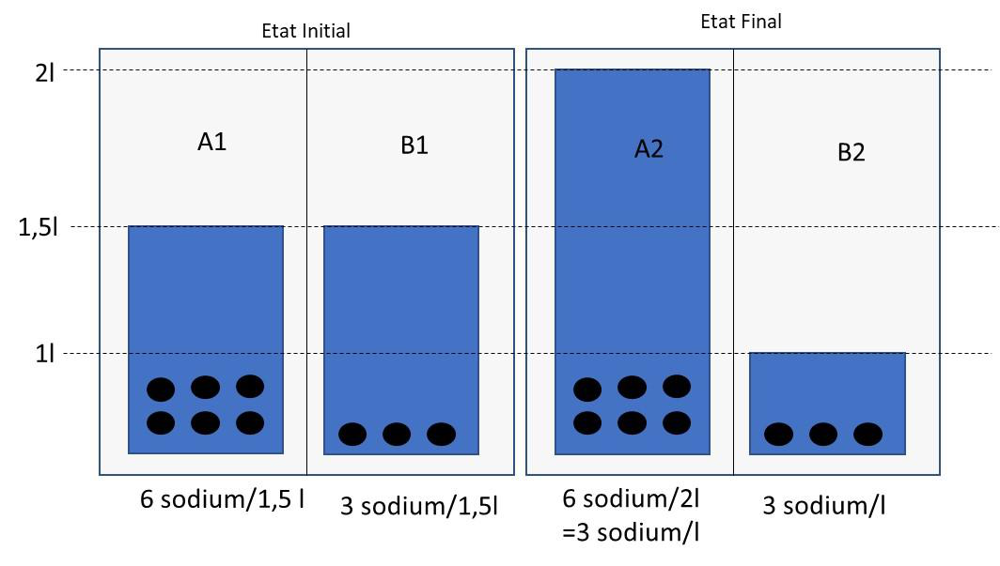
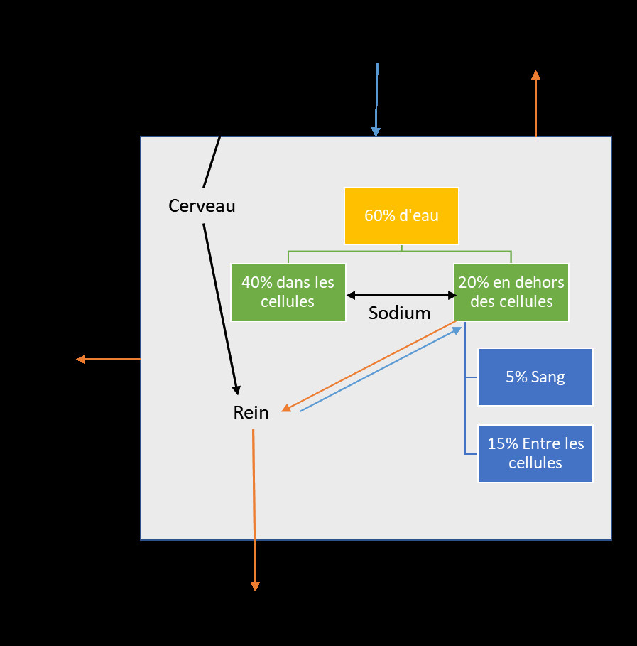
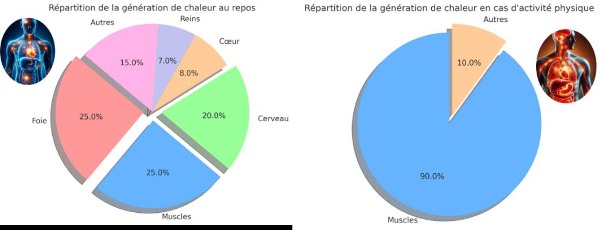
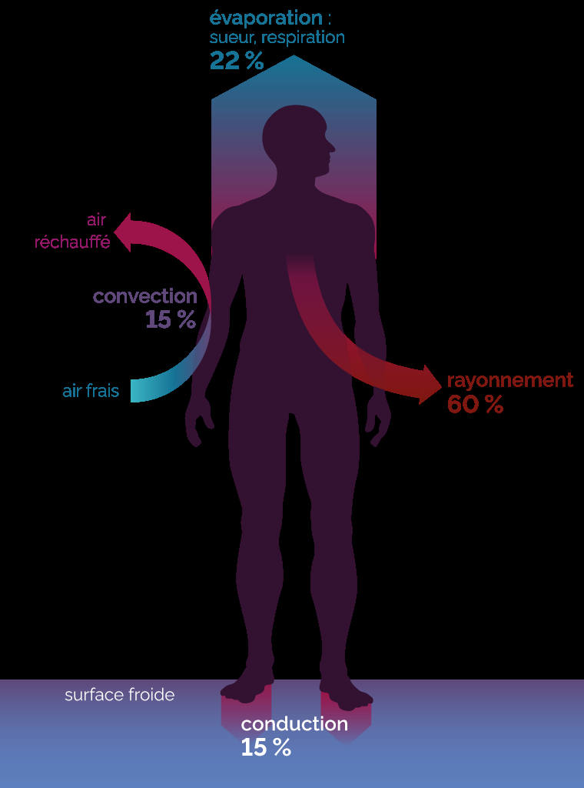
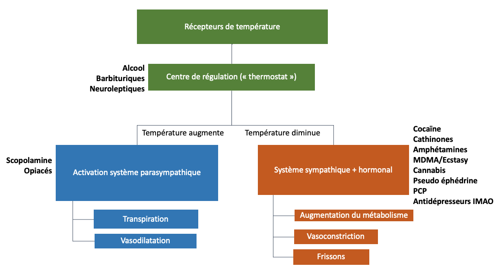
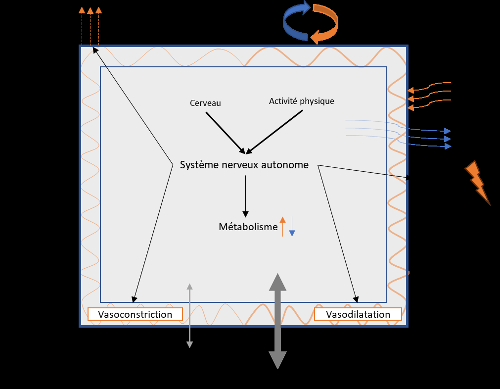

# Allergie, convulsions, hydratation et thermie

## Allergie et crise d’anaphylaxie

Sur l’allergie aux drogues, les études conclues souvent au
manque de données [304] ,
aux besoins du développement de tests spécifiques et souligne que bien que ces
réactions soient rares, elles peuvent être fatale.

Les drogues,
souvent des petites molécules, échappent généralement à la détection par le
système immunitaire et ne peuvent donc pas causer d’allergie. C’est également
le cas des médicaments en général, sauf que certains peuvent se lier à des
protéines plus grandes, formant des complexes pouvant déclencher des allergies,
à l'instar de la pénicilline. Le risque d'allergie est particulièrement
pertinent pour ceux ayant des antécédents d'allergies médicamenteuses.

Même des drogues
non allergènes de base, telles que le GBL ou le GHB (similaires à des
neurotransmetteurs naturels), peuvent être contaminées ou coupées avec d'autres
substances, et les drogues « naturelles » contiennent une multitude
de substances, c’est le cas par exemple pour l’allergie à l’alcool [305] (agent de collage,
particules, etc). Cela s'applique aussi aux produits de coupe de la cocaïne.
Les tests effectués par les associations de réduction des risques drogues
visent à identifier ces risques. De plus, il existe un risque d'interaction
avec les traitements antiallergiques.

L’allergie aux drogues est
rare, il faut être attentif :

-En
cas d’allergie connue ;

-Aux produits
de coupe ;

-Aux interaction
avec un traitement de l’allergie.

Dans les deux cas, faire
tester ces produits est une bonne solution pour le risque allergique.

Pour prévenir ces
risques, une compréhension approfondie des mécanismes allergiques et des
options de traitement est proposée.

### Le mécanisme allergique

L'allergie [306]
est une réaction immunitaire démesurée de notre corps face à des substances
étrangères habituellement inoffensives, telles que le pollen, certains aliments
ou la poussière. Cette surréaction est déclenchée par une série d'événements
biologiques complexes, se déroulant en deux phases principales :

1. Phase de Sensibilisation :
Lors de la première rencontre avec un allergène, les lymphocytes B de notre
système immunitaire produisent des anticorps spécifiques, appelés
immunoglobulines E (IgE). Ces IgE se fixent sur les mastocytes et les
basophiles, les préparant à une réponse rapide lors d'une future exposition à
l'allergène.

2. Réaction Allergique : À la
suite d'une nouvelle exposition, les IgE activent les mastocytes et basophiles,
qui libèrent alors des médiateurs chimiques tels que l'histamine. Ces
médiateurs sont responsables des symptômes caractéristiques des réactions allergiques,
notamment :

- Vasodilatation : Dilatation
des vaisseaux sanguins augmentant le flux sanguin vers la zone affectée,
provoquant rougeur et chaleur.

- Augmentation de la
perméabilité vasculaire : Les vaisseaux sanguins deviennent plus perméables,
permettant le passage de l'eau et des protéines du sang dans les tissus,
entraînant un gonflement (œdème).

- Recrutement de cellules
inflammatoires : Attraction de cellules immunitaires supplémentaires, telles
que les éosinophiles et les neutrophiles, aggravant l'inflammation.

Les manifestations allergiques
s'articulent autour de deux phases :

- Phase Immédiate : Se
manifestant minutes après l'exposition à l'allergène, caractérisée par une
libération rapide de médiateurs chimiques.

- Phase Retardée : Survenant
quelques heures après l'exposition, marquée par une inflammation tissulaire
soutenue due à l'infiltration cellulaire.

Ces réactions peuvent varier de
légères à sévères, allant de simples démangeaisons à des réactions
anaphylactiques (œdème dans la région du larynx, démangeaison, diarrhées,
hypotension) potentiellement mortelles, nécessitant une intervention médicale
urgente. L'adrénaline, aussi appelée épinéphrine, est cruciale en cas de
réaction allergique grave, car elle réduit l'œdème en provoquant une
vasoconstriction, augmente la pression artérielle, diminue la perméabilité
vasculaire et dilate les bronches pour faciliter la respiration.

La gravité des réactions peut
évoluer au fil du temps, une exposition initialement bénigne pouvant entraîner
des réactions plus sérieuses lors de contacts ultérieurs.

En résumé, l'allergie est le résultat d'une réaction
immunitaire exagérée à des substances normalement inoffensives. Les médiateurs
chimiques libérés lors de cette réaction provoquent une série de changements
vasculaires et cellulaires, entraînant les symptômes caractéristiques des
allergies, tels que le gonflement, dû à la fuite de liquide des veines vers les
tissus environnants.

### Faire un test allergique

Les auto-tests allergiques aux drogues, pratiqués sans
supervision médicale, manquent de fiabilité et présentent des risques
significatifs. Ces tests, souvent mentionnés en ligne, suggèrent d'appliquer
une petite quantité de substance sur la peau ou la langue et d'observer les
réactions. Cependant, ils ne garantissent pas une évaluation précise des
allergies potentielles, principalement en raison de l'absence de contrôle sur
la procédure et le contexte d'administration.

L'un des seuls intérêts potentiels de ces tests pourrait
être la détection préliminaire d'une allergie de type 1, caractérisée par une
réaction immédiate. Cependant, même dans ce cas, l'auto-administration sans
précautions adéquates pourrait mener à des conséquences graves si une réaction
allergique sévère, comme le choc anaphylactique, se produisait sans accès
immédiat à un traitement médical approprié.

En outre, pour les consommateurs explorant de nouvelles
drogues de synthèse achetées sur Internet, un tel test pourrait théoriquement
aider à vérifier l'activité du produit à la dose attendue. Cette pratique vise
à éviter les risques d'une surdose due à l'incertitude sur la puissance de la
drogue. Néanmoins, cette méthode reste moins intéressante que faire tester la
substance par une association.

## Convulsions

## L’hydratation

L'hydratation est un équilibre
que le corps ne cesse de contrôler sans en être conscient. Les substances
psychoactives (drogues comme médicaments) impactent cet équilibre. Lorsque
c'est le cas, deux troubles peuvent apparaître : la déshydratation et l'hyperhydratation.
Pour les comprendre, l'hydratation est expliquée, suivie d’un point sur chacun
des troubles pour aboutir aux règles de prévention des risques. Les problèmes
d'hydratation, avec ceux liés à la température, sont des risques majeurs, très
fréquents et peuvent conduire à des décès. La suite du chapitre est orientée
vers la consommation de substances. Pour autant, ces problèmes d'hydratation,
même les formes les plus graves, peuvent survenir uniquement avec un effort
intensif. La médecine du sport est très vigilante sur ce sujet avec les jeunes
athlètes.

### Principes physiologiques de l’hydratation

#### La répartition de l’eau dans le corps humain

Le corps est composé d'environ 60
% d'eau [307] .
Cette eau se répartit entre différents compartiments :

-l'eau présente dans les cellules, permettant aux
cellules de fonctionner correctement ;

-l'eau entre les cellules, qui permet le transport des
nutriments, des protéines ou encore l'élimination des déchets . Ce
compartiment inclus l’eau du sang.

Une bonne hydratation va donc permettre le maintien du
volume de sang de l’organisme qui lui-même permet une bonne oxygénation du
cerveau et des muscles.

La répartition entre l'eau dans
les cellules et en dehors est gérée par un mécanisme qui s'appelle l 'osmose .
Ce principe est présent dans le corps, mais également dans les habitations
équipées d'un robinet dit à osmose inverse, ou encore dans les usines de
désalinisation des eaux de mer. L'osmose se produit lorsqu'une eau riche en sel
est mise en contact avec une eau pauvre en sel, à travers une membrane comme la
paroi d'une cellule.

La membrane bloque le passage du sel
mais laisse passer l'eau. La nature cherche toujours un équilibre, elle va donc
chercher à avoir la même concentration en sel des deux côtés. Le seul moyen ici
est de faire passer de l'eau vers la partie la plus concentrée pour la diluer.

Ce phénomène impact
directement la taille des cellules, elles peuvent gonfler ou dégonfler en
fonction de la concentration en sel de l’eau dans laquelle elles beignent (eau
intercelullaire).

<figure class="doc-figure">
  
  <figcaption>Figure 38. Schéma osmose.</figcaption>
</figure>

Dans le cas où l'eau en dehors des cellules (B1) est moins
riche en sel que l'eau dans les cellules (A1), le volume des cellules va
augmenter : elles vont gonfler (A2) pour essayer d'équilibrer les
concentrations.

C'est l'hyponatrémie : "hypo" pour moins, et
"natrémie" qui désigne la concentration de sodium dans le sang. Pour
rappel, le sang fait partie du compartiment eau extracellulaire. Donc, si moins
de sel dans le sang, il y a moins de sel sur l'ensemble du compartiment.

L'apport en minéraux, surtout le sodium [308] ,
joue donc un rôle clé dans l'hydratation , car cela régule l'hydratation des
cellules. L'apport d'eau pure n'est pas suffisant pour s'hydrater.

#### Elimination de l’eau

L'eau de l'organisme va s'évacuer au fur et à mesure, pour
plusieurs raisons.

La première est la détoxification par les
reins. L 'urine va permettre d'évacuer les déchets de l'organisme qui
sont solubles dans l'eau (voir la partie sur le métabolisme), notamment les
métabolites, les molécules issues de la métabolisation des drogues, par
exemple.

Les reins sont donc des filtres, qui vont laisser passer les
déchets dilués dans de l'eau.

La quantité d'eau pour diluer ces déchets est gérée par le
cerveau qui sécrète une hormone : la vasopressine ou ADH. Autrement dit, le
cerveau va dire aux reins la quantité d'eau qu'il accepte de perdre dans
l'urine. La vasopressine fonctionne comme un frein : plus il y en a,
moins les reins laissent passer d'eau dans les urines. Cet équilibre, qui est
régulé en temps réel, peut se détraquer avec les prises de substances qui
agissent sur le cerveau.

La deuxième est la régulation de la
température. L'un des moyens du corps pour éliminer la chaleur est la sueur .
Ce point est un premier élément qui explique le lien entre l'hydratation et la
régulation de la température. Lors d'exercice physique et/ou lorsque la
température est élevée, ce débit peut aller jusqu'à 2 litres par heure ,
ce qui représente une perte colossale.

Pour illustrer cela : en médecine du travail, il est
nécessaire de suivre les personnes qui travaillent en ambiance thermique
chaude, pour évaluer leur perte d'eau, elles sont pesées sur une balance avant
et après le travail. Autrement dit, la perte est telle qu'elle peut se voir sur
une balance.

Enfin, il y a les vomissements, qui peuvent
être à l’origine d’une importante perte en eau.

#### Apport en eau

Les apports qui hydratent sont donc l'eau et les minéraux.
Ces apports proviennent des boissons, mais également de la nourriture,
surtout pour les minéraux . L'hydratation passe donc aussi par
l'alimentation.

Plusieurs points sont importants pour établir des règles de
prévention des risques :

·
 La vitesse d'absorption d'eau par l'organisme est limitée
(environ 1,2 l/h alors que le débit de sueur à l'effort peut monter à 2 l/h),

·
 La sensation de soif est un mauvais indicateur [309]
de l'hydratation car elle n'apparaît que lors d'une concentration en sel dans
le sang déjà supérieur à la normale. Autrement dit, la soif apparaît un peu
trop tard.

·
 Boire une trop grande quantité d'eau peut favoriser le
vomissement.

·
 Boire une quantité d'eau trop froide peut créer des maux de
ventre voire des malaises vagaux.

L'apport en eau dans une journée se calcule en fonction du
poids de corps [310] ,
il se fait en plusieurs étapes :

·
 Retirer 20 à son poids,

·
 Multiplier par 15,

·
 Ajouter 1500.

Dans le cadre d'une alimentation normale, environ 1 litre
d'eau est apporté par l'alimentation.

| Poids de corps (kg) | Eau totale nécessaire (l) | Apport par la boisson (l) |
| --- | --- | --- |
| 40 | 1,8 | 0,8 |
| 50 | 1,95 | 0,95 |
| 60 | 2,1 | 1,1 |
| 70 | 2,25 | 1,25 |
| 80 | 2,4 | 1,4 |
| 90 | 2,55 | 1,55 |
| 100 | 2,7 | 1,7 |

Figure 39. Apport en eau en fonction du poids pour une
journée. Hors activité physique et consommation de substances psychoactive

Ce tableau représente l’apport pour une journée hors
activité physique particulière. À titre indicatif, il est conseillé de boire 1
ml de liquide par Kcal d’énergie consommée [311] .
Par exemple, pour un footing de 30 minutes, il faudrait boire au moins 416 ml,
soit environ une petite bouteille d’eau.

### Bilan

L’hydratation peut donc être résumée avec le schéma
ci-dessous. Il servira de base pour comprendre les troubles de l’hydratation
liée aux drogues.

<figure class="doc-figure">
  
  <figcaption>Figure 40. Bilan des apports et des éliminations d'eau.</figcaption>
</figure>

Les flèches oranges représentent les moyens d'éliminer
l'eau, notamment par les reins et d'autres voies. Les flèches bleues indiquent
les sources d'apport d'eau au corps. Les flèches noires montrent les
interactions, avec le cerveau jouant un rôle régulateur en contrôlant le
comportement (comme la faim et la soif) et en ajustant la quantité d'eau
renvoyée dans la circulation par les reins, notamment grâce à l'hormone
vasopressine.

L’hydratation permet :

-De
maintenir le volume de sang (et donc avoir une bonne oxygénation du cerveau et
des muscles)

-De maintenir
le fonctionnement des cellules (en régulant la quantité d’eau dans les
cellules)

-Participe à
la régulation de la température (via la sueur)

### Troubles de l’hydratation

#### La déshydratation

La déshydratation correspond à une perte d’environ 5% de
l’eau, au-delà de 10% le fonctionnement des organes vitaux est compromis.

###### Prévention

Le schéma précédent permet d'avoir une vision générale des
mécanismes de l'hydratation. Sur cette base, voici ce qui peut conduire à la
déshydratation lors de consommations :

·
 Hacker le cerveau en modifiant les comportements (moins de
sensation de soif et oubli de boire), c'est le cas de beaucoup de drogues,
(Moins d’apport)

·
 Hacker le cerveau pour libérer moins de vasopressine : les
reins évacuent un maximum d'eau. C'est le cas de l'alcool, de la caféine et des
dépresseurs en général, (Plus d’élimination)

·
 Augmenter le débit de sueur (en créant une hyperthermie),
c'est le cas pour les stimulants notamment. À cela s'ajoute le fait de danser
toute la nuit dans un environnement chaud comme une boîte de nuit. Sachant que
le débit de sueur peut être supérieur au débit d'absorption de l'eau, il peut
être plus difficile de réhydrater dans ce cas. D'ailleurs, l'effort physique à
lui seul, hors consommation, suffit à pouvoir créer des déshydratations, (Plus
d’élimination)

·
 Faire vomir , c'est souvent le cas lors des surdoses, (Plus
d’élimination)

Le fait que la déshydratation soit un risque majeur n'est
pas étonnant car dans le contexte festif, les causes se cumulent : consommation
d'alcool en préambule de la soirée, l'envie d'uriner va être fréquente et le
volume d'urine va dépasser le volume d'eau consommée par les boissons alcoolisées.
Une fois arrivé en boîte il y a un environnement chaud couplé au fait de danser
(sueur) ; en milieu de soirée, pour être reboosté, une prise de cocaïne qui va
amplifier l'hyperthermie, tout en continuant à boire de l'alcool. L'effet de la
cocaïne passe et l'effet de l'alcool remonte de plein fouet, ce qui va
provoquer des vomissements. Ce cas, qui peut paraître tiré par les cheveux, est
pourtant fréquent.

Il faut bien retenir qu'un seul des facteurs présentés
précédemment peut causer des déshydratations plus ou moins graves.

Il n'y a pas de protocole tout fait, il faut ancrer le fait
de boire (de l'eau) lors des consommations. C'est clairement indissociable, et
l'hydratation passe aussi par l'apport en sodium.

1° Inclure l’hydratation dans
votre organisation/préparation

L’organisation et préparation de
prise de drogues devrait inclure l’hydratation. Globalement, boire de l’eau est
suffisant pour prévenir le risque de déshydratation. Les solutions de
réhydratation (vendue en pharmacie) ne se justifie pas en prévention. (MSDMANUAL)

INFO :
Les bars et boites sont dans l’obligation [312]
de vous donner à boire si vous le demandez : « Ces établissements
doivent donner accès à leurs clients à une eau potable fraîche ou tempérée,
correspondant à un usage de boisson. »

2° Boire régulièrement de
petites quantités même sans soif

Comme la soif arrive trop tard
et que débit d’absorption est aussi limité : il faut boire des quantités
raisonnables régulièrement. Raison supplémentaire, boire une grande quantité
d’un coup peut favoriser les vomissements !

Dans le cas de la consommation
d’alcool, alterner une boisson alcoolisée et un verre d’eau peut aider à
diminuer la déshydratation subit le lendemain.

3° Boire de l’eau fraiche ou
tempérée, mais pas trop froide

La température de l’eau n’a pas
d’influence sur l’hydratation. Toutefois, boire beaucoup d’eau très froide
peut avoir un impact sur la tension artérielle et parfois conduire à un malaise
vagal cela peut aussi provoquer des vomissements.

4° Manger correctement

Manger permet d’apporter des
minéraux essentiels a l’hydratation.

En
résumé pour Prévenir la déshydratation :

- La
sensation de soif n’est pas un indicateur fiable de l’état d’hydratation

-Manger
correctement

-Boire
régulièrement de petites quantités

-Ne pas
boire trop froid

- Faire
régulièrement des pauses pour stopper l’évacuation par la sueur

###### Protection

Si la prévention n'est pas suffisante et que la
déshydratation se produit, il est crucial de pouvoir l'identifier. Ce chapitre
décrit les symptômes et la manière dont la déshydratation peut être mortelle.

|  | Déshydratation |
| --- | --- |
| Symptômes | Les symptômes d’une déshydratation GRAVE ressemblent   beaucoup à la « gueule de bois ».     – des maux de tête ;   – une désorientation, des vertiges ;   – des troubles de la conscience (malaise,   étourdissements…) ;   – une modification du comportement (agitation,   apathie, grande faiblesse…)     – une soif intense ;   – une bouche et une langue sèches (avoir la   « pâteuse ») ;   – un regard terne et des yeux enfoncés ;   – l'apparition d'un pli cutané (lorsqu'elle est   légèrement pincée, la peau tarde à retrouver son aspect initial) ;   – une peau sèche, froide et pâle ;   – une fièvre ;   – des urines en faible quantité ; |
| Mécanisme simplifié | Choc hypovolémique :   Moins de volume de sang à baisse du   débit cardiaque à hypotension à Arrêt cardiaque |

Figure 41.Tableau Déshydratation

Les premiers symptômes ressentis vont être neurologiques car
le cerveau est l'un des organes les plus hydratés (80 % d'eau). Si les
symptômes ressemblent à ceux de la gueule de bois, c'est parce que la gueule de
bois est principalement une déshydratation. En effet, même lorsque beaucoup de
boissons alcoolisées sont consommées, le volume évacué sera toujours plus
important que le volume bu avec l'alcool (cf. vasopressine). À cela s'ajoutent
les autres facteurs développés plus haut.

Lors de consommation, les symptômes peuvent se confondre
avec les effets des drogues, et d'autres fois, avec l'hypothermie.

En
résumé pour Détecter la déshydratation :

- Bouche
et langue sèche

-
Pli cutanée

-Peu
d’urine

-Appeler
les urgences

En prévention, l'eau plate suffit. Si la déshydratation
apparaît, il existe des solutions de réhydratation. Vendues en pharmacie, ce
sont des Solutions de Réhydratation Orales – SRO. Elles contiennent un mélange
de sels minéraux (qui servent à réhydrater) et de sucre. Le sucre [313] ou les
hydrates de carbone [314]
dans l’eau permettent une absorption 30% plus rapide que l’eau seule .

Il est aussi possible de la réaliser soi-même avec 1 litre
d'eau, 6 cuillères à café de sucre, 1 cuillère à café de sel [315] .

En
résumé pour Agir face à la déshydratation :

-
Boire des solutions de réhydratation : 1 litre d'eau, 6 cuillères à
café de sucre (augmente la vitesse d’absorption), 1 cuillère à café de sel
(hydrate)

- Ne
pas boire trop vite et ne pas dépasser 1l par heure

-
Appeler les urgences si l’état de s’améliore pas

#### L’hyperhydratation

L'hyperhydratation, aussi connue sous le nom d'intoxication
à l'eau ou hyponatrémie dilutionnelle, se produit lorsque l'apport en eau
dépasse la capacité de l'organisme à l'éliminer, entraînant une dilution
excessive des électrolytes dans le corps, en particulier du sodium.

Ce phénomène est peu connu du grand public, peu communiqué
par les associations, mais fait l’objet d’un suivi particulier auprès des
personnes âgés en été. Parfois, ce phénomène fait l’objet de publications
scientifiques (cas cliniques). Par exemple, deux personnes qui avaient consommé
de la MDMA et, conscientes des risques de déshydratation, ont bu de l’eau en
excès jusqu'au décès [316] .
Une étude néerlandaise portant sur des patients intoxiqués à la MDMA admis en
unité de soins intensifs a révélé que 20 % d'entre eux étaient admis en raison
d'une hyponatrémie [317] .

Certains médicaments [318]
peuvent également favoriser ce trouble : Traitements de l’hypertension,
Tramadol, Inhibiteur de la pompe à protons (anti-acide) ou les antidépresseurs.

L'hyperhydratation est lorsque le volume d'eau dans les
cellules devient trop important. Les cellules gonflent, c'est-à-dire que les
organes vont prendre plus de place, c'est l'œdème. Les conséquences sont
surtout subies par le cerveau qui est dans une boîte crânienne ; il ne peut pas
prendre beaucoup en volume, il va se plaquer contre la boîte crânienne et finir
par bloquer l'arrivée de sang. La régulation du volume d'eau entre les
compartiments se fait avec le sodium.

Le grossissement des cellules a lieu si la concentration
en sodium n'est pas suffisante par rapport au volume d'eau. C'est
l'hyponatrémie. "Hypo" signifie moins, "natrémie" est la
mesure de sodium (symbole chimique : Na) dans le sang.

Dans l’hyperhydratation, c’est la concentration de sodium
qui est en jeu, elle peut donc se produire même sans boire un volume d’eau
démesuré [319] .

###### Prévention

Pour prévenir ce problème, il faut assurer un équilibre
entre l'apport en eau et en sel. Afin d'identifier les moyens de prévention,
voici comment causer une hyponatrémie :

·
 Hacker le cerveau en modifiant les comportements (perte de la
sensation de faim, envie irrépressible de boire), c'est le cas de beaucoup de
drogues, (moins d’apport en sel et plus d’apport en eau)

·
 Hacker le cerveau pour libérer plus de vasopressine. L'eau ne
s'évacue plus par l'urine et le sodium du corps est donc dilué dans un plus
grand volume d'eau,

·
 Augmenter le débit de sueur (en créant une hyperthermie). La
sueur contient du sodium, ce moyen va donc permettre de diminuer le sel présent
dans le corps.

Le point sur l'alimentation est important. Avec une
alimentation normale, il est possible de boire d'importantes quantités d'eau
sans problème. Toutefois, en cas de carence alimentaire ou d'une alimentation
inadéquate, ou de consommations de substances, la consommation de 2 ou 3 litres
d'eau peut devenir problématique. 2 ou 3 litres sont rapidement atteints en
soirée ou lors d'un environnement chaud. Ce mécanisme est le syndrome du
"tea-toast" [320] ,
qui touche beaucoup de personnes âgées en été ; et de sportifs mal préparés.

Dans le contexte d'une consommation de substances, voici à
quoi une situation menant à une hyponatrémie pourrait ressembler : Une soirée
techno est prévue un vendredi. Tout au long de la journée, la personne s'engage
intensément dans son travail, négligeant de manger et probablement de boire
suffisamment, l’apport en minéraux est faible. Avec l'excitation de
l'événement, elle consomme un stimulant pour se 'rebooster' avant d'arriver.
Sur place, elle se laisse emporter par l'ambiance, dansant activement pendant
des heures. Cela entraîne une sudation excessive, contribuant à une perte
significative de sodium. La consommation de la substance stimulante non
seulement amplifie la perte d'électrolytes par sudation mais pourrait également
induire une soif excessive, menant à la consommation d'une grande quantité
d'eau sans électrolytes pour compenser, conduisant à l'hyponatrémie.

En résumé pour Prévenir
l’hyponatrémie (hyperhydratation) :

-Manger
correctement, si ce n’est pas le cas, essayer de boire des boissons avec
électrolytes (boissons de sport ou solutions de réhydratation)

-Prendre le temps d’uriner

###### Protection

Si la prévention n'est pas suffisante et que
l'hyperhydratation se produit, il est crucial de pouvoir l'identifier. Ce
chapitre décrit les symptômes et la manière dont l'hyperhydratation peut être
mortelle.

|  | Hyperhydratation : hyponatrémie |
| --- | --- |
| Symptômes | Premiers symptômes :   -Nausée / vomissements   -Dégout de l’eau   -Malaise   Hypernatrémie aigue :   -Maux de tête intense,   -Obnubilation (absence de réactions)   -Confusion   -Œdèmes |
| Mécanisme simplifié | Moins de sodium à la   quantité d’eau dans les cellules augmente (Œdème) à cerveau compressé dans la   boite crânienne (engagement cérébral) à circulation sanguine bloquée à mort   cérébrale par manque d’oxygène [321] . |

Figure 42.Tableau de l'hyperhydratation (hyponatrémie)

Avant que l'hyponatrémie ne devienne grave, son
identification s'avère complexe. Les symptômes peuvent être confondus avec ceux
produits par les drogues consommées ou d’une hypothermie.

En résumé pour Détecter
l’hyponatrémie :

-Pas
de symptômes facilement identifiables. Effets neurologiques qui se
confondent avec les effets des substances psychoactives

-En cas de maux de tête
intenses . Essayer d’identifier l’apport en minéraux et en eau sur les
dernières 12 h. Si peux d’apport en sel, suspicion d’hyponatrémie et APPEL
DES URGENCES en précisant les consommations et les médicaments.

Le traitement de l'hyponatrémie consiste à réduire l'apport
en eau (appelé restriction hydrique) et à favoriser l'apport en sel. Si
l'apport en sel est trop rapide, dans de très rares cas, il peut y avoir une
atteinte du tronc cérébral avec un risque de tétraplégie (c'est la myélinolyse
centro-pontine). Lors du traitement, les urgences vont donc apporter du sel
progressivement sur les 48 premières heures [322]
du traitement.

En résumé pour Agir face
à l’hyponatrémie :

-
Arrêter de boire, même en cas de soif,

-Appeler les urgences
pour être guidé sur l’apport en sel.

La régulation de l'hydratation est étroitement liée à
celle de la température corporelle , notamment à travers des mécanismes tels que
le débit de sueur. La section suivante se penchera sur ce sujet. À l'issue de
cette partie dédiée à la régulation thermique, un logigramme fournira un
récapitulatif pratique pour prévenir et intervenir efficacement face aux
problèmes de régulation de température et de déshydratation.

## Hyper et hypothermie

### Principes physiologiques de régulation de la température

L'hyperthermie et l'hypothermie
représentent des risques majeurs, lors des consommations. Avec la
déshydratation, l’hyperthermie est le risque majeur de la prise de stimulants
(cocaïne, MDMA).

Une corrélation directe a même été établie entre le risque
de mortalité et l'augmentation de la température corporelle lors de
consommation [323] .

La température interne normale de l'humain se situe autour
de 37°C, avec une variation tolérable de ±0,5°C. Des températures en deçà de
35°C peuvent conduire à un état de somnolence, tandis qu'au-delà de 40,3°C,
l'individu peut devenir prostré, avec une conscience altérée. Les mécanismes
thermorégulateurs, qualifiés d'homéostatiques, visent à maintenir l'équilibre
du milieu intérieur face aux variations environnementales.

Afin d’identifier les bons réflexes, la façon dont le corps
régule la température et les mécanismes d’hyper et hypothermie sont présentés.

#### Création de chaleur

Un corps est chaud car il y a des réactions chimiques (le
métabolisme) qui génèrent de la chaleur. Les processus métaboliques entraînent
la production d'énergie par la rupture des liaisons chimiques (des protéines,
du glucose, des acides gras, etc.), sous forme de chaleur. Parmi ces processus
métaboliques, il y a la digestion, l'activité musculaire et les activités
cognitives, bien que cette liste ne soit pas exhaustive.

L'une des principales réactions qui créent de la chaleur
dans l'organisme est liée à la respiration. Les nutriments que nous consommons
réagissent avec l'oxygène pour produire du CO2, de l'eau, et une molécule qui
constitue la base de l'énergie chimique pour nos cellules : l'ATP.

Cette production de chaleur n'est pas répartie de manière
homogène dans le corps et peut considérablement varier en fonction de
l'activité physique.

<figure class="doc-figure">
  
  <figcaption>Figure 43. Génération de chaleur dans le corps, au repos et en activité physique.</figcaption>
</figure>

Au repos, ce sont le foie (25 %), les muscles (25 %) et le
cerveau (20 %) qui génèrent le plus de chaleur, suivis du cœur (8 %) et des
reins (7 %). En cas d'activité physique, 90 % de la chaleur provient des
muscles, tandis que les autres organes ne représentent plus que 10 %. C'est
donc une augmentation colossale de chaleur qu'il faut évacuer. Si ce n'est pas
le cas, cela peut causer une hyperthermie.

Si cette augmentation de la température, liée à une hausse
du métabolisme, est couplée à une activité physique dans un environnement chaud
et humide, le risque d'hyperthermie devient considérable. Le seul fait d'une
activité intensive dans un milieu chaud peut conduire à des hyperthermies .
Cela a été le cas pour 12 personnes hospitalisées lors du Future Music Festival
en 2014. Si les médias ont immédiatement titré « 3 personnes décédées suite à
une surconsommation de drogues », les autopsies ont montré qu'il n'y avait pas
de substances illicites impliquées mais des hyperthermies sévères [325] .

#### Mécanismes de régulation de la température

Différents phénomènes permettent de réguler la température
du corps humain. Il y a des phénomène physique, liés aux échanges de chaleurs
avec l’environnement et des phénomènes physiologiques régulés par le
corps.

##### Phénomènes physiques : échanges avec l’extérieur

<figure class="doc-figure">
  
  <figcaption>Figure 44. Schéma d'échange de chaleur avec l'extérieur.</figcaption>
</figure>

Pour réguler la température, il y a plusieurs mécanisme,
basé sur différents moyens physiques. Il en existe 5 :

La radiation :

La température d'un objet ou d'un environnement reflète
l'agitation thermique ou la vibration de ses molécules : plus ces vibrations
sont importantes, plus la température est élevée ; à l'inverse, une vibration
moindre indique une température plus basse. Lorsque les molécules sont
excitées, par exemple, par l'absorption d'énergie thermique, elles vibrent plus
intensément. Pour retourner à leur état d'énergie plus bas, elles émettent un
rayonnement. Ce phénomène est similaire à celui observé avec les bâtons lumineux
ou les ampoules, où l'énergie est convertie et émise sous une forme lumineuse
ou, dans le cas de la chaleur, sous forme de rayonnements particuliers appelés
infrarouges.

Le corps humain, se refroidit principalement par ce
mécanisme en perdant de l'énergie par l'émission de rayonnements infrarouges. Les
technologies comme les lunettes de vision infrarouge exploitent ce principe en
détectant la chaleur émise par les êtres vivants, permettant ainsi de les
visualiser même dans l'obscurité.

Cependant, il peut aussi absorber de la chaleur, comme
lorsqu'il est exposé au soleil, contribuant ainsi à l'augmentation de sa
température.

Pour réguler l’énergie émise ou reçue, l'utilisation d'une
couverture de survie est recommandée. Initialement développée par la NASA pour
protéger les équipements spatiaux des extrêmes thermiques, la couverture de
survie est également utile pour se protéger des hyperthermies (coup de chaleur)
et des hypothermies (refroidissement excessif du corps).

La couverture de survie [327]
est recouverte d'une fine couche d'aluminium vaporisé d’un coté qui réfléchit
environ 90% des rayonnements qu'elle rencontre. Pour maximiser son efficacité,
l'orientation de la couverture est clef :

- pour conserver la chaleur, la partie argentée doit être
tournée vers la personne ;

- pour se protéger des rayonnements solaires, la partie
argentée doit être orientée vers l'extérieur.

Cette propriété réfléchissante s'apparente à celle d'un
miroir, où la surface argentée (et non dorée) joue un rôle clé dans la
réflexion des rayonnements.

La couverture de survie a donc une efficacité redoutable.

L’Evaporation (sueur) :

Lorsque l'eau passe de l'état liquide à l'état de vapeur,
elle absorbe de l'énergie, ce qui constitue une réaction endothermique.
Autrement dit, elle prend de l'énergie à son environnement, ce qui, dans le cas
de la transpiration, signifie qu'elle extrait de la chaleur du corps,
contribuant ainsi à son refroidissement.

C'est la raison pour laquelle, dans un véhicule où les
vitres sont embuées, l'utilisation d'air chaud peut aider à dissiper la buée :
l'air chaud fournit l'énergie nécessaire pour que l'eau condensée sur les
vitres repasse à l'état de vapeur.

Cependant, le simple fait de transpirer ne garantit pas un
refroidissement efficace. Pour que la sueur puisse s'évaporer, et donc emporte
avec elle de la chaleur corporelle, l'humidité ambiante ne doit pas être trop
élevée : dans ce cas l’atmosphère ne peut plus accueillir d’eau en plus. Pour
une humidité de l’air de 5% la température qui est invivable est 44,4°C. Si
l’humidité monte à 85%, la température vivable tombe à 37,8°C [328] .

Il y a un lien important entre déshydratation et
hyperthermie. Le débit de transpiration peut atteindre jusqu'à 2 litres par
heure, surtout lors d'efforts intenses ou dans des conditions de chaleur
extrême. Ce qui peut conduire à une déshydratation significative. De même, en
cas de déshydration, la transpiration est limitée limitant l’évacuation de
chaleur.

La convection (transfert de chaleur) :

Dans ce mécanisme, l'air en contact avec la peau se
réchauffe, augmente en volume, puis s'élève en étant remplacé par de l'air plus
froid. Ce cycle permet un échange thermique constant entre le corps et l'air
ambiant, facilitant la régulation de la température corporelle.

L'utilisation d'un ventilateur illustre parfaitement ce
principe : en accélérant le remplacement de l'air chaud par de l'air plus frais
autour du corps, le ventilateur augmente l'efficacité de ce transfert de
chaleur, contribuant ainsi à une sensation de fraîcheur. À l'inverse, se
couvrir de vêtements crée une barrière qui ralentit ce transfert, aidant à
conserver la chaleur corporelle dans des conditions plus froides.

Le corps peut naturellement agir sur la convection, c’est l'horripilation,
communément appelée "chair de poule". Les poils se dressent et créent
une couche d'air isolante qui réduit les pertes de chaleur par convection et
diminue la sudation.

La convection contribue également à la notion de température
ressentie en météorologie, qui prend en compte l'impact du vent sur la
sensation de froid. Par exemple, une température de l'air de 4°C peut, avec un
vent de 65 km/h, produire une sensation de froid équivalente à -12°C [329] .
Prendre en compte uniquement la température météo ne permet pas de bien
anticiper le risque d’hyper ou hypothermie.

La conduction :

La conduction est un processus par lequel la chaleur se
transmet d'une zone chaude vers une zone plus froide par diffusion directe,
sans mouvement réel de matière. Cela se produit lorsque deux objets ou
substances en contact direct échangent de la chaleur. Un exemple courant de ce
phénomène est l'expérience de tenir une fourchette de barbecue : la partie
exposée au feu chauffe, et cette chaleur se propage le long du métal jusqu'au
manche. Autres exemples, entrer dans un bain chaud ou marcher pieds nus sur un
sol froid sont des situations où la conduction permet un échange thermique
direct entre le corps et son environnement.

Dans le contexte de la consommation de substances comme
l'alcool, la conduction peut avoir des conséquences dramatiques .
L'alcool perturbe la capacité du corps à réguler sa température et peut réduire
la conscience de l'individu du froid ambiant. Si une personne alcoolisée perd
connaissance et s'effondre sur le sol, particulièrement froid, la conduction de
la chaleur du corps vers ce sol peut s'intensifier. Sans la capacité de
percevoir correctement le froid ou de réagir à la situation, le risque
d'hypothermie augmente significativement. En milieu urbain, l'alcool est la
principale cause de mortalité par hypothermie [330] .

Résumé :

|  | G estion hypothermie | Gestion   hyperthermie |
| --- | --- | --- |
| Radiation | Couverture de   survie coté argenté vers soi | Si exposition au   soleil : couverture de survie coté doré vers soi |
| Convection | Se couvrir | Se découvrir, se ventiler |
| Conduction | Eviter les   contacts avec des surfaces froides / Boire chaud ou tiède / bain chaud | Favoriser les   contacts avec des surfaces froides (Bain froid ou chaud ; glace) / boire   de l’eau tempérée légèrement froide |
| Evaporation | Se sécher | Se   mouiller régulièrement (avec de l’eau tiède) |

Figure 45.Résumé des phénomènes physiques et moyens
d'actions

##### Phénomènes physiologiques : réactions du corps

<figure class="doc-figure">
  
  <figcaption>Figure 46. Résumé des phénomènes physiologiques.</figcaption>
</figure>

Frissonnement

Le frissonnement représente une réaction réflexe du corps
face au froid, marquée par une activité musculaire involontaire visant à
produire de la chaleur. Ce phénomène commence souvent par les muscles du visage
avant de s'étendre aux muscles des bras et des jambes.

Il entraîne une augmentation significative de la
consommation d'oxygène, pouvant être multipliée par cinq, ce qui illustre
l'intensité métabolique de cette réaction. Le frissonnement agit en
contractant les muscles de manière répétée, générant ainsi de la chaleur
pour contrer les effets du froid.

Toutefois, si le frissonnement se prolonge sur une période
étendue, typiquement entre quatre à cinq heures, il peut conduire à un
épuisement [331] .

Augmentation du métabolisme

En réponse au froid, le corps peut augmenter son métabolisme
basal, c'est-à-dire l'énergie dépensée au repos pour maintenir les fonctions
vitales, par l'intermédiaire de deux mécanismes principaux :

·
 Stimulation du système nerveux sympathique : Ce système,
qui régule les processus physiologiques associés à l'activité, la peur, et la
fuite, favorise la libération de noradrénaline. Cette hormone accélère le
métabolisme des sucres dans le foie et les muscles, augmentant ainsi la
production de chaleur. Le système nerveux sympathique joue un rôle crucial
dans l'adaptation du corps aux variations de température, permettant une
réaction rapide en cas de besoin.

·
 Réponse hormonale : Le cerveau sécrète une molécule qui
stimule la thyroïde pour libérer une hormone facilitant la dissociation entre
l'oxygène et l'hémoglobine dans le sang. Cela rend l'oxygène "plus
actif", favorisant les réactions chimiques produisant de la chaleur. Ce
mécanisme est particulièrement observé chez les patients souffrant de troubles
de la thyroïde, expliquant pourquoi ces individus peuvent présenter une
température corporelle plus élevée.

Par ailleurs, le système nerveux sympathique stimule
également la métabolisation de la graisse brune, un type spécial de tissu
adipeux capable de générer une quantité significative de chaleur. Contrairement
à la graisse blanche, qui stocke l'énergie, la graisse brune est riche en
mitochondries, ce qui lui permet de brûler des calories et de produire de la
chaleur. Cette graisse est principalement située autour des organes vitaux,
dans la région cervicale et thoracique, notamment au niveau des omoplates. Chez
les jeunes individus et les adultes exposés à des conditions climatiques
froides, une augmentation de la graisse brune peut être observée, en
particulier au niveau du haut du dos, indiquant une activation de ce tissu par
le système sympathique pour une production accrue de chaleur.

Dilatation périphérique

Ce mécanisme est très important, et souvent en lien avec des
problèmes liés aux consommations.

Pour que la chaleur produite par les organes internes puisse
être efficacement régulée via les phénomènes physique (conduction, convection,
évaporation), elle doit être transférée jusqu'à la peau.

Ce transfert s'effectue grâce à un réseau de vaisseaux
sanguins qui traversent la couche graisseuse sous-cutanée pour atteindre la
surface de la peau, permettant ainsi l'échange thermique avec l'extérieur. La
régulation de ce transfert de chaleur est assurée par deux processus opposés,
contrôlés par le système nerveux :

·
 Vasodilatation : Sous l'influence du système nerveux
parasympathique, les vaisseaux sanguins se dilatent, augmentant le flux sanguin
vers la peau et facilitant ainsi la dissipation de la chaleur. Ce phénomène
rend la peau rouge et chaude, et il est particulièrement visible après un
effort physique, dans un environnement chaud ou lors d’une consommation
d’alcool,

Le sang à plus de place, la pression
artérielle diminue et le cœur s’accélère,

·
 Vasoconstriction : À l'inverse, le système nerveux
sympathique peut provoquer une contraction des vaisseaux sanguins, réduisant le
flux sanguin vers la surface de la peau. Cette réaction aide à conserver la
chaleur au niveau des organes vitaux lorsque le corps est exposé au froid. Lors
de la vasoconstriction, la peau peut apparaître blanche et froide

Le sang à moins de place, la pression
artérielle augmente et le cœur ralenti .

Le flux sanguin à travers la peau peut varier de façon
significative , allant de pratiquement zéro à 30 % du débit cardiaque total,
en fonction des besoins thermiques du corps. La vasoconstriction et la
vasodilatation vont donc avoir un impact important sur le rythme cardiaque et
sur la pression artérielle.

La noyade blanche [332] ,
ou « hydrocution », illustre bien ce lien et est un risque important lors
de consommation en été près d’un plan d’eau. Lorsque la température corporelle
est élevée, il y a vasodilatation. Le rythme cardiaque augmente également et
permet d'accélérer le refroidissement.

Le corps se refroidit 25 fois plus vite dans l'eau que dans
l'air, en raison de la plus grande conduction thermique de l'eau par rapport à
celle de l'air. Lors d'une immersion brutale dans de l'eau froide, la
température centrale baisse rapidement. Pour préserver cette température
centrale, il y a rapidement une vasoconstriction massive alors que le cœur bat
à plein régime. Ceci entraîne un reflux du sang périphérique vers l'intérieur
du corps, notamment vers le cœur, et provoque une augmentation massive de la
pression artérielle. Cela peut aller d’une perte connaissance (mortelle dans
l’eau) jusqu'à l’arrêt cardiaque spontané.

Autrement dit, en été, lors de la pause déjeuner, une
vasodilatation importante va avoir lieu à cause de la chaleur et une
consommation d’alcool ; une vasoconstriction massive va se produire si un
plongeon est effectué dans l’eau.

L’idée à retenir est que le corps supporte très mal les
chocs thermiques.

La dilatation périphérique peut expliquer pourquoi des
personnes peuvent ressentir une sensation de froid alors qu'en réalité leur
corps est en état d'hyperthermie, et vice versa.

Dans le cas de stimulants tels que la MDMA, le corps
peut se trouver en état d'hyperthermie due à l'augmentation de l'activité
métabolique et à la stimulation du système nerveux sympathique. La MDMA peut
induire une vasoconstriction, réduisant le flux sanguin à la surface de la peau
et donnant ainsi une sensation de froid malgré une température
corporelle élevée à l'intérieur.

Inversement, des substances comme l'alcool provoquent
une vasodilatation, augmentant le flux sanguin vers la peau et donnant une sensation
de chaleur . Mais cette vasodilatation va augmenter l’échange de température
avec l’extérieur et donc diminuer la température du corps.

Enfin, des conditions extrêmes peuvent entraîner des
complications graves, comme des nécroses dues à une vasoconstriction prolongée,
empêchant le sang d'irriguer correctement les extrémités et les tissus
périphériques. Un exemple notoire est la nécrose des narines chez les
consommateurs de cocaïne, où la vasoconstriction induite par la drogue réduit
l'apport sanguin, entraînant la mort des cellules par anoxie.

Le contrôle au niveau central

La capacité du corps à réguler sa température repose sur un
système complexe et finement coordonné, nécessitant des récepteurs de la
température externe et interne, l'analyse de ces informations, et la mise en
œuvre de réponses adaptées.

Pendant longtemps, l'hypothalamus, situé dans le cerveau, a
été considéré comme le principal "centre de contrôle"
thermorégulateur, fonctionnant à la manière d'un thermostat réglé sur une
température spécifique. Tout écart par rapport à cette température déclenchait
automatiquement des réactions pour rétablir l'équilibre.

Cependant, des recherches plus récentes ont révélé que le
processus de thermorégulation implique plusieurs zones du cerveau, y compris la
moelle épinière, le tronc cérébral et l'hypothalamus lui-même [333] .
Cette découverte suggère l'existence de multiples "thermostats" dans
le système nerveux central, chacun avec ses propres paramètres de réglage qui
peuvent varier dans certaines limites. De plus, des récepteurs thermiques
situés à la surface de la peau jouent un rôle crucial dans la détection précoce
des changements de température externe, permettant des réactions comme le
frissonnement avant même que la température interne du corps commence à
baisser.

Certaines drogues comme les barbituriques ou l’alcool sont
capables de déréguler ces thermostats. C’est donc un facteur de risque
important. Certaines drogues comme les barbituriques ou l’alcool sont capables
de déréguler ces thermostats. C’est donc un facteur de risque important.

Par exemple, dans le cas de consommation de MDMA [334] ,
cette substance agit sur la sérotonine et a des propriétés d'augmentation de la
température. Prise seule, les risques sont gérables et font l'objet de
recherches cliniques pour une utilisation thérapeutique. Cependant, lors d'une
consommation simultanée d'alcool, les risques d'hyperthermie et de troubles de
l'hydratation explosent. Cette combinaison rend la gestion des effets beaucoup
plus difficile, augmentant le risque d'incidents graves, notamment en soirée.

La thermorégulation est également affectée par des agents
dit pyrogènes, tels que ceux sécrétés par des bactéries ou par le système
immunitaire en réponse à une infection. Ces substances peuvent augmenter le
point de réglage du thermostat hypothalamique, provoquant une vasoconstriction
cutanée (sensation de froid) et une augmentation de la production de chaleur
(frissons et tremblements), dans le but de faire monter la température
corporelle à un nouveau niveau plus élevé : c’est la fièvre. Des médicaments antipyrétiques,
tels que le paracétamol ou l’aspirine peuvent réajuster le point de réglage du
thermostat, réduisant ainsi la fièvre.

### Bilan

La régulation de la température peut donc être résumée avec
le schéma ci-dessous. Il servira de base pour comprendre les troubles de la
thermorégulation.

<figure class="doc-figure">
  
  <figcaption>Figure 47. Bilan de la régulation de la température.</figcaption>
</figure>

·
 La chaleur du corps est principalement produite par le
métabolisme. En activité physique, c’est surtout le métabolisme des muscles qui
génère le plus d'énergie.

·
 Le corps peut ajuster la quantité d'énergie produite et dissipée
grâce à plusieurs mécanismes physiologiques, tels que la variation du
métabolisme, les frissons, la dilatation périphérique, et la transpiration.

·
 Le corps doit également composer avec des facteurs qu'il ne
contrôle pas, comme la conduction, la radiation, la convection et l'humidité.
Si ces paramètres bloquent la libération de chaleur ou, au contraire, en
extraient trop, le corps peut ne plus réussir à compenser

### Troubles de la température

#### L’hypothermie

Une hypothermie est considérée lorsque la température du
corps est en dessous ou égale à 35°C. Il est important de noter que
l'hypothermie ne survient pas uniquement en cas de températures très froides ;
une ambiance thermique de 20°C peut, dans certains cas, produire une
hypothermie aussi [335] .

##### Prévention

Le schéma bilan permet d'avoir une vision générale des
mécanismes de régulation de la température. Sur cette base, voici ce qui peut
conduire à une hypothermie (en plus d'une température ambiante particulièrement
froide) :

·
 Influencer le cerveau pour modifier les comportements (réduire la
sensation de froid), comme c'est le cas avec beaucoup de drogues.

·
 Influencer le cerveau pour causer de l'ataxie (diminution de
l'activité physique), notamment avec les dissociatifs et les dépresseurs.

·
 Influencer le cerveau pour réduire l'activité métabolique.

·
 Influencer le système nerveux autonome pour induire une
vasodilatation même dans un environnement froid.

·
 Influencer le système nerveux autonome pour empêcher le frisson.

·
 Être en contact avec des éléments froids (conduction) ou être
mouillé (évaporation).

L'hypothermie est l'un des risques majeurs lors de
consommations. C'est notamment pour cela que lors d'interventions des secours,
une couverture de survie est souvent utilisée. Avec les mécanismes présentés
ci-dessus, l'hypothermie peut même survenir si la température extérieure n'est
pas très basse. Par exemple, la consommation de dépresseurs peut naturellement
refroidir le corps. Ainsi, deux verres standards de boisson alcoolisée
consommés dans une température ambiante de 22°C peuvent diminuer la température
corporelle de 0,25°C.

Le piège ici est le fait que les sensations corporelles sont
modifiées et qu'il est possible d'être en hypothermie sans le ressentir.

Pour prévenir l'hypothermie, il faut prévoir des vêtements
chauds et des endroits où s'abriter, surtout dans le cas de consommation de
substances qui diminuent l'activité physique comme les dissociatifs (kétamine,
salvia) et les dépresseurs (alcool, opioïdes et benzodiazépines), ou les
substances qui provoque une vasodilatation (alcool, cannabis).

##### Protection

Pour détecter une hypothermie, la prise de température par
le front n'est pas efficace. Il faut réussir à mesurer la température interne.
Dans les contextes de consommation, ce n'est pas évident. Le mieux est donc de
détecter les autres symptômes.

| Catégorie | Symptômes | Réaction | Conseils |
| --- | --- | --- | --- |
| Légère (36 à 32°) | Frissons, chair de poules,   sensation de froid, accélération du rythme cardiaque, difficultés   respiratoires, envie d’uriner . | Bouger, couverture de survie   ou vêtement, s’alimenter, boire tiède ou chaud ou boissons énergétiques,   s’abriter du vent , se sécher |  |
| Modérée (32° à 30/28°) | Fin du frisson avec plutôt des   tremblements, sensation de bien-être, diminution de la fréquence cardiaque,   pseudo obnubilation comateuse. Déshydratation | Ne pas bouger trop   brutalement , réagir, parler, se   réchauffer lentement par tous les moyens et appel des secours. | Ne pas masser ou frictionner   ni réchauffer trop rapidement. |
| Sévère, grave et profonde   (< 30/ 28°) | Coma, ralentissement des   fonctions vitales, Vasoconstriction massive (pouvant aller jusqu’à la   nécrose)   Baisse du rythme cardiaque   jusqu’à l’arrêt | C’est une urgence vitale, une   affaire de spécialistes avec réchauffement progressif souvent de 1° par   heure. |  |

Figure 48 .Approche graduée de l'hypothermie [336]

Le ralentissement cérébral causé par l'hypothermie va
provoquer l'arrêt de la production de la vasopressine, une hormone réduisant la
production d'urine afin de conserver l'eau dans le corps. Ceci entraînera la
création d'un volume important d'urine, entraînant plusieurs conséquences :
l'eau intercellulaire (entre les cellules) va être drainée dans l'urine, cela
va notamment diminuer le volume de sang. Ensuite il va y avoir une fuite d'eau
des cellules. En somme, l'hypothermie provoquera également une déshydratation .
Plusieurs substances ont un mécanisme similaire sur la production d’urine, qui sera
amplifié par l'exposition au froid, intensifiant la déshydratation .

L'hypothermie induit une vasoconstriction significative (qui
réduit donc le volume disponible pour le sang), ce qui n'est pas problématique
tant que le corps reste froid. Toutefois, le réchauffement rapide d'une
personne peut conduire à une vasodilatation, augmentant le volume du
système sanguin rapidement sans disposer de suffisamment de sang, résultant en
un choc hypovolémique susceptible d'entraîner un arrêt cardiaque .

Ceci représente la situation inverse de la "noyade
blanche" mentionnée précédemment – Le corps ne supporte pas les chocs
thermiques importants-. Il faut d’abord réchauffer la température centrale
avant de réchauffer les parties périphériques. Pour des températures
inférieures à 32°C, un réchauffement actif est nécessaire, appliquant de la chaleur
au niveau du thorax . L'application de chaleur sur les mains, les aisselles
ou la nuque, comme dans le cas du refroidissement pour l'hyperthermie, est
moins efficace et peux être dangereux.

La méthode de réchauffement doit donc être graduée en
fonction de la température corporelle. Pour des températures comprises entre 32
et 35 degrés Celsius, se sécher, s'isoler avec des couvertures ou des vêtements
et consommer des boissons chaudes seront suffisants.

En situation d'hypothermie, il est important de limiter
l’évacuation d’énergie en séchant la personne (évite l’évaporation), la
couvrant et l'éloignant des surfaces froides, telles que le sol.

Face à une hypothermie :

- Se sécher, se couvrir avec
des couvertures ou des vêtements chauds

- S'alimenter et boire des
liquides tièdes ou chauds. L’hypothermie déshydrate.

- S'abriter du vent et
rechercher un environnement légèrement plus chaud

- En cas de frissons ou de
chair de poule, éviter de bouger brusquement

- Si la température
corporelle est modérée (32° à 30/28°) : limiter les mouvements brusques,
communiquer et chercher à se réchauffer doucement

- Éviter de masser ou de
frictionner les zones froides, ne pas réchauffer trop rapidement

- Si possible réchauffer le
torax avec un objet chaud

- L’hypothermie peut être
une urgence VITALE : appelez les secours en cas de symptômes

##### L’hypothermie alcoolique

L'hypothermie est abordée dans la section sur les risques
génériques, nous reprendrons ici quelques notions de base et mettrons l'accent
sur les données relatives à l'alcool en particulier. Lors de la consommation
d'alcool, l'hypothermie peut rapidement devenir un risque majeur .

Une étude [337]
menée à l'Hôpital Reinier de Graaf aux Pays-Bas sur des adolescents intoxiqués
à l'alcool entre 2000 et 2010 a démontré que la réduction de la conscience
(45%) et l'hypothermie (43,1%) étaient les complications médicales aiguës les
plus courantes en cas d'intoxication alcoolique. En milieu urbain, l'alcool est
la principale cause de mortalité par hypothermie [338] .

L'alcool peut induire l'hypothermie de plusieurs manières :

• Bien que la consommation d'alcool puisse donner une
sensation de chaleur, elle provoque en réalité une dilatation de vos vaisseaux
sanguins. C'est un mécanisme naturel qui permet au corps de réguler sa
température. L'alcool, en forçant la dilatation des vaisseaux, accélère la
dissipation de la chaleur du sang vers l'extérieur. La coloration rouge du
visage de certains grands buveurs est en partie due à une vasodilatation
persistante (les lésions des petits vaisseaux y contribuent aussi).

• La consommation d'alcool réduit le frissonnement, un
mécanisme corporel essentiel pour maintenir la chaleur.

• En cas de consommation excessive, la reconnaissance du
danger lié au froid peut être altérée, rendant difficile la prise de mesures
adéquates pour se protéger du froid. Au contraire, la sensation fausse de
chaleur ressentie peut conduire à chercher du frais

La cause généralement citée dans les médias est la
vasodilatation, pourtant c’est largement remis en question [339] . Les sources utilisées pour
cette partie ne sont pas en phase pour définir lequel de ces mécanismes est
majoritaire pour expliquer l’hypothermie lors de la consommation d’alcool. Il
faut retenir que c’est multifactoriel.

Il est important de noter que l'hypothermie ne survient pas
uniquement dans des conditions de grand froid. Une étude [340] sur les adolescents
néerlandais intoxiqués à l'alcool a révélé des températures corporelles
légèrement plus basses en hiver par rapport à l'été. L'hypothermie était plus
fréquente en hiver (26,6% des cas) que pendant l'été (18,0% des cas).

Des études [341]
contrôlées menées sur des sujets sains ont montré qu'une consommation de 2 à 3
unités d'alcool à des températures ambiantes de 21 à 33 °C provoque une baisse
de la température corporelle de 0,2 à 0,3 °C.

L’alcool donne une fausse
sensation de chaleur

A une température
ambiante de 25°c , le corps se refroidit d’environ -0,25°c pour 2,5
verres

L’hypothermie est un risque
majeur et ne se produit pas qu’en hiver .

#### Hyperthermie

L'hyperthermie est considérée lorsque la température
corporelle dépasse 40°C. Historiquement, il existait deux types d'hyperthermie
(coup de chaleur) : le classique et le coup de chaleur à l'effort. Aujourd'hui,
cette distinction n'est plus d'actualité. Les conséquences sont les mêmes
quelle que soit la cause : médicaments, effort physique intense (qui représente
une cause de mortalité chez les jeunes athlètes [342] )
ou exposition à la chaleur (les symptômes sévères apparaissent après 2 ou 3
jours).

Les médicaments et drogues qui peuvent causer une
hyperthermie incluent souvent les stimulants (cocaïne, cathinones, PCP,
amphétamines), les antidépresseurs et les anticholinergiques
(antihistaminiques, antimuscariniques) qui augmentent le métabolisme.
L’hyperthermie est également un des symptômes du syndrome sérotoninergique
(voir partie dédiée), qui se produit lors de consommation de substances
impactant les recepteurs de la sérotonine.

###### Prévention

Le schéma bilan permet d'avoir une vision générale des
mécanismes de régulation de la température. Sur cette base, voici ce qui peut
conduire à une hyperthermie (en plus d'une température particulièrement élevée)
:

·
 Influencer le cerveau pour modifier les comportements (moins de
sensation de chaud), comme c'est le cas avec beaucoup de drogues.

·
 Influencer le cerveau pour augmenter l'activité du métabolisme
(c'est le cas des stimulants).

·
 Influencer le système nerveux autonome pour créer une
vasoconstriction même dans un environnement chaud.

·
 Être en contact avec des éléments chauds (conduction).

Pour prévenir l'hyperthermie, il faut anticiper des moyens
de se refroidir (aspersion d'eau, par exemple). L'objectif principal est la
prévention de l'hyperthermie, notamment en évitant la déshydratation associée
et en anticipant des moyens de se refroidir. Il est également important de
faire régulièrement des pauses cela permet de diminuer le métabolisme et donc
la création de chaleur par le corps.

###### Protection

| Catégorie | Symptômes | Réaction | Conseils |
| --- | --- | --- | --- |
| Légère (37.5 à 38°) | Transpiration OU PAS ! , sensation de soif intense, légers maux de tête. | Hydratation fréquente, repos   dans un endroit frais, application de compresses froides. | Éviter l'exposition prolongée   au soleil, porter des vêtements légers. |
| Modérée (38.1° à 39°) | Fatigue importante, nausées ou   vomissements, étourdissements. Déshydratation. | Repos au frais, hydratation   accrue, surveillance de l’évolution de la température, éventuellement baisser   la température avec des bains tièdes. | Surveiller l'évolution des   symptômes, éviter toute activité physique intense. |
| Sévère (39.1° à 40.5°) | Rougeur de la peau , accélération du rythme cardiaque, confusion, possible   délire. | Recherche immédiate   d'assistance médicale, hydratation par voie orale si possible,   refroidissement actif du corps. | Ne pas administrer de   médicaments sans avis médical, éviter toute boisson alcoolisée. |
| Critique (> 40.5°) | Hallucinations, convulsions,   perte de conscience. Une température très élevée peut conduire à : Modification   des protéines, Inflammation (généralisée), Les cellules musculaires meurent   libèrent des toxines et se retrouvent dans le sang (rhabdomyolyse), défaillance   des reins, foie. Dépression respiratoire. Coagulation généralisée | Urgence médicale absolue,   refroidissement rapide nécessaire, hospitalisation pour traitement intensif. | Ne   pas essayer de refroidir trop rapidement la personne avant l'arrivée des   secours. |

Tableau 34.Approche graduée de l'hyperthermie

Une hyperthermie n’est pas toujours identifiée facilement,
les symptômes psychologiques peuvent être provoqués par les effets des drogues,
tels que les problèmes de coordination, les délires et la tachycardie. Il
faut faire une pause en cas d’observation de changement de comportement,
d’épuisement ou de douleurs physiques.

L'immersion dans l'eau froide se présente comme la
méthode la plus évidente, ayant les taux de mortalité les plus faibles [343] et étant
le traitement de choix disponible. Cependant, l'immersion ne doit pas être
réalisée de manière brusque pour éviter la vasoconstriction (voir la
section sur la vasoconstriction pour plus de détails) et ne doit pas
trop durer pour éviter l’hypothermie.

Lorsque l'immersion dans l'eau n'est pas une option viable,
le refroidissement par évaporation, qui peut être effectué en s'aspergeant
ou en vaporisant de l'eau sur soi , est considéré comme une autre solution
efficace. Toutefois la température de l'eau utilisée pour l'aspersion ne doit
pas être froide car elle peut entraîner une vasoconstriction des vaisseaux
sanguins près de la peau, ce qui peut empêcher l'évacuation de la chaleur. De
plus, une eau tiède ou légèrement chaude s’évaporera plus facilement, c’est
l’évaporation qui capte la chaleur.

En dernier recours, l'application de glace ou de
packs de froid est également recommandée. Ces derniers doivent être placés sur
des régions corporelles riches en vaisseaux sanguins sous-cutanés, telles que
la nuque, les aisselles, l'aine, les paumes des mains et les plantes des
pieds .

Dans le cas d'une hyperthermie sévère, l'utilisation
d'antipyrétiques (aspirine, paracétamol, ibuprofène) pourrait aggraver la
situation, car ils peuvent causer des lésions au foie et aux reins.

Face à une hyperthermie :

- Si possible, suivre la
température corporelle pour la faire descendre en dessous de 39°C.

- La transpiration n’est
pas un indicateur fiable pour déterminer la présence d'une hyperthermie.

-
Se baigner dans l'eau froide est la meilleure solution, mais il faut veiller à
ne pas prolonger l'immersion pour éviter une hypothermie.

- S’asperger d'eau tiède
constitue une bonne alternative pour aider à réguler la température corporelle.

- Appliquer de la glace
ou des packs de froid sur la nuque, les paumes des mains et les aisselles peut
contribuer à réduire efficacement la température

- Ne jamais donner de
paracétamol ni aucun médicament sans avis médical !

- L’hyperthermie peut
être une urgence VITALE : appelez les secours en cas de symptômes

#### Approche générale : Thermie et Hydratation
