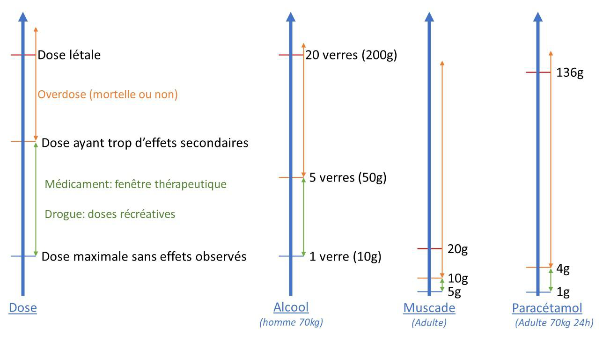

# Badtrip et overdose

## Badtrip

<figure class="doc-figure">
  
  <figcaption>Figure p. 235 : support visuel du chapitre sur les situations critiques, badtrip et overdose.</figcaption>
</figure>

### Définition

Un bad trip (mauvais trip) se
produit lorsque l'expérience se transforme en angoisse, paranoïa, panique,
sueurs, etc. En résumé, c'est une détresse psychologique et physique, mais le
plus souvent, psychosomatique, c'est-à-dire que l'état mental influence les
sensations physiques.

Bien que les bad trips soient souvent associés aux
substances perturbatrices (LSD, ayahuasca, champignons hallucinogènes, MDMA), ils
peuvent survenir avec toutes les substances psychoactives . Pour
l’alcool par exemple, une consommation qui n'entraîne pas nécessairement une
surdose peu conduire a de l’angoisse et de la paranoïa. En fonction des
substances, les noms peuvent varier mais cela reste la même chose. Pour le
cannabis par exemple, le nom est « crise blanche » en référence à la
peau qui blanchit.

Les substances délirogènes, telles que la datura, la DPH, la
scopolamine, la noix de muscade, la doxylamine, et la belladone, sont
particulièrement susceptibles de provoquer des bad trips. Ces molécules
engendrent de véritables hallucinations, contrairement aux autres substances
psychoactives qui provoquent des hallucinoses. Ainsi, les consommateurs de
délirogènes éprouvent des difficultés à distinguer la réalité des
hallucinations, ce qui peut rapidement conduire à des expériences négatives et
angoissantes.

Il y a souvent confusion entre le bad trip et l'overdose.
B ien que ces deux notions puissent être liées, elles sont différentes.
L'overdose survient lorsqu'une dose trop importante est consommée et provoque
des effets négatifs. Bien qu'une overdose puisse effectivement favoriser un bad
trip, ce dernier peut également survenir à des doses faibles ou modérées et
 n'est pas proportionnel à la dose . Ainsi, il est possible de faire un
bad trip avec une dose auparavant bien tolérée par le consommateur.

Prenons l'exemple d'un consommateur régulier de cannabis qui
fume quotidiennement deux joints. Bien habitué à cette dose, il peut, pourtant,
un jour et sans raison apparente, expérimenter un bad trip avec la même dose.

##### Exemples

Pour illustrer les propos précédents, voici un témoignage d’un
recueil par l'association Plus Belle la Nuit [344] ,
dans le cadre des bad trip au cannabis, disponible sur Instagram :

« Salut, je vous écris suite à votre story par rapport à
un Bad Trip au cannabis, c'était lundi donc c'est récent.

Ça fait maintenant 3 ans que je fume quotidiennement
entre 5 et 15 joints par jour en fonction des périodes, et ça fait 1 mois
que je me motive à arrêter mais étant bien addict je galère pas mal.

Lundi soir après ma journée de travail je rentre chez moi
et décide donc de me fumer un joint mais je ne me sentais déjà pas très
bien avant de le fumer et plus je fume mon joint et plus je tombe dans une
sorte de crise de panique

Et à un moment je sens une montée assez intense (j'ai
quand même fait mes expériences avec la « dure » donc j'ai l'habitude
de me gérer) mais là c'était une montée aussi violente que du LSD .

Et la crise de panique qui arrivait petit à petit s'est
transformée en Bad Trip assez flippant, j'arrêterai pas de me remettre en
question, j'avais l'impression que je pouvais mourir à tout instant et ça
faisait une boucle dans ma tête qui a amplifié le Bad.

Heureusement qu'il y avait mon coloc avec qui je
m'entends très bien qui m'a fait extérioriser et juste le fait de parler
d'autre chose et de sortir de ma tête m'a aidé à redescendre petit à petit et
j'ai réussi à me calmer.

Maintenant, rien que de penser à un joint, je fais
presque une crise , c'est allé très vite et même si j'avais l'impression
d'avoir le contrôle à cause de la banalisation que j'ai fait par rapport au
cannabis, il faut faire très attention. »

### Eviter le badtrip

Il n'est pas possible de garantir
l'absence de bad trips, mais on peut réduire leur probabilité. Plusieurs outils
peuvent être utiles à cet effet. Le principal est le "set and
setting" , qui fait référence au conditionnement mental et à
l'environnement dans lequel la substance est consommée. Un deuxième outil
consiste à se répéter des phrases simples et rassurantes avant la prise
de la substance. Enfin, un troisième outil, plus controversé, est la possession
de " trip killers " pour qui peut rassurer et éviter de bad
trip.

#### Le conditionnement : set and setting

La façon de se conditionner avant la consommation est la
meilleure façon d’éviter les bad trip, c’est ce que l’on appelle le Set and
Setting. Cette notion a été introduite par Timothy Leary, un psychologue connu
dans le milieu des drogues psychédéliques. C’est un personnage sulfureux, il
n’a sûrement pas eu que de bonnes idées, mais celle-ci est particulièrement
intéressante pour la réduction des risques.

Pour illustrer le set and setting nous allons appliquer la
méthode de l’inverse. Il s’agit d’une méthode intéressante qui pourrait
peut-être vous servir dans votre vie professionnelle ou personnelle.

Cette méthode se base sur le fait qu’il est plus facile pour
nous d’identifier les éléments négatifs que positifs. Le raisonnement est donc
de lister les conditions qui favorisent le badtrip pour identifier ce
qui peut nous l’éviter.

Voici des exemples de questions à se poser pour avoir un
« bon » set and setting:

| Set à badtrip | Bon set |
| --- | --- |
| Je suis fatigué   Je suis malade   (grippe, covid, rhume, etc.) : la   drogue peut amplifier vos symptômes   Je suis stressé   Je consomme par   pression sociale   Je suis nerveux à   l’idée de consommer   Je ne contrôle pas   la dose prise   Je veux contrôler   le trip   J’ai peur   J’ai des croyances   sur la substance   Je ne sais pas ce   que je dois faire en cas de badtrip | Je suis en forme   physique et mentale   Je consomme par   choix individuel   Je suis serein sur   la consommation   Je contrôle la dose   prise   Je suis prêt à me   laisser aller   Je connais les   effets de la substance ses risques, son dosage et sa durée   Je sais quoi faire   en cas de badtrip (voir ci après) |
| Setting pour   avoir un badtrip | Bon setting |
| Je consomme dans un lieu inconnu   Je suis dans un lieu dangereux   Je suis dans lieu inconfortabl e   Je ne sais pas si je pourrais avoir de l’eau et accès à des   toilettes   Je suis avec des personnes avec qui je ne suis pas à   l’aise   La musique que j’écoute m’angoisse   Je dois faire des choses importantes (répondre à des e-mails   ou à des messages, travailler, réunion de famille le lendemain à 17h, etc . ) | Je reste dans un lieu familier, dans le cas contraire   j’anticipe une manière de sortir et un lieu de refuge.   J’anticipe un accès aux toilettes et à de l’eau   Je consomme avec des personnes fiables que je connais   Si je ne contrôle pas la musique, j’anticipe un moyen de   partir   Je m’organise pour ne rien avoir à faire durant toute la   durée du trip ET la descente. |

Si vous consommez à plusieurs, il est important de discuter
ensemble avant la prise de la substance. En ce qui concerne le
"setting", il est souvent recommandé d'avoir une personne sobre pour
assister et guider les participants durant leur expérience. Cette pratique est
même devenue un métier en Allemagne, où l'on parle de "trip-sitters"
- littéralement des "baby-sitters" pour les personnes qui consomment
des substances psychoactives.

[Image reference: Une image contenant fenêtre, mammifère, fixant

Description générée automatiquement; source export Word: Traité RDR version html_fichiers/image010.png]

L’idée
est de travailler son état mental (set) et son environnement (setting) avant un
trip. Mieux on s’y prépare, moins on prend de risque.

Le set and setting joue un rôle
crucial non seulement dans la prévention des bad trips, mais également dans la
façon dont l'expérience se déroule. Prenons l'exemple de la MDMA. Si elle est
consommée dans un environnement calme, chez vous, avec une musique relaxante et
en compagnie d'une personne proche en qui vous avez confiance, vous aurez
probablement envie de discuter. En effet, cette substance permet d'aborder des
événements traumatiques sans les revivre, ce qui vous amènera à parler de
sujets profonds. C'est d'ailleurs pour cette raison que l'ecstasy était utilisé
en psychothérapie et revient progressivement dans le traitement de certains
traumatismes.

En revanche, si vous consommez de la MDMA lors d'une soirée,
vous serez plutôt enclin à danser, à être surexcité et plein d'énergie.

Il arrive parfois qu'un consommateur pense avoir ingéré un
produit différent de celui qu'il a réellement consommé, en raison des
variations d'expériences liées au set and setting. Cela est fréquemment observé
avec les psychédéliques, le cannabis et les champignons hallucinogènes. En
réalité, le principe actif et les doses sont similaires, la seule différence
résidant dans le contexte de la prise.

[Image reference: Une image contenant fenêtre, mammifère, fixant

Description générée automatiquement; source export Word: Traité RDR version html_fichiers/image010.png]

Et
c’est là une notion importante : une même substance prise dans deux sets
and settings différents n’aura pas forcément les mêmes effets.

Il est
essentiel de déconstruire certaines croyances erronées qui circulent à propos
des substances psychoactives. On entend souvent des affirmations telles que «
ce LSD fait rire, tandis que celui-ci est plus introspectif », et cela
s'applique également à d'autres substances comme le cannabis, les champignons
hallucinogènes, la cocaïne, etc. En supposant que les produits ne soient pas
coupés par d’autres substances psychoactives, les seuls éléments qui varient
sont le set and setting et la dose ingérée . Ce sont ces deux facteurs qui
influencent les effets ressentis.

De plus,
l'aspect psychologique joue un rôle important dans l'expérience vécue lors de
la consommation de drogues. Par exemple, si un consommateur associe une
sensation particulière, comme le rire, à la première prise de son pochon, il
aura tendance à associer cet effet avec le pochon. Le pouvoir de suggestion
influence alors considérablement l'expérience lors des prises ultérieures, et
ce jusqu'à ce qu’a la prochaine commande.

###### Le débriefing

Par suite de l’expérience, faire un retour sur ce qu’il
s’est passé pourra permettre d’ancrer les bonnes pratiques afin de mieux
préparer les prochaines consommations et ainsi diminuer les risques.

[Image reference: Une image contenant fenêtre, mammifère, fixant

Description générée automatiquement; source export Word: Traité RDR version html_fichiers/image010.png]

Après
la descente, il est important de prendre le temps de débriefer l’expérience pour
identifier les risques pris, capitaliser les bonnes pratiques de réduction des
risques et de set and setting (pour éviter les badtrips) et se situer dans sa
consommation (cf partie Addiction, facteur de risques et dommages/plaisir).

Le débriefing fait partie
de l’expérience !

Quelques questions peuvent être utiles pour cadrer le
débriefing :

·
 Exprimer ses ressentis,

·
 Retour sur les quantités prises : est-ce que prendre moins
aurait pu être mieux ?

·
 Quelles pratiques de réduction des risques a été mis en place,
lesquelles pourraient l’être ?

·
 Balayer les risques génériques : hydratation, hyperthermie,
nausées, etc,

·
 Comment améliorer le set and setting,

Même en consommant seul, il est intéressant de se poser ces
questions.

#### Les phrases clefs

Au cours d'un bad trip, l'inquiétude la plus fréquente est
de demeurer dans cet état de malaise et d'être envahi par la crainte de ne
jamais en sortir. Ainsi, il est important de se rappeler certaines phrases pour
éviter de tomber dans un bad trip :

« Tout ce qui monte redescend » - cela vous rassurera
en vous rappelant que vous ne resterez pas indéfiniment dans cet état et en
acceptant qu’il y aura une « descente ».

« Je suis en sécurité » - répétez-vous que vous êtes
dans un environnement sécurisé et que rien ne peut vous arriver de grave.

« Respire profondément et calmement » - la
respiration contrôlée peut aider à gérer l'anxiété et à retrouver un état
d'esprit plus serein.

« Concentre-toi sur l'instant présent » - essayer de
rester ancré dans le moment présent peut réduire les pensées anxieuses et
négatives liées au bad trip.

« Accepte et laisse passer » - accueillez vos
sensations sans résistance et sachez qu'elles vont finir par disparaître.

En gardant ces phrases clefs en tête, vous pourrez mieux
gérer un bad trip et réduire l'intensité de votre malaise.

#### Le Trip Killer

Un trip killer est une substance qui est sensée arrêter les
bad trip.

Les benzodiazépines et parfois les antipsychotiques sont
souvent prévus par les personnes habituées à l'usage de substances
psychédéliques pour arrêter leur trip, pour ceux qui y ont accès.

En ce qui concerne l'efficacité des benzodiazépines pour
arrêter les bad trips, une analyse réalisée sur le site www.mixtures.info [345]
a révélé qu'il n'y a pas d'études spécifiques sur l'interaction entre les
benzodiazépines et les psychédéliques lors d'un bad trip, mais certaines
sources médicales recommandent leur utilisation chez les patients ayant des
réactions négatives au LSD en deuxième intention, c'est-à-dire après avoir
essayé de les calmer en les changeant d'environnement.

La combinaison peut avoir des résultats paradoxaux .
Par exemple, certaines personnes peuvent vivre une intensification du bad trip
lorsqu'elles prennent des benzodiazépines. Dans certains cas, la forte dose de
benzodiazépine peut causer des trous de mémoire et de la désinhibition, ce qui
ne fait qu'amplifier le bad trip et met la victime en danger. Chez d'autres, la
relaxation induite par les benzodiazépines peut amplifier les effets
psychédéliques.

Enfin, il y a le risque de s'habituer à la consommation des
benzodiazépines, ce sont des produits addictifs. Il est donc essentiel de
faire preuve de prudence lors de l'utilisation de benzodiazépines comme trip
killer.

Les « trip killers » en vente libre, qui ne sont pas des
médicaments mais des mélanges à base de plantes, peuvent s'avérer utiles malgré
l'absence de preuve d'effet direct. En effet, la simple présence d'un trip
killer, même si son efficacité est similaire à celle d'un placebo, peut
engendrer deux effets bénéfiques sur les consommateurs.

Premièrement, le trip killer procure un sentiment de
sécurité, permettant aux consommateurs d'être plus détendus et moins craintifs,
ce qui réduit les chances de vivre un bad trip. De nombreux témoignages
révèlent que certaines personnes conservent des plaquettes de Xanax dans leur
sac sans jamais les utiliser, uniquement pour se rassurer. Toutefois, il est
crucial de rester prudent, car certains consommateurs peuvent être tentés
d'augmenter les doses consommées en se sentant protégés par la présence d'un trip
killer. Posséder un trip killer ne devrait pas inciter à prendre des doses plus
élevées sous prétexte de se sentir en sécurité.

Deuxièmement, la conviction qu'un trip killer peut aider à
stopper un bad trip peut contribuer à en atténuer les effets si celui-ci
survient. Comme évoqué précédemment, les bad trips sont principalement
psychosomatiques, et les croyances du consommateur jouent un rôle déterminant
dans leur évolution.

En conclusion, il est recommandé de privilégier les trip
killers non médicamenteux que l'on croit efficaces. Avoir un trip killer à
disposition est surtout utile pour diminuer les probabilités de survenue d'un
bad trip et peut éventuellement aider s'il survient.

[Image reference: Une image contenant fenêtre, mammifère, fixant

Description générée automatiquement; source export Word: Traité RDR version html_fichiers/image052.png]

La
probabilité de survenue d'un bad trip peut être réduite du simple fait de
détenir un trip killer

Le fait d'avoir un trip
killer ne permet pas de prendre plus de doses en toute sécurité.

Si l'on pense qu'un trip
killer non médicamenteux sera efficace, il convient de le prévoir dans le set
and setting

#### Gérer un badtrip

Cette partie contient des suggestions avec une analyse,
ensuite un visuel est proposé pour aider durant le badtrip [346] .
Ces suggestions sont présentées pour un témoin d’un bad trip, mais la victime
pourrait aussi utiliser ces notions.

Les suggestions qui suivent pourraient être utiles pour
gérer un bad trip. Cependant, il est essentiel de contacter les services
d'urgence dans les situations suivantes :

·
 Les effets persistent pendant une période prolongée (plus
de 48 heures)

·
 La personne met en danger sa propre sécurité ou celle des
autres

·
 En tant que témoin, vous ne vous sentez pas en mesure de
gérer le bad trip de quelqu'un d'autre.

Si vous ne vous sentez pas à l’aise pour gérer mais que
l’appelle des urgences n’est pas nécessaire, il est possible de se tourner vers
des associations ou apparenté. Par exemple le discord (très actif) de l’association
nuit blanche à un canal pour les urgences : https://discord.gg/Hrq7trGX9T

##### Le début

L'apparition d'un badtrip, ou
d'une expérience désagréable et angoissante lors de la prise de substance, ne
survient généralement pas de manière soudaine. Il existe souvent une phase
préliminaire marquée par une sensation intermittente de mal-être ou par une
pensée obsédante qui semble occuper de plus en plus l'esprit. Identifier et
agir durant cette phase initiale peut s'avérer importante pour prévenir
l'escalade vers un badtrip plus intense et difficile à gérer.

Voici quelques stratégies qui
peuvent aider à naviguer à travers cette phase délicate :

1. Écouter son corps : Prêter attention aux signaux
que votre corps vous envoie est essentiel. Un inconfort physique, une sensation
de froid ou de chaud extrême, ou même une tension musculaire peut être le signe
avant-coureur d'un badtrip. Reconnaître ces signes et prendre des mesures pour
se rassurer ou se conforter peut aider à éviter que l'expérience ne devienne
plus difficile.

2. Essayer de changer ce que l’on est en train de faire
: Si vous sentez que l'expérience prend une tournure négative, modifier votre
environnement ou votre activité peut aider à détourner votre esprit des pensées
ou sensations déplaisantes. Changer de pièce, aller à l'extérieur si c'est
possible et sûr, ou simplement modifier l'éclairage ou la musique peut avoir un
effet bénéfique. Une autre chose simple est de regarder vers le haut au lieu du
bas.

3. Tester des choses absurdes : Parfois, l'action de
faire quelque chose d'inhabituel ou d'absurde peut aider à briser le cycle des
pensées négatives. Lever les yeux au ciel, croiser les bras de manière
inhabituelle, ou même effectuer de petits mouvements corporels bizarres peut
aider à rediriger l'attention. Ces actions peuvent sembler sans importance,
mais elles peuvent effectivement servir de distraction utile et réintroduire un
sentiment de contrôle sur l'expérience.

4. Respirer profondément : La respiration profonde et
consciente est une technique puissante pour calmer l'esprit et le corps.
Prendre de longues inspirations, retenir brièvement sa respiration, puis
expirer lentement peut aider à réduire l'anxiété et le sentiment de mal-être. Cette
méthode peut être particulièrement efficace lorsqu'on se sent submergé par des
sensations ou des pensées désagréables.

Reconnaitre les signes avant-coureurs d'un badtrip et savoir
comment intervenir peut grandement contribuer à améliorer l'expérience.

##### Accompagner

Le bad trip ressemble souvent à
une crise de panique ou d'angoisse. La personne concernée lutte généralement
pour s'extraire de cet état, ce qui l'enfonce encore plus dans le mal-être .
Il est important d'accepter la situation telle qu'elle est et de garder
à l'esprit que parfois, les expériences difficiles peuvent conduire à des
transformations positives. Plutôt que de pousser la personne à se rétablir, il
est préférable de l'accompagner, de l'aider à se détendre et à se concentrer
sur des aspects plus positifs.

L'accompagnement est particulièrement important dans ces
situations, il faut donc éviter de :

• Donner des ordres à la personne en lui disant
"calme-toi" ou "détends-toi".

• Parler davantage que d'écouter.

• S'agiter autour d'elle.

Privilégiez plutôt les approches suivantes :

• Parlez calmement , en adoptant un ton de voix
apaisant, détendu et empathique.

• Utilisez un langage sans jugement : par exemple,
évitez de parler de "mauvais voyage", car cela implique un jugement
de valeur. Il est normal que les expériences psychédéliques comportent des
moments difficiles qui finissent par se résoudre et qui font partie de
l'expérience globale.

• Exprimez-vous en phrases courtes et simples . La
répétition de phrases qui ont fonctionné peut être une bonne idée.

En somme, l'accompagnement et le soutien empathique sont
essentiels pour aider une personne traversant un bad trip. Veillez à adopter
une attitude calme et compréhensive pour faciliter la gestion de cette
expérience difficile.

##### Sécuriser

Assurez-vous que la personne concernée ne soit pas en danger
immédiat , par exemple, en l'éloignant d'un balcon s'il y a un risque de
chute ou en l'écartant d'une route passante. Essayez de trouver un endroit
calme et sécurisant, comme une pièce isolée, un jardin ou un coin tranquille à
l'écart de la foule.

Exemple : Si la personne est dans une fête, emmenez-la dans
une pièce calme ou à l'extérieur, loin de la musique et des lumières
clignotantes.

##### S'informer

Tentez d'obtenir des informations sur la ou les substances
consommées par la personne et le temps écoulé depuis leur prise. Interrogez ses
amis ou, si la situation le permet, la personne elle-même. Cela permettra
d'identifier une éventuelle surdose ou des problèmes liés au mélange de
substances.

Exemple : Demandez à ses amis s'ils savent ce qu'elle a
pris, en quelle quantité et à quel moment , ou demandez à la personne
elle-même si elle est en mesure de répondre.

##### Informer

La personne vivant un bad trip est submergée par ses
émotions, son mal-être et ses pensées. L'objectif est de la ramener à la
réalité en la rassurant, un peu comme lors d’une sortie d’hypnose :
« vous revenez ici et maintenant ». Rappeler qu'elle a pris une
substance psychoactive et que les effets sont temporaires est important.

De même, orientez-la dans le temps, l'espace et les
personnes en lui rappelant des éléments concrets.

Exemple : Dites-lui : « Vous êtes [prénom], vous êtes
avec vos amis, je suis [votre prénom], nous sommes dans une maison/à une
fête/dans un festival, il est [heure actuelle], et tout va bien. Les effets de
la substance vont s'estomper, et vous vous sentirez mieux bientôt. »

##### Revenir aux besoins de base

Vérifiez si la personne est correctement hydratée et
nourrie. Proposez-lui de l'eau, du jus de fruits ou des aliments légers et
faciles à digérer. Si elle y consent, établissez un contact physique pour la
rassurer, comme lui tenir la main, lui poser une main sur l'épaule ou lui faire
un câlin.

Exemple : Demandez-lui si elle a soif ou faim et
proposez-lui une bouteille d'eau ou un en-cas . Si elle accepte le contact
physique, serrez-lui la main ou mettez votre bras autour de ses épaules.

##### Adapter

Changer l'environnement peut parfois être très utile. Par
exemple, ouvrez une fenêtre pour laisser entrer l'air frais, allumez ou
éteignez une lumière pour modifier l'ambiance, ou changez la musique pour
quelque chose de plus apaisant.

Suggérez à la personne de se concentrer sur son corps et de
surveiller sa respiration. Inhalez par le nez pendant quatre secondes, retenez
votre souffle pendant quatre secondes, puis prenez encore quatre secondes pour
expirer par la bouche, retenez votre souffle pendant 2 secondes et répétez.
Cela peut vous aider à vous détendre et à clarifier votre esprit lorsque vous
avez une crise de panique.

Exemple : Mettez de la musique relaxant e, comme des
sons de la nature ou une mélodie douce, et invitez la personne à prendre des
inspirations et des expirations lentes et profondes en synchronisant sa
respiration avec la vôtre.

##### Débriefer

Lorsque l'état de la personne s'améliore, il est important
de débriefer et d'analyser les éléments de cette expérience afin d'en tirer des
enseignements. Encouragez la personne à partager ses ressentis, ses pensées et
ses émotions durant le bad trip. Cela permettra de mettre des mots sur ce
qu'elle a vécu et de mieux comprendre ce qui a pu déclencher cette réaction.

Exemple : Asseyez-vous avec la personne dans un endroit
calme et confortable, et engagez une conversation ouverte et bienveillante.
Posez des questions comme : « Comment te sentais-tu avant le bad trip ? », «
Qu'est-ce qui, selon toi, a déclenché cette expérience ? », ou « Y a-t-il
quelque chose que tu aimerais partager sur ce que tu as ressenti ? ».
L'objectif est d'aider la personne à exprimer et à comprendre son vécu, sans la
juger ni la blâmer.

En résumé, pour gérer un bad trip, assurez-vous de sécuriser
la personne, d'obtenir des informations sur les substances consommées, de la
rassurer en l'informant sur sa situation, de veiller à ses besoins de base,
d'adapter son environnement, et de débriefer une fois l'état amélioré. Chaque
étape peut être adaptée en fonction des circonstances et des besoins
spécifiques de la personne concernée.

## Overdose

Le terme "overdose"
signifie littéralement "surdose", ce qui peut impliquer une issue
fatale, mais cela n'est pas systématique.

Une overdose non mortelle se produit lorsqu'une personne
consomme une quantité excessive de drogue (y compris l’alcool), mais qu'elle
survit grâce à une intervention médicale ou à sa propre capacité de
récupération. L’exemple le plus courant est « le verre de trop »
en soirée qui conduit à vomir et s’endormir.

Overdose et badtrip sont deux
notions différentes. La surdose favorise largement l’apparition d’un badtrip
mais ce n’est pas systématique L’overdose fait référence à une dose prise trop
importante, le badtrip a une mauvaise expérience. Le badtrip peut se produire a
dose « standard ».

Une overdose mortelle survient
lorsqu'une personne consomme une quantité de substance qui entraîne son décès. Si
cela parait simple sur le papier, il n’est pas toujours évident de faire le
lien de causalité. Si le décès est causé par une déshydrations qui elle-même
est causé par des amphétamines, est ce que l’amphétamine est la cause du
décès ? Si oui, alors est qu’une personne qui se noie parce qu’elle a
perdu le contrôle à cause du cannabis peut aussi être considéré comme un décès
par overdose ? Les statistiques sont donc à prendre avec des pincettes [347] .

L'Observatoire Français des Drogues et des Toxicomanies
(OFDT) et l'Agence Nationale de Sécurité du Médicament et des produits de santé
(ANSM) suivent les décès imputables à l'abus de médicaments et de drogues
illicites (programme DRAMES). Ce suivi a pour but de surveiller les tendances
en matière d'overdoses et d'identifier les substances en cause, à l'exclusion
de l'alcool. Bien que ce système ait ses limites - toutes les overdoses ne sont
pas nécessairement signalées - il offre une vue d'ensemble des proportions
relatives des overdoses.

Selon ces statistiques, les opioïdes et les opiacés ,
qui comprennent des substances telles que la morphine, la codéine, le Tramadol,
le fentanyl, la méthadone et l'héroïne, sont responsables d'environ 70% des
overdoses mortelles dont la moitié par le Tramadol [348] .

Les 30% restants se répartissent entre la cocaïne (17%),
le cannabis (5%) et les amphétamines (5%).

[Image reference: Output image; source export Word: Traité RDR version html_fichiers/image095.png]

Figure 49. Répartition des overdoses par substances

Il convient de souligner que les décès liés au cannabis sont
relativement peu fréquents. Pour le cannabis, seuls les décès survenant en
présence d'une maladie cardiovasculaire préexistante ou décelée à l'autopsie,
ou lors d'une crise convulsive ou d'un syndrome d'hyperhémèse cannabinoïde
(caractérisé par des vomissements persistants sur plusieurs jours), sont pris
en compte.

C'est la raison pour laquelle la majorité des informations
concernant les overdoses se concentrent sur les opiacés et les opioïdes. Paradoxalement,
c’est l’une des seules familles de molécule pour laquelle il existe un
antidote : la naloxone. Ces décès sont donc évitables.

Pour autant, ces statistiques présentes des limites. Par
exemple, les décès par overdose alcooliques sont nettement sous-estimés au
niveau international pour deux raisons principales selon une meta-analyse [349] .
Tout d'abord, les troubles liés à la consommation d'alcool sont souvent
stigmatisés, ce qui conduit à des certificats de décès mentionnant des
catégories plus neutres , telles que les maladies cardiaques, comme cause de
décès.

[Image reference: Une image contenant fenêtre, mammifère, fixant

Description générée automatiquement; source export Word: Traité RDR version html_fichiers/image010.png]

La
deuxième raison pour laquelle les décès par overdose alcoolique sont
sous-estimés est liée aux règles appliquées pour classer les décès dans les
référentiels internationaux (CMI-10). En cas de consommation d'alcool avec
une autre drogue (mélange), la cause du décès doit être attribuée à cette
dernière, même lorsque l'alcool a été identifié comme le composant justifiant
le plus la mort par le médecin légiste.

Une Overdose, c’est avoir
pris « trop » de substance. Lorsque ça arrive, il est difficile de
savoir si elle sera mortelle ou pas.

Il est difficile de prévoir la dose qui sera « trop »
car chaque personne réagit différemment. Pour s’en rendre compte, la notion de
dose létale est intéressante.

### Dose létale

La dose létale nous renseigne
directement sur la toxicité aigüe d’une substance ; c’est la dose qui va
entrainer une mort directe (arrêt respiratoire, arrêt cardiaque, etc).

Cependant, nous avons tous une
sensibilité différente, elle varie notamment en fonction de
l’accoutumance/tolérance de la substance.

La dose létale est donc souvent
définie comme la dose conduisant à la mort de 50% des sujets [350] .
Elle se note DL50 et s’exprime souvent en masse de produit sur la masse
corporelle (mg/kg) pour un type de prise (orale, intraveineux, etc.).

Rassurez-vous, les scientifiques
ne se sont pas amusés à prendre un groupe de personne et à leur donner des
doses de plus en élève jusqu’à ce que la moitié passe l’arme à gauche. Les DL50
sont souvent estimées sur la base de cas cliniques (du retour d’expérience en
quelque sorte), des expérimentations animales que l’on extrapole aux humains
(c’est extrêmement difficile) et désormais sur la base de simulations
informatiques également.

##### Exemple : La dose létale de la nicotine [351]

L’agence nationale de sécurité
sanitaire (ANSES) s’est penchée sur le sujet et a pris en compte les études
existantes sur le sujet. La dose létale humaine d’une publication citée par
l’ANSES, celle de Mayer (2014), donne une DL50 pour l’homme par voie orale
estimée entre 7 et 14 mg/kg. Nous allons considérer une dose létale de
10,5 mg/kg.

Cela veut dire que pour un groupe
de personnes qui pèsent chacun 100 kg, la dose conduisant au décès de 50%
d’entre eux sera 1050 mg (10,5 x 100), soit un 1,05 g.

À titre de comparaison, cela correspond à la masse de 1/8
ème d’un morceau de sucre.

### Échelle de toxicité
aiguë

C’est assez « glauque »
d’autant plus qu’il est extrêmement compliqué d’estimer une DL50 chez l’homme.
L’intérêt est surtout de pouvoir comparer la toxicité de différentes
substances : plus la DL50 est élevée, moins la substance est toxique. Pour
ce faire, Il est possible de se contenter des DL50 pour un même animal.

C’est le principe d’une échelle
de toxicité connue : l’échelle de Hodge et Sterner [352] ,
basée sur des DL50 sur le Rat.

| Échelle de Hodge   et Sterner sur le rat pour une dose orale | Exemples |  |  |
| --- | --- | --- | --- |
| Indice de   toxicité | Classification | DL 50 en mg/kg | DL 50 en mg/kg |
| 1 | Extrêmement toxique | 1 ou moins | Cyanure : 0,5 |
| 2 | Hautement toxique | 1 à 50 | Nicotine : 50 |
| 3 | Modérément toxique | 50 à 500 | Caféine : 192 |
| 4 | Légèrement toxique | 500 à 5000 | THC (principe actif   du cannabis) : 700 à 1400 [353] |
| 5 | Presque pas toxique | 5000 à 15 000 | Vitamine C :   11 900 |
| 6 | Relativement   inoffensive | Plus de   15 000 | L'eau : 90 000 |

Tableau 35.Échelle de Hodge et Sterner sur le rat pour une
dose orale

L’eau peut tuer, d’où le terme
« relativement inoffensif ». Une consommation excessive d’eau peut
vous conduire à une dilution importante du sodium, qui va augmenter la quantité
d’eau dans les cellules. Cela va ensuite entrainer la compression du cerveau
dans la boite crânienne, qui va induire une mauvaise circulation du sang dans
le cerveau et donc, éventuellement, tuer.

Certains vont peut-être se dire qu’il
« vaut mieux prendre du cannabis puisqu’il est moins toxique que la
caféine ». Or, il faut être prudent lorsqu’on interprète cette échelle.
Ici on ne considère que la mort comme effet secondaire. Néanmoins, d’autres
éléments sont à prendre en compte, comme les effets sur le cerveau, le foie, le
potentiel addictif, etc.

La DL 50 montre que tout le monde
ne meurt pas à la même dose (ici, 50%), nous réagirons tous différemment.

Elle permet également de
déterminer si une erreur de dosage peut être mortelle lorsqu’elle est
comparée à la dose usuelle à la dose létale.

Autrement dit, elle donne une
indication sur la marge de sécurité entre la dose efficace et la dose mortelle.

Par exemple, la cocaïne a une DL50 estimée de 82.5mg/kg [354] ,soit
 8 grammes pour une personne de 100 kg. Une trace (un rail)
contient environ 0,125 g, ce qui signifie que pour atteindre la DL50, il
faudrait environ 64 rails pour cette personne. En revanche, pour la même
personne, une dose létale de caféine est d’environ 19 g , soit environ 190
tasses de café (environ 100 mg/tasse de café). La marge avec le café est
plus importante qu’avec la cocaïne.

Cependant, ces calculs sont
théoriques et ne prennent pas en compte les particularités de chaque
individu et les mélanges de substances ni les conditions spécifiques de la
prise (exemple de l’hyperthermie qui est peut être mortelle (voir chapitre
concerné) . Ils permettent simplement de comprendre que les erreurs de
dosage n'ont pas les mêmes conséquences pour toutes les substances et que la
vigilance est de mise.

### Étapes d es
overdoses

Chaque substance, ayant son propre mécanisme d'action,
engendre des effets spécifiques en cas de surdose. Par exemple, les
dépresseurs, tels que l'alcool ou la codéine, provoquent généralement une
défaillance respiratoire, tandis que les stimulants peuvent plutôt conduire à
un arrêt cardiaque.

Cependant, trois phases se dégagent, communes à la plupart
des surdoses.

La première phase se manifeste par un profond mal-être
accompagné de symptômes physiques sévères comme de fortes nausées, des
diarrhées, une agitation ou une agressivité accrue. À ce stade, bien que
l'individu soit en détresse, sa vie n'est généralement pas en danger immédiat,
et un retour à un état normal est fortement probable.

La deuxième phase clé est la perte de conscience .
C'est un état parfois recherché avec certaines drogues (comme avec le "K
hole" pour la kétamine, ou le "G hole" pour le GHB), et est
fréquent lors d'une forte consommation d'alcool. Cette phase peut s'accompagner
de troubles du rythme cardiaque, de dérèglement thermique, voire de
convulsions. Il s'agit d'une étape sérieuse qui ne doit pas être prise à la
légère. Idéalement, le numéro d'urgence 15 (en France) devrait être contacté
et, à minima, une surveillance constante par une personne sobre devrait être
mise en place. À ce stade, il est impossible de prévoir comment la
situation évoluera . La victime doit systématiquement être mise en
Position Latérale de Sécurité (PLS).

La troisième phase , qui représente une urgence
vitale , est caractérisée par une défaillance cardiaque ou respiratoire.
L'une entraînera rapidement l'autre. Il faut débuter immédiatement un massage
cardiaque, rechercher un défibrillateur si possible et appeler le numéro
d'urgence 15 le plus rapidement possible.

[Image reference: image096.png; source export Word: Traité RDR version html_fichiers/image096.png]

### Prévenir les overdoses

En ce qui concerne les médicaments, des recherches
approfondies ont été menées afin de déterminer la posologie idéale,
c'est-à-dire le nombre de doses ainsi que la fréquence de leur administration.
Le médecin peut par la suite adapter ces recommandations en prenant en compte
l'état de santé et les besoins particuliers de chaque patient.

En ce qui concerne les substances (qu'elles soient légales
ou non), l'utilisateur est laissé à lui-même pour réguler sa consommation.

Attention : même avec une posologie standard pour les
médicaments, une overdose reste possible. L'impact d'une dose peut varier
considérablement en fonction d'un grand nombre de facteurs. L'objectif ici est
de proposer des principes de base pour la réduction des risques . La seule
façon d'éliminer complètement le risque d'overdose est de s'abstenir de toute
consommation.

#### Fenêtre récréative

Pour réduire les risques, il
existe trois types de doses à prendre en compte. Tout d'abord, la dose maximale
sans effets observés, qui est la quantité maximale d'une substance pouvant être
prise sans effets ressentis.

Ensuite, la dose à laquelle les effets secondaires
deviennent trop importants par rapport aux bénéfices attendus. Enfin, la dose
létale 50% , abordée précédemment. Cette approche est similaire en médecine.

[Image reference: Une image contenant texte, ligne, diagramme, Parallèle

Description générée automatiquement; source export Word: Traité RDR version html_fichiers/image097.jpg]

Figure 50.
Fenêtres des doses pour l'alcool [355] ,
la muscade [356]
et le paracétamol [357]

Les exemples donnés ci-dessus sont présentés à titre
indicatif , bien qu'ils soient sourcés. La muscade est une noix qui peut,
sous certaines conditions, entraîner des effets délirants. C'est un exemple
typique de substance qui peut causer des problèmes extrêmement graves car la
fenêtre d'utilisation « sûre » est très étroite. La sensibilité
individuelle fait varier l’échelle et donc une dose peut rapidement devenir une
surdose.

En ce qui concerne l'alcool, la consommation de 5 verres
équivaut à une concentration d'environ 1g d'éthanol/l de sang. À cette dose,
sans tolérance, on peut éprouver une perte de l'esprit critique et des
problèmes moteurs, entre autres symptômes, c’est généralement le verre de trop.
Cependant, la marge de sécurité entre la dose excessive et la dose létale est
large.

Dans le cas du paracétamol (Doliprane), une prise supérieure
à 4 grammes peut causer des lésions hépatiques graves.

Il est possible de faire une overdose (ou surdose), que la
dose mortelle soit éloignée (paracétamol) ou proche (muscade).

#### Reconsommation

[Image reference: image098.png; source export Word: Traité RDR version html_fichiers/image098.png]

Figure 51.
Illustration de cas d'overdoses

Lors de l'ingestion d'une substance, l'overdose survient
souvent suite à une reconsommation. Afin d'illustrer des situations typiques de
consommation, trois cas sont présentés. Chaque pic symbolise, de manière
schématique et non rigoureuse, l'évolution de l'absorption et de
l'élimination d'une substance.

Le Cas 1 illustre l'application des règles de
réduction des risques où une substance est reconsommée deux fois :

·
 Chaque dose individuelle est bien en dessous du seuil d'overdose.

·
 Chaque nouvelle prise est effectuée après une élimination
significative de la dose précédente.

·
 Même en cumulant toutes les prises, la dose totale reste
inférieure à la dose susceptible de provoquer une overdose.

Le Cas 2 représente un scénario extrêmement courant :
une reconsommation avant la fin de la montée de la première prise.

Ce cas est fréquent car le temps de montée peut varier en
fonction de nombreux facteurs , tels que la nourriture consommée, la
fatigue, le mode d'administration, etc. C'est pourquoi il est essentiel de
prendre une marge de sécurité importante. Par exemple, si les études indiquent
que le temps de montée est entre 30 minutes et 1 heure (comme dans le cas de la
MDMA), il est recommandé d'attendre au moins 1 heure et demie avant de
considérer une nouvelle prise. Si aucun effet n'est ressenti, cela pourrait
être dû à une tolérance accrue ou à un produit non conforme . Par
exemple, les NBOMes, souvent vendus comme LSD, peuvent prendre plus de temps à
agir.

Le Cas 3 représente également un scénario classique.
Fractionner les doses est une bonne pratique, mais elle ne suffit pas. Il est
également essentiel de limiter la dose totale consommée .

1- Tester
le produit : Cela est particulièrement important pour les substances
obtenues sur le marché non régulé, où la composition peut varier grandement.

2- Limiter
la dose totale : Par exemple, évitez d'acheter des contenants d'alcool de
grande taille (tels que les fûts de bière ou les bouteilles Magnum) ou, pour la
MDMA, préparez des doses individuelles à l'avance (souvent appelées
"parachutes"). Il faut se fixer un objectif maximal sur la dose
totale prise.

3-
 Fractionner les prises : Diviser la substance en plusieurs
petites doses au lieu d'une grande peut permettre une meilleure maîtrise de la
consommation. Pour l'alcool, par exemple, cela pourrait signifier boire
plusieurs petits verres au lieu d'un grand.

4- S’informer :

a. Connaître
le délai d'action de la substance : Chaque substance a un temps de montée
spécifique. Ce temps peut varier en fonction de la substance, de la voie
d'administration, et de l'individu.

b. Comprendre
la demi-vie de la substance : La demi-vie est le temps nécessaire pour que
la concentration d'une substance dans le corps soit réduite de moitié. Cette
information est cruciale pour comprendre comment la substance est éliminée de
l'organisme et pour déterminer le moment approprié pour une éventuelle
réadministration.

5-
 Ne jamais reconsommer avant la fin de la montée : Reprendre une
substance avant de ressentir pleinement les effets de la première dose.

Pour prévenir les overdoses, il est recommandé de :

· Tester
le produit

· Limiter
 la quantité consommée

· Fractionner
les prises

[Image reference: Une image contenant fenêtre, mammifère, fixant

Description générée automatiquement; source export Word: Traité RDR version html_fichiers/image080.png]

· Ne
jamais reconsommer avant la fin de la montée

· S'informer
 sur des éléments clés comme le temps de montée, la dose létale 50 (DL50),
les doses moyennes et la demi-vie de la substance.

La manière la plus sûre d'éviter les risques associés à la
consommation de substances est de s'abstenir totalement.

### Application à l’alcool

Les overdoses mortelles liées à l'alcool sont une
réalité reconnue dans les critères de mortalité internationaux. Son nom,
qu’elle soit mortelle ou non est l’intoxication éthylique aigue : IEA.

Une méta-analyse internationale [358] sur l'alcool a examiné les
décès par IEA liée à l'alcool, et a établi qu'une concentration d'alcool dans
le sang supérieur à 3 g/l doit être considérée comme potentiellement
mortelle . Il est possible de voir dans les médias des cas qui dépassent ce
taux [359] ,
cela est souvent dû à une tolérance particulière de l'individu.

Les décès par overdose alcooliques sont nettement
sous-estimés au niveau international pour deux raisons principales. Tout
d'abord, les troubles liés à la consommation d'alcool sont souvent stigmatisés,
ce qui conduit à des certificats de décès mentionnant des catégories plus
neutres , telles que les maladies cardiaques, comme cause de décès. Par
exemple, dans une série de plus de 22 000 autopsies dans une ville russe, 16 %
des décédés avaient plus de 4 g/l et 8 % avaient plus de 5 g/l de concentration
d'alcool dans le sang alors que les décès étaient simplement déclarés comme
arrêt cardiaque.

La deuxième raison pour laquelle les décès par overdose
alcoolique sont sous-estimés est liée aux règles appliquées pour classer les
décès dans les référentiels internationaux (CMI-10). En cas de consommation
d'alcool avec une autre drogue (mélange), la cause du décès doit être
attribuée à cette dernière, même lorsque l'alcool a été identifié comme le
composant justifiant le plus la mort par le médecin légiste.

[Image reference: Une image contenant fenêtre, mammifère, fixant

Description générée automatiquement; source export Word: Traité RDR version html_fichiers/image010.png]

Les
overdoses mortelles d’alcool existent -> il ne faut pas les banaliser

Elles sont sous-estimées
dans les statistiques

#### Éviter l’IEA : calculer son verre de trop

Bon nombre de risques apparaissent lors « du verre de
trop » : la vulnérabilité chimique, les rapports consentis sans
protection, les accidents, les agressions (des autres), etc. L’idée va donc
être de l’estimer (bien que grossièrement) en passant par une description des
effets ressentis.

Les effets ressentis en fonction de
la dose

Il s’avère que l’alcool ne va agir de la même façon (sur le
cerveau) en fonction de la quantité ingérée. En effet, l’effet sur le glutamate
arrive à plus forte dose que sur le gaba.

Le tableau ci-dessous donne les effets par rapport à la
quantité dans le sang, pour une personne sans tolérance et quel que soit
le sexe.

| Concentration | Effet mental | Effet physique |
| --- | --- | --- |
| 0,1 à 0,5 g/l | Relaxation   Sentiment de bien être   Perte d’inhibition | Altération du jugement   Perte de concentration |
| 0,6 à 1 g/l | Désinhibition   Altération du plaisir sexuel   Sentiments amplifiés | Réflexes altérés Raisonnements altérés   Problème de coordination   Vision altérée |
| 1 à 2 g/l | Instabilité émotionnelle   Comportement colérique ou   euphorique | Difficulté à parler   Chute /maladresse   Perte de l’esprit critique   Surestimation de soi |
| 2 à 3 g/l | Stupeur   Perte de ses capacités mentales   Sensation altérée | Insensibilité,   Handicap moteur sévère   Perte de connaissance   Perte de mémoire/blackout |
| 3 à 4 g/l | Dépression sévère   Mort possible | Trouble respiratoire   Troubles cardiaques |
| >4 g/l et plus | Perte de connaissance   Coma/Mort | Arrêt respiratoire |

Tableau 36. Effets en fonction de la concentration
dans le sang (sans tolérance) [360]

Cette approche est simplifiée car elle dépend de beaucoup de
facteurs, mais cela permet déjà d’avoir une bonne idée.

Les effets sont donc progressifs et dépendent de la
concentration dans le sang.

Dans le cas où l’on souhaite
faire une grosse soirée en intégrant la réduction des risques la limite
de 1g/l ne devrait pas être dépassée.

[Image reference: Une image contenant fenêtre, mammifère, fixant

Description générée automatiquement; source export Word: Traité RDR version html_fichiers/image010.png]

Au-delà
de ce stade, la surestimation de soi et la perte de jugement entraine de
nouveaux risques, en plus des effets directs sur la santé.

La suractivation du circuit
GABA entraine une réelle déficience mentale et intellectuel : on est
capable de croire que l’on a la capacité de prendre la voiture, d’avoir des
comportements regrettés le lendemain, etc.

Pour estimer à quoi correspond notre verre de trop, il faut
calculer l’alcoolémie engendrée pour un verre d’alcool. Dans une première
approche il faut prendre en compte : le poids, le sexe et la quantité.

Pour la quantité d’alcool , il est important de savoir
que les verres sont standardisés (dans les bars restaurants, etc.). Cela veut
dire que quelle que soit la boisson commandée au verre, la quantité d’alcool
est toujours la même.

[Image reference: Une image contenant diagramme

Description générée automatiquement; source export Word: Traité RDR version html_fichiers/image099.png]

Figure 52. Les verres standardisés [361]

Donc, un verre standard quelles que soit la boisson, c’est 10 grammes
d’éthanol .

La formule utilisée pour calculer son alcoolémie s’appelle
la « formule de Widmark ». Ci-après, un tableau montre l’alcoolémie
par rapport au nombre de verres standards consommés, sans tolérance .

| Alcoolémie en g/l | Femmes |  |  |  |  |
| --- | --- | --- | --- | --- | --- |
| Poids (kg) | 1 verre | 2 verres | 3 verres | 4 verres | 5 verres |
| 45 | 0,37 | 0,74 | 1,11 | 1,48 | 1,85 |
| 50 | 0,33 | 0,66 | 1 | 1,33 | 1,66 |
| 55 | 0,3 | 0,6 | 0,9 | 1,21 | 1,51 |
| 60 | 0,27 | 0,55 | 0,83 | 1,11 | 1,38 |
| 65 | 0,25 | 0,51 | 0,77 | 1,02 | 1,28 |
| 70 | 0,23 | 0,47 | 0,71 | 0,95 | 1,19 |
| 75 | 0,22 | 0,44 | 0,66 | 0,88 | 1,11 |
| 80 | 0,2 | 0,41 | 0,62 | 0,83 | 1,04 |
| 85 | 0,19 | 0,39 | 0,58 | 0,78 | 0,98 |
| 90 | 0,18 | 0,37 | 0,55 | 0,74 | 0,92 |
|  | Hommes |  |  |  |  |
| Poids (kg) | 1 verre | 2 verres | 3 verres | 4 verres | 5 verres |
| 50 | 0,28 | 0,57 | 0,86 | 1,14 | 1,43 |
| 55 | 0,26 | 0,52 | 0,78 | 1,04 | 1,3 |
| 60 | 0,24 | 0,47 | 0,71 | 0,95 | 1,19 |
| 65 | 0,22 | 0,44 | 0,66 | 0,88 | 1,1 |
| 70 | 0,2 | 0,41 | 0,61 | 0,81 | 1,02 |
| 75 | 0,19 | 0,38 | 0,57 | 0,76 | 0,95 |
| 80 | 0,18 | 0,36 | 0,53 | 0,71 | 0,89 |
| 85 | 0,17 | 0,33 | 0,5 | 0,67 | 0,84 |
| 90 | 0,16 | 0,31 | 0,47 | 0,63 | 0,79 |
| 95 | 0,15 | 0,3 | 0,45 | 0,6 | 0,75 |
| 100 | 0,14 | 0,28 | 0,43 | 0,57 | 0,71 |

Figure 53. Alcoolémie en fonction des verres standards consommés

Bien que ces calculs contiennent des incertitudes, ils
restent une bonne estimation pour gérer les risques.

Contrairement à l’idée reçue « il est possible de
boire deux verres et prendre le volant », cela dépend de son poids
et son sexe …

Pour estimer « le verre
de trop » :

[Image reference: Une image contenant fenêtre, mammifère, fixant

Description générée automatiquement; source export Word: Traité RDR version html_fichiers/image010.png]

– Regarder
dans le tableau le nombre de verres qui conduit à une alcoolémie supérieure à
1g/l

OU

– Retenir l’alcoolémie
pour un verre

(Exemple : Homme, 75 kg, 1 verre=
0.19 g/l)

– Choisir la limite :
par exemple une alcoolémie 1 g/l

– évaluer le nombre de
verres correspondant, en divisant l’alcoolémie :

1
divisé par 0.19= 5 verres

Cela donne une première idée. Si les prises sont espacées
alors une partie de l’alcool sera digéré et il sera possible de reconsommer
sans atteindre les 1 g/l mais la prudence est de mise.

De plus, votre état émotionnel, votre fatigue et votre forme
physique influera forcément. Sans compter les mélanges avec d’autres drogues ou
médicaments !

#### Gérer l’overdose

Contrairement à certaines autres substances telles que les
opiacés (codéine, morphine, etc.), il n'existe pas d'antidote spécifique
pour traiter les surdoses d'alcool. La prise en charge des IEA se concentre
donc sur la gestion des complications associées, en attendant que l'organisme
élimine l'alcool.

Une enquête publiée par Santé Publique France [362] en
Nouvelle-Aquitaine, portant sur les intoxications éthyliques aiguës (IEA)
survenues de 2016 à 2021, révèle que ces dernières représentent 1% de la
totalité des passages aux urgences (avec un impact significatif sur l'activité
de ces dernières). Sur ces passages aux urgences, la moitié des patients ont
nécessité une hospitalisation .

Il important de perde cette banalisation des personnes ayant
perdu connaissance et baignant dans leur vomi. C’est potentiellement grave
et il faut agir dans ces cas-là.

Ce chapitre détaille une analyse aboutissant à un logigramme
pour mieux savoir comment réagir lorsque vous êtes témoins d’une personne en
IEA.

##### Les complications

Afin de tirer des règles de réduction des
risques, il est important de connaître les complications possibles des IEA
ainsi que la façon dont le système hospitalier les prend en charge.

La cause la plus directe de décès liée à
l'intoxication alcoolique est associée aux effets de l'alcool sur le cerveau :
facilitation de la transmission du GABA, un neurotransmetteur inhibiteur, et en
diminution de la transmission du glutamate, un neurotransmetteur excitateur.
Ces actions perturbent la fonction respiratoire et peuvent provoquer un arrêt
respiratoire. Ce mécanisme est renforcé par le fait que l'alcool dilate les
veines et les artères, ce qui peut entraver le passage de l'air par le nez [363] .

Plusieurs effets de l'alcool sur l'organisme
peuvent aussi être mortels ou grave s'ils ne sont pas correctement gérés.

L'hypothermie et la déshydratation, par exemple, peuvent
entraîner des de graves complications et des décès. Ces deux aspects sont
particulièrement détaillés dans la section consacrée aux risques communs à
toutes les drogues.

Pour mieux comprendre les complications liées à
l'intoxication éthylique aiguë, il est possible de se référer à une thèse [364] portant
sur la prise en charge des IEA aux urgences qui résume les connaissances sur
les complications potentielles complété par une publication l’IEA [365] . Pour
identifier lesquelles doivent être prévenus aux plus tôt lorsque nous sommes
face à une IEA, des critères de gravité et de moyens d’action sont ajoutés. Ce
dernier permettra d’identifier les actions à réaliser en considérant que le
”sauveteur” n’a pas d’équipements spécifiques de secours.

Ce moyen d’action est différencié en plusieurs catégories :

| Système corporel | Troubles | Commentaire | Gravité | Moyen d’action |
| --- | --- | --- | --- | --- |
| Cardiovasculaires | Troubles du rythme cardiaque | Diminue la contractibilité du muscle cardiaque | Potentiellement grave | Non |
| Hypotension | Baisse de la tension par dilatation des vaisseaux   (vasodilatation) | Compensée | Non |  |
| Pulmonaires | Pneumopathie d’inhalation (« Respirer » son   vomis) | Risque étouffement / infection des poumons |  | Oui, prévention |
| Digestives | Gastrite aiguë, | Inflammation de l’estomac |  | Non |
| Hépatite alcoolique aiguë | Sur patient alcoolique |  | Non |  |
| Syndrome de Mallory-Weiss | Hémorragie digestive | Généralement peu grave | Non |  |
| Neurologiques | Convulsions et épilepsie | Diminution du seuil épileptique. Semble toucher les   buveurs occasionnels |  | Oui, identification et   information |
| Troubles de la conscience et coma | Mécanisme cérébral de l’alcool |  | Oui, identification |  |
| Accident vasculaire cérébral | Risque allant jusqu’à x15 |  | Oui, identification |  |
| Encéphalopathie de Gayet-Wernicke   (Manque de vitamine B1) | Favorisé par déshydratation. Mort des neurones,   hémorragies |  | Oui, information |  |
| Psychiatriques | Agitation, Délire, hallucination |  |  | Oui, information |
| Métaboliques, Thermiques | Hypoglycémie | Risque de coma glycémique | Probabilité discutée pour   l’alcool | Non |
| Troubles hydro-électrolytiques | En lien avec l’hydratation |  | Oui, information |  |
| Hypothermie | 2/3 verres = -0.5°c |  | Oui, prévention |  |
| Musculaires | Rhabdomyolyse (Les cellules des muscles se dégradent et   passent dans le sang. Les reins peuvent être saturés) | Consommateurs chronique de 40 à 60 ans / Chute /   immobilisation prolongée /hypothermie |  | Non |
| Traumatiques | Traumatisme crânien,   Traumatisme associé, Polytraumatisme | 60% des traumas sont liés à la prise de substance dont 40%   pour l’alcool |  | Oui, prévention et information |
| Infectieux | Infections | L’alcool altère certains mécanismes de défense (toxicité   médullaire) |  | Non |
| Allergique | Œdème, choc anaphylactique, bronchospasme | L’éthanal (métabolite de l’alcool) est pro allergique |  | Non |

Tableau 37.Liste des complications de l'IEA

Il est important de noter qu’en cas de traumatisme grave
sous alcool, il est possible que la victime ne s’en rende pas compte.

##### Les classifications

Étant donné la multitude de complications possibles liées à
l'intoxication alcoolique, les référentiels de médecine d'urgence, en
particulier le consensus de la Commission de Veille Scientifique de la Société
Française de Médecine d'Urgence, mis à jour en 2003 [366] , catégorisent les IEA. Ces
catégories permettent aux personnels de santé de déjà prendre une décision sur
l’hospitalisation suite au passage aux urgences et ensuite des critères de
gravité pour « jauger » l’IEA.

Il est important de préciser qu'un passage aux urgences
n’est pas et ne signifie pas nécessairement une hospitalisation . Lorsqu'un
patient arrive aux urgences, le personnel médical, après avoir effectué les
interventions d'urgence requises, doit décider si le patient doit être
transféré vers un service de l’hôpital (psychiatrie, réanimation, etc.) pour
une prise en charge plus approfondie, c’est l’hospitalisation. Dans certains
cas, les patients peuvent être stabilisés et renvoyés chez eux avec des
instructions appropriées pour le suivi et les soins ultérieurs.

###### Classifications génériques des IEA :

·
 Intoxication éthylique simple : Elle se compose de
trois phases distinctes,

o
 Phase d'excitation psychomotrice : désinhibition et une
euphorie, ainsi que par une atteinte précoce des fonctions cognitives, telles
que la perception, la mémoire et la vigilance.

o
 Phase d'incoordination : troubles de la vigilance (de la
somnolence à la torpeur), perte de la coordination, des troubles de la vision

o
 Phase de coma profond : Coma profond, souvent accompagné
de bradycardie et d'hypotension.

·
 Intoxication éthylique pathologique : Elle englobe
divers types d'ivresses,

o
 Ivresses excito-motrices : Ces ivresses se manifestent par
de l’impulsivité. (Verbale ou/et motrice) discours décousus, des gestes
inappropriés, et une augmentation du risque de comportements violents ou
dangereux.

o
 Ivresses d'allure maniaque : Elles sont caractérisées par
une euphorie, des idées de grandeur et un sentiment de toute-puissance.

o
 Ivresses dépressives : Ce type d'ivresse entraîne une
humeur dépressive et une tristesse profonde.

o
 Ivresses délirantes : Elles se manifestent par des thèmes
de persécution, de jalousie et d'autodépréciation.

o
 Ivresses hallucinatoires : Ces ivresses sont
principalement visuelles et terrifiantes pour la personne concernée.

Ces classifications ne prédisent pas directement la gravité
de l'intoxication éthylique aiguë, mais elles permettent premier triage. En
effet, selon les recommandations de la SFMU, il est conseillé d'hospitaliser
(même forcée) toute personne présentant une intoxication éthylique pathologique
jusqu'à la disparition des signes d'intoxication aiguë car elle représente des
risques importants pour soi ou les autres.

En revanche, pour les intoxications éthyliques simples,
chaque cas doit être évaluer en fonction de la gravité.

###### Critères de gravité :

·
 Gravité liée à l'intoxication elle-même : Coma,
manifestations excito-motrices, délires et hallucinations sont des signes d'une
intoxication grave, qu'il s'agisse de la troisième phase d'une intoxication
éthylique simple ou d'une ivresse pathologique.

·
 Gravité liée aux complications : L’ensemble des
complications possibles du tableau précédent, la consommation d’autres
substances avec l’alcool. Dans ces cas, il courant de parler d’une IEA
« compliquée ».

·
 Gravité liée à l'association à d'autres pathologies : La
présence de traumatismes crâniens, de polytraumatismes, d'autres intoxications
ou d'infections.

·
 Gravité liée au terrain : Le terrain sur lequel se produit
l'IEA, c'est-à-dire les facteurs individuels et environnementaux (age, santé
générale, mentale etc), joue un rôle crucial dans la gravité de l'intoxication.

###### Critère d’hospitalisation :

La SFMU conseille de surveiller attentivement et/ou
d'hospitaliser toute personne présentant une intoxication éthylique aiguë
répondant à l'un des critères suivants:

·
 Perturbation des fonctions relationnelles ;

·
 Présence de complications ;

·
 Existence de lésions associées ;

·
 Alcoolémie supérieure à 3 g/L ;

·
 Absence de surveillance fiable à domicile ou résidence
éloignée d'un centre hospitalier ;

·
 Intoxication éthylique pathologique ;

·
 Présence d'une pathologie psychiatrique associée.

##### Agir face à une IEA

Que ce soit pour soi-même ou un proche, de nombreuses
personnes sont confrontées à l'intoxication éthylique aiguë (IEA). Bien qu'elle
soit souvent banalisée, comme mentionné précédemment, elle peut entraîner des
conséquences graves. Alors, quels gestes peuvent aider ?

Un logigramme est présenté plus loin pour guider les
personnes non-médicales. Cependant, il est essentiel de se rappeler que si vous
avez des doutes ou si vous ne savez pas comment réagir face à une IEA, appelez
le 15. Les médecins régulateurs vous prodigueront des conseils sur la marche à
suivre et enverront les secours si nécessaire.

[Image reference: Une image contenant fenêtre, mammifère, fixant

Description générée automatiquement; source export Word: Traité RDR version html_fichiers/image010.png]

En
cas de doute, se rappeler une chose : appelez immédiatement le 15 ou le 112.

La première étape cruciale consiste à évaluer l'état de
conscience de l'individu. L'échelle de Glasgow [367] , largement reconnue, est
généralement utilisée pour mesurer cet état de conscience. Elle se base sur
trois éléments clés : l'ouverture des yeux, la réponse verbale et la réponse
motrice. Cette dernière concerne la réaction de la personne à la douleur. Dans
le cadre d'une intervention d'urgence, il est préférable de garder les choses
simples [368] .

Pour évaluer la conscience, trois actions doivent être
entreprises :

·
 Demandez à la personne de prononcer des mots .

·
 Demandez-lui d'ouvrir les yeux.

·
 Demandez-lui de vous serrer la main .

Il est évident qu'avant de prendre toute autre mesure, il
est essentiel d'assurer la sécurité de la personne concernée. Que celle-ci se
trouve sur une route, sur le sol dans un lieu bondé ou dans toute autre
situation potentiellement dangereuse, sa mise en sécurité doit être la
priorité.

[Image reference: Une image contenant texte, capture d’écran, Police, ligne

Description générée automatiquement; source export Word: Traité RDR version html_fichiers/image100.png]

Figure 54.Logigramme en cas d'Intoxication Ethylique Aigue

Ce logigramme simplifié vise à poser les bonnes questions,
notamment pour les personnes qui banalisent l'IEA. Il est basé sur les travaux
précédemment réalisés, tout en restant simplifié et facilement compréhensible
pour le grand public.

###### Détails du logigramme

Lorsque la personne est consciente, la première étape
consiste à identifier une intoxication éthylique aiguë pathologique, qui est un
critère d'hospitalisation pour la SFMU.

La deuxième étape consiste à analyser les facteurs de risque
propices aux complications de l'IEA, y compris les traumatismes. En cas de
chute, la victime peut ne pas se rendre compte de la gravité de la situation en
raison de l'inhibition de la nociception par l'alcool.

La troisième étape concerne la possibilité de surveiller la
victime et d'intervenir rapidement en cas de dégradation de son état, ce qui
est également un critère d'hospitalisation.

Concernant les actions à entreprendre, placez la personne en
position latérale de sécurité (PLS) pour dégager les voies respiratoires en cas
de vomissements, prévenant ainsi l'étouffement et les pneumopathies. Il est
également important de couvrir la victime pour éviter l’hypothermie. Attention
si la personne est dehors sur le sol par temps froid !

Si la personne est consciente, essayez de la réhydrater
en utilisant une Solution de Réhydratation Orale (SRO). La Croix-Rouge [369] a proposé
une méthode pour préparer cette solution chez soi (Il n’y pas besoin d’être
précis) :

·
 1 litre d'eau,

·
 4 cuillères à café de sucre

·
 1demi-cuillère à café de sel.

La surveillance doit porter sur la conscience et les signes
d'AVC (risque accru). Bien que d'autres complications soient plus probables,
surveiller les signes d'AVC incite à rester en contact avec la victime.

L'Assurance Maladie précise quatre signes d'AVC :

·
 Une déformation de la bouche ;

·
 Une faiblesse ou un engourdissement soudain d'un côté du visage ;

·
 Une perte de force ou un engourdissement du bras ou d'une jambe ;

·
 Une difficulté d'élocution ou de compréhension.

Certains de ces signes peuvent être liés à l'ivresse
(difficulté d'élocution, etc.).

L'alcool peut également engendrer d'autres problèmes
cardiovasculaires tels que l'insuffisance cardiaque et des arythmies. Dans les
cas les plus sévères, un signe indicatif peut être la cyanose des mains, c'est-à-dire
lorsqu'elles prennent une teinte violette.

L'alcool a pour effet de réduire le seuil épileptique et
donc de favoriser les convulsions . Dans 20% des cas de convulsions
survenant lors des Intoxications Éthyliques Aiguës (IEA), la cause est un
traumatisme crânien. En présence de convulsions, l'attitude à adopter est
spécifique : ne tentez pas d'intervenir physiquement, et surtout, n'essayez pas
d'insérer quelque chose dans la bouche de la personne. La priorité absolue est
d'appeler sans délai les services d'urgence . Il est aussi fortement
recommandé de compter et de chronométrer les crises . Ces
informations seront ensuite très utiles aux professionnels de la santé. (Voir
la section sur les convulsions dans les risques génériques pour plus
d'informations).

Enfin, la collecte d'informations permettra une meilleure
évaluation de la situation pour les secours et permettra à la personne venant
en aide de rester actif et impliquée.

Dans le cas d'une perte de conscience , des actions de
suivi doivent également être effectuées, mais elles seront expliquées par le
médecin régulateur au secouriste lors de l'appel d'urgence. Il est crucial que
le 15 ou le 112 soit appelé dès que possible, afin que des conseils adaptés à
la situation soient obtenus et, si nécessaire, que les secours soient envoyés.
Avant de passer l'appel, la seule action à réaliser est de mettre la victime en
position latérale de sécurité (PLS) et de la couvrir.

###### Après l’IEA

Finalement, après l'événement, il est crucial de débriefer
avec la victime, en évitant de banaliser son expérience ou de lui faire
ressentir de la culpabilité. Voici quelques étapes envisageables :

1. Aspect
physique : Respecter les directives médicales, favoriser une alimentation
saine, une hydratation adéquate et un repos approprié.

2. Dialogue
établi sans jugement : L'inquiétude et le soutien doivent être exprimés sans
blâmer ni juger, afin d'éviter une réaction défensive.

3. Analyse
de l’événement : Les raisons de la consommation excessive d'alcool doivent être
explorées en identifiant d'éventuels déclencheurs et problèmes sous-jacents
tels que le stress, la dépression ou l'anxiété.

4. Point
sur les dommages et les bénéfices de ses consommations : rappel des risques,
point sur ses consommations et les dommages subis

5. Proposer
l’aide d’un professionnel : L'aide d'un spécialiste, un médecin généraliste,
d'un psychologue ou d'un psychiatre pourrait être bénéfique et devrait être
envisagée.

6. Soutien
moral : Il est important de ne pas les laisser se sentir seuls dans cette
épreuve.

Cette personne soit prête et disposée à apporter des
changements dans sa vie. Forcer à changer les habitudes ou les comportements
n’est pas efficace.
