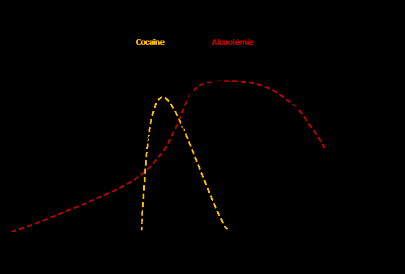
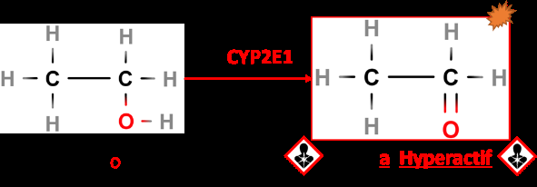
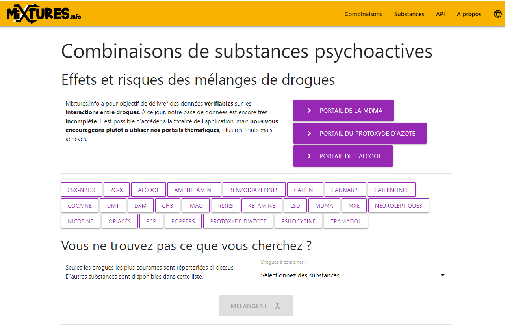
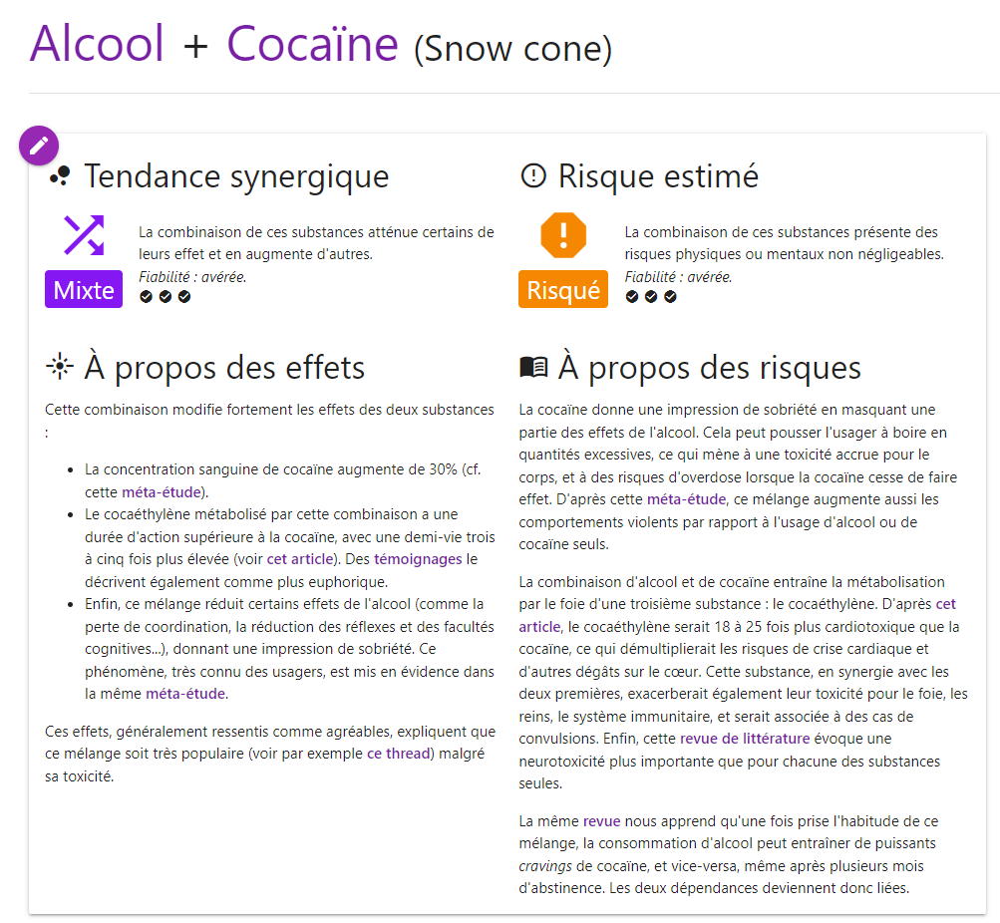
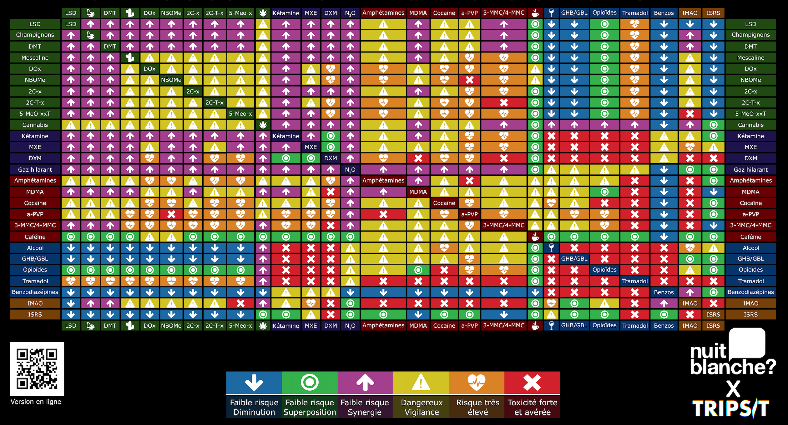
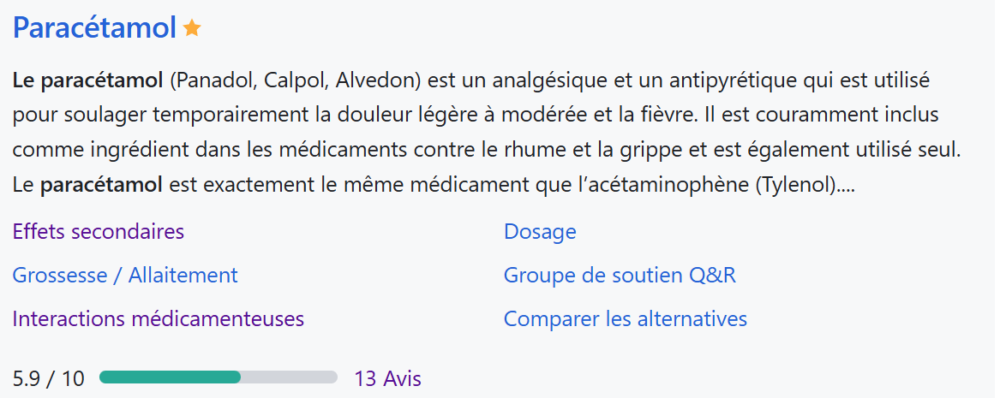
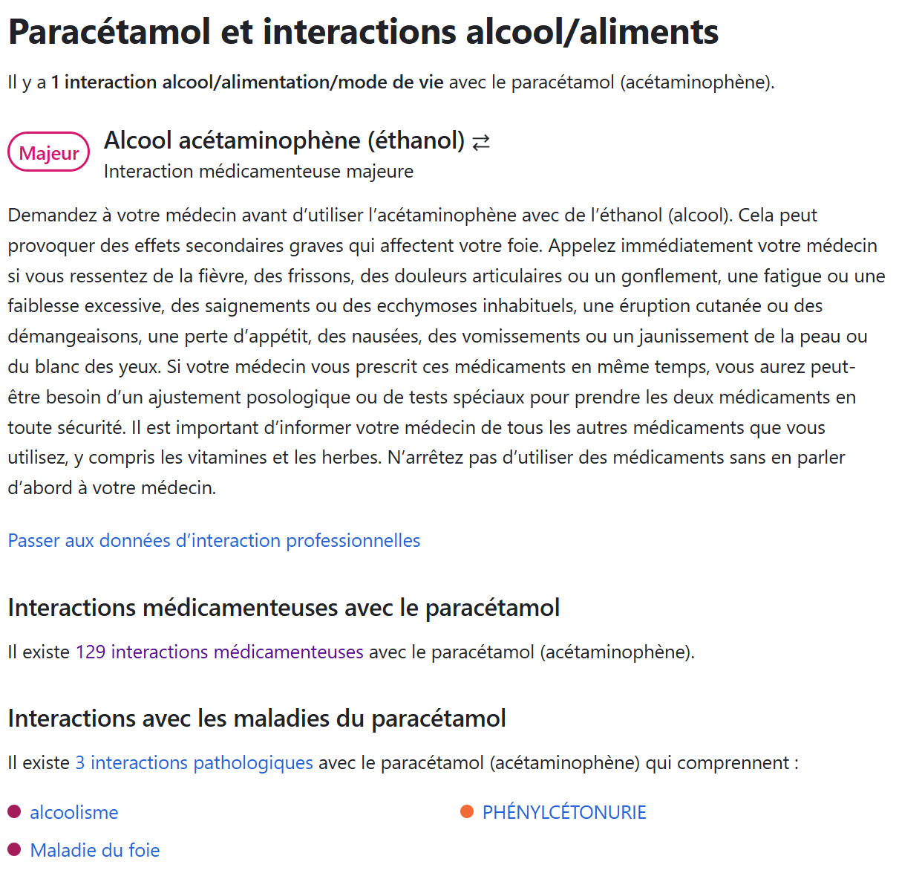
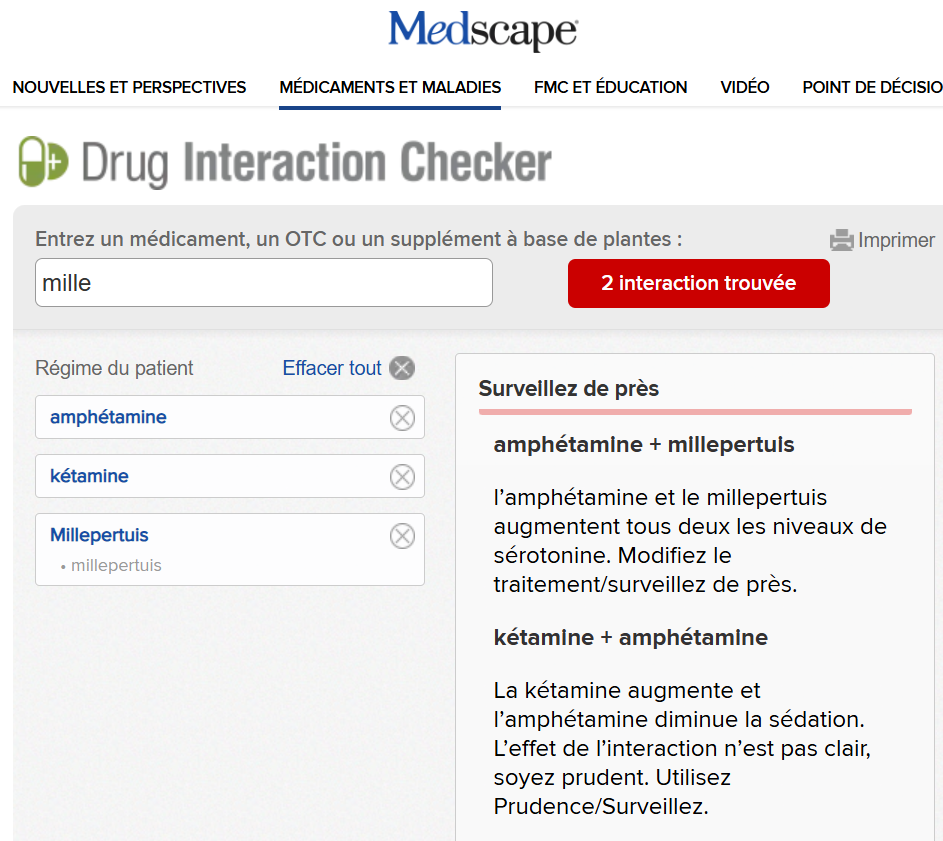

# Interactions et melanges

## Interactions, mélanges

Les médias font souvent les gros
titres avec des décès liés aux drogues en ciblant une substance particulière,
comme la 3MMC ou le GHB. Cependant, lorsqu'on examine ces cas dans les revues
médicales (qui font pour la plupart l’objet de publication scientifique), il
s’avère qu’il s’agit de mélange de substances, sauf pour les opiacés,
responsables à eux seuls de plus de 70% des overdoses mortelles. Or, les
drogues agissent toutes sur le cerveau et le corps. Lorsque l’on prend une
drogue A avec une drogue B, elles interagissent et il devient difficile de
considérer qu’une seule est responsable de la mort. Ce phénomène s’appelle la polyconsommation .
Par exemple, les associations tabac + cannabis + alcool ou encore cocaïne
+ alcool sont fréquentes.

En général, l’alcool est une
sorte de base, la première substance consommée, à laquelle s’ajoutent les
autres. Comme indiqué dans la classification des risques par interaction,
l’alcool est la drogue qui a le plus d’interactions. À cela s’ajoutent les interactions
avec les aliments et les médicaments. Les interactions sont donc très
fréquentes et représentent l’un des risques majeurs de la consommation de
substances.

En réduction des risques, une des
priorités doit être la sensibilisation aux interactions. Pour bien comprendre
les interactions, il est important d’avoir lu la partie sur le métabolisme des
drogues.

Il
est également important de comprendre que ces interactions ne se limitent pas
aux substances psychoactives. Les aliments, les huiles essentielles,
compléments alimentaires et les médicaments peuvent aussi jouer un rôle,
influençant l’absorption, la métabolisation ou l’élimination des drogues
consommées.

Les interactions sont
donc quasiment systématiques lors d’une consommation. Mais certaines sont
plus nocives que d’autres : il faut s’informer

### Exemple de l’alcool

Il est connu qu’il ne faut pas prendre de l’alcool avec des
médicaments. Le tableau ci-après en présente les raisons [370] .

| Type de médicament/drogue | Mécanisme | Effet |
| --- | --- | --- |
| Antibiotique | Réduit l’activité de l’ALDH | Augmentation de la concentration en Ethanal. Effet   désagréable avec des consommations faibles |
| Antidépresseurs   de type ISRS (prozac/fluoxétine) | Non connu | Une étude [371]   montre des effets négatifs avec ce mélange |
| Antidépresseur IMAO | Interaction avec la tyramine du vin rouge | Élévation BRUTALE de la pression sanguine |
| Antihistaminique   de première génération (mal des transports notamment) | Synergie d’effet   sédatif | Sédation importante |
| Antihistaminique de deuxième génération (utilisé pour les   troubles gastrique) | Réduit l’activité de l’ADH | Augmentation de l’alcoolémie |
| AINS   (ibuprofène) | ? | Augmente le risque   d’ulcère |
| Aspirine | Possible réduction de la métabolisation de l’alcool | Alcoolémie plus importante |
| Benzodiazépine   (valium, alprazolam, diazépam, etc) | -effets similaires   -élimination par   cytochrome (concurrence pour l’élimination) | -Synergie des effets   -Élimination plus longue |
| Opiacés (codéine, morphine etc) | -effets similaires   -élimination par cytochrome (concurrence pour   l’élimination) | -Synergie des effets   -Élimination plus longue |
| Paracétamol | L’alcool augmente   la quantité de CYP2E1 qui transforme le paracétamol en molécule très toxique   pour le foie [372] | Augmentation importante de la toxicité   pour le foie |
| MDMA | L’alcool dérégule le contrôle de température et la MDMA   l’augmente | Risque d’Hyperthermie supérieur aux deux   substances seules [373] |
| Cocaïne | L’alcool et la   cocaïne fusionnent pour créer du cocaéthylène | Le cocaéthylène est hallucinogène et augmente   le risque de crise cardiaque |

Tableau 38.
Exemples d'interaction avec l'alcool

Le tableau illustre la diversité des mécanismes
d’interaction possibles , rendant difficile leur anticipation par une simple
analyse individuelle de chaque substance.

Cette partie explore les principaux mécanismes pour mieux
les comprendre et inclut également les interactions avec les aliments. Quelques
notions clés peuvent être dégagées de l’explication des mécanismes, et une
méthode d’analyse est proposée.

Cependant, l’élément central de cette section reste la
présentation des outils de réduction des risques (RDR), exposés en fin de
partie.

Avec notamment un site spécialisé dédié aux mélanges ainsi
qu’une cartographie déjà développée pour faciliter l’évaluation des
interactions entre drogues et médicaments.

### Modes d’interaction

Deux grands types d’interactions existent : les
interactions pharmacodynamiques et les interactions pharmacocinétiques .

Les interactions pharmacodynamiques concernent les
effets des substances au niveau de leur site d’action, sans modifier leur
parcours dans l’organisme. (Exemple : synergie alcool + benzodiazépines
qui vont se compléter pour multiplier les effets).

Les interactions pharmacocinétiques , en revanche,
touchent le devenir des substances dans le corps : absorption, distribution,
métabolisme ou élimination. (Exemple : lors de la métabolisation d’un
mélange alcool et cocaïne, du cocaéthylène qui est hallucinogène et toxique
pour le cœur va être produit)

#### Interactions pharmacodynamiques

Les interactions pharmacodynamiques peuvent être comparées à
des substances qui, une fois présentes ensemble dans l’organisme, collaborent,
s’additionnent ou s’opposent pour produire un effet final. Ces interactions
sont indépendantes de la manière dont les substances se déplacent dans le corps
(pharmacocinétique) et concernent uniquement leurs effets au niveau des
sites d’action . :

Le tableau suivant présente les principaux types
d’interactions pharmacodynamiques, avec leurs définitions, exemples et
mécanismes sous-jacents :

| Type d’interaction | Définition | Formule | Exemple | Mécanisme |
| --- | --- | --- | --- | --- |
| Synergie additive | L’effet total est égal à la somme des effets des deux substances. | E = A + B | Morphine + oxycodone   : augmentation conjointe de l’effet analgésique | Addition (même mécanisme) ou Sommation (mécanismes différents). |
| Synergie   renforçatrice | L’effet total est   supérieur à la somme des effets des deux substances. | E > A + B | Alcool + diazépam   (Valium®) : sédation et dépression respiratoire amplifiées | Potentialisation des   effets au site d’action. |
| Antagonisme compétitif | Une entre en compétition réduisant ou annulant son effet partiellement   ou totalement. | E = A - B | Naloxone + morphine   : la naloxone bloque les effets opioïdes de la morphine | Compétition sur les mêmes récepteurs. |
| Antagonisme non   compétitif | Une substance agit sur   un site différent pour produire un effet opposé. | E = A - B | Cannabis +   Amphétamine : Amphétamine stimule système nerveux, cannabis dépresseur | Action inverse sur un   autre site biologique. |
| Antagonisme partiel | Neutralisation partielle des effets d’une substance. | 0<E<A | Insuline + adrénaline   : l’insuline diminue l’hyperglycémie sans agir sur les autres effets | Neutralisation d’un effet spécifique. |
| Antagonisme total | Neutralisation complète   des effets d’une substance, indépendamment de sa concentration, par blocage   irréversible | E = 0 | Flumazénil +   benzodiazépines : Le flumazénil bloque entièrement les effets sédatifs   des benzodiazépines sur les récepteurs GABA-A. | Blocage complet des   actions. |
| Inversion d’action | Une substance provoque un effet inverse à celui attendu. | E = -A | Adrénaline + alcaloïdes de l’ergot : l’adrénaline provoque une hypotension au lieu d’une   hypertension | Modification de la réponse biologique. |

Tableau 39. Interactions pharmacodynamiques

##### Le risque d’overdose

La synergie renforçatrice est particulièrement dangereuse.
Dans ce type d’interaction, les effets de deux substances s’amplifient,
produisant un résultat plus puissant que la simple addition des effets
individuels.

Exemple typique : l’association alcool + benzodiazépines

Pris ensemble, ces effets se potentialisent ,
augmentant le risque de dépression respiratoire , de coma, voire de
décès. Ce danger est d’autant plus insidieux que les consommateurs peuvent
sous-estimer l’intensité finale des effets ressentis.

##### L’effet rebond

À l’inverse des synergies, certaines substances s’opposent
l’une à l’autre en bloquant ou masquant partiellement leurs effets respectifs.
C’est ce qu’on appelle l’antagonisme . Si cette interaction peut sembler
bénéfique dans un contexte médical (comme l’utilisation d’antidotes), elle
présente néanmoins des risques importants, notamment le phénomène de rebond .

L’effet rebond survient lorsque l’une des substances
(souvent un antagoniste) a une durée d’action plus courte que l’autre.
Une fois cette première substance éliminée, les effets de la seconde,
jusqu’alors masqués, reviennent brutalement , parfois de manière
amplifiée.

Exemple concret : l’association alcool + cocaïne

Cette combinaison est fréquente, notamment en contexte festif. Généralement, la
consommation d’alcool commence progressivement au début de la soirée, puis la
cocaïne est ajoutée plus tard, lorsque la fatigue ou les effets de l’alcool
commencent à se faire sentir.

Ce phénomène de rebond peut entraîner des
comportements à risque, une surconsommation d’alcool ou même une intoxication
sévère, car les effets dépressifs sont retardés mais pas annulés.

<figure class="doc-figure">
  
  <figcaption>Tableau 40. Illustration de l'effet rebond (alcool et cocaïne).</figcaption>
</figure>

##### Les antidotes

Les interactions peuvent être rechercher dans le cadre des
intoxications. Les antidotes exploitent ce principe pour neutraliser les
effets des substances toxiques en agissant directement sur leur site d’action.

Quelques exemples d’utilisation thérapeutique :

Ces antidotes doivent être administrés avec précaution, car
dans certains cas, leur neutralisation peut être temporaire ou partielle,
nécessitant un suivi médical constant.

##### Conclusion

Les interactions pharmacodynamiques, qu’elles soient synergiques
ou antagonistes , ne sont jamais sans conséquence. Une simple combinaison
de substances peut transformer un usage jugé « acceptable » en une situation
d’urgence médicale. Comprendre ces interactions, anticiper leurs risques et
savoir comment les gérer (comme l’utilisation des antidotes) est essentiel pour
prévenir les complications graves liées à la polyconsommation.

Les
substances peuvent se potentialiser et une dose acceptable peut devenir dangereuse.

Les substances qui
s’annulent peuvent aussi être dangereuses : c’est l’effet rebond.

Dans les deux cas : TOUJOURS
DIMINUER LES DOSES EN CAS DE MELANGES

#### Interactions pharmacocinétiques

Les interactions pharmacocinétiques concernent la façon dont
une substance est influencée par une autre lorsqu’elle est absorbée,
distribuée, métabolisée et excrétée par l’organisme.

Pour mieux comprendre ces interactions, il est utile de se
représenter le corps comme une série d’étapes par lesquelles passent les
substances, depuis leur entrée jusqu’à leur sortie.

L’idée principale à retenir est que le corps tente de
gérer simultanément les deux substances, mais celles-ci peuvent entrer en
concurrence . L’une d’elles peut monopoliser les systèmes d’élimination de
l’organisme, laissant l’autre libre de circuler.

À l’inverse, le corps peut s’adapter en augmentant la
production d’enzymes de dégradation, ce qui entraîne une élimination beaucoup
plus rapide des molécules.

##### Interactions dans l’absorption

Avant de parvenir dans la circulation sanguine, une
substance doit être absorbée, généralement au niveau de l’estomac ou de
l’intestin [374] .

Ce processus dépend de plusieurs facteurs, tels que le temps
de transit dans le tube digestif, le pH (acidité) local et la présence d’autres
composés. Ces interactions peuvent modifier la rapidité, l’efficacité ou
l’intensité de l’effet d’une substance. Ci-après un tableau illustrant des
interactions dans l’absorption.

| Substance/Interaction | Mécanisme | Conséquences potentielles |
| --- | --- | --- |
| Cannabis et vitesse de vidange gastrique | Ralentit la vidange gastrique, retardant l’arrivée des substances dans   l’intestin. | Retard de l’absorption des médicaments à action rapide, modifiant leur   efficacité. |
| Calcium (produits   laitiers) et tétracyclines | Le calcium se lie aux   tétracyclines, formant des complexes non absorbables. | Diminution de   l’absorption des tétracyclines, réduisant leur efficacité contre l’infection. |
| Alcool et érythromycine (antibiotique) | Irritation de la muqueuse gastrique et accélération du transit   intestinal. | Temps d’absorption réduit, diminuant potentiellement l’efficacité de   l’érythromycine. |
| MDMA et caféine | La caféine augmente la   motilité gastro-intestinale, accélérant l’absorption. | Absorption plus rapide   et plus complète de la MDMA, amplifiant les effets et les risques. |
| Antiacides (ex. oméprazole) et médicaments acides | Élévation du pH gastrique, diminuant la fraction non ionisée des   médicaments acides faibles. | Diminution de l’absorption des médicaments comme l’aspirine, réduisant   leur efficacité thérapeutique. |
| Pansements gastriques et médicaments oraux | Création d’une barrière physique tapissant la muqueuse   gastro-intestinale. | Blocage partiel ou total de l’absorption des médicaments, entraînant   une inefficacité thérapeutique. |
| Ralentisseurs du transit (ex. lopéramide) | Augmentation du temps de contact entre le médicament et la paroi   intestinale. | Absorption accrue des médicaments, augmentant leur   concentration sanguine et le risque de toxicité. |

Tableau 41.
Exemple d'interaction lors de l'absorption

Même si les interactions au niveau de l’absorption sont
identifiées, ces informations restent insuffisantes pour aboutir à une
conclusion définitive. C’est pourquoi le tableau indique les « conséquences
potentielles » plutôt que des certitudes.

Prenons l’exemple de l’alcool et des antibiotiques :
l’interaction au niveau de l’absorption peut réduire l’efficacité de
l’antibiotique, en limitant sa concentration dans la circulation sanguine.
Cependant, des interactions au niveau du métabolisme peuvent également se
produire, l’alcool peut occuper les enzymes qui dégrade les médicaments et les
drogues, et l’antibiotique peut donc être libre d’agir plus longtemps.

Il est complexe de prédire à l’avance laquelle de ces
interactions, absorption ou métabolisme, prédominera et influencera le plus
l’efficacité du traitement. C’est pourquoi l’étude des interactions
médicamenteuses nécessite des recherches spécifiques et approfondies,
s’appuyant sur des publications scientifiques rigoureuses.

##### Interactions dans la distribution

Une fois absorbées, les substances circulent dans le sang et
se lient souvent à des protéines, un peu comme des passagers prenant place dans
un véhicule. Ces « places » (sites de liaison) ne sont pas infinies.

Quand deux substances se disputent les mêmes sites, l’une
peut « éjecter » l’autre et augmenter sa part libre dans le sang, modifiant
ainsi son effet.

Par exemple, la warfarine (un anticoagulant) et l’aspirine
peuvent se concurrencer pour les mêmes sites de liaison. Résultat : la
warfarine se retrouve plus libre, ce qui augmente son effet anticoagulant et le
risque de saignement.

##### Interactions dans le métabolisme

Ces interactions sont les plus fréquentes et sont complexes.

###### Abondance des CYP450

Le métabolisme est l’étape où l’organisme transforme une
substance, souvent grâce à des enzymes (principalement dans le foie) qui
agissent comme de petits « ouvriers chimiques ». Ces enzymes découpent,
modifient et rendent souvent les substances plus facilement éliminables. L’un
des groupes d’enzymes les plus importants est celui des cytochromes P450 [375]
(CYP), avec des membres comme CYP3A4, CYP2D6, CYP2E1, etc.

Les variations génétiques dans les gènes des cytochromes
P450, connues sous le nom de polymorphisme génétique, peuvent affecter la
quantité et manière dont chaque individu métabolise les drogues.

| Type | Abondance foie (%) | Rôle dans le métabolisme des   médicaments |
| --- | --- | --- |
| CYP3A4/5 | 15-38% | Métabolise environ 30% des   médicaments . Cible majeure pour les interactions. |
| CYP2D6 | 2-5% | Métabolise environ 20% des médicaments , notamment   les antidépresseurs et analgésiques. |
| CYP2C9 | 5-30% | Impliqué dans le métabolisme des   AINS et des anticoagulants . |
| CYP1A2 | 5-15% | Impacté par le tabac et certains antidépresseurs. |
| CYP2E1 | 5-15% | Participe   au métabolisme de l’alcool et le paracétamol. |

Tableau 42. Répartition des CYP dans le foie humain et rôle
dans la métabolisation des médicaments [376]

Plusieurs points peuvent être dégagés de ce tableau :

Le
métabolisme varie d’une personne à l’autre. NOUS NE SOMME PAS EGAUX

Une majorité des médicaments
et des drogues utilisent les mêmes CYP : IL Y A DONC PRESQUE TOUJOURS
INTERACTION

Ces interactions peuvent être de deux types :

·
 L’inhibition enzymatique : une des deux substances « bloque »
les enzymes,

·
 L’induction enzymatique : une des deux substances « augmente »
les enzymes.

###### Inhibition enzymatique : exemple du pamplemousse

L’inhibition enzymatique désigne le processus par lequel une
substance (médicament, aliment ou drogue) bloque le fonctionnement ou
monopolise une enzyme de dégradation.

Lorsque ces enzymes sont inhibées, la dégradation des
substances dépendantes ralentit, ce qui peut augmenter leur concentration dans
le sang. Cette situation peut amplifier leurs effets ou conduire à des effets
indésirables graves, comme une toxicité ou des surdoses. C’est le cas du
pamplemousse [377] .

Le pamplemousse contient des composés appelés furanocoumarines ,
qui inhibent durablement l’enzyme CYP3A4, présente principalement dans
l’intestin et le foie. Cette enzyme est impliquée dans le métabolisme d’environ
50 % des médicaments. En la bloquant, le pamplemousse empêche ces médicaments
d’être dégradés à leur rythme habituel, ce qui prolonge leur présence dans le
sang et augmente leur concentration.

La félodipine [378] ,
un antihypertenseur, est un exemple emblématique de médicament fortement
influencé par le CYP3A4.

Habituellement, après ingestion orale, seule une petite
fraction (15 %- c’est la biodisponibilité abordée en partie 1) de la dose
atteint la circulation sanguine, le reste étant métabolisé par le CYP3A4 dans
l’intestin et le foie, mais l’ingestion de pamplemousse empêche sa dégradation
et la concentration augmente dans ces proportions :

·
 Un verre de 200-250 ml de jus bu 4 heures avant la prise de
félodipine peut multiplier par 4 la concentration sanguine du médicament.

Cette augmentation significative expose le patient à un
risque de surdosage, se manifestant par des effets secondaires tels qu’une
hypotension excessive ou des maux de tête.

Un autre exemple d’inhibition enzymatique est l’Ayahuasca.

L’ayahuasca, un mélange contenant de la DMT et des IMAO
(inhibiteurs de monoamine-oxydase) , bloque l’enzyme qui dégrade la DMT.
Cela permet à la DMT d’être active par voie orale, augmentant sa
biodisponibilité et sa durée d’action.

| Substance ou aliment | Enzyme cible | Mécanisme   d’inhibition | Conséquences   principales | Exemples de   médicaments concernés |
| --- | --- | --- | --- | --- |
| Pamplemousse | CYP3A4 | Les furanocoumarines neutralisent de manière irréversible le CYP3A4   dans l’intestin et le foie. | Augmentation des concentrations plasmatiques, risque de surdosage. | Félodipine, simvastatine, ciclosporine, amiodarone |
| Ayahuasca (IMAO +   DMT) | Monoamine-oxydase (MAO) | Les inhibiteurs de MAO   bloquent la dégradation des monoamines, comme la DMT. | Prolongation des effets   psychoactifs et risque de syndrome sérotoninergique en cas d’association avec   d’autres substances. | DMT |
| Clarithromycine | CYP3A4 | La clarithromycine inhibe le CYP3A4, augmentant la concentration des   médicaments métabolisés par cette enzyme. | Risque de toxicité médicamenteuse accrue. | Benzodiazépines, statines |

Tableau 43.
Exemples d'interactions par inhibition d'enzymes

###### Induction enzymatique

Exemple de l’alcool et du paracétamol (CYP2E1)

L’induction enzymatique est le mécanisme
inverse : la substance A stimule la production ou l’activité de l’enzyme,
accélérant la dégradation de la substance B et réduisant ses concentrations dans
le sang.

Cela va être le cas avec l’alcool. Globalement, l’alcool est
en majorité métabolisé par deux enzymes spécialisées : l’ADH et l’ALD. Mais
il y a aussi les CYP2E1.

<figure class="doc-figure">
  
  <figcaption>Figure 55. Métabolisation de l'alcool par les cytochromes.</figcaption>
</figure>

Cette dernière voie est problématique car elle produit des
formes d’éthanal hyper réactifs (radicalaires) qui conduisent à la perturbation
des membranes cellulaires, dénaturation de certaines protéines, des mutations
de l’ADN (mécanisme pouvant provoquer le cancer) et la mort des cellules du
foie.

Il s’avère que l’on retrouve des CYP2E1 dans le cerveau [379] , cette
voie de métabolisation participe à la neurotoxicité de l’alcool.

Il existe un stock de CYP2E1 dans l’organisme, si un
médicament et de l’alcool sont consommés en même temps, ils vont se faire
concurrence. Il y a inhibition enzymatique. C’est dangereux car le médicament
va rester plus longtemps dans l’organisme (qui est occupé a détoxifier
l’alcool) et la concentration maximale du médicament peut être plus importante.

Après avoir été beaucoup sollicité, le corps va anticiper
et créer une plus grande quantité de ce cytochrome . Lors de la prochaine
consommation, le corps aura plus de réserve et métabolisera plus vite c’est
l’induction enzymatique, donc les effets seront moins fort. L’induction
enzymatique va augmenter la tolérance à l’alcool, mais également sa toxicité
(en augmentant la quantité d’alcool métabolisé par les CYP2E1) !

Les buveurs réguliers peuvent présenter jusqu’à 10 fois plus [380] de CYP2E1,
et une consommation simple augmente suffit à créer une induction enzymatique.

En plus d’augmenter la toxicité de l’alcool, cette induction
enzymatique va rendre problématique la consommation de certains médicaments.

Lorsque le paracétamol agit avec le CYP2E1 un produit
toxique est créer (le NAPQI) [381] .
 En temps normal, c’est-à-dire sans induction enzymatique de l’alcool, le
paracétamol est peu métabolisé par le CYP2E1.

Donc, lors d’une consommation régulière d’alcool ou d’une
consommation importante, la quantité de CYP2E1 augmente, en cas de prise de
paracétamol il y a un risque de nécrose hépatique plus important .

La
consommation importante ou chronique d’alcool peut rendre toxique la prise de
paracétamol et d’autre médicaments. Il ne faut pas prendre de paracétamol
les lendemains de fêtes.

La consommation d’alcool
de façon chronique multiplie la toxicité et ne l’additionne pas sur l’ensemble
des organes (foie, cerveau etc).

Exemple des fumées (CYP1A2)

Les fumées, qu’elles proviennent du tabac, du cannabis
ou même du bois, contiennent des hydrocarbures aromatiques polycycliques (HAP).
Ces produits se forment lors de la combustion qui est une réaction chimique
très violente et incomplète. Ces HAP entrainent une augmentation importante du
CYP1A2, ce qui accélère la dégradation de certaines substances (et donc
l’efficacité), tels que [382]
:

·
 La théophylline, utilisée dans le traitement de l'asthme ;

·
 La Clozapine, utilisé en psychiatrie ;

·
 La Flovoxamine, utilisé comme antidepresseur,

·
 La caféine.

Lorsqu’un fumeur a besoin de prendre un antidépresseur, le
médecin ajuste généralement la dose du médicament en tenant compte du fait que
le tabac induit l’activité de l’enzyme CYP1A2. En raison de cette induction,
l’organisme du fumeur métabolise le médicament plus rapidement, ce qui
nécessite souvent une dose plus élevée pour obtenir le même effet thérapeutique
qu’un non-fumeur.

Cependant, si le patient arrête de fumer brusquement ,
l'induction du CYP1A2 disparaît rapidement. Cela signifie que l’enzyme devient
moins active, ralentissant le métabolisme du médicament . En conséquence, la
concentration de l’antidépresseur dans le sang peut augmenter de manière
significative , rendant le médicament beaucoup plus efficace, mais également
plus susceptible de provoquer des effets secondaires ou des signes de
surdosage, tels que somnolence, agitation ou autres symptômes indésirables.

C’est pourquoi il est essentiel que le patient informe son
médecin de tout changement dans sa consommation de tabac. Le médecin pourra
alors ajuster progressivement la dose de l’antidépresseur afin de maintenir un
traitement sûr et efficace, en évitant une exposition excessive au médicament
après l’arrêt du tabac.

La caféine est également métabolisée principalement
par le CYP1A2. Sous l'effet de l'induction enzymatique due au tabac, la caféine
est éliminée plus rapidement. En revanche, chez une personne ayant arrêté de
fumer, son métabolisme ralentit, ce qui peut entraîner « un shot » de
caféine dans l'organisme.

Par ailleurs, la caféine est souvent utilisée comme marqueur
pour évaluer l'activité de l'enzyme CYP1A2 dans un cadre clinique ou de
recherche (Perera et al., 2012).

Arrêter
de fumer (même en passant à la cigarette électronique) change le
métabolisme : il faut en parler à un médecin

Exemple du Millepertuis (CYP3A4)

Le millepertuis (Hypericum perforatum), également connu sous
le nom de St. John's Wort ou iperico en espagnol, est une plante qui a le même
mécanisme d’action que les antidepresseurs ISRS (comme la fluoxetine) [383] .
Il est beaucoup utilisé en naturopathie et est en vente libre.

C’est aussi un inducteur bien connu de plusieurs cytochromes,
principalement CYP3A4 mais pas uniquement. Or, le CYP3A4 est largement utilisé
par l’organisme pour beaucoup de médicaments et le millepertuis fait l’objet
d’alertes régulière en santé publique [384] .

La liste d’interactions est particulièrement longue [385] :

·
 Psychotropes : Antidépresseurs, anxiolytiques (ex. clozapine,
buspirone).

·
 Immunosuppresseurs : Ciclosporine, tacrolimus.

·
 Antirétroviraux : Ritonavir, efavirenz.

·
 Contraceptifs : Estradiol, éthinylestradiol.

·
 Anticoagulants : Warfarine.

·
 Cytotoxiques : Cyclophosphamide, irinotécan.

·
 Cardiologie : Digoxine, vérapamil.

Il est également utilisé en médicament à base de plantes
pour le traitement à court terme des symptômes dépressifs légers [386] .

L’induction enzymatique par le millepertuis ne se manifeste
pas immédiatement. Quelques jours après le début de la prise, une augmentation
progressive de l’activité enzymatique est observée. De plus, cet effet persiste
environ une semaine après l’arrêt du millepertuis, nécessitant une attention
particulière lors de l’interruption du traitement.

Les
produits naturels peuvent également causer des interactions !

Les patients qui prennent des médicaments, avec ou sans
ordonnance, doivent consulter un médecin ou un pharmacien avant de prendre du
millepertuis.

##### Interactions dans l’élimination

L’excrétion est la dernière étape du métabolisme des
substances dans l’organisme. Elle correspond à l'élimination des métabolites ou
des substances inchangées, principalement par les reins (voie urinaire) ou le
foie (voie biliaire). Ce processus est réglementé par différentes protéines et
enzymes spécialisées, comme les glycoprotéines P (P-gp) et les
UDP-glucuronosyltransférases (UGT). Ces mécanismes peuvent être modulés par des
interactions avec des médicaments, drogues ou compléments alimentaires, influençant
ainsi la durée et l’intensité des effets d’une substance.

###### Rôle des glycoprotéines P dans l’élimination

Les glycoprotéines P, aussi appelées transporteurs d’efflux,
sont des protéines présentes dans plusieurs tissus, notamment dans la barrière
intestinale, le foie, les reins et la barrière hémato-encéphalique. Leur rôle
principal est de pomper les substances étrangères (xénobiotiques) hors des
cellules pour favoriser leur élimination.

Certaines substances peuvent inhiber ou induire ces
transporteurs, modifiant ainsi l’élimination des médicaments ou drogues.

###### UDP-glucuronosyltransférases (UGT) et conjugaison

Les UGT sont des enzymes de phase II qui jouent un rôle clé
dans la conjugaison des substances, les rendant plus hydrosolubles pour
faciliter leur élimination par voie urinaire ou biliaire. Elles ajoutent un
groupement glucuronide aux métabolites. Voici quelques exemples :

###### Interaction rénale

Une fois les produits suffisamment solubles, ils doivent être
éliminé par le rein. Trois processus principaux interviennent :

Un exemple est la consommation de MDMA avec des aliments
qui réduisent le pH de l’urine [391] .
La MDMA est une base faible dont l'élimination rénale dépend du pH urinaire. Un
pH urinaire alcalin (supérieur à 7) réduit l'excrétion de la MDMA, prolongeant
ainsi sa présence dans l'organisme et augmentant le risque de toxicité.
Certains compléments alimentaires, notamment ceux contenant des citrates de
minéraux tels que le magnésium, le potassium ou le zinc, peuvent alcaliniser
l'urine.

### Outils d’aide

Certaines associations ont
développé des outils d’aide centrés sur les drogues courantes. Par exemple, le
site mixtures.info fournit des informations détaillées sur les
interactions possibles entre substances, leurs risques et leurs effets.

Plus rapide et opérationnel, un tableau interactif,
développé par l’association TripSit et repris par Nuit Blanche, permet
d’évaluer rapidement le niveau de risque d’un mélange envisagé, grâce à un code
couleur intuitif.

Ces outils offrent une première estimation précieuse des dangers
liés à la consommation combinée de drogues.

Par ailleurs, deux autres ressources permettent de mieux
comprendre les interactions avec des médicaments ou des plantes :

·
 Drugs.com : un outil conçu pour identifier les
interactions avec les médicaments. Détenu et exploité par le Drugsite Trust,
une fiducie privée administrée par deux pharmaciens néo-zélandais, Karen Ann et
Phillip James Thornton. Le site n'est affilié à aucune entreprise
pharmaceutique, ce qui garantit son indépendance éditoriale.

·
 Medscape : une base de données qui inclut également les
interactions entre médicaments et plantes médicinales. Medscape,
y compris son outil "Drug Interaction Checker", est une filiale de
WebMD, une entreprise privée américaine spécialisée dans l'information médicale
en ligne.

Ces plateformes offrent une base informative utile pour
évaluer les risques et guider les décisions, bien qu’il soit toujours
recommandé de consulter un professionnel de santé pour des conseils adaptés et
fiables.

#### Le site Mixtures.info

Le site Mixtures.info est une source de connaissances
collaboratives sur les mélanges de substances, couvrant à la fois les effets
ressentis et les risques potentiels. Fournissant des informations rigoureuses
et détaillées, le site s'appuie sur des sources fiables pour fournir des
connaissances précises et actualisées aux utilisateurs.

<figure class="doc-figure">
  
  <figcaption>Figure 56. Page d'accueil Mixtures.info.</figcaption>
</figure>

<figure class="doc-figure">
  
  <figcaption>Figure 57. Exemple du mélange cocaïne et alcool.</figcaption>
</figure>

Aucune fiche ne pourra être exhaustive, mais pour les
mélanges les plus courants mixtures.info permets d’avoir les principales
informations pour comprendre les risques.

#### Le tableau croisé

L’association tripsit [392] ,
a réalisé un tableau pour estimer rapidement les impacts d’un mélange de
substance sur la base des connaissances actuelles (Janvier 2023). L’association
Nuit Blanche a complété et amélioré ce tableau.

L'information n'est destinée qu'à un aperçu rapide et une
référence, et il est nécessaire pour les utilisateurs de mener une recherche
plus approfondie avant de prendre une décision. Voici quelques pistes de
recherches (non exhaustive) :

- Quel est le mécanisme sur le cerveau des deux
substances ?

- Par quel moyen elles sont métabolisées ?

- Quelles sont leur classification en termes
d’effet ? (Dépresseur, perturbateur, stimulants, neuroleptique)

- Est ce qu’il existe des études sur ce mélange en
particulier ?

Pour aller plus loin, sur le site de Tripsit, le détail
des risques pour chaque combinaison est précisé. Il y a également une
application mobile.

|  | Les effets ressentis   sont plutôt soustractifs .   La combinaison est   peu susceptible de causer une réaction indésirable en dehors de celles qui   pourraient être attendues pour les substances prises seules. | Alcool + Champignon |
| --- | --- | --- |
|  | Les effets ressentis   sont plutôt additifs .   La combinaison est   peu susceptible de causer une réaction indésirable en dehors de celles qui   pourraient être attendues pour les substances prises seules. | Café + Cannabis |
|  | Il y a une synergie : l’effet ressenti est supérieur   à la somme des effets des deux substances prises individuellement.   Ils ne sont pas   susceptibles de causer une réaction indésirable lorsqu'ils sont utilisés avec   précaution. Il est toujours nécessaire d’effectuer des recherches   supplémentaires avant de combiner ces produits | Alcool + Cannabis |
|  | Les effets synergiques peuvent être imprévisibles.   Ces combinaisons ne   sont généralement pas physiquement nocives, mais peuvent produire des effets   indésirables (incommodités, nausées etc.). Une utilisation extrême peut   causer des problèmes de santé physique. Il convient de faire attention lors   du choix d'utiliser cette combinaison. | Alcool + protoxyde   d’azote |
|  | Il existe un RISQUE IMPORTANT   pour la santé lors de la prise de ces combinaisons, il faut les   éviter. | Alcool + cocaïne |
|  | Les réactions à ces   mélanges sont très imprévisibles.   Ces combinaisons   sont considérées EXTREMEMENT TOXIQUE et doivent toujours être évitées. | Alcool + Tramadol |

Tableau 44.Niveau de risque considérés dans le tableau
TripSit & Nuit Blanche

<figure class="doc-figure">
  
  <figcaption>Tableau croisé TripSit et Nuit Blanche des interactions de substances.</figcaption>
</figure>

Pour faciliter la lecture du tableau les drogues sont
classées en familles.

| Perturbateurs | Dissociatifs | Stimulants | Dépresseurs | Antidépresseurs |
| --- | --- | --- | --- | --- |
|  |  |  |  | Ici le terme   antidépresseur fait référence à la dépression et n’a pas de rapport avec les   dépresseurs du système nerveu |

#### Le site Drugs.com

Le site Drugs.com [393]

<figure class="doc-figure">
  
  <figcaption>Capture p. 265. Fiche Drugs.com du paracétamol.</figcaption>
</figure>
permet d’obtenir des informations détaillées sur un médicament et de consulter
la liste de ses interactions. Par exemple, en sélectionnant le paracétamol,
toutes ses caractéristiques sont affichées. Il est également possible de
cliquer sur l’onglet « Drug Interactions » pour accéder à la liste des
interactions connues. Drugs.com permet d’identifier les interactions avec des
médicaments mais est moins détaillé que mixtures.
Bien que le site soit en anglais, il peut être traduit automatiquement à l’aide
du navigateur Edge.

<figure class="doc-figure">
  
  <figcaption>Tableau 45. Exemple d'identification d'interaction paracétamol/alcool sur Drugs.com.</figcaption>
</figure>

#### Le site Medscape interaction checker

Le site Medscape [394]
à l’avantage de contenir les données pour les plantes et compléments
alimentaire mais ne contient pas toutes les drogues.

L’analyse est très succincte et est plutôt orienté sur les
interactions pharmacodynamiques. Par exemple, pour l’interaction alcool et
amphétamine, il est précisé : « L’éthanol augmente et l’amphétamine
diminue la sédation. L’effet de l’interaction n’est pas clair, soyez prudent.
Utilisez Prudence/Surveillez. » sans préciser que ce mélange peut
engendrer une hyperthermie importante.

<figure class="doc-figure">
  
  <figcaption>Figure 58. Extrait du site Medscape pour l'interaction millepertuis/amphétamine/kétamine.</figcaption>
</figure>

### Analyser des interactions

Il est souvent difficile pour un consommateur non spécialisé
de s'informer par lui-même sur les interactions potentielles. Plusieurs
facteurs rendent cette analyse complexe :

Néanmoins beaucoup d’interactions sont connues et décrites
scientifiquement, l’idéal est donc d’utiliser en priorité les outils présentés.

#### Interaction connue

La première étape est de vérifier dans les outils
l’existence de l’interaction recherché. Le tableau ci-après permet d’orienter
vers les outils existants.

| Outil | Rendu de l'outil | À utiliser pour |
| --- | --- | --- |
| Mixtures.info | Fiches explicatives sur les   effets et risques, basées sur des sources scientifiques rigoureuses. | Comprendre les effets , les synergies et les risques des mélanges de drogues   courantes. |
| Tableau tripSit/Nuit   Blanche | Informations rapides et visuelles sur les niveaux de   danger des mélanges. Inclut une application mobile. | Une estimation rapide des dangers avant une   recherche plus approfondie sur un mélange de substances psychoactives. |
| Drugs.com | Liste détaillée des interactions   d’un médicament, avec une classification des niveaux de risque. | Vérifier les interactions   entre médicaments , ou entre médicaments et certaines drogues.   Voir la liste des interactions   pour une substance. |
| Medscape Interaction   Checker | Analyse très succincte des interactions pharmacodynamiques   et possibles précautions. | Identifier les interactions   impliquant des plantes, compléments alimentaires ou médicaments   complexes. |

Tableau 46. Utilisation des outils d'identification des interactions.

Le site Mixtures.info est la ressource la plus
complète pour consulter l'état de l'art scientifique concernant une
interaction. Il fournit des informations détaillées sur les interactions
pharmacodynamiques et pharmacocinétiques connues. Si l’interaction recherchée
n’y est pas décrite, il est conseillé de consulter le tableau interactif de
TripSit/Nuit Blanche , qui permet d’évaluer rapidement, mais de manière
approximative, le niveau de risque d’un mélange envisagé.

Si l’interaction concerne un médicament, le site Drugs.com
constitue une référence utile pour obtenir une liste détaillée des interactions
connues et leur classification en termes de risque.

Enfin, si l’interaction implique une plante ou un dérivé, le
site Medscape peut être consulté. Toutefois, il convient de noter que
les analyses y sont succinctes, ce qui limite leur précision et rend parfois
difficile l’établissement de conclusions définitives.

L’utilisation
de mixtures.info doit devenir un reflexe dans le cadre de consommation

#### Interaction inconnue

Il est rare, mais possible, qu’un mélange ne soit pas encore
documenté. Dans ce cas, il est nécessaire d’effectuer des recherches pour
identifier les mécanismes potentiels d’interaction. Cela peut se faire en
consultant la littérature scientifique via des plateformes spécialisées telles
que ScienceDirect [395]
ou PubMed [396] ,
qui regroupent un grand nombre de publications scientifiques.

De plus, il est désormais possible d'utiliser des outils
d’intelligence artificielle spécialisés dans l’analyse de la littérature
scientifique, comme Consensus [397]
ou Scholar GPT [398] .

Ces outils permettent, par exemple, de poser des questions
spécifiques, telles que l’effet cardiaque d’une substance, et d’obtenir une
sélection de publications scientifiques pertinentes sur le sujet. Ces solutions
facilitent l'accès à des informations précises et actualisées.

Pour savoir quoi chercher, une méthode est proposée,
inspirée par l’association Nuit Blanche [399] .
Il est possible de se focaliser sur la toxicité des deux molécules sur les
principaux organes : le cerveau, le foie, le cœur et les reins.

Ces organes sont impliqués soit dans les effets directs des
substances, soit dans leur métabolisation et leur élimination.
