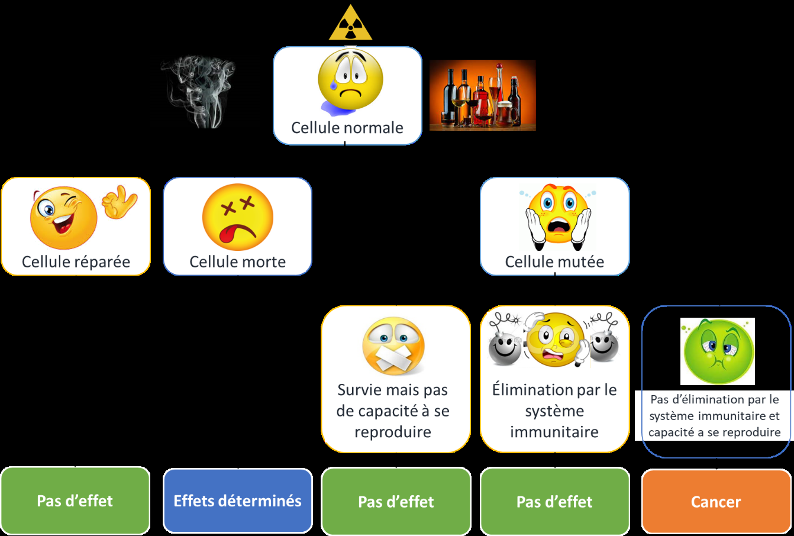
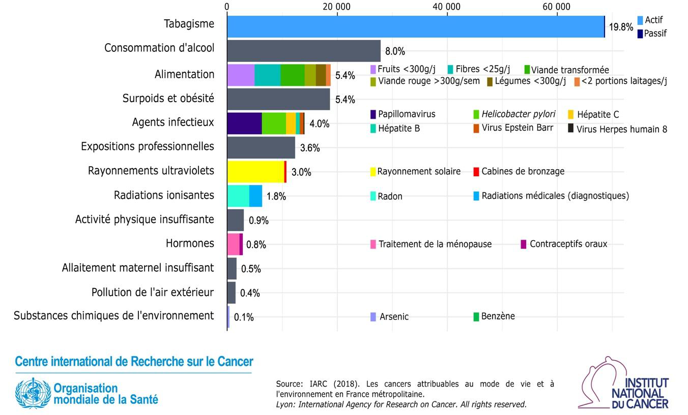

# Cancer

## Cancer

Le cancer est une maladie qui se
développe lorsque des cellules anormales se multiplient de manière incontrôlée
dans le corps. Ces cellules peuvent former une tumeur qui peut être bénigne
(non cancéreuse) ou maligne (cancéreuse). Les tumeurs malignes peuvent envahir
les tissus environnants et se propager à d'autres parties du corps, ce qui peut
entraîner des complications graves.

Il existe plusieurs facteurs de risque qui peuvent augmenter
les chances de développer un cancer, notamment l'utilisation de certaines
drogues, comme celles qui sont fumées ou l'alcool. La fumée de cigarette, par
exemple, est l'un des principaux facteurs de risque de cancer du poumon et de
cancer de la bouche, du larynx et du pharynx. L'alcool est également un facteur
de risque de cancer de la bouche, du larynx, du sein, du pharynx et du foie.

Nous sommes tous concernés de près ou de loin par le cancer,
sans vraiment comprendre ce que c’est. Cette partie fait le tour des notions à
connaître pour comprendre ce que c’est ainsi qu’une première approche pour
mieux estimer les risques.

### Fonctionnement des
cellules

Pour mieux comprendre, commençons par examiner la structure
des cellules. Un organe est composé de tissus constitués de cellules. Chaque
cellule contient un noyau renfermant l'ADN.

[Insérer une image montrant un tissu, une cellule et l'ADN.]

L'ADN agit comme le disque dur et le système d'exploitation
(tels que Windows) de la cellule, déterminant son fonctionnement, comme la
vitesse de reproduction cellulaire.

L'ADN ne peut pas quitter le noyau. Pour cela, des
intermédiaires tels que l'ARN (le même ARN utilisé dans les vaccins contre la
COVID-19) et les protéines sont nécessaires.

Imaginons que l'ADN est un livre de recettes culinaires. Ce
livre contient toutes les instructions requises pour préparer divers plats,
tels que des recettes de pâtes, de gâteaux, etc.

L'ARN (acide ribonucléique) est semblable à un cuisinier qui
lit le livre de recettes et prend en note chaque étape de la préparation. Le
cuisinier ne peut pas préparer le plat seul et a besoin d'aide.

Les protéines représentent les ingrédients nécessaires à la
préparation du plat. Le cuisinier suit les instructions du livre de recettes
pour déterminer quels ingrédients utiliser et comment les assembler. Une fois
les ingrédients prêts, le cuisinier peut commencer à préparer le plat.

Ainsi, l'ADN (le livre de recettes) fournit les instructions
requises, l'ARN (le cuisinier) transmet ces instructions et les protéines (les
ingrédients) sont produites en suivant ces instructions.

#### Approche statistique

<figure class="doc-figure">
  
  <figcaption>Figure p. 328 : dommage cellulaire, réparation, élimination immunitaire ou évolution possible vers un cancer.</figcaption>
</figure>

L'appréciation du risque de cancer s'avère être compliquée.
Pour illustrer cette complexité, prenons l'exemple de l'alcool. À partir d'une
dose spécifique (environ 5g/l pour une personne sans tolérance) un arrêt
respiratoire peut se produire. Cet effet, que l'on qualifie de déterministe,
est associé à une dose plutôt précise malgré une incertitude lié à chaque
personne. Autrement dit, pour certain effets, on peut associer une dose.

Comme le montre le schéma, un dommage à l'ADN induit par un
agent cancérigène peut potentiellement transformer une cellule en cellule
cancéreuse. Néanmoins, il est crucial de comprendre que cela est fondé sur une
probabilité et non sur une certitude. Autrement dit, une personne peut passer
sa vie à consommer de l'alcool sans jamais développer un cancer, et vice versa.
C'est ce que l'on appelle une approche probabiliste.

Pour donner une image, c’est comme le lancement quotidien
d'un dé à plusieurs centaines de faces. Sur certaines faces, il est écrit «
cancer », sur d'autres, « pas de cancer ». Chaque action qui stimule notre
système immunitaire ou qui active nos mécanismes de réparation de l'ADN, comme
faire de l'exercice, ajoute une face supplémentaire marquée « pas de cancer ».
Inversement, chaque exposition à un agent cancérigène entraîne l'ajout d'une
face marquée « cancer ». Ainsi, chaque jour, le sort est jeté lorsque ce dé à
plusieurs faces est lancé.

Revenir sur les cellules

Expliquer que beaucoup de dégradation de l’adn par seconde
(reprendre effet bio)

Plus il y a de défaut adn plus la probabilité d’avoir la
mauvaise mutation est grande.

#### Cas de la combustion

En théorie, toute combustion ( réaction d’un produit avec de
l’oxygène) devrait produire de l'eau et du CO2. Cependant, en réalité, ce n'est
JAMAIS le cas. La fumée provenant de la combustion du tabac, des barbecues, des
narguilés (shishas), des voitures ou des cheminées contiennent TOUTES des
quantités significatives de substances cancérigènes.

Cela est lié au fait que la chaleur produite par la flamme
va engendrée des réactions chimiques violente conduisant à la formation de
molécule qui ont la capacité de s’intercaler dans l’ADN, de l’attaquer, de
diminuer les défenses du corps etc

Toute substance fumée est cancérigène en raison des composés
chimiques nocifs et des mécanismes impliqués dans le processus de combustion et
d'inhalation de la fumée. Voici quelques raisons pour lesquelles les substances
fumées sont considérées comme cancérigènes :

·
 Production de composés chimiques nocifs : Lorsqu'une substance
est brûlée, elle produit de nombreux composés chimiques, dont certains sont
cancérigènes, comme les hydrocarbures aromatiques polycycliques (HAP) et les
nitrosamines. Ces composés peuvent endommager l'ADN des cellules, ce qui
augmente le risque de mutations et de développement du cancer.

·
 Irritation et inflammation des tissus : L'inhalation de la fumée
provoque une irritation et une inflammation des tissus des voies respiratoires,
de la gorge et des poumons. Cette inflammation chronique peut entraîner des
lésions cellulaires et des mutations, ce qui augmente le risque de cancer.

·
 Formation de radicaux libres : La combustion de substances génère
également des radicaux libres, qui sont des molécules hautement réactives. Les
radicaux libres peuvent endommager les cellules et l'ADN, ce qui peut provoquer
des mutations et augmenter le risque de cancer.

·
 Diminution de la fonction de nettoyage des voies respiratoires :
Les voies respiratoires sont dotées de mécanismes de nettoyage pour éliminer
les particules et les substances étrangères. Cependant, l'inhalation de fumée
peut altérer cette fonction, permettant aux particules cancérigènes de
s'accumuler et d'endommager les cellules.

<figure class="doc-figure">
  
  <figcaption>Figure p. 330 : nombre de nouveaux cas de cancer attribuables aux facteurs de mode de vie et d'environnement en France en 2015, selon le CIRC.</figcaption>
</figure>

S’il
y a combustion il y a risque cancérigène (Cannabis, tabac, etc)

Plusieurs vidéos sur Youtube expliquent que fumer des feuilles
de bananier ou d’autres plante est bon pour la santé ou non cancérigène :
C’est FAUX !

#### Pourquoi le cancer tue ?

En soit des cellules qui se multiplie ça ne tue pas
directement

##### Cancer malin/Benin

Les types les classification

#### Comparaison des risques cancerigène

Il existe de nombreux facteurs de risque de cancer, et il
est complexe de les comparer entre eux car leurs impacts ne sont pas
équivalents. Par exemple, l'inactivité physique peut effectivement augmenter le
risque de cancer, en partie en affectant l'immunité et les enzymes qui
protègent l'ADN contre les espèces réactives de l'oxygène (ROS). Une personne
qui fume pourrait être tentée de penser que son habitude de courir chaque
samedi matin "compense" les effets négatifs de la cigarette. Mais
malheureusement, les choses sont plus complexes.

En outre, tous les cancers ne sont pas évitables. En
d'autres termes, ils ne sont pas tous liés à une exposition à un facteur de
risque spécifique. Selon le Centre International de Recherche sur le Cancer
(CIRC), qui fait partie de l'Organisation Mondiale de la Santé (OMS), environ
40% [458]
des cancers sont liés à notre mode de vie et à notre environnement. Donc
60% des cancers déclarés seraient « naturels ».

Figure 91.Nombre de nouveaux cas de cancer attribuables au
mode de vie et à l'environnement en France en 2015 pour les 30ans et plus [459]

28% des cancers déclarés, soit plus de la moitié des cancers
évitables, sont liés au tabac et a l’alcool.

Cela permet de se rendre compte du nombre de cacners
déclarés en fonction des facteurs de risques. Mais cela ne permet de dire a
qu’elle point le tabac est plus nocif que la mauvaise alimentation. Prenons
l’hypothèse que le tabac est peu cancérigène mais que tout le monde fume, et
que la mauvaise alimentation est très cancérigène mais que peu de personne sont
concernés. Dans ce cas c’est normal qu’il est y est plue de cancer décalrés
pour le tabav que pour l’alimentation

Pour chercher a comparer la probabilité de développer un
cancer entre deux facteurs il faut regarder les risques relatifs.

è Regarder le doc du
CIRC qui détail les RR

– Fiche des
risques génériques—

-

-

[1]
https://www.laprovence.com/article/sorties-loisirs/6657027/combien-de-temps-passent-les-francais-sur-les-reseaux-sociaux.html

[2]
 Multimédia
| Combien de temps passent les Français sur les réseaux sociaux ? | La Provence

[3]
https://nuit-blanche.ch/

[4]
https://energycontrol.org/quienes-somos/

[5]
 https://technoplus.org/historique/

[6]
 https://issuu.com/medecinsdumonde/docs/mdm_rdr_fr_bd

[7]
 https://www.unodc.org/documents/commissions/CND/CND_Sessions/CND_67/Documents/ECN72024L5Rev2_unedited_revised.pdf Commission on Narcotic Drugs Sixty-seventh session

[8]
Partie notamment basée sur les cours de science de la décision de MS management
global des risques

[9]
 https://thedecisionlab.com/fr/biases/heuristics

[10]
https://moodle-lettres-25.sorbonne-universite.fr/pluginfile.php/46929/mod_resource/content/2/Heuristiques%20et%20biais%202.pdf

[11]
 https://www.sciencedirect.com/science/article/abs/pii/0010028573900339
 Tversky et Kahneman

[12]
 https://onlinelibrary.wiley.com/doi/abs/10.1002/%28SICI%291099-0771%28200001/03%2913%3A1%3C1%3A%3AAID-BDM333%3E3.0.CO%3B2-S
Finucane

[13]
Kahneman 2012, p. 135-238.

[14]
https://thedecisionlab.com/fr/biases-index

[15]
https://psycnet.apa.org/record/1952-00803-001

[16]
https://faculty.washington.edu/jdb/articles/Illusion%20and%20Well-Being.pdf?utm_source=chatgpt.com

[17]
https://pmc.ncbi.nlm.nih.gov/articles/PMC4467896/

[18]
https://pages.ucsd.edu/~mckenzie/nickersonConfirmationBias.pdf?utm_source=chatgpt.com

[19]
https://pmc.ncbi.nlm.nih.gov/articles/PMC4467896/?utm_source=chatgpt.com

[20]
 https://study.sagepub.com/system/files/Vaughan%2C_Diane_-_The_Normalization_of_Deviance.pdf

[21]
 Helping
Doctors Making Sense of Health Statistics | Enhance Risk Literacy Today — Gerd
Gigerenzer

[22]
 https://www.perseus.tufts.edu/

[23]
 https://plato.stanford.edu/entries/fallacies/#:~:text=understand%20their%20assumed%20dialectical%20setting,mistaken%20inferences%2C%20either%20deductive%20or

[24]
 https://owl.purdue.edu/owl/general_writing/academic_writing/historical_perspectives_on_argumentation/toulmin_argument.html

[25]
 https://seop.illc.uva.nl/entries/logical-consequence

[26]
 https://plato.stanford.edu/entries/argument/

[27]
https://plato.stanford.edu/entries/reasoning-defeasible/

[28]
 https://www.erudit.org/fr/revues/informallogic/2022-v42-n1-informallogic06950/1088463ar.pdf

[29]
 https://www.jstor.org/stable/1423706

[30]
 Définition :
Raisonnement motivé | Psychomédia

[31]
 False
ideas, fake information, and the logic of identity-protective reasoning -
Fondation Descartes

[32]
 Understanding
Psychological Reactance: New Developments and Findings: Zeitschrift für
Psychologie: Vol 223, No 4

[33]
 https://pmc.ncbi.nlm.nih.gov/articles/PMC10714668/
 The case for motivated
reasoning - PubMed

[34]
 https://www.lexpress.fr/sciences-sante/arretons-de-confondre-les-sciences-avec-la-recherche-scientifique-par-etienne-klein-PZ7B7JEWYRHPRCMVQWCDNAHAQ4/?cmp_redirect=true

[35]
 https://www.anses.fr/system/files/TABAC2020SA0015Ra.pdf
expertise collective ANSES

[36]
 https://www.cdc.gov/tobacco/e-cigarettes/health-effects.html
 https://www.who.int/news-room/questions-and-answers/item/tobacco-e-cigarettes

[37]
 https://pmc.ncbi.nlm.nih.gov/articles/PMC5008716

[38]
https://pubmed.ncbi.nlm.nih.gov/26855234/

[39]
 https://www.ipubli.inserm.fr/handle/10608/10638 :
expertise collective INSERM, Réduction des dommages associés à la consommation
d’alcool, 2021

[40]
 https://www.francetvinfo.fr/replay-magazine/franceinfo/inattendu/inattendu-du-samedi-11-janvier-2025_7008050.html
Interview d’ Agnes Buzyn

[41]
Le coût social des drogues en France OFDT , http://www.ofdt.fr/BDD/publications/docs/eisxpkv9.pdf

[42]
 https://www.ipubli.inserm.fr/handle/10608/10638 :
expertise collective INSERM, Réduction des dommages associés à la consommation
d’alcool, 2021

[43]
 https://www.strategie.gouv.fr/sites/strategie.gouv.fr/files/archives/CGSP_Evaluation_socioeconomique_17092013.pdf

[44]
 https://fiscalite-comportementale.org/mise-a-jour-de-linfographie-sur-les-paquets-de-cigarettes-2023/

[45]
 https://alliancecontreletabac.org/2020/12/10/le-vrai-cout-du-tabac

[46]
 https://doi.org/10.2105/AJPH.2014.302396R
(Guindon et al., 2018 ; Gallus et al., 2006)

[47]
 https://doi.org/10.1093/ntr/ntt019
(Nikaj & Chaloupka, 2014)

[48]
 https://pubmed.ncbi.nlm.nih.gov/33559644/
(Martín Álvarez et al., 2021)

[49]
 https://www.jstor.org/stable/45050897
(Gallus et al., 2003)

[50]
Institut National de la Santé et de la Recherche Médicale

[51]
 https://www.ipubli.inserm.fr/handle/10608/10638 :
expertise collective INSERM, Réduction des dommages associés à la consommation
d’alcool, 2021

[52]
 https://www.youtube.com/watch?v=Ro8jzOCTJnU
Alcool : les stratégies pour nous faire boire.

[53]
 https://www.tylervigen.com/spurious-correlations

[54]
 https://doi.org/10.1016/j.forsciint.2004.09.085 Bilban, 2005

[55] (Wadman, 2018).

[56] https://apps.who.int/iris/handle/10665/48393

[57]
 « Drunk ? The new science of Alcohol + your
health » du Professeur David NUTT

[58] https://youtu.be/6ivszjwQVgE

[59]
https://fr.statista.com/statistiques/1330973/consommation-de-vin-par-habitant-pays/

[60]
https://sante.lefigaro.fr/actualite/2014/03/04/22070-vin-est-il-lami-votre-coeur-vos-arteres

[61]
Allo docteurs, Les vertus du vin, entre mythe et réalité — Le magazine de la
santé, https://youtu.be/EOKFZxFIzLI

[62] Alcohol consumption and mortality: modelling risks for men and
women at different ages

Ian R White, Dan R Altmann, Kiran
Nanchahal

[63] Alcohol consumption and mortality: modelling risks for men and
women at different ages

Ian R White, Dan R Altmann, Kiran
Nanchahal

[64] Alcohol use and burden for 195 countries and territories,
1990–2016: a systematic analysis for the Global Burden of Disease Study 2016;
the lancet; GBD 2016 Alcohol Collaborators

[65] Do “Moderate” Drinkers Have Reduced Mortality Risk? A Systematic
Review and Meta-Analysis of Alcohol

Consumption and All-Cause Mortality –
Stockwell, 2016

[66] https://theconversation.com/voici-comment-les-lois-de-la-genetique-nous-aident-a-prevenir-les-maladies-chroniques-144153

[67] Conventional and genetic evidence on alcohol and vascular disease
aetiology: a prospective study of 500 000 men and women in China Millwood
2019

[68]
 https://www.ipubli.inserm.fr/handle/10608/10638 :
expertise collective INSERM, Réduction des dommages associés à la consommation
d’alcool, 2021

[69] https://www.has-sante.fr/upload/docs/application/pdf/2022-03/note_de_cadrage_fiche_points_cles_alcool.pdf

[70]
https://www.allodocteurs.fr/se-soigner-politique-sante-le-vin-un-alcool-comme-les-autres-24295.html

[71] Can resveratrol in wine protect against the carcinogenicity of
ethanol? A probabilistic dose-response assessment, Dirk W Lachenmeier, 2013

[72] Effect of grape juice, red wine and resveratrol solution on
antioxidant, anti-inflammatory, hepactic function and lipid profile in rats
feds with high-fat diet, Teresa Palmisciano Bedê, 2020

[73]
 https://pubmed.ncbi.nlm.nih.gov/7653281/ Peneda J , 1994

[74]
 https://pubmed.ncbi.nlm.nih.gov/22447328/
Lachenmeier D 2012

[75]
 https://www.ipubli.inserm.fr/handle/10608/10638 :
expertise collective INSERM, Réduction des dommages associés à la consommation
d’alcool, 2021, Page 117

[76]
 https://pubmed.ncbi.nlm.nih.gov/27372453/ 2016 Margaret L Westwater

[77]
 https://www.alainsuppini.com/post/le-sucre-plus-addictif-que-la-coca%C3%AFne-vraiment

[78]
 https://youtu.be/cy9FgpPUqCw?si=cuOIpFUakK_ZR42J
 E-add 2024

[79]
 https://www.instagram.com/p/C1mXrM4qv8V/?img_index=4
Thibsciences, Docteur en santé publique

[80] Siegrist, M., Bearth, A. Chemophobia in Europe and reasons for
biased risk perceptions. Nat. Chem. 11, 1071–1072 (2019).
https://doi.org/10.1038/s41557-019-0377-8

[81]
 Bearth, Angela et al. “Lay-people's
knowledge about toxicology and its principles in eight European countries.”
Food and chemical toxicology : an international journal published for the
British Industrial Biological Research Association vol. 131 (2019): 110560.

[82]
 https://www.youtube.com/watch?v=3brE46isq5A
Chat Septique

[83]
https://www.lllfrance.org/vous-informer/fonds-documentaire/allaiter-aujourd-hui-extraits/1169-57-candidose

[84]
Martindale et al., 1971 ; Littlefield et al., 1985

[85]
 https://www.sciencedirect.com/science/article/abs/pii/S0378874198001688?via%3Dihub
Callaway et al., 1999

[86]
 https://www.larevuedupraticien.fr/article/bien-prescrire-un-antidepresseur

[87]
 https://hal.univ-lorraine.fr/hal-01738934/document
thèse sur le millepertuis

[88]
 https://www.erowid.org/library/books_online/tihkal/tihkal16.shtml

[89]
 https://www.cbd.fr/blog/le-cbd-la-legislation-en-france-et-dans-lunion-europeenne

[90]
 https://sensiseeds.com/fr/blog/quest-ce-que-lhexahydrocannabinol-hhc

[91]
 https://librairie.ademe.fr/1787-ebene-exposition-aux-polluants-emis-par-les-bougies-et-les-encens-dans-les-environnements-interieurs.html

[92] Rohsenow D. J.; Howland J.; Arnedt J. T.; Almeida A. B.; Greece J.;
Minsky S.; Kempler C. S.; Sales S. (1 March 2010). "Intoxication with
bourbon versus vodka: effects on hangover, sleep, and next-day neurocognitive
performance in young adults". Alcoholism: Clinical and Experimental
Research. 34 (3): 509–18. doi:10.1111/j.1530-0277.2009.01116.x

[93]
 https://www.fairesagnole.eu/page1/page66/methanol.html

[94]
 https://www.20minutes.fr/sante/1985287-20161222-consommation-alcool-artisanal-fortement-deconseillee

[95]
 https://www.france24.com/fr/20111215-inde-intoxication-alcool-frelate-methanol-calcutta-morts-victimes-
 https://www.20minutes.fr/monde/4002900-20220929-maroc-19-personnes-meurent-apres-avoir-bu-alcool-frelate
 http://www.afrik.com/article8562.html

[96]
 https://www.health.gov.il/French/News_and_Events/SpokemanMesseges/Pages/15082019_3.aspx

[97] Defining maximum levels of higher alcohols in alcoholic beverages
and surrogate alcohol products, Dirk W Lachenmeier , 2008

[98]
 Public statement on the use of herbal medicinal
products containing estragole

[99]
 Methyleugenol and oxidative metabolites induce DNA
damage and interact with human topoisomerases | Archives of Toxicology

[100]
Isabel Anna Maria Groh et al., 2015

[101]
 Genotoxicity of pyrrolizidine alkaloids - Chen - 2010
- Journal of Applied Toxicology - Wiley Online Library

[102]
Chen T. et al., 2010

[103]
https://www.anses.fr/fr/content/complements-alimentaires-plantes-meilleure-information-des-consommateurs

[104]
https://www.economie.gouv.fr/dgccrf/laction-de-la-dgccrf/les-enquetes/controle-des-allegations-nutritionnelles-et-de-sante-sur

[105]
 https://www.drogues-info-service.fr/Les-Temoignages/Temoignages-de-consommateurs/Je-suis-reste-perche-au-cannabis#:~:text=Il%20sont%20une%20r%C3%A9ponse%20%C3%A0,autre%20pour%20pouvoir%20le%20supporter

[106]
 https://www.alcool-info-service.fr/Les-Forums-de-discussion/Forums-pour-les-consommateurs/Rester-perche#:~:text=Les%20sympt%C3%B4mes%20sont%20assez%20difficiles,et%20%C3%A0%20fixer%20des%20choses

[107]
 https://hal.univ-lorraine.fr/hal-01733191/document
développement de la psychose de Korsakoff

[108]
 https://www.vice.com/fr/article/mgxqwp/peut-on-rester-perche-a-vie-a-cause-du-lsd

[109]
 https://www.drogues-info-service.fr/Vos-Questions-Nos-Reponses/Avec-quelles-drogues-peut-on-rester-perche

[110]
 https://www.vice.com/fr/article/dpmk4w/perche-a-vie-apres-une-prise-d-ecstasy-909

[111]
 https://hal.univ-lorraine.fr/hal-01733191/document
Thérapeutique par les psychédéliques Charles Fleurentin

[112]
 https://www.researchgate.net/publication/323831194_Hallucinogen_Persisting_Perception_Disorder_Etiology_Clinical_Features_and_Therapeutic_Perspectives/fulltext/5ab11928a6fdcc1bc0bfbd6d/Hallucinogen-Persisting-Perception-Disorder-Etiology-Clinical-Features-and-Therapeutic-Perspectives.pdf?origin=publication_detail

[113]
 https://hal.univ-lorraine.fr/hal-01733191/document
Thérapeutique par les psychédéliques Charles Fleurentin

[114]
 https://www.researchgate.net/publication/323831194_Hallucinogen_Persisting_Perception_Disorder_Etiology_Clinical_Features_and_Therapeutic_Perspectives

[115]
 https://www.em-consulte.com/article/83101/flash-back-cannabique-un-cas-medico-legal

[116]
 https://www.frontiersin.org/articles/10.3389/fnins.2021.675768/full

[117]
 https://www.cairn.info/revue-psychotropes-2005-1-page-9.htm

[118]
 https://www.france-assos-sante.org/2022/01/28/korsakoff-un-syndrome-meconnu-lie-a-lalcoolo-dependance/

[119]
 https://www.inrs.fr/risques/addictions/donnees-chiffrees.html

[120]
 https://www.youtube.com/watch?v=GM8GDK5kt-w
Les Rendez-vous de la Coreadd Nouvelle-Aquitaine

[121]
 https://www.ofdt.fr/sites/ofdt/files/2023-08/field_media_document-1336-eftxol2cc.pdf

[122]
 https://www.thelancet.com/journals/langlo/article/PIIS2214-109X(24)00525-4/fulltext

[123]
DSM-5 : Document de référence des psychiatres pour la classification des
troubles psychiatrique DSM-IV : ancienne version

[124]
 https://www.nature.com/articles/1395810

[125]
 https://pmc.ncbi.nlm.nih.gov/articles/PMC3069146

[126]
Degenhardt et al., 2018

[127]
 http://www.asud.org/author/vincent-benso/

[128]
https://pubmed.ncbi.nlm.nih.gov/33892279/

[129]
https://www.camh.ca/fr/info-sante/index-sur-la-sante-mentale-et-la-dependance/le-ghb

[130]
 https://pubmed.ncbi.nlm.nih.gov/26074743/

[131]
 https://www.sfmu.org/toxin/DROGUES/MONOGRAP/GHB/GHB0.HTM

[132]
https://www.drogbox.fr/04-drog-a-louvrage/02-Documents-et-brochures/07-Drogues-de-synthese/02-Brochures/Techno-plus-GHB-GBL/Techno-plus-GHB-GBL.pdf

[133]
https://www.revmed.ch/revue-medicale-suisse/2015/revue-medicale-suisse-464/pharmacotherapie-des-troubles-lies-a-l-usage-d-alcool-etat-des-lieux-en-france#tab=tab-read

[134]
https://vih.org/20190529/usages-de-gbl-en-france-retour-sur-une-controverse/

[135]
 https://www.ofdt.fr/BDD/publications/docs/eftxcgzc.pdf

[136]
GHB: substance naturelle, drogue et médicament Robert Hämmig Universitäre
Psychiatrische Dienste, Bern

[137]
 https://new.societechimiquedefrance.fr/wp-content/uploads/2019/12/2013-378-379-oct.-nov.-p112-milan_hd.pdf ,
Société Chimique de France, actualité octobre 2013 ; https://hal.univ-lorraine.fr/hal-01739086
Thèse Damien Vignaud page 45

[138] https://www.youtube.com/watch?v=t-igebqAZdk

[139] https://www.drogbox.fr/04-drog-a-louvrage/02-Documents-et-brochures/07-Drogues-de-synthese/02-Brochures/Techno-plus-GHB-GBL/Techno-plus-GHB-GBL.pdf

[140]
https://vih.org/drogues-et-rdr/20240827/les-particularites-du-chemsex-en-addictologie/

[141]
J. Kehr, F. Ichinose, S. Yoshitake, M. Goiny, T. Sievertsson, F. Nyberg et T.
Yoshitake, « Mephedrone, compared to MDMA (ecstasy) and amphetamine, rapidly
increases both dopamine and serotonin levels in nucleus accumbens of awake rats
», British Journal of Pharmacology, vol. 164, no 8,‎ avril 2011,

[142]
Source : Corkery, J., Claridge, H., Loi, B., Goodair, C., & Schifano, F.
(2014). Drug-related deaths in the UK: January-December 2012: Annual report
2013. Etude reprise lors du congrès d’addictologie Albatros 3 au 6 juin 2024
en présence du ministre de la santé.

[143]
https://www.ofdt.fr/sites/ofdt/files/2024-10/note-chemsex-2024.pdf

[144]
Un arrêté est un texte qui a une force exécutoire venant (souvent) d’un
ministère. En gros, un texte plus précis qu’une loi

[145]
https://www.erowid.org/chemicals/2cb_fly/2cb_fly_death1.shtml

[146]
https://www.psychonaut.fr/Thread-NPS-RC-erreurs-d-étiquetage-anomalies-etc

[147] Albert MOUKHEIBER https://youtu.be/ub5i7cRdbBM https://youtu.be/LitEPzbO0bc https://youtu.be/PDeh1mCpIDs

[148]
 https://www.goodplanet.info/vdj/le-striatum-region-du-cerveau-responsable-de-notre-inaction-face-au-dereglement-climatique/

[149]
https://www.ucl.ac.uk/news/2022/jul/no-evidence-depression-caused-low-serotonin-levels-finds-comprehensive-review

[150]
http://lycees.ac-rouen.fr/cailly/Accueil/enseignement/SVT/Synapse/Synapse_txt/Synapse002Anat.htm

[151]
La dégradation se produit surtout dans le neurone, pour des soucis de
compréhension et de simplification nous allons considérer qu’elle se produit
dans la synapse

[152]
La notion d’hallucinogène sera détaillée en partie 2 dans la classification par
effet.

[153]
La toxicomanie, Mohamed Ben Amar

[154]
https://theconversation.com/non-la-serotonine-ne-fait-pas-le-bonheur-mais-elle-fait-bien-plus-109280

[155] https://www.ncbi.nlm.nih.gov/pmc/articles/PMC7550876/

[156] Psychopharmacology Drugs, the Brain, and Behavior (Jerrold S.
Meyer, Linda F. Quenzer)

[157]
Maad Digital, les effets de l'alcool sur le cerveau https://www.youtube.com/watch?v=G_Z3M8Y5UOc

[158]
https://www.sciencesetavenir.fr/sante/cerveau-et-psy/pourquoi-boire-de-l-alcool-donne-envie-de-fumer_28318

[159]
https://www.maad-digital.fr/articles/boire-et-fumer-ou-fumer-et-boire-lequel-entraine-lautre

[160]
https://www.maad-digital.fr/video/systeme-de-recompense-et-addiction

[161]
 https://youtu.be/LNAdOTzpLLU MAAD
Digital: Addiction et neuroplasticité – Level 2

[162]
 https://derangedphysiology.com/main/cicm-primary-exam/required-reading/variability-drug-response/Chapter%20221/mechanisms-tolerance-and-tachyphylaxis

[163]
 https://www.psychonaut.fr/Thread-Fiche-Info-La-tachyphylaxie-et-la-tol%C3%A9rance

[164]
La Toxicomanie, Mohamed BEN AMAR, les presses de l’Université de Montréal

[165]
 https://lsdtolerancecalculator.github.io/
 https://wellwithsativa.com/weed-tolerance-charts-and-calculators/

[166]
 https://youtu.be/nvpm-iNRnG0 Tu
mourras moins bête « Pourquoi les ados sont-ils mous ? »

[167] https://fondationjeunesentete.org/trousse-familles/reconnaitre-la-detresse-psychologique/le-developpement-adolescent-pleins-feux-sur-le-cerveau/

[168]
https://www.maad-digital.fr/video/video-les-effets-de-la-nicotine-sur-le-cerveau

[169]
Ces deux études sont présentées dans les parties concernées

[170]
 https://youtu.be/fRTauF0Yd6s ,
Université de Liège

[171]
 https://www.vocabulaire-medical.fr/encyclopedie/193-parasympathique-sympathique-systeme-nerveux-enterique

[172]
 https://www.psychologue-paris-15-floret.fr/1679-2/#:~:text=Le%20syst%C3%A8me%20nerveux%20sympathique%20contracte%20les%20tissus%20musculaires,responsable%20de%20l%E2%80%99%C3%A9rection%20est%20le%20syst%C3%A8me%20nerveux%20parasympathique .

[173]
 https://sites.uclouvain.be/facm2/dessy/systeme-nerveux-autonome.pdf

[174]
 https://youtu.be/lZNHZXyTz5w?si=p3HlrdoJcFlbLVjz
COREADD Nouvelle-Aquitaine « la cocaïne & le crack »

[175]
https://www.canada.ca/fr/sante-canada/services/preoccupations-liees-sante/tabagisme/legislation/etiquetage-produits-tabac/tabac-cancer-estomac.html

[176]
https://www.msdmanuals.com/fr/professional/multimedia/table/%C3%A9quivalence-de-doses-des-antalgiques-opiac%C3%A9s

[177]
https://www.msdmanuals.com/fr/professional/pharmacologie-clinique/pharmacocin%C3%A9tique/biodisponibilit%C3%A9-des-m%C3%A9dicaments?utm

[178]
https://www.msdmanuals.com/fr/professional/pharmacologie-clinique/pharmacocin%C3%A9tique/revue-g%C3%A9n%C3%A9rale-de-la-pharmacocin%C3%A9tique

[179]
 https://fr.know-drugs.ch/informations-generales/absorption-de-substances/26

[180]
https://www.instagram.com/p/CpAzP4aIWCd/?igshid=MzRlODBiNWFlZA== association
HygieRDR (étudiants en médecine)

[181]
https://www.leparisien.fr/societe/on-a-tous-de-l-alcool-dans-le-sang-24-04-2004-2004934108.php

[182]
Éthanol : pharmacocinétique, métabolisme et méthodes analytiques, J.P Goullé,
M.Guerbet, 2015 / Psychopharmacology Drugs, the Brain, and Behavior, Jerrold S.
Meyer, 3 ème édition

[183]
 Alcohol, its absorption, distribution, metabolism, and
excretion in the body and pharmacokinetic calculations Alan W.Jones, 2019

[184]
 https://youtu.be/Np-e2KUO3Po , PNN19
la vérité sur les régimes

[185] David Louapre, https://youtu.be/XncDE6IT6lY

[186] (Lieber 1997)

[187]
 https://www.ncbi.nlm.nih.gov/pmc/articles/PMC4314297/ Heit C 2013

[188] https://www.ncbi.nlm.nih.gov/pmc/articles/PMC6761694/

[189]
https://www.ncbi.nlm.nih.gov/pmc/articles/PMC4498995/ Mazaleuskaya 2015

[190]
Schmitt, Aderjan, 1995

[191]
https://coepes.nih.gov/module/melanie-acute-chronic-orofacial-pain/event-8-acute-persistent

[192]
https://sommeil.univ-lyon1.fr/articles/onen/cafe/sommaire.php.

[193]
https://pharmacomedicale.org/pharmacologie/pharmacocinetique/38-parametres-pharmacocinetiques/80-demi-vie

[194]
masterclass à destination des médecins généralistes du Dr.Sikorav, intitulée «
Prescription d’antidépresseur en médecine générale »

[195]
BEECHER Henry.K., The powerful placebo. JAMA, 159, 1603,1955

[196]
 https://dumas.ccsd.cnrs.fr/dumas-01593054
thèse de David Goslin, 2016

[197]
 https://jamanetwork.com/journals/jamanetworkopen/fullarticle/2788172
Frequency of Adverse Events in the Placebo Arms of COVID-19 Vaccine Trials,
Haas, 2022

[198]
Geuter S, Koban L, Wager TD. The cognitive neuroscience of placebo effects:
Concepts, predictions, and physiology. Annu Rev Neurosci 2017 ; 40 : 167-88.

[199]
France Haour Mécanismes de l'effet placebo et du conditionnement : données
neurobiologiques chez l'homme et l'animal

[200]
1. Amanzio, M., & Benedetti, F. (1999). Neuropharmacological
dissection of placebo analgesia: expectation-activated opioid systems versus
conditioning-activated specific subsystems. Journal of Neuroscience, 19(1),
484-494

[201]
Becker, H. K. (2009). Outsiders: Studies in the Sociology of Deviance. Free
Press.

[202]
 Coué, É. (1922). La maîtrise de soi-même par l'autosuggestion consciente.
Librairie J. Ollendorff.

[203]
Flaten, M. A., Aasli, O., & Blumenthal, T. D. (2004). Expectations and
placebo responses to caffeine-associated stimuli. Psychopharmacology, 172(1),
27-34.

[204]
Meissner K, Fässler M, Rücker G, et al. (2013). Differential effectiveness of
placebo treatments: A systematic review of migraine prophylaxis. JAMA Internal
Medicine, 173(21), 1941-1951.

[205]
Mayo, E. (1933). The Human Problems of an Industrial Civilization. Macmillan.

[206]
6. Colloca, L., & Benedetti, F. (2007). Nocebo hyperalgesia: how
anxiety is turned into pain. Current Opinion in Anaesthesiology, 20(5), 435-439

[207]
7. Ernst, M., et al. (2005). Role of the social context in the effects of
drugs on adolescents. Journal of Child Psychology and Psychiatry, 46(3),
235-245

[208]
https://maps.org/research-archive/mdma/MDMA-Assisted-Psychotherapy-Treatment-Manual-Version7-19Aug15-FINAL.pdf

[209]
 https://thedea.org/docs/MAPS_MDMA_Manual.pdf

[210]
https://www.youtube.com/watch?v=qGhBW3KinZ0 Joe Flanders psychologue spécialisé
en psychédéliques

[211]
https://www.has-sante.fr/upload/docs/application/pdf/2017-10/depression_adulte_recommandations_version_mel.pdf

[212]
 https://www.semanticscholar.org/paper/Randomized%2C-placebo-controlled-trial-of-fluoxetine-Judd-Rapaport/94dc089d274940b50b1f51a4341b5ee89e479c71
Randomized, placebo-controlled trial of fluoxetine for acute treatment of minor
depressive disorder , Lewis, 2004

[213]
 https://psychiatryonline.org/doi/10.1176/appi.ajp.160.10.1823

[214]
https://www.researchgate.net/publication/10692733_Doctors_and_patients_the_role_of_clinicians_in_the_placebo_effect

[215]
masterclass à destination des médecins généralistes du Dr.Sikorav, intitulée «
Prescription d’antidépresseur en médecine générale »

[216]
 https://pubmed.ncbi.nlm.nih.gov/38213402/
Magnesium supplementation beneficially affects depression in adults with
depressive disorder, Moabedi 2023

[217]
 https://pubmed.ncbi.nlm.nih.gov/31383846/
Efficacy of omega-3 PUFAs in depression, Liao, 2019

[218]
 https://www.sciencedirect.com/science/article/pii/S1876382018304451
Homeopathy in the treatment of depression Viksveen, 2018

[219]
 https://pubmed.ncbi.nlm.nih.gov/38355154/
Noetel, 2024

[220]
 https://www.ipubli.inserm.fr/bitstream/handle/10608/10447/MS_2019_08-09_674.pdf?sequence=1
Le placebo

à l’hôpital Regard sur son utilisation dans les
services de médecine polyvalente

[221]
Psychopharmacology Drugs, the Brain, and Behavior (Jerrold S. Meyer, Linda F.
Quenzer)

[222]
https://interwd.be/lexperience-canonique-de-morrot-brochet-et-dubourdieu/

https://www.researchgate.net/publication/289715394_Influence_of_the_context_on_the_perception_of_wine_cognitive_and_methodological_implications/fulltext/63dcc73fc465a873a280dff6/Influence-of-the-context-on-the-perception-of-wine-cognitive-and-methodological-implications.pdf

https://www.revmed.ch/revue-medicale-suisse/2005/revue-medicale-suisse-37/de-la-degustation-des-vins-et-de-l-effet-placebo

[223]
https://ici.radio-canada.ca/nouvelle/1859838/microdosage-champignons-magiques-psychedeliques-etudes

[224]
https://shs.cairn.info/revue-chimeres-2017-1-page-139?lang=fr

[225]
https://www.psychoactif.org/psychowiki/index.php?title=Microdosage_Psilocybine%2C_Etude%2C_Effets_et_Protocoles_%28Dépression%29

[226]
 https://pubmed.ncbi.nlm.nih.gov/30726251/
 https://pubmed.ncbi.nlm.nih.gov/33082016/
 https://pubmed.ncbi.nlm.nih.gov/31331617/
 https://pubmed.ncbi.nlm.nih.gov/31778967/
 https://www.sciencedirect.com/science/article/abs/pii/S0955395920304370
 https://pubmed.ncbi.nlm.nih.gov/33031815/

[227]
 https://www.youtube.com/watch?v=62M3mqS7ZMk&t=2347s
Association Nuit Blanche : LSD

[228] National Institute of Drug Abuse https://nida.nih.gov/publications/research-reports/common-comorbidities-substance-use-disorders/why-there-comorbidity-between-substance-use-disorders-mental-illnessesv

[229]
 https://www.revmed.ch/revue-medicale-suisse/2005/revue-medicale-suisse-26/du-bon-usage-des-psychotropes-en-alcoologie

[230] Psychedelics not linked to mental health problems or suicidal
behavior: a population study, 2015 https://pubmed.ncbi.nlm.nih.gov/25744618/ DOI: 10.1177/0269881114568039

[231]
 https://www.cairn.info/revue-laennec-2016-4-page-29.htm
2016 ; Anne-Victoire Rousselet

[232]
 https://www.ema.europa.eu/en/documents/scientific-guideline/guideline-clinical-investigation-medicinal-products-treatment-depression-revision-3_en.pdf

[233]
 https://pmc.ncbi.nlm.nih.gov/articles/PMC8157504

[234]
https://pmc.ncbi.nlm.nih.gov/articles/PMC6799972/?utm_source=chatgpt.com

[235]
 https://www.linkedin.com/posts/h%C3%A9l%C3%A8ne-verdoux-0494b7260_cannabis-et-schizophr%C3%A9nie-activity-7329755124401143808-h3-y

[236]
https://nida.nih.gov/publications/research-reports/common-comorbidities-substance-use-disorders/references

[237]
 https://dumas.ccsd.cnrs.fr/dumas-02088800/document
 Thèse: Les soins de médecine générale en
psychiatrie : une étude rétrospective monocentrique en institut privé Antoine
Lortholary

[238]
 http://www.globalcommissionondrugs.org/reports/classification-psychoactive-substances
 Cette association est gérée par d’anciens
présidents, prix Nobel de la paix, scientifiques, etc

[239]
Sédatif= calme l’angoisse, le stress, l’agitation

[240]
L’exemple n’appartient qu’à une famille

[241]
 https://www.healthline.com/health/is-weed-a-depressant#stimulant

[242]
Voir fiche sur le protoxyde d’azote

[243]
Livre « LSD mon enfant terrible », Albert Hoffman

[244]
 https://www.assemblee-nationale.fr/legislatures/11/pdf/rap-oecst/i3641.pdf
P.153

[245] Nutt D, King LA, Saulsbury W, Blakemore C., «
Development of a rational scale to assess the harm of drugs of potential misuse
» , Lancet , vol. 369, n o 9566,‎ 2007, p. 1047-53.

[246]
 https://www.psychoactif.org/psychowiki/

[247] Dodgson J, Spackman M, Pearman A, Phillips L. Multi-criteria
analysis: a manual. London: Department of the Environment, Transport and the
Regions, 2000. https://assets.publishing.service.gov.uk/government/uploads/system/uploads/attachment_data/file/191506/Mult-crisis_analysis_a_manual.pdf

[248] Morton A, Airoldi M, Phillips L. Nuclear risque management on
stage: the UK’s Committee on Radioactive Waste Management. Risk Anal 2009; 29:
764–79.

[249] van Amsterdam J, Nutt D, Phillips L, van den Brink W. European
rating of drug harms. J Psychopharmacol. 2015 Jun;29(6):655-60. doi:
10.1177/0269881115581980. Epub 2015 Apr 28. PMID: 25 922 421.

[250]
 http://www.globalcommissionondrugs.org/reports/classification-psychoactive-substances Cette association est gérer par d’anciens
présidents, prix Nobel de la paix, scientifiques, etc

[251]
 https://www.ncbi.nlm.nih.gov/pmc/articles/PMC4311234/

[252] Morgan C. J Harms and benefits associated with psychoactive drugs:
findings of an international survey of active drug users. J. Psychopharmacol.
27, 497–506 (2013).

Morgan C. J Harms associated with
psychoactive substances: findings of the UK National Drug Survey. J.
Psychopharmacol. 24, 147–153 (2010).

[253] Rolles S, Measham F. Questioning the method and utility of ranking
drug harms in drug policy. Int J Drug Policy. 2011 Jul;22(4):243-6. doi:
10.1016/j.drugpo.2011.04.004. Epub 2011 Jun 8. PMID: 21 652 195.

[254] Les experts étaient membres de l’UK Advisory Council on the Misuse
of Drugs (ACMD)

[255] Independent Scientific Committee on Drugs (ISCD) maintenant appelé
DrugScience

[256]
https://www.ema.europa.eu/en/documents/referral/alcover-article-294-referral-questions-answers-alcover-granules-sodium-oxybate-750-1250-1750-mg_fr.pdf

[257]
Conférence CORREADD : https://youtube.com/watch?v=Bi8aJxz-Zqk
28min36

[258]
Reprise d’une communication de l’association : Plus belle la nuit
(Facebook)

[259]
 https://publications.parliament.uk/pa/cm200506/cmselect/cmsctech/1031/1031.pdf

[260]
 https://www.assemblee-nationale.fr/legislatures/11/pdf/rap-oecst/i3641.pdf
 P.153

[261]
 https://www.senat.fr/questions/base/1998/qSEQ980709787.html

[262]
 https://journals.openedition.org/lettre-cdf/288
 Hors série 3 revue le Tabac/ 2010 / https://journals.openedition.org/lettre-cdf/288

[263]
 https://www.globalcommissionondrugs.org/wp-content/uploads/2019/06/2019Report_FR_web.pdf

[264] Gable, 2004 Comparison of acute lethal toxicity of commonly abused
psychoactive substances https://www.researchgate.net/publication/8565872_Comparison_of_acute_lethal_toxicity_of_commonly_abused_psychoactive_substances

[265] Lachenmeier, 2015, Comparative risk assessment of alcohol, tobacco,
cannabis and other illicit drugs using the margin of exposure approach https://www.ncbi.nlm.nih.gov/pmc/articles/PMC4311234/

[266]
La Toxicomanie, Mohamed BEN AMAR, les presses de l’Université de Montréal

[267]
 https://www.maad-digital.fr/articles/tenir-bien-lalcool-du-point-de-vue-scientifique

[268]
 UK Health Security Agency website. New evidence on
alcohol-related harm to people other than the drinker (12 June 2019).
https://ukhsa.blog.gov.uk/2019/06/12/new-evidence-on-alcohol-related-harm-to-people-other-than-the-drinker

[269] Chan, J. K., Trinder, J., Andrewes, H. E., Colrain, I. M., &
Nicholas, C. L. (2013)

[270] Ebrahim, I. O., Shapiro, C. M., Williams, A. J., & Fenwick, P.
B. (2013)

[271]
https://www.santepubliquefrance.fr/determinants-de-sante/drogues-illicites/articles/que-prevoit-la-loi-en-cas-de-consommation-de-stupefiant

[272]
Vidéo Plus Belle la Nuit avec intervention du défenseur des droits : https://youtu.be/yIFK4K8baTI

[273]
 https://www.causeur.fr/wp-content/uploads/2020/09/note-31-aout-1.pdf

[274]
 https://www.ofdt.fr/BDD/sintes/LePointSINTES08.pdf

[275]
 https://www.ldh-france.org/amende-forfaitaire-drogue/

[276]
 https://www.conseil-etat.fr/fr/arianeweb/CE/decision/2023-03-24/470350

[277]
 https://www.drogues-info-service.fr/Vos-Questions-Nos-Reponses/GHB-Comment-savoir-Quels-tests

[278] https://www.curml.ch/sites/default/files/fichiers/documents/UTCF/GHB_rapport_2021_(Vfinale_public).pdf
Rapport du centre universitaire romand de médecine légale

[279]
 https://lecrafs.com/les-agressions-facilitees-par-les-substances/

[280]
https://ansm.sante.fr/page/resultats-denquetes-pharmacodependance-addictovigilance

[281] La toxicomanie, Mohamed Ben Amar, p 273

[282]
 https://www.lequotidiendupharmacien.fr/exercice-pro/politique-de-sante/modifier-laspect-visuel-ou-le-gout-des-medicaments-une-piste-pour-alerter-les-victimes-de-soumission

[283]
 https://www.maad-digital.fr/dossiers/bd-autopsie-de-wei-ep3-lexperience-interdite

[284] UK Health Security Agency website. New evidence on alcohol-related
harm to people other than the drinker (12 June 2019).
https://ukhsa.blog.gov.uk/2019/06/12/new-evidence-on-alcohol-related-harm-to-people-other-than-the-drinker

[285]
https://www.filsantejeunes.com/ghb-la-drogue-du-violeur-5274

[286]
 https://www.cespharm.fr/prevention-sante/actualites/2024/violences-faites-aux-femmes-nouvelles-mesures-plateforme-nationale-sur-la-soumission-chimique

[287]
 https://www.egalite-femmes-hommes.gouv.fr/sites/efh/files/2025-05/Rapport-au-gouvernement-soumission-chimique-120525.pdf

[288]
 https://youtu.be/M91TE1psAMs reportage, Dr Charlier

[289] https://publications.parliament.uk/pa/cm5802/cmselect/cmhaff/967/report.html

[290]
 Psychopharmacology Drugs, the Brain, and Behavior (Jerrold S.
Meyer, Linda F. Quenzer)

[291]
 https://pubmed.ncbi.nlm.nih.gov/24845414/ https://www.ncbi.nlm.nih.gov/pmc/articles/PMC5123847/

[292] https://en.wikipedia.org/wiki/Alcohol_and_sex#cite_note-3

[293]
 Health-Related
Lifestyle Factors and Sexual Dysfunction: A Meta-Analysis of Population-Based
Research - PubMed (nih.gov)

[294] O’Farrell, Choquette, Cutter, & Birchler, 1997; Ponizovsky,
2008

[295]
 Effects of
acute alcohol intoxication on pituitary-gonadal axis hormones,
pituitary-adrenal axis hormones, beta-endorphin and prolactin in human adults
of both sexes - PubMed (nih.gov)

[296]
 Effects of Alcohol on Plasma Testosterone and Luteinizing Hormone
Levels - Mendelson - 1978 - Alcohol: Clinical and Experimental Research - Wiley
Online Library

[297]
 Relationship of alcohol use and risky sexual behavior: A review and
analysis of findings - Journal of Adolescent Health (jahonline.org)

[298]
 Delayed Orgasm and Anorgasmia - PMC (nih.gov)

[299] https://pubmed.ncbi.nlm.nih.gov/30958036/

[300] Beckman, LJ; Ackerman, KT (1995). "Women, alcohol, and
sexuality". Recent Developments in Alcoholism. 12: 267–85.
doi:10.1007/0-306-47138-8_18

[301] Anwar MY, Marcus M, Taylor KC. The association between alcohol
intake and fecundability during menstrual cycle phases. Hum Reprod. 2021 Aug 18

[302] Ricci E, Al Beitawi Semen quality and alcohol intake: a systematic
review and meta-analysis. Reprod Biomed Online. 2017

[303]
 https://academic.oup.com/eurjpc/article/27/4/410/5924865 ? Senmao Parental alcohol consumption and the risk of congenital
heart diseases in offspring:, European Journal of Preventive Cardiology, Volume
27, Issue 4, 1 March 2020

[304]
 Allergy to illicit drugs and narcotics, S. Swerts, 2013

[305]
 Adverse Reactions to Illicit Drugs (Marijuana, Opioids,
Cocaine) and Alcohol, Ine I. Decuyper, MD, 2021

[306]
Atlas de poche de pharmacologie 3eme édition

[307]
Biochimie clinique, 2eme édition Pierre Valdigué

[308]
 https://cuen.fr/manuel2/spip.php?article137

[309]
 https://www.msdmanuals.com/fr/professional/blessures-empoisonnement/troubles-dus-à-la-chaleur/coup-de-chaleur

[310]
 https://www.vidal.fr/sante/nutrition/corps-aliments/eau-vivre.html

[311]
 http://www.saging.com/mise_au_point/hydratation-et-deshydratation-

[312]
III de l’article L.541-15-10 du code de l’environnement : A compter
du 1er janvier 2022, les établissements recevant du public sont tenus d'être
équipés d'au moins une fontaine d'eau potable accessible au public, lorsque
cette installation est réalisable dans des conditions raisonnables. Cette
fontaine est raccordée au réseau d'eau potable lorsque l'établissement est
raccordé à un réseau d'eau potable/ https://entreprendre.service-public.fr/vosdroits/F22387

[313]
 Institute of Medicine (US) Committee on Military Nutrition
Research; Marriott BM, editor. Fluid 1994. 2, Use of Electrolytes in Fluid
Replacement Solutions: What Have We Learned From Intestinal Absorption Studies?
 https://www.ncbi.nlm.nih.gov/books/NBK231118/#

[314]
https://www.msdmanuals.com/fr/professional/blessures-empoisonnement/troubles-dus-à-la-chaleur/revue-générale-des-troubles-dus-à-la-chaleur

[315]
 https://www.sarthe.gouv.fr/IMG/pdf/canicule_rehydratation_voie_orale_cle0d3a73.pdf
 OMS, INPES

[316]
 O’Connor, A., Cluroe, A., Couch, R.,
Galler, L., Lawrence, J., & Synek, B.N. (1999). Death from
hyponatraemia-induced cerebral oedema associated with MDMA (« Ecstasy ») use. New Zealand medical journal, 112, 255-

[317]
Zuidema et al., "Acute complications and treatment in critically ill
MDMA-intoxicated patients"

(2023).

[318]
INVIVOX, cas clinique, Hyponatrémie, Dr.Hammelin

[319]
https://prospective-jeunesse.be/articles/ecstasy-mdma-et-reduction-des-risques-boire-de-leau-certes-mais-pas-trop/

[320]
 https://www.crossroadshospice.com/hospice-palliative-care-blog/2022/january/27/prevent-tea-toast-syndrome/

[321]
 https://prospective-jeunesse.be/cpt_article/ecstasy-mdma-et-reduction-des-risques-boire-de-leau-certes-mais-pas-trop/ dr.Hogge Mickael

[322]
 https://www.efurgences.net/publications/sodium1.pdf

[323] PubMed, [ The health effects of ecstasy] https://pubmed.ncbi.nlm.nih.gov/12189005/ ; INSPQ, [Hyperthermie induite par les amphétamines : un danger
bien réel] https://www.inspq.qc.ca/toxicologie-clinique/hyperthermie-induite-par-les-amphetamines-un-danger-bien-reel

[324]
Atlas de poche de pharmacologie 3eme édition

[325]
 https://www.medecine-des-arts.com/fr/article/danser-a-en-mourir-coup-de-chaleur-mortel-chez-des-festivaliers.php

[326]
 https://www.maxicours.com/se/cours/le-bilan-thermique-du-corps-humain/

[327]
 https://spinoff.nasa.gov/Spinoff2006/ch_9.html

[328]
 https://www.science.org/doi/10.1126/sciadv.aaw1838

[329]
Université de Franche-Comté, Cours de thermorégulation https://univ.ency-education.com/uploads/1/3/1/0/13102001/physiopath3an_generale-thermoregulation2021semra.pdf

[330]
 https://pubmed.ncbi.nlm.nih.gov/1811578
 Alcohol and cold Granberg 1991

[331]
 http://clement.ad.free.fr/fac/physio/diapos.thermoregulation.denjean.pdf

[332]
https://sofia.medicalistes.fr/spip/IMG/pdf/Les_prises_en_charge_specifiques_de_la_noyade.pdf

[333]
 Manuel visuel de psychophysiologie - Françoise
Morange-Majoux | Cairn.info

[334]
Jan van Amsterdam et al., "Hard Boiled: Alcohol Use as a Risk Factor for
MDMA-Induced

Hyperthermia: a Systematic Review", Neurotoxicity
Research (2021).

[335]
https://www.em-consulte.com/article/195528/peau-et-froid

https://www.msdmanuals.com/fr/professional/blessures-empoisonnement/lésions-dues-au-froid/hypothermie

[336]
 https://www.em-consulte.com/article/195528/peau-et-froid

[337]
 https://journals.sagepub.com/doi/pdf/10.1177/0009922810388509

[338]
 https://pubmed.ncbi.nlm.nih.gov/1811578

[339]
 https://pubmed.ncbi.nlm.nih.gov/1811578/

[340]
 https://www.tandfonline.com/doi/full/10.1080/14659891.2016.1235733

[341]
 https://europepmc.org/article/med/6723209
 https://doi.org/10.1016/j.alcohol.2005.09.002

[342]
 https://www.msdmanuals.com/fr/professional/blessures-empoisonnement/troubles-dus-à-la-chaleur/coup-de-chaleur

[343]
 https://www.msdmanuals.com/fr/professional/blessures-empoisonnement/troubles-dus-%C3%A0-la-chaleur/coup-de-chaleur

[344]
 https://www.instagram.com/plusbellelanuit/?hl=fr

[345]
 https://mixtures.info/fr/combo/benzodiazepines+lsd/

[346]
 https://wiki.tripsit.me/wiki/How_To_Deal_With_A_Bad_Trip
 https://energycontrol.org/infodrogas/viajes-dificiles/

[347]
 http://www.ofdt.fr/BDD/publications/docs/eftxabz7.pdf https://ansm.sante.fr/uploads/2022/11/09/plaquette-drames-2020-vf-2.pdf

[348]
Congrès E ADD 2024 – Renée Maarek président UPRP USPO

[349] The relationship between different dimensions of alcohol use and
the burden of disease—an update, 2017

[350]
 Cours MTR-8002 Toxicologie Professionnelle,
Université de Montréal https://medpostdoc.umontreal.ca/wp-content/uploads/sites/49/2018/02/DESMED_MTR8002.pdf

[351]
 Rapport Agence Nationale SEcurité Sanitaire sur l’évaluation des dangers de
la nicotine : https://www.anses.fr/fr/content/avis-et-rapport-de-lanses-relatif-%C3%A0-l%C3%A9valuation-des-dangers-de-la-nicotine

[352]
Pr.S.ABDENNOUR Évaluation de la toxicité aiguë, université constantine https://facmed.univ-constantine3.dz/wp-content/uploads/2021/10/2022-EVALUATION-DE-LA-TOXICITE-AIGUE.pdf

[353]
 « Acute
Effects of Marijuana (Delta 9 THC) - Lethality » [ archive ] ,
 (consulté le 3 octobre 2015)/ George
R. Thompson, Harris Rosenkrantz, Ulrich H. Schaeppi et Monique C. Braude,
« Comparison of acute oral toxicity of cannabinoids in rats, dogs and monkeys
», Toxicology and Applied Pharmacology , vol. 25,‎ 1 er juillet
1973, p. 363-372 ( DOI 10.1016/0041-008X(73)90310-4 ,
 lire
en ligne [ archive ] ,
consulté le 3 octobre 2015)

[354]
https://www.addictionresource.net/lethal-doses/cocaine/

[355]
Voir Tome 2 : l’Alcool

[356]
 https://www.psychoactif.org/psychowiki/index.php?title=Muscade,_effets,_risques,_t%C3%A9moignages#Les_dosages

[357]
 https://www.aatbio.com/resources/toxicity-lethality-median-dose-td50-ld50/paracetamol ;
 https://www.vidal.fr/medicaments/doliprane-1000-mg-cp-19649.html

[358] The relationship between different dimensions of alcohol use and
the burden of disease—an update, 2017

[359]
https://actu.fr/hauts-de-france/lourches_59361/un-automobiliste-controle-a-un-taux-d-alcool-record-dans-le-nord_56804046.html

[360] https://www.alcohol.org/effects/blood-alcohol-concentration/
et https://www.loyola.edu/department/sswp/students/calculate

[361]
 https://www.alcool-info-service.fr/alcool/boissons-alcoolisees/verre-alcool

[362]
 https://www.santepubliquefrance.fr/content/download/495947/3725601?version=1

[363]
 https://www.maad-digital.fr/articles/mecanisme-du-coma-ethylique

[364]
 https://hal.univ-lorraine.fr/hal-01932235/document ,
Dr Drouot, 2018, Prise en charge de l’intoxication éthylique aiguë

[365]
 https://studylibfr.com/doc/9128189/intoxication-%C3%A9thylique-aigu%C3%AB-j.-m.-philippe--c.-sureau--d ...
Philippe, Sureau, Teil 2011

[366]
 https://www.sfmu.org/upload/consensus/Actualisation_consensus_ivresse__thylique_aigu__2006.pdf

[367]
 https://www.espacesoignant.com/soignant/pratiques-de-soins/examen-conscience-vigilance-echelle-de-glasgow
Echelle de Glasgow

[368]
 https://youtu.be/NRmksMoONTU Fantine
& Hippocrate

[369]
 https://epidemics.ifrc.org/fr/volunteer/action/09-preparation-dune-solution-de-rehydratation-orale-sro

[370]
 https://www.psychonaut.fr/Thread-Métabolisation-de-l-alcool-interactions-et-toxicité

[371]
 https://pubmed.ncbi.nlm.nih.gov/25214162/
 Menkes DB 2014

[372]
Mazaleuskaya, 2015

[373]
Jan van Amsterdam et al., "Hard Boiled: Alcohol Use as a Risk Factor for
MDMA-Induced

Hyperthermia: a Systematic Review", Neurotoxicity
Research (2021).

[374]
 https://pharmacomedicale.org/pharmacologie/risque-des-medicaments/50-interactions-medicamenteuses/118-interactions-pharmacocinetiques

[375]
 https://www.hug.ch/sites/interhug/files/structures/pharmacologie_et_toxicologie_cliniques/a5_cytochromes_6_2.pdf

[376]
Williams et al. (2004), Drug Metab Dispos, 32, 1201-1208 Wienkers et al.
(2005), Nat Rev Drug Discov, 4, 825-833

Zanger et al. (2014), Pharmacol Ther, 138, 103-141

[377]
 https://www.sante.fr/decryptage/nos-reponses/faut-il-vraiment-eviter-le-pamplemousse-lorsquon-prend-des-medicaments?adfcd=1718470857.ABdUbVsQIkCk7pzXFwXEBQ.Mjg2NzQwMiwxOTE2MTI3

[378]
 https://ansm.sante.fr/uploads/2020/10/27/20201027-thesaurus-referentiel-national-des-interactions-medicamenteuses-20102020.pdf

[379]
 https://www.ncbi.nlm.nih.gov/pmc/articles/PMC4314297/ Heit C 2013

[380] https://www.ncbi.nlm.nih.gov/pmc/articles/PMC6761694/

[381]
https://www.ncbi.nlm.nih.gov/pmc/articles/PMC4498995/ Mazaleuskaya 2015

[382]
 https://doi.org/10.1208/s12248-009-9127-y
 https://doi.org/10.3109/03602530903286476
 https://doi.org/10.2174/1389200211209050667
 https://doi.org/10.2174/1389200221999210101233135

[383]
 https://pubmed.ncbi.nlm.nih.gov/12775192/

[384]
 https://www.creapharma.ch/news/risque-eleve-interactions-millepertuis-0527.htm

[385]
 https://ansm.sante.fr/uploads/2020/10/27/20201027-thesaurus-referentiel-national-des-interactions-medicamenteuses-20102020.pdf

[386]
 https://agence-prd.ansm.sante.fr/php/ecodex/rcp/R0354366.htm?utm

[387]
 https://dumas.ccsd.cnrs.fr/dumas-01278384/document?utm_source=chatgpt.com

[388]
 https://archive.ansm.sante.fr/S-informer/Communiques-Communiques-Points-presse/Risques-lies-a-l-utilisation-du-millepertuis?utm_source=chatgpt.com

[389]
https://springerplus.springeropen.com/articles/10.1186/2193-1801-2-236?utm

[390]
 https://ascpt.onlinelibrary.wiley.com/doi/pdf/10.1111/cts.13250?utm

[391]
 https://www.inspq.qc.ca/toxicologie-clinique/traitement-de-l-intoxication-par-les-amphetamines-les-cathinones-et-leurs-analogues-synthetiques?utm

[392]
 https://tripsit.me tableau sur le lien : https://combo.tripsit.me le détail pour
chaque mélange est disponible sur : https://wiki.tripsit.me/wiki/Drug_combinations

[393]
 https://www.drugs.com/

[394]
 https://reference.medscape.com/drug-interactionchecker

[395]
 https://www.sciencedirect.com/

[396]
 https://pubmed.ncbi.nlm.nih.gov/

[397]
 https://chatgpt.com/g/g-bo0FiWLY7-consensus

[398]
 https://chatgpt.com/g/g-kZ0eYXlJe-scholar-gpt

[399]
 https://youtu.be/kpAVK_ga410?si=ZCBpguzFszTg4cpg
Nuit Blanche, comprendre les combos

[400]
https://notforhuman.org/index.php/2023/04/08/1cp-lsd-effets-secondaires-sur-le-coeur/

[401]
 https://www.ofdt.fr/BDD/sintes/LePointSINTES08.pdf

[402]
 https://www.euda.europa.eu/data/catalogue/stats2023/drug-checking_en

[403]
 https://www.ofdt.fr/publication/2023/3-minutes-sur-la-3-mmc-nouvelle-cocaine-1822

[404]
 https://www.em-consulte.com/article/1727366/evolution-du-contenu-reel-des-substances-vendues-c

[405]
 https://maps.org/mdma/ https://pubmed.ncbi.nlm.nih.gov/33972795/

[406]
 https://www.addictionsuisse.ch/wp-content/uploads/library_sumo/saferparty.ch_jhrms7x29mmx.pdf

[407] http://www.asud.org/author/vincent-benso/
 https://www.legifrance.gouv.fr/codes/id/LEGIARTI000006908108/2005-04-15

[408]
 https://www.psychoactif.org/forum/2019/09/06/Reactifs-identification-chromatographie-couche-mince_46748_1.html
/ https://www.reagent-tests.uk

[409]
 https://culturesciences.chimie.ens.fr/thematiques/chimie-analytique/chromatographie/fiche-sur-la-technique-de-la-chromatographie

[410]
 https://ellasciences.jimdofree.com/méthodo/chimie/chromatographie/

[411]
https://youtu.be/VLylPLFm49M?si=9nnSX6I8caoku2Ew

[412]
 https://microbenotes.com/high-performance-liquid-chromatography-hplc/

[413]
https://wiki.fablab.sorbonne-universite.fr/BookStack/attachments/633

[414]
 https://www.inserm.fr/wp-content/uploads/2021-05/inserm-expertisecollective-alcool2021-synthese.pdf
page 58

[415]
 https://shs.cairn.info/revue-mouvements-2016-2-page-52?lang=fr

[416]
https://www.assemblee-nationale.fr/11/rap-off/i3641-11-1.gif

[417]
 https://www.cairn.info/revue-laennec-2016-4-page-29.htm

[418]
 https://youtu.be/VbqlDi1lR4U?si=W-JJ0Gt3LhMQ-_7I
STOPTABACch «Peut-on encore parler de différences entre la dépendance physique
et la dépendance psychique?»

[419]
Goodman A. Addiction: definition and implications. British Journal of Addiction
1990 ; 85 : 1403-8.

[420]
 https://slideplayer.com/slide/4776979/

[421]
https://slideplayer.com/slide/4776979/

[422]
https://www.addictaide.fr/wp-content/uploads/2017/12/trait%C3%A9-daddictologie-chapitre-1.pdf

[423]
 Karila L, Benyamina A. Addictions [Addictions]. Rev Mal
Respir. 2019 Feb;36(2):233-240. French. doi: 10.1016/j.rmr.2018.12.001. Epub
2019 Jan 24. PMID : 30686556.

[424]
 Dr LABRUNE https://youtu.be/Bnm8hyJJVpA

[425]
Traité d’addictologie. 2eéd. Paris : Lavoisier ; 2016.

[426]
 https://www.drogues.gouv.fr/comprendre/l-essentiel-sur-les-addictions/qu-est-ce-qu-une-addiction
(les critères sont vulgarisés)

[427]
 Karila L, Benyamina A. Addictions [Addictions]. Rev Mal
Respir. 2019 Feb;36(2):233-240. French. doi : 10.1016/j.rmr.2018.12.001. Epub
2019 Jan 24. PMID : 30686556.

[428]
Idées reçues sur l’addiction à l’alcool, 2018,Laurent Karila

[429]
https://www.youtube.com/watch?v=WIj0F7Zfn8I

[430]
 https://youtu.be/yDOuKXJlHx8?si=MuVKC1qHsNDvrwem&t=562
Pr Alain Dervaux

[431]
Psychopharmacology, 3 ème édition, Jerrold S Meyer

[432]
 https://pubmed.ncbi.nlm.nih.gov/24345818/
Devito, neuropsychopharmacology (2014)

[433]
 https://gaeconseil.fr/limportance-des-patients-experts-en-addictologie/

[434]
 https://hopital-bichat.aphp.fr/2018/03/26/initiative-innovante-murie-20-ans-patients-experts-addictologie/

[435]
Rôle des patients-experts en addictologie - France Assos Santé. https://www.france-assos-sante.org/2021/01/29/role-des-patients-experts-en-addictologie/

[436]
 https://bichatnouvellesaddictions.aphp.fr/alcool/patient-expert/

[437]
 Mesa Grande: a methodological analysis of clinical trials of
treatments for alcohol use disorders, 2002, William R Miller

[438]
 https://www.has-sante.fr/upload/docs/application/pdf/2021-02/reco403_rapport_elaboration_2014_maj2021_alcool_cannabis_tabac_cd_2021_02_05.pdf

[439]
https://afdem.org/

[440]
 https://youtu.be/dYSXq8LoOnQ ,
entretien motivationnel, le guide pratique (Fréquence médicale)

[441]
 https://shs.cairn.info/revue-l-information-psychiatrique-2009-7-page-611?lang=fr

[442]
Prochaska J, DiClemente C. Transtheoretical therapy: toward a more integrative
model of change. Psychotherapy: Theory, Research and Practice 1982 ; 19 :
276-58 ; (1) : 7-29.

[443]
https://www.fmcgastro.org/postu-main/postu-2013-paris/textes-postu-2013-paris/le-traitement-medicamenteux-de-la-dependance-alcoolique-en-dehors-de-la-periode-aigue/

[444]
https://www.has-sante.fr/jcms/c_272358/fr/strategies-therapeutiques-pour-les-personnes-dependantes-des-opiaces-place-des-traitements-de-substitution

[445]
Montastruc JL, et al. Critères pharmacologiques d’un médicament pour la
substitution de la pharmacodépendance aux opiacés. Thérapie 2003 ; 58 : 123-5.

[446]
 https://shs.cairn.info/revue-mouvements-2016-2-page-52?lang=fr

[447]
 https://hal.science/hal-02299859/document
Le programme spirituel en 12 étapes

[448]
 https://www.has-sante.fr/upload/docs/application/pdf/rpc_ivresse_argumentaire_mel_2006.pdf

[449]
 https://www.alcoologie-et-addictologie.fr/index.php/aa/article/view/570/233
Mésusage de l’alcool, recommandation de bonne pratique

[450]
https://ccsa.ca/fr/reperes-canadiens-sur-lalcool-et-la-sante

[451]
 https://doi.org/10.1136/pgmj.2004.024703 , malone 2005

[452]
 https://www.vidal.fr/maladies/psychisme/alcool-dependance.html

[453]
 https://www.has-sante.fr/jcms/c_1795221/fr/outil-d-aide-au-reperage-precoce-et-intervention-breve-alcool-cannabis-tabac-chez-l-adulte

[454]
 https://dumas.ccsd.cnrs.fr/dumas-01908606/document

[455] Mesa Grande: a methodological analysis of clinical trials of
treatments for alcohol use disorders, 2002, William R Miller

[456] https://www.who.int/publications/i/item/WHO-MSD-MSB-01.6a

[457] https://hal.univ-lorraine.fr/hal-01932235/document

[458]
 https://www.santepubliquefrance.fr/maladies-et-traumatismes/cancers

[459]
Rapport CIRC sur les cancers évitable en France : https://gco.iarc.fr/includes/PAF/PAF_FR_report.pdf
