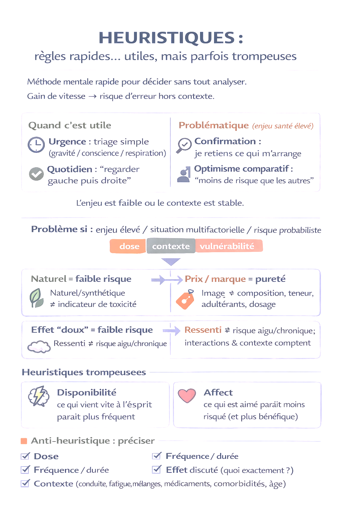
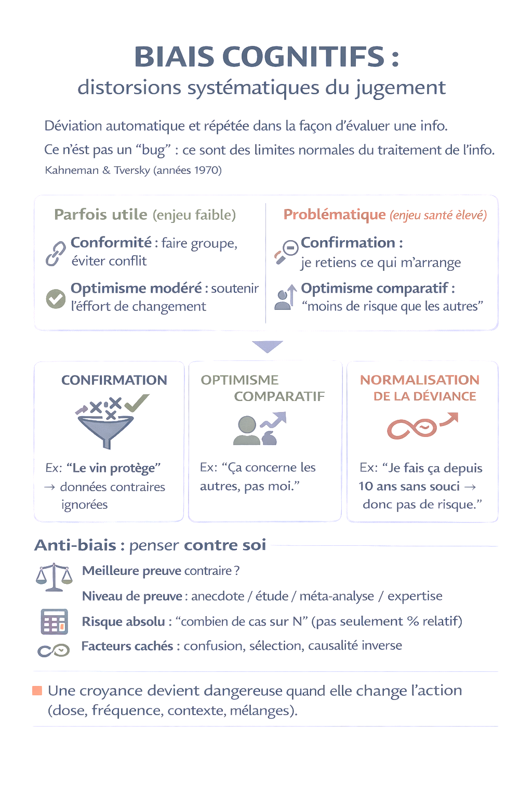
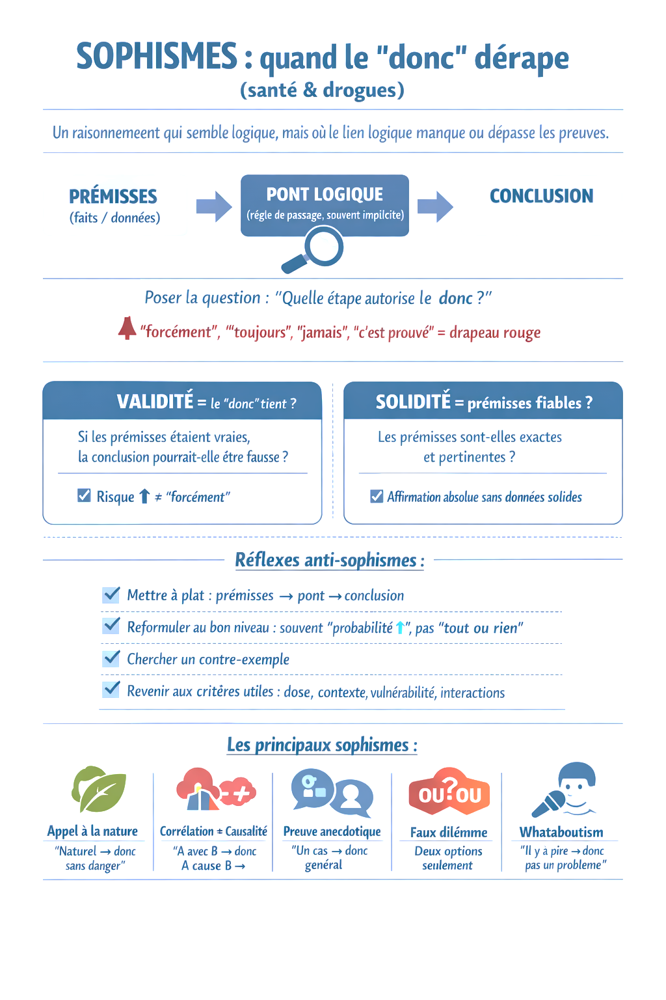
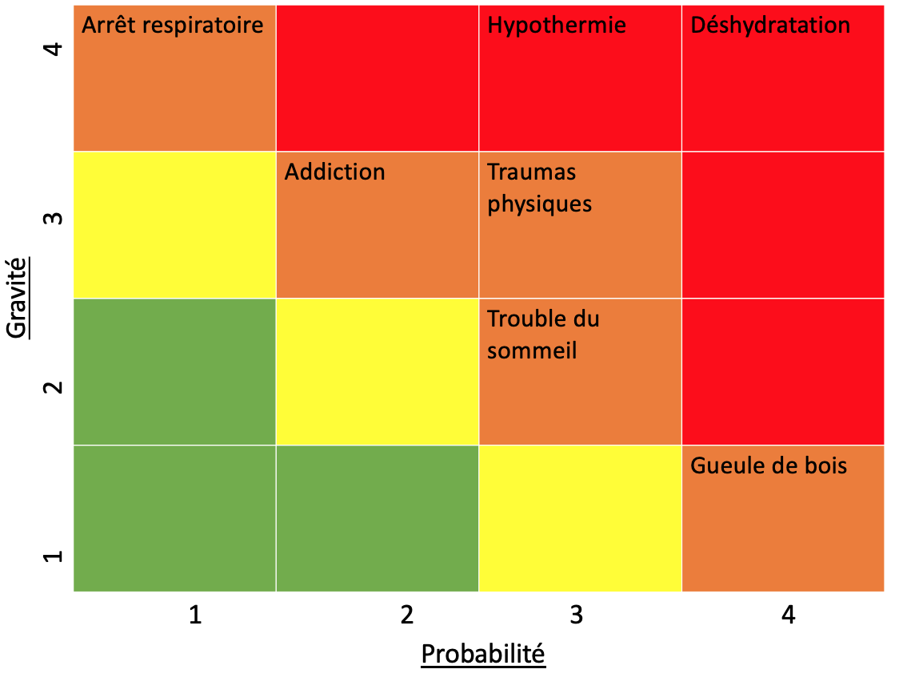
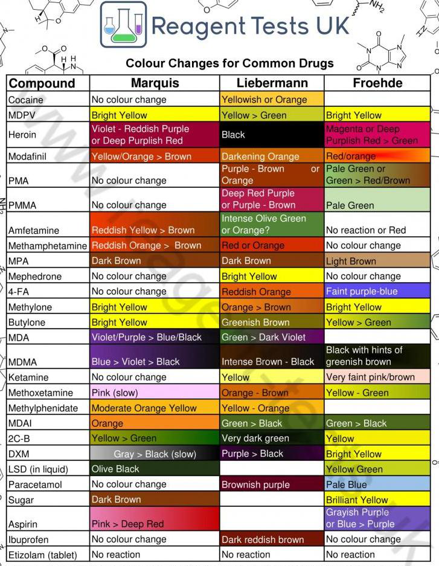

# Figures utiles

Cette galerie regroupe les figures les plus utiles pour naviguer dans le traite. Les images sont conservees avec leur contexte source dans les chapitres canoniques.

  
<h3>Preventions primaire, secondaire et tertiaire</h3>
Positionne le traite dans la prevention secondaire. <a href="/01_source_canonique/01_introduction_cadre_objectif_sources">Voir le chapitre</a>

  
<h3>Heuristiques</h3>
Raccourcis utiles, mais parfois trompeurs. <a href="/01_source_canonique/02_mythes_croyances_heuristiques_biais_sophismes">Voir le chapitre</a>

  
<h3>Biais cognitifs</h3>
Distorsions du jugement et anti-biais. <a href="/01_source_canonique/02_mythes_croyances_heuristiques_biais_sophismes">Voir le chapitre</a>

  
<h3>Sophismes</h3>
Quand le lien logique depasse les preuves. <a href="/01_source_canonique/02_mythes_croyances_heuristiques_biais_sophismes">Voir le chapitre</a>

  
<h3>Mecanismes de protection psychologique</h3>
Pourquoi un message vrai peut etre rejete. <a href="/01_source_canonique/03_mecanismes_protection_approche_rdr">Voir le chapitre</a>

  
<h3>Corriger une croyance</h3>
Protocole BUT - CADRE - FOND - SORTIE. <a href="/01_source_canonique/03_mecanismes_protection_approche_rdr">Voir le chapitre</a>

  
<h3>Science et recherche</h3>
Distinguer corpus stabilise et questions ouvertes. <a href="/01_source_canonique/04_comprendre_science_preuves_causalite">Voir le chapitre</a>

  
<h3>Methode scientifique</h3>
Construire une question testable et confronter les resultats. <a href="/01_source_canonique/04_comprendre_science_preuves_causalite">Voir le chapitre</a>

  
<h3>Gestion des risques</h3>
Notions de risque, gravite et barrieres. <a href="/01_source_canonique/08_gestion_des_risques">Voir le chapitre</a>

  
<h3>Cerveau et circuits</h3>
Un visuel cle du chapitre neurobiologie. <a href="/01_source_canonique/09_cerveau_synapses_neurotransmetteurs_circuits">Voir le chapitre</a>

  
<h3>PK/PD et ADME</h3>
Devenir des substances dans l'organisme. <a href="/01_source_canonique/11_pk_pd_absorption_distribution_metabolisme_elimination">Voir le chapitre</a>

  
<h3>Classifications</h3>
Classer les substances sans reduire la complexite. <a href="/01_source_canonique/13_classifications_substances">Voir le chapitre</a>

  
<h3>Thermie et hydratation</h3>
Risques physiologiques transversaux. <a href="/01_source_canonique/16_allergie_convulsions_hydratation_thermie">Voir le chapitre</a>

  
<h3>Badtrip et overdose</h3>
Visuel important du chapitre situations critiques. <a href="/01_source_canonique/17_badtrip_overdose">Voir le chapitre</a>

  
<h3>Interactions et melanges</h3>
Carte visuelle dense sur les interactions. <a href="/01_source_canonique/18_interactions_melanges">Voir le chapitre</a>

  
<h3>Testing et analyses</h3>
Analyse de produits et donnees biologiques. <a href="/01_source_canonique/19_testing_analyses_produits_biologie">Voir le chapitre</a>

